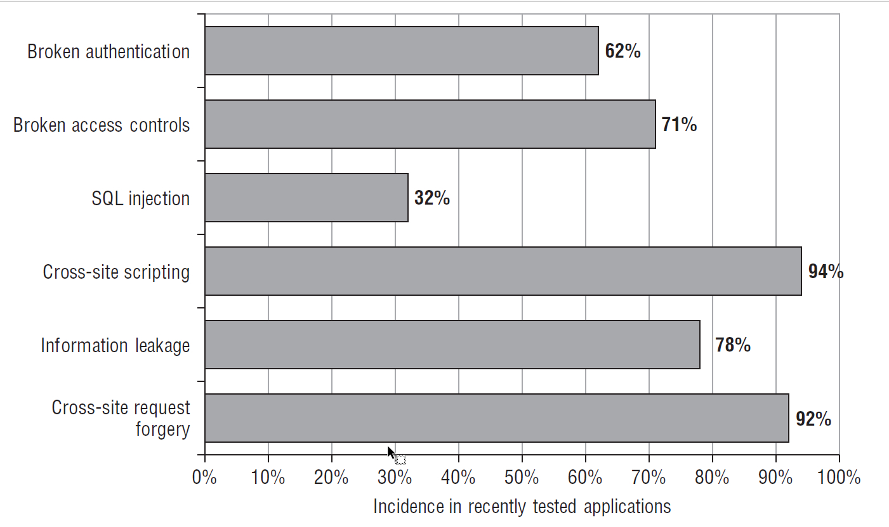

#  第一章 Web应用（不）安全性

毫无疑问，网络应用程序安全性是一个当前热门且备受关注的话题。对于所有相关方来说，风险都非常高：对于依赖互联网商务增加收入的企业，对于信任网络应用程序处理敏感信息的个人用户，以及那些通过窃取支付信息或入侵银行账户牟取暴利的犯罪分子而言，更是如此。声誉在其中扮演着至关重要的角色。很少有人愿意与一个不安全的网站进行交易，因此很少有组织愿意公开自己的安全漏洞或数据泄露事件。因此，要获得关于当前网络应用程序安全状况的可靠信息并非易事。

本章将简要回顾网络应用的演变过程及其带来的诸多益处。我们根据作者的直接经验，提供了一些关于当前网络应用漏洞的指标，表明大多数应用远未达到安全标准。我们将描述网络应用面临的核心安全问题——用户可以提供任意输入——以及导致其安全态势薄弱的各种因素。最后，我们将介绍网络应用安全领域的最新趋势及其未来发展可能的方向。

## 网络应用的演变

互联网早期，万维网仅由网站组成。这些网站本质上是包含静态文档的信息仓库。网页浏览器被发明出来用于检索和显示这些文档，如图1-1所示。信息的流动是单向的，从服务器到浏览器。大多数网站不需要进行用户认证，因为没有必要。每个用户都被同等对待，并呈现相同的信息。与托管网站相关的任何安全威胁主要与web服务器软件的漏洞有关（其中有很多）。如果攻击者入侵了web服务器，通常不会获得任何敏感信息，因为服务器上的信息已经公开可见。相反，攻击者通常会修改服务器上的文件来篡改网站内容，或利用服务器的存储和带宽分发“盗版软件”。

.jpg)

图1-1：传统只包含静态信息的网站

今天，万维网与早期的形态几乎完全不同。网络上的大多数站点实际上都是应用程序（见图1-2）。它们功能强大，依赖于服务器和浏览器之间的双向信息流。它们支持注册和登录、金融交易、搜索、以及用户生成内容。呈现给用户的内容是动态生成的，并且经常为每个特定的用户量身定制。处理的大部分信息都是私密且高度敏感的。因此，安全是一个大问题。如果有人认为自己的信息会被泄露给未经授权的一方，那么没有人会愿意使用一个网络应用程序。

1.jpg)

图1-2：典型的Web应用

网络应用程序带来了新的、重大的安全威胁。每个应用程序都不同，可能包含独特的漏洞。大多数应用程序都是内部开发的——许多是由仅部分了解可能在他们编写的代码中出现的安全问题的开发人员开发的。为了提供其核心功能，网络应用程序通常需要连接到包含高度敏感数据并可以执行强大业务功能的内部计算机系统。十五年前，如果你想进行资金转账，你需要去银行，由柜员为你办理转账；今天，你可以访问一个网络应用程序并自动进行转账。攻击者可以入侵网络应用程序，窃取个人信息，进行金融欺诈，并对其他用户执行恶意操作。

## 常见的网络应用程序功能

网络应用程序几乎可以实现任何在线可用的功能。以下是近年来突出的几种网络应用程序功能：

- 购物（亚马逊）

- 社交网络（脸书）

- 银行业务（花旗银行）

- 网页搜索（谷歌）

- 拍卖（eBay）

- 赌博（Betfair）

- 博客（Blogger）

- 网邮（Gmail）

- 交互式信息（维基百科）

使用计算机浏览器访问的应用程序与使用智能手机或平板电脑访问的移动应用程序之间越来越重叠。大多数移动应用程序使用浏览器或自定义客户端，通过基于HTTP的API与服务器通信。应用程序功能和数据通常在应用程序向不同用户平台公开的各种界面之间共享。

除了公共互联网，网络应用程序已被广泛应用于组织内部以支持关键业务功能。其中许多提供对高度敏感数据和功能的访问。

- 人力资源应用程序，允许用户访问薪资信息，提供和接收绩效反馈，以及管理招聘和纪律程序。

- 关键基础设施的管理界面，例如web和邮件服务器、用户工作站和虚拟机管理。

- 协作软件用于共享文档、管理工作流程和项目，以及跟踪问题。这些类型的功能通常涉及关键的安全和治理问题，组织经常完全依赖于其网络应用程序中内置的控制措施。

- 业务应用程序，例如企业资源规划（ERP）软件，以及使用专有的客户端应用程序访问，现在可以使用web浏览器访问。

- 软件服务，例如电子邮件，最初需要单独的电子邮件客户端，现在可以通过Outlook Web Access等web界面访问。

- 传统的桌面办公应用程序，如文字处理器和电子表格，已经通过Google apps和Mircrosoft Office Live 等服务迁移到web应用程序。

在所有这些例子中，被视为“内部”的应用程序越来越多地被外部托管，因为组织转向外部服务提供商以降低成本。在这些所谓的云解决方案中，关键业务功能和数据对更广泛的潜在攻击者开放，组织越来越依赖于其控制之外的安全访问的完整性。

大多数计算机用户唯一需要的客户端软件即将到来，那就是web浏览器。各种各样的功能将使用一组共享的协议和技术实现，从而继承了一系列独特的常见安全漏洞。

## 网络应用程序的优势

不难看出，网络应用程序为何能如此迅速地崛起。除了明显的商业激励因素外，一些技术因素也推动了我们使用互联网方式的革命。

- **HTTP** 是用于访问万维网的核心通信协议，轻量级且无连接。这在通信错误的情况下提供了弹性，并避免了服务器需要为每个用户保持网络连接的需要，正如许多传统客户端/服务器应用程序中的情况一样。HTTP还可以通过其他协议进行代理和隧道传输，允许在任何网络配置中进行安全通信。

- **每个网络用户已经在其计算机和移动设备上安装了浏览器。** 网络应用程序动态地将用户界面部署到浏览器，避免了分发和管理单独客户端软件的需要，就像web应用程序的情况一样。界面更改只需在服务器上实现一次，并立即生效。

- 现在的浏览器功能强大，能够构建丰富灵人满意的用户界面。Web界面使用的标准的导航和输入控件，用户可以立即熟悉，避免了学习每个应用程序的独特功能的需要。客户端脚本使应用程序能够将其部分处理过程推送到客户端，并在必要时可以使用浏览器扩展技术以任意方式扩展浏览器的功能。

- **开发网络应用程序所用的核心技术和语言相对简单。** 有大量的平台和开发工具可供使用，使相对初学者也能开发出强大的应用程序，并且有大量开源代码和其他资源可用于整合到定制的应用程序中。

## 网络应用程序安全

与人任何新型技术一样，网络应用程序带来了一系列新的安全漏洞。最常见的缺陷的集合随着时间的推移有所演变。开发现有的程序时未考虑到新的攻击出现。随着人们对某些问题的认识提高，这些问题变得不那么普遍了。新技术的开发引入了新的可利用可能性。犹豫对web浏览器软件的更改，某些类型的缺陷已基本消失。

针对网络应用程序最严重的攻击是那些暴露敏感数据或无限制访问应用程序运行所在后端系统的攻击。此类高知名度的泄露事件继续频繁发生。然而，对于多组织来说，任何导致系统停机的攻击都是一个关键事件。应用程序级别的拒绝服务攻击可以用来实现与针对基础设施的传统资源耗尽攻击相同的结果。但是，它们通常使用更微妙的技术和目标。它们可能被用来破坏特定的用户或服务，以获得在金融交易、游戏、在线竞拍和票务预订领域相对于同行的竞争优势。

在整个演变过程中，知名网络应用程序的泄露事件一直占据新闻头条。没有迹象表明情况已经好转，这些安全问题正在减少。从某种程度来说，网络应用程序安全是当今攻击者和拥有计算机资源和数据需要保护的人之间最重要的战场。

### “这个网站是安全的”

热门普遍意识到网络应用程序存在的安全问题。查看应用程序的常见问题解答页面，你会得到关于其安全的保证。

大多数应用程序称它们是安全的，因为它们使用了SSL。例如：
本网站绝对安全。它设计并使用了128位安全套接层（SSL）技术，以防止未经授权的用户查看你的任何信息。你可以放心使用本网站，你的数据在我们这里安全无虞。

用户经常被敦促验证网站证书，赞赏其使用的先进加密协议，并在此基础上信任其个人信息。越来越多地组织还引用其对支付行业（PIC）标准的遵守来向用户保证其安全性。例如：我们非常重视安全。我们的网站每天都会进行扫描，已确保我们保持PCI合规并免受黑客攻击。你可以在下面的徽标上查看最新扫描日期，并保证我们的网站安全使用。

实际上，尽管广泛使用SSL技术和定期进行PCI扫描，大多数网络应用程序都不安全。本书作者近年来测试了数百个网络应用程序。图1-3显示了2007年和2011年期间测试的应用程序中受某些常见漏洞类别影响的百分比。

- **身份验证失效** （62%）-此类漏洞包含应用程序登录机制中的各种缺陷，可能使攻击者猜测弱密码、发起暴力破解攻击或绕过登录。

- **访问控制失效（71%）** - 这涉及应用程序未能正确保护其数据和功能访问的情况，可能使攻击者查看服务器上保存的其他用户的敏感数据或执行特权操作。

- **SQL注入（32%）** -   此漏洞使攻击者能够提交精心制作的输入来干扰应用程序与后端数据库的交互。攻击者可能能够从应用程序检索任意数据、干扰其逻辑或在数据库服务器本身上执行命令。

- **跨站脚本攻击（94%）** - 此漏洞使攻击者能够针对应用程序的其他用户，潜在访问它们的数据，代表它们执行未经授权的操作或对它们进行其他攻击。

- **信息泄露（78%）** - 这涉及应用程序泄露敏感信息的情况，这些信息可用于攻击者开发针对应用程序进行攻击，通过有缺陷道德错误处理或其他行为。

- **跨站请求伪造（92%）**- 此缺陷意味着应用程序用户可以被诱导在它们的用户上下文和权限级别上执行非预期操作。该漏洞允许恶意网站访问受害者用户并与应用程序交互，执行用户无意执行的操作。

> 图1-3 ：作者最近测试的一百多个应用程序，一些常见Web应用程序漏洞的发生率如上所示。

SSL是一种优秀的技术，可以保护用户浏览器和Web服务器之间传输数据的机密性和完整性。它有助于防御窃听，并可以向用户保证他正在处理的Web服务器的身份。但它无法阻止直接针对应用程序服务器或客户端组件的攻击，而大多数成功的攻击正是如此。具体来说，它无法阻止刚刚列出的任何漏洞，也无法阻止许多其他可能使应用程序严重暴露于攻击的漏洞。无论是否使用SSL，大多数Web应用程序仍然包含安全缺陷。

### 核心安全问题：用户可以提交任意输入

与大多数分布式应用程序一样，网络应用程序面临着一个必须解决的基本安全问题。由于客户端不受应用程序控制，用户可以向服务器端应用程序提交任意输入。应用程序必须假设所有输入都可能是恶意的。因此，它必须采取措施确保攻击者无法使用精心制作的输入干扰应用程序的逻辑和行为，从而获得对其数据和功能的未授权访问。

- 用户可以干扰客户端和服务器之间传输的任何数据，包括请求参数、cookie和HTTP头。任何在客户端实现的安全控制措施，例如输入验证检查，都可以轻松绕过。
- 用户可以任意顺序发送请求，并且可以在应用程序预期之外的阶段提交参数，多次提交或完全不提交。开发人员对用户如何与应用程序交互的任何假设都可能被违反。
- 用户不受限于仅使用网络浏览器访问应用程序。许多广泛使用的工具可以与浏览器一起或独立运行，以帮助攻击Web应用程序。这些工具可以发出任何浏览器通常不会发出的请求，并可以快速生册灰姑娘大量请求以发现和利用问题。

大多数针对Web应用程序的攻击都涉及向服务器发送精心狗仔的输入，以除法应用程序设计者未预期或不希望发生的事件。以下是实现此目标的一些示例：

- 更改隐藏HTML表单字段中传输的产品价格，以欺诈性的更便宜的价格购买产品。
- 修改HTTP cookie中传输的会话令牌以劫持另一个已认证用户的会话。
- 删除通常提交的某些参数，以利用应用程序处理中的逻辑缺陷。
- 更改将由后端数据库处理的某些输入，以注入恶意数据查询并访问敏感数据。

毋庸置疑，SSL无法阻止攻击者向服务器提交精心构造的输入。如果应用程序使用了SSL，这仅仅意味着网络上的其他用户无法查看或修改攻击者传输中的数据。由于攻击者控制着SSL隧道的端点 ，她可以通过该隧道向服务器发送任何她想要的内容。如果之前提到的任何攻击成功，那么无论应用程序的常见问题解答中说了什么，该应用程序都绝对是脆弱的。

### 关键问题因素 

Web应用程序面临的核心安全问题出现在任何必须接收并处理可能恶意的不受信任数据的场景中。然而，在Web应用程序的情况下，几个因素共同加剧了这个问题，并解释了为什么如今互联网上的许多Web应用程序在解决这个问题方面做得如此糟糕。

#### 不足的安全意识

尽管近年来对Web应用程序安全问题的意识有所提高，但它仍然不如网络和操作系统等长期存在的领域成熟。虽然大多数从事IT安全工作的人员对网络安全和主机加固的基本知识有一定的了解，但对于Web应用程序安全中的许多核心概念仍然存在广泛的混淆和误解。Web应用程序开发人员的工作越来越多地涉及整合数十甚至数百个第三方包，所有这些包都是为了将开发人员从底层技术中抽象出来。经常会遇到经验丰富的Web应用程序开发人员对编程框架提供的安全性做出重大假设，而对许多基本类型的缺陷的解释却让他们大吃一惊。

#### 定制开发

大多数Web应用程序是由阻止自己的员工或第三方承包商内部开发的。即使应用程序使用了成熟的组件，这些组件通常也是定制的或使用新代码组合在一起的。在这种情况下，每个应用程序都是不同的，可能包含其资深独特的缺陷。这与典型的基础设施部署形成对比，组织可以购买最佳产品并按照行业标准指南进行安装。

#### 欺骗的简单性

借助如今的Web应用程序平台和开发工具，新手程序员可以在短时间内从头开始创建一个强大的应用程序。但是，编写功能性代码和编写安全代码之间存在巨大的差异。许多web应用程序是由善意的个人创建的，他们只是缺乏识别安全问题可能出现的知识和经验。

近年来，一个突出的趋势是使用应用程序框架，这些框架提供现成的代码组件来处理许多常见的功能领域，例如身份验证、页面模板、消息模板以及与常见后端基础设施组件的集成。Liferay和Appfuse是这些框架的示例。这些产品使创建工作应用程序变得快速简单，无需对应用程序的工作原理或可能包含的潜在风险有技术理解。这也意味着许多公司使用相同的框架。因此，当发现漏洞时，它会影响许多不相关的应用程序。

#### 快速演变的威胁形势

对Web应用程序攻击和防御的研究仍然是一个蓬勃发展的领域，其中新概念和威胁出现的速度比旧技术更快。特别是在客户端方面，针对特定攻击的公认防御措施通常会被更新的攻击技术的研究所破坏。一个开始项目时完全了解当前威胁的开发团队，在应用程序完成后部署时可能已经失去了这种地位。

#### 资源和时间限制

大多数Web应用程序开发项目都受到严格的时间和资源限制，这是由内部一次性开发的经济性造成的。在大多数组织中，在设计或开发团队中使用专门的安全专业知识通常是不可行的。由于项目延误，专家进行的安全测试通常留到项目生命周期的后期。在权衡相互竞争的优先级时，按时生产稳定和功能正常的应用程序通常会压倒不太明确的安全考虑因素。一个典型的小型组织可能只愿意支付几天的咨询时间来评估一个新的应用程序。快速的渗透测试通常会发现低悬的果实，但可能会错过需要时间和耐心才能识别的更微妙的漏洞。

#### 过渡扩展的技术

许多用于Web应用程序的核心技术诞生于万维网非常不同的时期。从那时起，它们被远远推出了最初设想的用途，例如在许多基于AJAX的应用程序中使用JavaScript作为数据传输手段。随着对Web应用程序功能期望迅速发展，用于实现功能的技术栈落后于曲线，旧技术被拉伸和适应以满足新要求。毫不奇怪，这导致了安全漏洞作为不可预见的副作用出现。

#### 对功能的不断增长的需求

应用程序的涉及主要考虑功能性和可用性。曾经静态的用户配置文件现在包含社交网络功能，允许上传图片和维基式编辑页面。几年前，应用程序设计师可能满足于实现用户名和密码挑战来创建登录功能。现在网站可能包括密码恢复、用户名恢复、密码提示以及在未来访问中记住用户名和密码的选项。这样的网站无疑会被宣传为具有众多安全功能，但实际上每个功能都是要给自助功能，增加了网站的攻击面。

### 新的安全边界

在Web应用程序出现之前，组织防御外部攻击的努力主要集中在网络边界上。保护这个边界需要强化和修补需要暴露的服务，并对其他服务的访问进行防火墙保护。

Web应用程序改变了这一切。为了让用户能够访问应用程序，防火墙必须允许通过HTTP或HTTPS的入站连接到服务器。为了使应用程序正常运行，服务器必须被允许连接到支持的后端系统，例如数据库、大型机以及财务和物流系统。这些系统通常位于组织运营的核心，并位于多层网络级防御之后。

如果Web应用程序中存在漏洞，互联网上的攻击者可能仅通过从其Web浏览器提交精心构造的数据来破坏组织的核心后端系统。这些数据绕过了组织的所有网络防御，就像普通无害的流量访问Web应用程序一样。

Web 应用程序的广泛部署使多数组织的安全边界发生了变化。边界的一部分仍然由防火墙和堡垒主机构成。但其中重要的一部分现在由Web应用程序占据。由于Web应用程序接收用户输入并将其传递给敏感后端系统的方式多种多样，它们成为各种攻击的潜在入口，必须在应用程序本身内实施防御措施。单个Web应用程序中的一行缺陷代码可能会使组织的内部系统变得脆弱。此外，随着混合应用程序、第三方小部件和其他跨域集成技术的兴起，服务端安全边界经常扩展到组织之外。对外部应用程序和服务存在隐含信任。之前描述的这种新安全边界内漏洞发生率的统计数据应该引起每个组织的深思。

注意：对一个目标组织的攻击来说，获取网络访问权限或在服务器上执行任意命令可能不是他们的最终目的。通常，也许是典型地，攻击者真正想要的是执行一些应用程序级别的操作，例如窃取个人信息、转移资金或进行廉价购买。而将安全边界重新定位到应用程序层可能会极大地帮助攻击者实现这些目标。

例如，假设一个攻击者想要“入侵”银行系统并窃取用户账户中的资金。过去，在银行部署Web应用程序之前，攻击者可能需要找到一个可公开访问服务的漏洞，利用它在银行的DMZ上获得立足点，穿透限制其内部系统访问的防火墙，映射网络以找到主机，解密用于访问它的加密协议，并猜测一些登录凭证。然而，如果银行现在部署了要给脆弱的Web应用程序，攻击者可能只需修改HTML表单中隐藏字段中的账户号码即可达到相同目的。

> DMZ 全称Demilitarized Zone，指的是不受信任的外部网络和可信任的内部网络之间的一个隔离子网。它就像一个缓冲区，将面向公众的服务（如网站、邮件服务器）与内部敏感的网络资源隔离开。

Web应用程序移动安全边界的第二种方式源于用户在访问脆弱应用程序时面临的威胁。恶意攻击者可以利用一个良性但脆弱的Web应用程序来攻击任何访问它的用户。如果该用户位于内部企业网络中，攻击者可能会利用用户的浏览器从用户的信任位置发起对本地网络的攻击。无需用户的任何合作，攻击者就可以执行用户自己恶意操作时可以执行的任何操作。随着浏览器扩展技术和插件的激增，客户端供给面的范围大大增加。

网络管理员熟悉组织用户访问恶意网站的概念，最终用户自己也逐渐意识到这一威胁。但Web应用程序漏洞的性质意味着，脆弱的应用程序可能对用户及其组织构成的威胁不亚于一个公开恶意的网站。相应地，新的安全边界要求所有应用程序所有者保护其用户免受通过应用程序传递的攻击。

安全边界部分移动到客户端的另一种方式是通过电子邮件作为扩展身份验证机制的广泛使用。如今的大量应用程序包含“忘记密码”功能，允许攻击者向任何注册地址生成账户恢复电子邮件，无需任何其他用户特定信息。这允许攻击者入侵用户的网络邮件账户，轻松升级攻击并破坏受害者注册的大多数Web应用程序的账户。

### Web应用程序安全的未来

在广泛采用十年后，如今互联网撒谎给您的Web应用程序仍然漏洞丛生。对Web应用程序面临的安全威胁以及有效解决这些威胁的理解在行业内仍然不够成熟。目前几乎没有迹象表明本章描述的问题因素将在不久的将来消失。

也就是说，Web应用程序安全领域的细节并不是静态的。尽管像SQL注入这样的旧漏洞和众所周知的漏洞仍在出现，但它们的流行程度正在逐渐减弱。此外，剩下的示例变得越来越难以发现和利用。这些领域的最新研究通常集中于开发高级技术来攻击更微妙的漏洞表现形式，几年前仅使用浏览器就可以轻松检测和利用这些漏洞。

第二个突出的趋势是注意力逐渐从针对应用程序服务器端的攻击转移到针对应用程序用户的攻击。后一种攻击仍然利用应用程序本身的缺陷，但通常涉及与另一个用户某种形式的交互来破坏该用户与脆弱应用程序的交易。这是在软件安全其他领域复制的一种趋势。随着对安全威胁意识的成熟，服务器端的缺陷首先得到充分理解和解决，而客户端作为学习过程的继续成为主要战场。本书中描述的所有攻击中，针对其他用户的攻击发展最快，并且近年来一直是大多数研究的重点。

最近的技术趋势在一定程度上改变了Web应用程序的格局。人们通过各种误导性的流行语对这些趋势有了普遍的认识，其中最突出的是：

- Web 2.0——这个术语指的是更大程度地使用能够启用用户生成内容和信息共享的功能，以及采用广泛支持此功能的各种技术，包括异步HTTP请求和跨域集成。
- 云计算——这个术语指的是更大程度地使用外部服务提供商来提供技术栈的各个部分，包括应用程序软件、应用程序平台、Web服务软件、数据库硬件。它还指在托管环境中增加虚拟化技术的使用。

正如大多数技术变革一样，这些趋势也带来了新的攻击方式和现有攻击的变种。尽管存在炒作，但所提出的问题并不像最初看起来那样具有革命性。我们将在本书的适当位置检查这些和其他近期趋势对安的全影响。

尽管Web应用程序发生了翻天覆地的变化，但某些类别的“经典”漏洞没有显示出减少的迹象。它们继续以与Web早期几乎相同的方式出现。这些包括业务逻辑缺陷、访问控制实施不当以及其他设计问题。即使在由拼装在一起的应用程序组件和一切即服务的时代，这些永恒的问题也可能仍然普遍存在。

## 总结

短短十余年，万维网已从单纯的静态信息存储库发展成为处理敏感数据并执行具有现实世界影响力的强大功能的高级应用程序。在此发展过程中，多种因素共同导致了当今大多数Web应用程序所表现出的薄弱安全态势。

大多数应用程序都面临一个核心安全问题，即用户可以提交任意输入。用户与应用程序交互的每个方面都可能具有恶意意图，除非得到证明，否则应被视为恶意。未能妥善解决此问题可能导致应用程序遭受多种方式的攻击。

关于当前Web应用程序安全状况的所有证据证明，尽管安全性的某些方面确实有所改善，但全新的威胁已经出现以取代它们。总体问题尚未得到任何大规模的解决。针对Web应用程序的攻击仍然对部署它们的组织和访问它们的用户构成严重威胁。

# 链接

- 上一节：[03 介绍](./03 介绍.md)
- 下一节：[05 第二章：核心防御机制](./05 第二章：核心防御机制.md)

