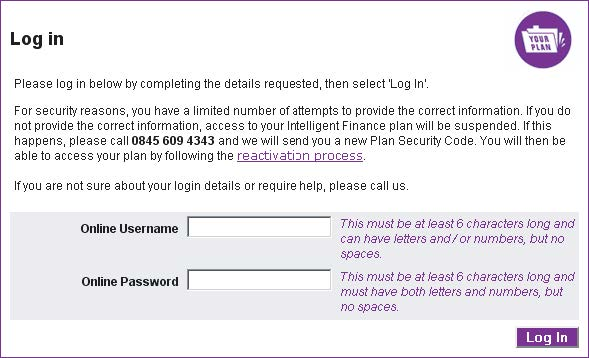
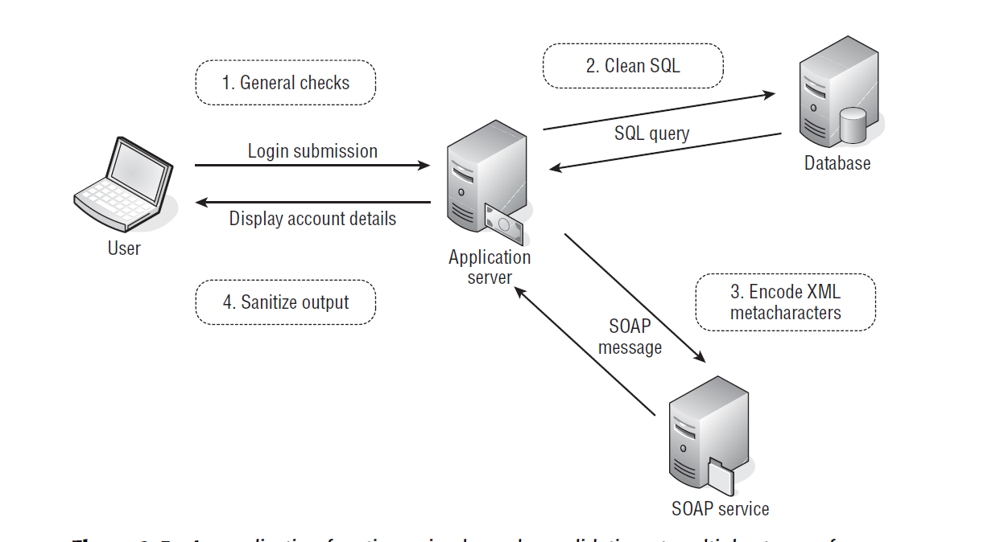
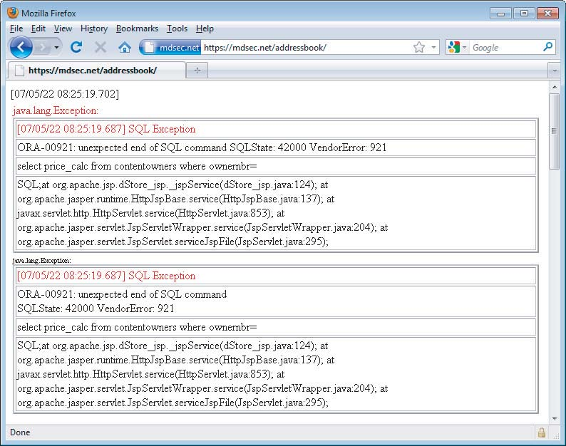
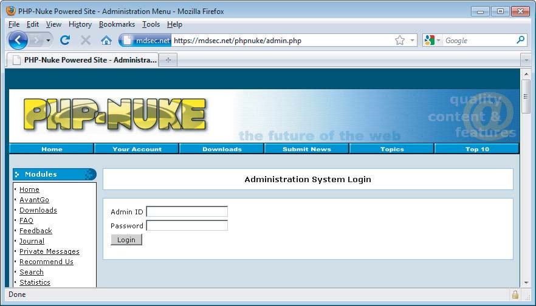

# 第二章 核心防御机制

Web应用程序面临的一个根本安全问题是：所有用户输入都不可信。为了防御攻击，应用程序采用了一系列安全机制。几乎所有的应用程序都采用了概念上相似的机制，但设计细节和实现效果差异很大。

Web应用程序采用的防御机制包括以下核心要素：

- **处理用户对应程序数据和功能的访问**，以防止用户获得未经授权的访问。
- **处理用户输入，**以防止格式错误的输入导致不良行为。
- **处理攻击者，**确保应用程序在受到直接攻击时能够做出适当的反应，采取合适的防御和进攻措施来挫败攻击者。
- **管理应用程序本身**，使管理员能够监控应用程序的活动病配置其功能。

由于这些机制在解决核心安全问题方面起着核心作用，因此它们也构成了典型应用程序大部分的攻击面。如果“知己知彼，百战不殆”是战争的第一法则，那么透彻理解这些机制就是有效攻击应用程序的主要先决条件。无论是新手还是老手，在渗透测试Web应用程序之前，都应该花时间去理解这些核心机制在每个应用程序中的工作原理，并找出其中的弱点，以便发起攻击。

## 处理用户访问

几乎所有应用程序都需要满足一个核心安全要求就是控制用户对其数据和功能的访问。典型情况下，应用程序会有多种不同类别的用户，比如匿名用户、普通认证和管理员。此外，在许多情况下，不同的用户被允许访问不同的数据集。例如，Web邮件应用程序的用户应该能够读取自己的邮件，但不能读取其它人的邮件。

大多数Web应用程序使用三组相互关联的安全机制访问：

- 身份认证（Authentication）
- 会话管理（Session management）
- 访问控制 (Access control)

这三种机制中的每一种都代表了应用程序攻击面的一个重要的区域，并且对应用程序的整体安全态势都至关重要。由于它们之间相互依赖，整个机制提供的安全性只取决于最薄弱的缓解。任何一个组件中的缺陷都可能使攻击者获得对应用程序功能和数据的无限制访问。

## 身份认证

身份认证机制是应用程序处理用户访问最基本的依赖项。身份认证涉及确认用户确实是其自称的身份。如果没有这个功能，应用程序就必须将所有用户视为匿名用户——信任度最低的级别。

如果大多数Web应用程序采用传统的身份认证模型，即用户提交用户名和密码，应用程序验证其有效性。图2-1展示了一个典型的登录功能。在安全性要求较高的应用程序中，例如在线银行，这种基本模型通常会辅以额外的凭证和多阶段登录过程。当安全要求更高时，可以采用其他身份认证模型，例如基于客户端证书、智能卡或挑战-响应令牌的身份认证。除了核心登录流程之外，身份认证机制通常还采用一些列其他辅助功能，例如自助注册、账户恢复和密码修改功能。



> Figure 2-1：典型的登录功能

尽管身份认证机制看起来很简单，但它们在设计和实现上存在着多种缺陷。常见的漏洞可能使攻击者能够识别其他用户的用户名，猜测他们的密码，或者通过利用其逻辑中的缺陷绕过登录功能。在攻击Web应用程序时，你应该投入大量精力关注其包含的各种与身份认证相关的功能。令人惊讶的是，这些功能中的缺陷经常使你能够未经授权地访问敏感数据和功能。

## 会话管理

在处理用户访问的过程中，下一个逻辑任务是管理已认证用户的会话。用户成功登录应用程序后，会访问各种页面和功能，从浏览器发出一系列HTTP请求。同时，应用程序会收到来自不同用户的无数其他请求，其中一些是已认证的，而另一些是匿名的。为了实施有效的访问控制，应用程序需要一种方法来识别和处理来自每个唯一用户的请求序列。

几乎所有Web应用程序都通过为每个用户创建一个会话并向用户发放一个标识该会话的令牌来满足这一要求。会话本身是一组存储在服务器上的数据结构，用于跟踪用户与应用程序交互的状态。令牌是一个唯一的字符串，应用程序将其映射到会话。当用户受到一个令牌时，浏览器会在每个后续HTTP请求中自动将其提交回服务器，使应用程序能够将该请求与该用户关联起来。HTTP cookie是传输会话令牌的标准方法，尽管许多应用程序使用隐藏表单字段或URL查询字符串来实现这一目的。如果用户在一段时间内没有发出请求，会话将理想地过期，如图2-2所示。


> Figure 2-2：应用强制会话过期

从攻击面角度来看，会话管理机制高度依赖于其令牌的安全性。针对它的多数攻击都试图窃取发放给其他用户的令牌。如果成功做到这一点，攻击者就可以伪装成受害用户，并向真正登录了该用户一样使用应用程序。主要漏洞来源于令牌生成方式中的缺陷，这使得攻击者能够猜测其他用户的令牌，以及令牌后续处理方式中的缺陷，这使得攻击者能够捕获其他用户的令牌。

少数应用程序通过其它方式在多个请求中重新识别用户，从而不需要会话令牌。如果使用HTTP内置的身份验证机制，浏览器会在每次请求中自动重新提交用户的凭证，使应用程序可以直接从这些凭证中识别用户。在其他情况下，应用程序将状态信息存储在客户端而不是服务器端，通常以加密形式存储以防止篡改。

## 访问控制

在处理用户访问的过程中，最后一个逻辑步骤是做出并执行正确的决策，决定是否允许或拒绝每个单独的请求。如果前面描述的机制运行正常，应用程序就能知道每个请求来自哪个用户。在此基础上，它需要决定该用户是否有权执行所请求的操作或访问所请求的数据，如图2-3所示。

访问控制机制通常需要实现一些细粒度的逻辑，因为应用程序的不同区域和不同类型功能的相关考虑因素是不同的。一个应用程序可能支持多种用户角色，每种角色涉及不同的特定权限组合。个别用户可能被允许访问应用程序中所持有的全部数据的子集。特定功能可能实施交易限制和其他检查，所有这些都需要根据用户的身份进行适当的强制执行。

由于典型的访问控制需求的复杂性，这种机制常常成为安全漏洞的来源，使得攻击者能够获得对数据和功能的未授权访问。开发人员经常对用户如何与应用程序交互做出错误的假设，并且经常由于省略了一些应用程序功能的访问控制检查而产生疏忽。探测这些漏洞通常是繁琐的，因为本质上需要对每个功能项重复相同的检查。然而，由于访问控制缺陷的普遍存在，当你攻击Web应用程序时，这种努力是值得的。第八章描述了如何自动执行严格的访问控制测试所涉及的一些工作。


> Figure 2-3 应用强制访问控制

## 处理用户输入

回想一下第一章中描述的基本安全问题：所有用户输入都是不可信的。针对Web应用程序的大量攻击都涉及提交意外的输入，这些输入被精心设计，以导致一个用程序设计者未曾预料的行为。相应地，应用程序安全防御的一个关键要求是，应用程序必须以安全的方式处理用户输入。基于输入的漏洞可能出现在应用程序功能的任何地方，并且与几乎所有常用的技术类型相关。“输入验证”经常被认为是低于这些攻击的必要防御措施。然而，没有单一的保护机制可以用于所有地方，防御恶意输入往往并不像听起来那么简单。

### 输入的种类

一个典型的Web应用程序会处理多种形式的用户输入数据。对于所有这些形式的输入，某些类型的输入验证可能不可行或不合适。图2-4展示了一个用户注册功能通常执行的输入验证类型。


> Figure 2-4：应用执行的输入验证

在许多情况下，应用程序可以对特定的输入项施加非常严格的验证检查。例如，提交给登录功能的用户名可能要求最大长度为8个字符，并且只能包含字符字符。

在其他情况下，应用程序必须容忍更广泛的可能输入。例如，提交到个人详细信息页面的地址字段可能合法地包含字母、数字、空格、连字符、撇号和其他字符。然而，对于此项，仍然可以合理地施加限制。数据不应超过合理的长度限制（例如50个字符），并且不应包含任何HTML标记。

在某些情况下，应用程序可能需要接收用户提供的任意输入。例如，博客应用程序的用户可以创建一个主题为Web应用程序黑客的博客。发布到博客上的帖子和评论可能合法地包含正在讨论的明确的攻击字符串。应用程序可能需要将此输入存储在数据库中，将其写入磁盘，并以安全的方式将其显示给用户。它不能仅仅因为输入看起来可能有恶意而简单地拒绝输入，否则会达达降低应用程序对某些用户群的价值。

除了用户通过浏览器界面输入的各种数据外，一个典型的应用程序还会收到许多起源于服务器并发送到客户端的数据，以便客户端可以在后续请求中将它们传回服务器。这包括诸如cookie和隐藏表单字段之类的项，这些项普通用户看不到，但攻击者当然可以查看和修改。在这些情况下，应用程序通常可以对接收到的数据执行非常特定的验证。例如，可能要求一个参数具有特定的一组已知值中的一个，例如指示用户首选语言的cookie，或者具有特定的格式，例如客户ID号。此外，当应用程序检测到服务器生成的数据以普通用户使用标准浏览器无法实现的方式被修改时，这通常表明用户正在尝试探测应用程序的漏洞。在这些情况下，应用程序应该拒绝请求并记录事件以供潜在调查（请参阅本章后面的“处理攻击者”一节）。

### 输入处理方法

处理用户输入通常采用多种不同的方法。不同的方法在不同的情况下以及针对不同类型的输入往往更可取，有时结合多种方法也是可行的。

**拒绝已知不良输入**

这种方法通常采用一个黑名单，其中包含一组已知用于攻击的字面字符串或模式。验证机制会组织与黑名单匹配的任何数据，并允许其他所有数据。

一般来说，这种方法被认为是验证用户输入最无效的方法，主要有两个原因。首先Web应用程序中的一个典型漏洞可以通过多种多样的输入来利用，这些输入可能被编码或以各种方式表示。除了最简单的情况，黑名单很可能会遗漏一些可用于攻击应用程序的输入模式。其次，利用技术在不断发展。新的利用现有漏洞类别的方法不太可能被当前的黑名单阻止。

许多基于黑名单的过滤器可以通过对被阻止的输入进行微小的调整而很容易地被绕过。例如：

- 如果SELECT被阻止，可以尝试SeLeCt
- 如果or 1=1--被阻止，尝试or 2=2--
- 如果alert('xss')被阻止，尝试prompt('xss')

在其它情况下，旨在阻止特定关键字的过滤器可以通过在表达式之间使用非标准字符来破坏应用程序执行的标记化，从而被绕过。例如：

```SQL
SELECT /*foo*/ username, password/*foo*/FROM/*foo*/users
```

```HTML

```

最后，许多基于黑名单的过滤器，尤其是哪些在Web应用防火墙中实现的过滤器，容易受到NULL字节攻击。由于在托管和非托管执行上下文中字符串处理的不同方式，在被阻止的表达式之前插入一个NULL字节可以导致某些过滤器停止处理输入，因此无法识别该表达式。例如：
```HTML
%00<script>alert(1)</script>
```

攻击Web应用防火墙的其它各种技术在第18章中进行了描述。

**注意：** 利用NULL字节处理的攻击在Web应用安全的许多领域都会出现。在NULL字节作为字符串分隔符的上下文中，它可以用来终止文件名或对某个后端组件的查询。在容忍并忽略NULL字节的上下文中（例如，在某些浏览器中的HTML中），可以在被阻止的表达式中插入任意NULL字节来绕过一些基于黑名单的过滤器。这类攻击将在后面的章节中详细讨论。

**接收已知良性输入**

这种方法采用一个白名单，其中包含一组字面字符串或模式，或者一组标准，已知仅匹配良性输入。验证机制允许匹配白名单的数据，并阻止其他所有数据。

例如，在数据库中查找请求的产品代码之前，应用程序可能会验证它是否仅包含字母数字字符且恰好为六个字符长。考虑到随后对产品代码进行的处理，开发人员知道通过此测试的输入不可能导致任何问题。

在可行的情况下，这种方法被认为是处理潜在恶意输入的最有效方法。只要在构建白名单时小心谨慎，攻击者就无法使用精心构造的输入来干扰应用程序的行为。然而，在许多情况下，应用程序必须接受不符合任何合理“良性”标准的处理数据。例如，一些人的名字包含撇号或连字符。这些可以在针对数据库的攻击中使用，但应用程序可能要求允许任何人以自己的真实姓名注册。因此，尽管白名单方法通常非常有效，但它并不是处理用户输入问题的万能解决方案。

### 净化

这种方法认识到有时需要接受无法保证安全的数据。与其拒绝这种输入，不如通过各种方式对其进行净化，以防止其产生任何不利影响。可能存在恶意字符的数据可以被移除，只保留已知安全的部分，或者在进行进一步处理之前对其进行适当编码或转义。

基于数据净化的方法通常非常有效，在许多情况下，它们可以作为处理恶意输入的一般解决方案。例如，防止跨站点脚本攻击的常用防御方法是将危险字符嵌入到应用程序的页面之前对它们进行HTML编码（参见第12章）。然而，如果需要在一个输入项中容纳几种潜在的恶意数据，那么实现有效的净化可能比较困难。在这种情况下，如后文所述，边界验证方法是可取的。

### 安全数据处理

许多Web应用程序漏洞产生的原因是因为用户提供的数据以不安全的方式被处理。漏洞往往可以通过确保对数据的处理本身是安全的，而不是通过验证输入本身来避免。在某些情况下，可以采用安全的编程方法来避免常见问题。例如，通过正确使用参数化查询进行数据库访问可以防止SQL注入攻击（参见第9章）。在其他情况下，可以设计应用程序的功能，以避免本质上不安全的做法，例如将用户输入传递给操作系统命令解释器。

这种方法不能应用于Web应用程序需要执行的每一种任务。但是，在可行的情况下，它是处理潜在恶意输入的有效通用方法。

### 语义检查

到目前为止描述的防御措施都解决了防御应用程序免受各种类型的畸形数据的攻击的需要，这些畸形数据的内容被精心设计来干扰应用程序的处理。然而，对于某些漏洞来说，攻击者提供的输入与普通非恶意用户提交的输入是相同的。使其具有恶意性的是它提交的不同环境。例如，攻击者可能试图通过更改隐藏表单字段中传输的账号来获取另一个用户的银行账户。无论进行多少语法验证，都无法区分用户的数据和攻击者的数据。为了防止未经授权的访问，应用程序需要验证提交的账号是否属于提交该账号的用户。

### 边界验证

跨信任边界验证数据的想法并不陌生。Web应用程序的核心安全问题在于从用户接收到的数据是不可信的。尽管在客户端实现的输入验证检查可以提高性能和用户体验，但它们并不能保证实际到达服务器的数据。用户数据首先被服务器端应用程序接收的点代表一个巨大的信任边界。此时，应用程序需要采取措施来防御恶意输入。

鉴于核心问题的性质，人们很容易将输入验证问题看作是互联网（“坏的”和不可信的）与服务器端（“好的”可信的）应用程序之间的边界。在这种情况下，输入验证的作用是在数据到达时清除潜在的恶意数据，然后将干净的数据传递给可信的应用程序。从这一点开始，数据可以被信任并进行处理，无需任何进一步的检查或担心可能的攻击。

然而，当我们开始见检查一些实际漏洞时，就会发现这种简单的输入验证视图是不充分的，原因有几个：

- 鉴于应用程序实现了广泛的功能，并且使用了不同的技术，一个典型的应用程序需要防御各种基于输入的攻击，每种攻击都可能采用多种多样的精心构造的数据。很难在外部边界设计一个单一的机制来防御所有这些攻击。
- 许多应用程序功能涉及一些不同类型处理的链式操作。单个用户提供的输入可能会导致不同组件中的多个操作，每个操作的输出被用作下一个操作的输入。随着数据的转换，它可能与原始输入没有任何相似之处。熟练的攻击者可能能够操作应用程序，导致在处理的关键阶段生成恶意输入，从而攻击接收此数据的组件。在外部边界实现验证机制来预测每个用户输入处理的所有可能结果是非常困难的。
- 防御不同类别的基于输入的攻击可能需要对用户输入执行不同的验证检查，这些检查彼此不兼容。例如，防止跨站点脚本攻击可能要求应用程序将>字符HTML编码为&gt；而防止命令注入攻击可能要求应用程序阻止包含&和；字符的输入。试图在应用程序的外部边界同时防止所有类别的攻击有时是不可能的。

### 边界验证模型

一个有效的模型是使用边界验证的概念。在这里，服务器端应用程序的每个单独组件或功能单元都将其输入视为来自潜在恶意源。除了客户端和服务器之间的外部边界之外，在每个信任边界上都会执行数据验证。这种模型为刚刚描述的问题提供了一个解决方案。每个组件都可以防御自己可能容易受到的特定类型的精心构造的输入。随着数据通过不同的组件，可以针对数据由于以前的转换而具有的任何值执行验证检查。而且，由于各种验证检查是在处理的不同阶段实施的，它们不太可能相互冲突。

图2-5说明了边界验证时防御恶意输入的最有效方法的典型情况。用户登录导致对用户提供的输入执行几个处理步骤，并且在每个步骤都执行适当的验证：

1. **应用程序接收用户的登录信息。** 表单处理器验证每个输入项仅包含允许的字符，长度在特定限制范围内，并且不包含任何已知的攻击特征。
2. **应用程序执行SQL查询以验证用户的凭证。** 为了防止SQL注入攻击，在构造查询之前，对用户输入中可能用于攻击数据库的任何字符进行转义。
3. **如果登录成功，应用程序将用户配置文件中的某些数据传递给SOAP服务，以检索有关其账户的更多信息。**  为了防止SOAP注入攻击，对用户配置文件数据中的任何XML元字符进行适当的编码。

> SOAP(Simple Object Access Protocol，简单对象访问协议)是一种基于XML的协议，用于在网络上交换结构化信息。

4. **应用程序将用户信息显示回用户的浏览器。** 为了防止跨站点脚本攻击，应用程序对嵌入到返回页面中的任何用户提供的数据进行HTML编码。



图2-5：一个应用程序在多个处理阶段使用边界验证的示例。

本场景中涉及的具体漏洞和防御措施将在后续章节中详细探讨。如果该功能的变体涉及将数据传递给其他应用程序组件，则需要在相关的信任边界上实施类似的防御措施。例如，如果登录失败导致应用程序向用户发送警告电子邮件，则需要对嵌入在电子邮件中的任何用户数据进行检查，以防范SMTP注入攻击。

### 多步验证与规范化

输入处理机制经常遇到的一个问题是，用户提供的输入在验证逻辑中经过多个步骤的处理。如果这个过程处理不当，攻击者可能构造出精心设计的输入，从而绕过验证机制，注入恶意数据。

这种问题的一个变体是，应用程序试图通过移除或编码某些字符或表达式来对用户输入进行净化。例如，一个应用程序可能试图通过去除表达式`<script>` 来防御一些跨站脚本攻击。然而，攻击者可能通过提供以下输入来绕过

过滤器`<scr<script>ipt>`。当被阻止的表达式被移除后，周围的数据收缩，恢复了恶意负载，因为过滤器没有递归地应用。

同样，如果对用户输入执行多个验证步骤，攻击者可能能够利用这些步骤的顺序来绕过过滤器。例如，如果应用程序首先递归移除`../` ，然后再次递归移除`../` ，那么以下输入可以用来绕过验证：

```html
...\/
```

与此相关的一个问题是数据规范化。当输入从用户的浏览器发送时，它可能以各种方式编码。这些编码方案的存在是为了使特殊字符和二进制数据能够安全地通过HTTP传输（更多细节参见第3章）。规范化是将数据转换为通用字符集的过程。如果在应用输入过滤器后进行任何规范化，攻击者可能能够使用合适的编码方案来绕过验证机制。

例如，一个应用程序可能试图通过阻止包含单引号的输入来防御某些SQL注入攻击。但是，如果输入随后经过了规范化处理，攻击者可能使用双重URL编码来绕过过滤器。例如：
```html
%2527
```

当接收到这个输入时，应用程序服务器执行正常的URL解码，因此输入变为：

```html
%27
```

由于不包含单引号，因此应用程序的过滤器允许它通过。但是，当应用程序执行进一步URL解码时，输入被转换为一个单引号，从而绕过了过滤器。

如果应用程序删除而不是阻止单引号，然后执行进一步的规范化，那么以下绕过方法可能有效：
```html
%%2727
```

值得注意的是，这些情况下多次验证和规范化步骤不一定都发生在应用程序的服务端。例如，在以下输入中，一些字符被HTML编码：

```html
<iframe src=j&#x61;vasc&#x72ipt&#x3a;alert&#x28;1&#x29;>
```

如果服务器端应用程序使用输入过滤器来阻止JavaScript表达式和字符，编码后的输入可能成功绕过过滤器。然而，如果输入随后被复制到应用程序的响应中，一些浏览器会对src参数值执行HTML解码，嵌入的Javascript就会执行。

除了用于Web应用程序的标准编码方案之外，规范化问题还可能出现在应用程序组件将数据从一种字符集转换为另一种字符集的其他情况下。例如，一些技术根据字符的印刷字形相似性执行“最佳匹配”映射。在这里，【and】可能会分别转换为<and>，而Ÿ和Â会转换为Y和A。这种行为通常可以用来将被阻止的字符或关键字偷偷地绕过应用程序的输入过滤器。

在本书中，我们将描述许多这种类型的攻击，它们可以有效地击败许多应用程序针对常见基于输入的漏洞的防御措施。

避免多步骤验证和规范化的问题有时可能很困难，而且没有单一的解决方案。一种方法是递归地执行净化步骤，直到对输入项不再进行进一步修改。但是，如果对所需的净化涉及转义一个有问题字符，这可能会导致无限循环。

通常，这个问题只能根据具体情况，根据正在执行的验证类型来解决。在可行的情况下，最好避免尝试清理某些类型的坏输入，而干脆将其完全拒绝。

## 处理攻击者

任何设计安全性至关重要的应用程序的人都必须假设它将直接受到专业且熟练的攻击者的攻击。应用程序安全机制的一个关键功能是能够以受控的方式处理和应对这些攻击。这些机制通常包含一系列防御和攻击措施，旨在尽可能挫败攻击者，并为应用程序所有者提供适当的通知和事件证据。用户处理攻击者的措施通常包括以下任务：

- 处理错误
- 维持审计日志
- 警报管理员
- 对攻击做出反应

### 处理错误

无论应用程序的开发人员在验证用户输入时多么谨慎，几乎不可避免地会发生一些未预料到的错误。普通用户操作导致的错误很可能会在功能和用户验收测试期间被识别出来。因此，在生产环境中部署应用程序前，会考虑到这些错误。然而，很难预测恶意用户可能与应用程序交互的所有可能方式，因此在应用程序受到攻击时，应该预期会出现更多的错误。

一个关键的防御机制是应用程序能够优雅地处理意外错误，要么从中恢复，要么向用户呈现适当的错误消息。在生产环境中，应用程序绝不应该在响应中返回任何系统生成的消息或其他调试信息。正如本书中将要看到的，过于详细的错误消息可以极大地帮助恶意用户进一步发起针对应用程序的攻击。在某些情况下，攻击者可以利用有缺陷的错误处理来检索错误消息本身中的敏感信息，从而提供一个窃取应用程序数据的宝贵渠道。图2-6显示了一个未处理错误导致详细错误消息的示例。



图2-6：未处理的错误

大多数Web开发语言通过Try-catch块和检查异常提供了良好的错误处理支持。应用程序代码应该广泛使用这些构造来捕获特定和一般的错误，并适当地处理它们。此外，大多数应用程序服务器都可以配置为以自定义方式处理未处理的应用程序错误，例如，通过呈现一个不提供信息的错误消息。有关这些措施的更多详细信息，请参见第15章。有效的错误处理通常与应用程序的日志记录机制集成 ，该机制记录尽可能多的关于未预料到的错误的调试信息。意外错误通常表明应用程序防御中存在缺陷，如果应用程序的所有者拥有所需的信息，就可以从源头解决这些问题。

### 维持审计日志

审计日志在调查针对应用程序的入侵尝试时非常有价值。在发生此类事件后，有效的审计日志应使应用程序所有者能够准确了解发生了什么，哪些漏洞被利用，攻击者是否获得了未经授权的数据访问权限或执行了任何未经授权的操作，并尽可能提供有关入侵者身份的证据。作为一项惯例，这些日志通常包括以下内容：

- 与身份验证功能相关的所有事件，例如成功和失败的登录以及密码更改
- 关键交易，例如信用卡支付和资金转账
- 被访问控制机制阻止的访问尝试
- 任何包含已知攻击字符串的请求，表明存在明显的恶意意图。

在许多安全关键性应用程序中，例如在线银行使用的那些，每个客户端请求都会被完整记录，从而提供一个完整的取证记录，可用于调查任何事件。

有效的审计日志通常记录每个事件的事件、接收请求的IP地址以及用户的账户（如果已认证）。这些日志需要受到强有力的保护，防止未经授权的读取或写入访问。一种有效的方法是将审计日志存储在一个自治系统上，该系统只接受来自自主应用程序的更新消息。在某些情况下，日志可以刷新到一次性写入媒体，以确保在成功攻击事件中日志的完整性。

就攻击面而言，保护不当的审计日志可以为攻击者提供一个宝贵的信息源，泄露大量敏感信息，例如会话令牌和请求参数。这些信息可能使攻击者立即破坏整个应用程序，如图2-7所示。


图2-7：保护不当的应用程序日志，其中包含其他用户提交的敏感信息。

### 告警管理员

审计日志使应用程序所有者能够追溯性地调查入侵尝试，并在可能的情况下对攻击者采取法律行动。然而，在许多情况下，希望实时采取更直接的行动来应对企图的攻击。例如，管理员可以阻止攻击者正在使用的IP地址或用户账户。在极端情况下，它们甚至可能在调查攻击并采取补救措施时使应用程序离线。即使已经发生了成功的入侵，如果在早期阶段采取防御措施，其实际影响可能会减轻。

在大多数情况下，警报机制必须平衡可靠地报告每次真实攻击与不产生太多警报以至于被忽略的相互冲突的目标。一个设计良好的警报机制可以结合多种因素来诊断正在进行的确定性攻击，并尽可能将相关事件聚合为单个警报。警报机制监控的异常事件通常包括以下内容：

- 使用异常，例如从单个IP地址或用户接收大量请求，表明存在脚本攻击。
- 业务异常，例如向或从单个银行账户进行异常数量的资金转账。
- 包含已知攻击字符串的请求
- 修改了对普通用户隐藏的数据请求

一些线程的应用防火墙和入侵检测产品可以较好地提供这些功能。它们通过使用基于特征和异常的混合规则来识别对应用程序的恶意使用，并可以主动阻止恶意请求，同时向管理员发出警报。这些产品可以为Web应用程序提供一层宝贵的防御，尤其是在已知存在问题但没有立即可用资源修复这些问题的现有应用程序的情况下。然而，它们的有效性通常受到以下事实的限制：每个Web应用程序都是不同的，因此使用的规则不可避免地具有一定的通用性。Web应用程序防火墙通常擅长识别最明显的攻击，即攻击者在每个请求参数中提交攻击字符串。然而，许多攻击比这更微妙。例如，他们可能修改隐藏字段中的账户编号以访问其他用户的数据，或者以不按顺序的方式提交请求来利用应用程序逻辑中的缺陷。在这些情况下，攻击者提交的请求可能与良性用户提交的请求相同。使其具有恶意性的因素是其被提交的环境。

在任何安全关键性应用程序中，实现实时警报的最有效方法是将其紧密集成到应用程序的输入验证机制和其他控制中。例如，如果Cookie应该具有一组特定的值之一，那么对该值的任何违反都表明其值已被以普通应用程序用户无法实现的方式修改。类似地，如果用户在隐藏字段中更改账户编号以标识其他用户的账号，则强烈表明存在恶意意图。应用程序应该已经在其主要防御中检查这些攻击，并且这些保护机制可以很容易地连接到应用程序的警报机制，以提供完全定制的恶意活动指示器。

由于这些检查时针对应用程序的实际逻辑量身定制的，并对普通用户应有的行为有细粒度的了解，因此它们比任何现成的解决方案都更不容易产生误报，无论该解决方案的可配置型或易学性如何。

### 对攻击的反应

除了向管理员发出警报，许多安全关键性应用程序 还包含内置机制，以对被标识为潜在恶意的用户做出防御反应。

由于每个应用程序都不同，大多数现实世界的攻击都需要攻击者系统地探测漏洞，提交大量包含精心设计的输入的请求，以表明存在各种常见的漏洞。有效的输入验证机制会将许多这样的请求识别为潜在的恶意请求，并阻止输入对应用程序产生任何不良影响。然而，假设存在一些绕过这些过滤器的办法，并且应用程序确实包含一些等待被发现和利用的实际漏洞是合理的。在某些情况下，系统地工作的攻击者可能会发现这些缺陷。

处于这个原因，一些应用程序采取自动的反应措施来挫败以这种方式工作的攻击者的活动。例如，它们可能会越来越慢地响应攻击者的请求，或者终止攻击者的会话，要求他登录或执行其他步骤才能继续攻击。虽然这些措施不会击败最耐心和最坚定的攻击者，但它们会阻止更多的偶然攻击者，并为管理员监控情况并在需要时采取更极端的行动争取更多时间。

当然，对疑似攻击者的反应并不能替代修复应用程序中存在的任何漏洞。然而，在现实世界中，即使是最勤奋地清除应用程序安全漏洞的努力也可能会留下一些可利用的缺陷。在攻击者面前设置进一步的障碍是一种有效的纵深防御措施，可以降低发现和利用任何残余漏洞的可能性。

## 应用程序管理

任何有用的应用程序都需要进行管理和维护。该功能通常是应用程序安全机制的关键部分，为管理员提供管理用户账户和角色、访问监控和审计功能、执行诊断任务以及配置应用程序功能各个方面的方法。

在许多应用程序中，管理功能是在应用程序本身内部实现的，可以通过与核心非安全功能相同的Web界面访问，如图2-8所示。在这种情况下，管理机制代表了应用程序攻击面的一个关键部分。它对攻击者的主要吸引力在于作为提升权限的载体。例如：

- 认证机制中的弱点可能使攻击者获得管理访问权限，从而有效地破坏整个应用程序。
- 许多应用程序没有实现对其某些管理功能的有效访问控制。攻击者可能会找到一种方法来创建一个具有强大权限的新用户账户。
- 管理功能通常涉及显示来自普通用户的数据。管理界面中的任何跨站点脚本漏洞都可能导致具有强大权限的用户会话受到损害。
- 管理功能通常受到较少的严格安全测试，因为其用户被认为是可信的，或者因为渗透测试人员只被授予低权限的账户。此外，该功能通常需要执行固有的危险操作，涉及访问磁盘上的文件或操作系统命令。如果攻击者可以破坏管理功能，他通常可以利用它来控制整个服务器。



图2-8：Web应用程序的管理界面

## 总结

尽管Web应用程序千差万别，但几乎所有应用程序都采用某种形式的核心安全机制。这些机制构成了应用程序抵御恶意用户的首要防线，因此也构成了应用程序攻击面的的大部分。本书后面将探讨的漏洞主要源于这些核心机制中的缺陷。

在这些组件中，处理用户访问和用户输入的机制最为重要，在攻击应用程序时应重点关注。这些机制中的缺陷往往会导致应用程序被完全攻破，使你能够访问其他用户的数据，执行未经授权的操作，并注入任意代码和命令。

## 题目

答案可以在 [http://mdsec.net/wahh](http://mdsec.net/wahh) 上找到。

1. 为什么一个应用程序处理用户访问的机制只与其最薄弱的组件一样强？

2. 会话和会话令牌有什么区别？

3. 为什么不能总是使用白名单方法来进行输入验证？

4. 你正在攻击一个实现了管理功能的应用程序。你没有任何有效的凭证来使用该功能。为什么你仍然应该密切关注它？

5. 一个旨在阻止跨站脚本攻击的输入验证机制对输入项执行以下步骤序列：

   1. 删除任何出现的`<script>` 表达式。
   2. 将输入截断为50个字符。
   3. 删除输入中的任何引号。
   4. 对输入进行URL解码。
   5. 如果删除了任何项，则返回步骤1.你能绕过这个验证机制，将以下数据偷渡过去吗？

   ```html
   “><script>alert(“foo”)</script>”
   ```

   
