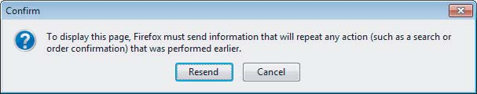

# 第三章 Web 应用技术

Web应用程序为了实现其功能，采用了多种多样的技术。本章将简要介绍在攻击Web应用程序时可能遇到的关键技术。我们将探讨HTTP协议、服务器端和客户端常用的技术，以及用于在不同情况下表示数据的编码方案。这些技术通常易于理解，掌握其相关特性是进行有效Web应用程序攻击的关键。

如果你已经熟悉Web应用程序中使用的关键技术，可以快速浏览本章，确认其中没有新的内容。如果你仍在学习Web应用程序的工作原理，那么在继续学习后续关于特定漏洞的章节之前，应该阅读本章。为了深入了解本章所涵盖的许多领域，我们推荐David Gourley和Brian Totty合著的《HTTP: The Definitive Guide》（O’Reilly，2002），以及万维网联盟（World Wide Web Consortium）的官方网站www.w3.org。

## HTTP协议

超文本传输协议（HTTP）是访问万维网的核心通信协议，也是当今所有Web应用程序所使用的协议。它是一个简单的协议，最初是为了检索静态文本资源而开发的。随着时间的推移，它已被扩展并以各种方式加以利用，使其能够支持如今常见的复杂分布式应用程序。HTTP采用基于消息的模型，客户端发送请求消息，服务器返回响应消息。该协议本质上是无连接的：尽管HTTP使用有状态的TCP协议作为其传输机制，但每次请求和响应的交换都是一个独立的事务，并且可以使用不同的TCP连接。

### HTTP请求

所有的HTTP消息（请求和响应）都由一个或多个头部组成，每个头部占一行，后面跟着一个必须的空格，然后是一个可选的消息体。一个典型的HTTP请求如下所示：

```http
GET /auth/488/YourDetails.ashx?uid=129 HTTP/1.1
Accept: application/x-ms-application, image/jpeg, application/xaml+xml,
image/gif, image/pjpeg, application/x-ms-xbap, application/x-shockwaveflash,
*/*
Referer: https://mdsec.net/auth/488/Home.ashx
Accept-Language: en-GB
User-Agent: Mozilla/4.0 (compatible; MSIE 8.0; Windows NT 6.1; WOW64;
Trident/4.0; SLCC2; .NET CLR 2.0.50727; .NET CLR 3.5.30729; .NET CLR
3.0.30729; .NET4.0C; InfoPath.3; .NET4.0E; FDM; .NET CLR 1.1.4322)
Accept-Encoding: gzip, deflate
Host: mdsec.net
Connection: Keep-Alive
Cookie: SessionId=5B70C71F3FD4968935CDB6682E545476
```

每个HTTP请求的第一行都包含三个部分，用空格分隔：

- **HTTP方法：** 一个动词，表示HTTP方法。最常用的方法是GET，其功能是从Web服务器检索资源。GET请求没有消息体，因此在消息头后的空行之后没有进一步的数据。
- **请求的URL：** URL通常用作所请求资源的名称，并带有一个可选的查询字符串，其中包含客户端传递给该资源的参数。查询字符串由URL中的问号（?）表示。示例中包含一个名为uid、值为129的参数。
- **使用的HTTP版本：** Internet上常用的HTTP版本只有1.0和1.1，大多数浏览器默认使用1.1版本。这两个版本之间有一些规范上的差异；但是，在攻击Web应用程序时，你可能会遇到的唯一区别是，在1.1版本中，Host请求头是必须的。

在这个请求示例中，还有其他一些值得注意的点：

- **Referer头部:** 用于指示请求的来源URL（例如，用户点击了该页面上的一个链接）。需要注意的是，这个头部在最初的HTTP规范中拼写错误，并且一直保留了这个错误的拼写。
- **User-Agent头部:** 用于提供有关生成请求的浏览器或其他客户端软件的信息。请注意，出于历史原因，大多数浏览器都包含Mozilla前缀。这是最初占主导地位的Netscape浏览器使用的User-Agent字符串，其他浏览器希望向网站表明它们与这个标准兼容。就像许多计算历史上的怪癖一样，它已经变得根深蒂固，即使在示例中显示的当前版本的Internet Explorer中仍然保留。
- **Host头部:** 指定在访问的完整URL中出现的主机名。当多个网站托管在同一服务器上时，这是必需的，因为在请求的第一行中发送的URL通常不包含主机名。（有关虚拟托管网站的更多信息，请参阅第17章。）
- **Cookie头部:** 用于提交服务器发给客户端的附加参数（本章稍后将详细描述）。

### HTTP响应

一个典型的HTTP响应如下所示：

```http
HTTP/1.1 200 OK
Date: Tue, 19 Apr 2011 09:23:32 GMT
Server: Microsoft-IIS/6.0
X-Powered-By: ASP.NET
Set-Cookie: tracking=tI8rk7joMx44S2Uu85nSWc
X-AspNet-Version: 2.0.50727
Cache-Control: no-cache
Pragma: no-cache
Expires: Thu, 01 Jan 1970 00:00:00 GMT
Content-Type: text/html; charset=utf-8
Content-Length: 1067
<!DOCTYPE html PUBLIC “-//W3C//DTD XHTML 1.0 Transitional//EN” “http://
www.w3.org/TR/xhtml1/DTD/xhtml1-transitional.dtd”><html xmlns=”http://
www.w3.org/1999/xhtml” ><head><title>Your details</title>
```

每个HTTP响应的第一行包含三个部分，用空格分隔：

- **使用的HTTP版本：** 指明使用的HTTP版本。
- **数字状态码：** 表示请求结果的数字状态码。200是最常见的状态码，表示请求成功并且正在返回所请求的资源。
- **文本原因短语：** 进一步描述响应状态的文本短语。这个短语可以是任意值，并且当前的浏览器不会将其用于任何目的。

在响应中，还有一些其他值得注意的点：

- **Server头部:** 包含一个标识正在使用的Web服务器软件的标语，有时还包含其他详细信息，例如已安装的模块和服务器操作系统。这些信息可能准确，也可能不准确。
- **Set-Cookie头部:** 向浏览器发出一个额外的cookie；这个cookie会在后续向该服务器的请求中通过Cookie头部提交回去。
- **Pragma头部:** 指示浏览器不要将响应存储在其缓存中。Expires头部表示响应内容已过期，因此不应被缓存。当返回动态内容时，通常会发出这些指令，以确保浏览器在后续访问时获得该内容的新版本。
- **几乎所有HTTP响应在头部后的空行之后都包含一个消息体。Content-Type头部表示该消息体包含一个HTML文档。**
- **Content-Length头部:** 指示消息体的长度（以字节为单位）。

### HTTP方法

在攻击Web应用程序时，你几乎只涉及两种最常用的方法：GET和POST。你需要了解这两种方法之间的一些重要区别，因为如果忽视这些区别，它们可能会影响应用程序的安全性。

GET方法用于检索资源。它可以用于在URL查询字符串中向请求的资源发送参数。这使得用户可以为一个动态资源添加书签，以便以后重用。或者其他用户可以在以后访问时检索等效的资源（就像在书签中的搜索查询中一样）。URL显示在屏幕上，并记录在各种地方，例如浏览器历史记录和Web服务器的访问日志。当遵循外部链接时，它们也会在Referer头部中传输到其他站点。出于这些原因，查询字符串不应用于传输任何敏感信息。

POST方法用于执行操作。使用这种方法，请求参数既可以发送到URL查询字符串中，也可以发送到消息体中。虽然URL仍然可以添加书签，但发送到消息体中的任何参数都将被排除在书签之外。这些参数也将被排除在维护URL日志的各种位置以及Referer头部之外。由于POST方法用于执行操作，如果用户单击浏览器的后退按钮返回到使用此方法访问的页面，浏览器不会自动重新发出请求。相反，它会警告用户即将执行的操作，如图3-1所示。这可以防止用户无意中多次执行某个操作。因此，在执行操作时，应始终使用POST请求。



**图3-1：**浏览器不会自动重新发出用户发起的POST请求，因为这可能会导致某个操作被执行多次

除了GET和POST方法外，HTTP协议还支持许多为特定目的而创建的其他方法。以下是您最有可能需要了解的其他方法：

- **HEAD：** 其功能与GET请求相同，只是服务器在响应中不应返回消息体。服务器应返回与对应的GET请求返回的相同的头部。因此，这种方法可以在发出GET请求获取资源之前，用来检查资源是否存在。
- **TRACE：** 用于诊断目的。服务器应在响应体中返回它收到的请求消息的原始内容。这可以用来检测客户端和服务器之间任何可能操纵请求的代理服务器的影响。
- **OPTIONS：** 请求服务器报告特定资源可用的HTTP方法。服务器通常会返回一个包含Allow头部的响应，其中列出了可用方法。
- **PUT：** 尝试使用请求体中包含的内容将指定资源上传到服务器。如果启用了此方法，你可能会利用它来攻击应用程序，例如上传任意脚本并在服务器上执行。

除了上述的方法外，HTTP协议还支持许多其他方法，但这些方法与攻击Web应用程序没有直接关系。然而，如果某些危险的方法可用，Web服务器可能会暴露于攻击之下。有关这些方法以及在攻击中使用它们的示例，请参阅第18章。

**URL**

统一资源定位符（URL）是通过它可以检索Web资源的唯一标识符。大多数URL的格式如下：

```http
protocol://hostname[:port]/[path/]file[?param=value]
```

此方案中的几个组件是可选的。只有当端口号与相关协议使用的默认端口号不同时，才通常包含端口号。用于生成前面显示的HTTP请求的URL如下：

```http
https://mdsec.net/auth/488/YourDetails.ashx?uid=129
```

除了这种绝对形式，URL还可以相对于特定主机或相对于该主机上的特定路径来指定。例如：

```http
/auth/488/YourDetails.ashx?uid=129
YourDetails.ashx?uid=129
```

这些相对形式通常在网页中用于描述网站或应用程序本身内的导航。

**注意：** 您可能会遇到URI（或统一资源标识符）这个术语来代替URL，但它实际上只用于正式规范中，或者那些想要炫耀自己学识的人。

### REST

表述性状态转移（REST）是一种分布式系统的架构风格，其中请求和响应包含系统资源当前状态的表示。万维网所采用的核心技术，包括HTTP协议和URL格式，都符合REST架构风格。

虽然包含查询字符串参数的URL本身符合REST约束，但术语“REST风格URL”通常用于表示将参数包含在URL文件路径中而不是查询字符串中的URL。例如，以下包含查询字符串的URL：

```http
http://wahh-app.com/search?make=ford&model=pinto
```

对应于以下包含“REST风格”参数的URL：

```http
http://wahh-app.com/search/ford/pinto
```

第4章描述了在映射应用程序的内容和功能以及识别其关键攻击面时，需要如何考虑这些不同的参数样式。

### HTTP头部

HTTP支持大量的头部，其中一些头部是为了特定的特殊目的而设计的。有些头部可以同时用于请求和响应，而另一些则特定于其中一种消息类型。以下各节将描述你在攻击Web应用程序时可能遇到的头部。

#### 通用头部

- **Connection：** 告诉通信的另一端，在HTTP传输完成后是否应关闭TCP连接，或者是否应保持打开状态以用于进一步的消息。
- **Content-Encoding：** 指定消息正文中所包含的内容使用的编码方式，例如gzip，一些应用程序使用它来压缩响应以加快传输速度。
- **Content-Length：** 指定消息正文的长度，单位为字节（除了对HEAD请求的响应，在这种情况下，它表示对相应GET请求的响应中正文的长度）。
- **Content-Type：** 指定消息正文中包含的内容类型，例如HTML文档的text/html。
- **Transfer-Encoding：** 指定对消息正文执行的任何编码，以便于通过HTTP传输。它通常用于在使用分块编码时指定分块编码。

#### 请求头部

- **Accept：** 告诉服务器客户端愿意接受哪些类型的内容，例如图像类型、办公文档格式等。
- **Accept-Encoding：** 告诉服务器客户端愿意接受哪些类型的内容编码。
- **Authorization：** 向服务器提交用于内置HTTP身份验证类型的凭据。
- **Cookie：** 向服务器提交之前由服务器颁发的cookie。
- **Host：** 指定在请求的完整URL中出现的域名。
- **If-Modified-Since：** 指定浏览器上次接收请求资源的时间。如果资源从那时起没有更改，服务器可以使用状态码304指示客户端使用其缓存的副本。
- **If-None-Match：** 指定一个实体标签，该标签是表示消息正文内容的标识符。浏览器提交服务器在上次接收请求资源时发出的实体标签。服务器可以使用实体标签来确定浏览器是否可以使用其缓存的资源副本。
- **Origin：** 用于跨域Ajax请求，以指示请求起源的域（参见第13章）。
- **Referer：** 指定当前请求起源的URL。
- **User-Agent：** 提供有关生成请求的浏览器或其他客户端软件的信息。

#### 响应头部

- **Access-Control-Allow-Origin：** 指示资源是否可以通过跨域Ajax请求检索（参见第13章）。
- **Cache-Control：** 将缓存指令传递给浏览器（例如，no-cache）。
- **ETag：** 指定一个实体标签。客户端可以在以后对同一资源的请求中提交此标识符，在If-None-Match头部中通知服务器浏览器当前在其缓存中持有的资源版本。
- **Expires：** 告诉浏览器消息正文的内容有效期。在此时间之前，浏览器可以使用该资源的缓存副本。
- **Location：** 用于重定向响应（状态码以3开头）中，以指定重定向的目标。
- **Pragma：** 将缓存指令传递给浏览器（例如，no-cache）。
- **Server：** 提供有关正在使用的Web服务器软件的信息。
- **Set-Cookie：** 向浏览器颁发cookie，浏览器将在后续请求中将其提交回服务器。
- **WWW-Authenticate：** 用于具有401状态码的响应中，以提供有关服务器支持的身份验证类型的详细信息。
- **X-Frame-Options：** 指示当前响应是否以及如何可以在浏览器框架中加载（参见第13章）。

#### Cookie

Cookie是HTTP协议中的一个关键部分，大多数Web应用程序都依赖于它。它们经常可以被用作利用漏洞的载体。Cookie机制允许服务器将数据发送给客户端，客户端存储这些数据并在随后重新提交给服务器。与其他类型的请求参数（URL查询字符串或消息正文中的参数）不同，Cookie会在每次后续请求中自动重新提交，而不需要应用程序或用户进行任何特殊操作。

服务器使用Set-Cookie响应头部发出Cookie，例如：

```http
Set-Cookie: tracking=tI8rk7joMx44S2Uu85nSWc
```

然后，用户的浏览器会自动将以下头部添加到后续发送回同一服务器的请求中：

```http
Cookie: tracking=tI8rk7joMx44S2Uu85nSWc
```

Cookie通常由一个名称/值对组成，如上所示，但也可以包含任何不包含空格的字符串。可以通过在服务器的响应中使用多个Set-Cookie头部来发出多个Cookie。这些Cookie在同一个Cookie头部中提交回服务器，用分号分隔不同的Cookie。

除了Cookie的实际值之外，Set-Cookie头部还可以包含以下任何可选属性，这些属性可以用来控制浏览器如何处理Cookie：

- **expires：** 设置Cookie的有效期。这会导致浏览器将Cookie保存到持久存储中，并在达到过期日期之前在后续浏览器会话中重用。如果未设置此属性，则Cookie仅在当前浏览器会话中使用。
- **domain：** 指定Cookie有效的域。这必须与接收Cookie的域相同或为其父域。
- **path：** 指定Cookie有效的URL路径。
- **secure：** 如果设置了此属性，则Cookie仅在HTTPS请求中提交。
- **HttpOnly：** 如果设置了此属性，则无法通过客户端JavaScript直接访问Cookie。

这些Cookie属性中的每一个都可能影响应用程序的安全性。主要影响是攻击者直接针对应用程序的其他用户的能力。有关更多详细信息，请参见第12章和第13章。

### 状态码

每个HTTP响应消息的第一行都必须包含一个状态码，以指示请求的结果。根据代码的第一位数字，状态码分为五组：

- **1xx — 信息性:** 表示请求已被接受，服务器正在处理。
- **2xx — 成功:** 表示请求已被成功接收、理解、接受、处理并完成。
- **3xx — 重定向:** 要完成请求，需要进一步的操作。通常，这些状态码用来重定向。
- **4xx — 客户端错误:** 请求包含语法错误或无法完成。
- **5xx — 服务器错误:** 服务器在处理请求的过程中发生了错误。

有许多特定的状态码，其中许多只在特殊情况下使用。以下是你在攻击Web应用程序时最有可能遇到的状态码，以及与之关联的常用原因短语：

- **100 Continue：** 在某些情况下，当客户端提交包含正文的请求时会发送。该响应表示已收到请求头部，客户端应继续发送正文。服务器在请求完成后返回第二个响应。
- **200 OK：** 表示请求成功，响应正文包含请求的结果。
- **201 Created：** 作为对PUT请求的响应返回，表示请求成功。
- **301 Moved Permanently：** 将浏览器永久重定向到另一个URL，该URL在Location头部中指定。客户端将来应该使用新的URL而不是原始URL。
- **302 Found：** 将浏览器临时重定向到另一个URL，该URL在Location头部中指定。客户端在后续请求中应恢复为原始URL。
- **304 Not Modified：** 指示浏览器使用其缓存的请求资源副本。服务器使用If-Modified-Since和If-None-Match请求头部来确定客户端是否具有资源的最新版本。
- **400 Bad Request：** 表示客户端提交了无效的HTTP请求。当你以某些无效方式修改请求时，例如在URL中放置空格，你可能会遇到这种情况。
- **401 Unauthorized：** 表示服务器要求在授予请求之前进行HTTP身份验证。WWW-Authenticate头部包含有关支持的身份验证类型的详细信息。
- **403 Forbidden：** 表示无论是否经过身份验证，都不允许任何人访问请求的资源。
- **404 Not Found：** 表示请求的资源不存在。
- **405 Method Not Allowed：** 表示请求中使用的HTTP方法不支持指定的URL。例如，如果你尝试在不支持PUT方法的地方使用PUT方法，就会收到此状态码。
- **413 Request Entity Too Large：** 如果你正在探测原生代码中的缓冲区溢出漏洞，并且因此提交了长字符串数据，则表示你的请求正文过大，服务器无法处理。
- **414 Request URI Too Long：** 与413响应类似。它表示请求中使用的URL过大，服务器无法处理。
- **500 Internal Server Error：** 表示服务器在处理请求时遇到错误。这通常发生在你提交了意外的输入，导致应用程序处理过程中出现未处理的错误。你应该仔细检查服务器响应的完整内容，以获取任何指示错误性质的详细信息。
- **503 Service Unavailable：** 通常表示虽然Web服务器本身可以运行并能响应请求，但通过服务器访问的应用程序没有响应。你应该验证这是否是由于你执行的任何操作造成的。

### HTTPS

HTTP协议使用普通的TCP作为传输机制，这种传输是未加密的，因此可以被网络上的攻击者拦截。HTTPS本质上与HTTP是相同的应用层协议，但通过安全的传输机制——安全套接层（SSL）进行隧道传输。这保护了通过网络传输的数据的隐私性和完整性，减少了非侵入式拦截攻击的可能性。无论是否使用SSL进行传输，HTTP请求和响应的功能完全相同。

**注意：** SSL已经被传输层安全（TLS）严格取代，但后者通常仍然被称为旧名称。

### HTTP代理

HTTP代理是一个服务器，它在客户端浏览器和目标Web服务器之间充当中间人。当浏览器配置为使用代理服务器时，它会将所有请求发送到该服务器。代理服务器将请求转发到相关的Web服务器，并将响应转发回浏览器。

大多数代理还提供其他服务，包括缓存、身份验证和访问控制。

当使用代理服务器时，HTTP的工作方式有两个不同之处：

- 当浏览器向代理服务器发出未加密的HTTP请求时，它会在请求中放置完整的URL，包括协议前缀http://、服务器主机名和端口号（如果是非标准端口号）。代理服务器提取主机名和端口号，并使用它们将请求定向到正确的目标Web服务器。
- 当使用HTTPS时，浏览器无法与代理服务器进行SSL握手，因为这会破坏安全隧道，使通信容易受到拦截攻击。因此，浏览器必须将代理作为纯TCP层中继，在浏览器和目标Web服务器之间双向传递所有网络数据，浏览器与目标Web服务器进行正常的SSL握手。为了建立这个中继，浏览器向代理服务器发送一个使用CONNECT方法的HTTP请求，并指定目标主机名和端口号作为URL。如果代理允许该请求，它将返回一个带有200状态的HTTP响应，保持TCP连接打开，并从那时起作为纯TCP层中继到目标Web服务器。

在某种程度上，在攻击Web应用程序时，工具箱中最有用的工具是一种特殊的代理服务器，它位于浏览器和目标网站之间，允许你拦截和修改所有请求和响应，甚至是使用HTTPS的请求和响应。在下一章中，我们将开始研究如何使用这种工具。

### HTTP认证

HTTP协议包含自己的机制来对用户进行身份验证，包括以下几种认证方案：

- **Basic认证：** 一种简单的认证机制，将用户凭证作为Base64编码的字符串放在每个消息的请求头中发送。
- **NTLM认证：** 一种挑战-响应机制，使用Windows NTLM协议的一个版本。
- **Digest认证：** 一种挑战-响应机制，使用MD5校验和对nonce（随机数）和用户的凭证进行计算。

在互联网上部署的Web应用程序中，很少遇到使用这些认证协议的情况。它们更常用于访问基于Intranet的服务。

**常见误解**

“Basic认证是不安全的。”

由于Basic认证将凭证以未加密的形式放在HTTP请求中，因此经常有人说该协议是不安全的，不应该使用。但是，许多银行使用的表单式认证也将凭证以未加密的形式放在HTTP请求中。任何HTTP消息都可以通过使用HTTPS作为传输机制来防止窃听攻击，而每个注重安全的应用程序都应该这样做。至少在防范窃听方面，Basic认证本身并不比当今大多数Web应用程序使用的方法更差。

### Web功能性

除了用于在客户端和服务器之间发送消息的核心通信协议外，Web应用程序还采用了众多技术来实现其功能。任何功能相对完善的应用程序都可能在其服务器和客户端组件中使用数十种不同的技术。在发起针对Web应用程序的严重攻击之前，你需要对它的功能实现方式、所用技术的预期行为以及可能存在的弱点有基本的了解。

#### 服务器端功能

早期的万维网完全包含静态内容。网站由各种资源组成，例如HTML页面和图像，这些资源只需加载到Web服务器上，然后交付给任何请求它们的用戶。每次请求特定资源时，服务器都会用相同的内容进行响应。

如今的Web应用程序通常仍然使用相当数量的静态资源。但是，它们呈现给用户的大量内容是动态生成的。当用户请求动态资源时，服务器的响应是动态生成的，每个用户都可能收到为他或她定制的独特内容。

动态内容是由在服务器上执行的脚本或其他代码生成的。这些脚本本身就类似于计算机程序。它们具有各种输入，对这些输入进行处理，并将输出返回给用户。

当用户浏览器请求动态资源时，通常不会简单地请求该资源的副本。一般来说，它还会随请求一起提交各种参数。正是这些参数使得服务器端应用程序能够生成针对单个用户的定制内容。

HTTP请求可以通过三种主要方式向应用程序发送参数：

- 在URL查询字符串中
- 在REST风格URL的文件路径中
- 在HTTP Cookie中
- 在使用POST方法的请求正文中

除了这些主要的输入来源之外，服务器端应用程序原则上可以将HTTP请求的任何部分作为其处理的输入。例如，应用程序可以处理User-Agent头来生成针对所用浏览器类型的优化内容。

像一般的计算机软件一样，Web应用程序在服务器端使用多种技术来交付其功能：

- **脚本语言**，例如PHP、VBScript和Perl
- **Web应用程序平台**，例如ASP.NET和Java
- **Web服务器**，例如Apache、IIS和Netscape Enterprise
- **数据库**，例如MS-SQL、Oracle和MySQL
- **其他后端组件**，例如文件系统、基于SOAP的Web服务和目录服务

本书将详细介绍所有这些技术以及与之相关的漏洞类型。以下部分将描述您可能会遇到的一些最常见的Web应用程序平台和技术。

**常见误区**

“我们的应用程序只需要进行简单的安全审查，因为它们使用了成熟的框架。”

使用成熟的框架往往会使Web应用程序开发人员产生自满情绪，认为像SQL注入这样的常见漏洞可以自动避免。这种假设有两个原因是错误的。

首先，大量的Web应用程序漏洞出现在应用程序的设计阶段，而不是实现阶段，并且与所选择的开发框架或语言无关。

其次，由于框架通常使用来自最新存储库的插件和包，因此这些包可能没有经过安全审查。有趣的是，如果稍后在应用程序中发现了漏洞，这些神话的支持者就会很容易地换边，责怪他们的框架或第三方包！

##### Java平台

多年来，Java平台企业版（以前称为J2EE）一直是大型企业应用程序的事实上的标准。它最初由Sun Microsystems开发，现在属于Oracle，适用于多层和负载均衡架构，非常适合模块化开发和代码重用。由于其悠久的历史和广泛的采用，有许多高质量的开发工具、应用程序服务器和框架可供开发人员使用。Java平台可以在多个底层操作系统上运行，包括Windows、Linux和Solaris。

Java基于的Web应用程序的描述经常使用一些可能令人困惑的术语，您需要了解这些术语：

- **Enterprise Java Bean（EJB）**：一个相对重量级的软件组件，封装了应用程序中特定业务功能的逻辑。EJB旨在解决应用程序开发人员必须处理的各种技术挑战，例如事务完整性。
- **Plain Old Java Object（POJO）**：一个普通的Java对象，与EJB等特殊对象不同。POJO通常用于表示用户定义的对象，比EJB和其他框架中使用的对象更简单、更轻量级。
- **Java Servlet**：驻留在应用程序服务器上的对象，接收来自客户端的HTTP请求并返回HTTP响应。Servlet实现可以使用许多接口来促进有用应用程序的开发。
- **Java Web容器**：为基于Java的Web应用程序提供运行时环境的平台或引擎。Java Web容器的示例包括Apache Tomcat、BEA WebLogic和JBoss。

许多Java Web应用程序除了定制的代码外，还使用第三方和开源组件。这是一个有吸引力的选择，因为它减少了开发工作，而Java非常适合这种模块化方法。以下是一些常用组件的示例：

- **认证** - JAAS、ACEGI
- **表示层** - SiteMesh、Tapestry
- **数据库对象关系映射** - Hibernate
- **日志** - Log4J

如果您能够确定攻击的应用程序使用了哪些开源包，就可以下载这些包并进行代码审查或安装它们进行实验。这些包中的任何漏洞都可能被利用来破坏整个应用程序。

##### ASP.NET

ASP.NET是微软的Web应用程序框架，是Java平台的直接竞争对手。ASP.NET比它的竞争对手年轻几岁，但已经在Java的领域内取得了显著进展。

ASP.NET使用微软的.NET框架，该框架提供了一个虚拟机（公共语言运行时）和一组强大的API。因此，ASP.NET应用程序可以用任何.NET语言编写，如C#或VB.NET。

ASP.NET适用于通常用于传统桌面软件的事件驱动编程范式，而不是大多数早期Web应用程序框架中使用的基于脚本的方法。这加上Visual Studio提供的强大开发工具，使得即使编程技能有限的人也可以非常轻松地开发功能性的Web应用程序。

ASP.NET框架有助于防止一些常见的Web应用程序漏洞，例如跨站点脚本，而无需开发人员付出任何努力。然而，它明显的简单性带来的一个实际缺点是，许多小型ASP.NET应用程序实际上是由缺乏任何Web应用程序核心安全问题意识的初学者创建的。

##### PHP

PHP语言起源于一个业余项目（首字母缩写词最初代表“个人主页”）。从那时起，它已经发展成为一个功能强大且丰富的Web应用程序开发框架。它经常与其他免费技术结合使用，被称为LAMP栈（由Linux作为操作系统、Apache作为Web服务器、MySQL作为数据库服务器以及PHP作为Web应用程序的编程语言组成）。

许多开源应用程序和组件都是使用PHP开发的。其中许多为常见的应用程序功能提供了现成的解决方案，这些解决方案通常被整合到更广泛的定制应用程序中：

- **公告板** - PHPBB、PHP-Nuke
- **管理前端** - PHPMyAdmin
- **Web邮件** - SquirrelMail、IlohaMail
- **图片库** - Gallery
- **购物车** - osCommerce、ECW-Shop
- **维基** - MediaWiki、WakkaWikki

由于PHP是免费且易于使用，它经常成为许多编写Web应用程序初学者的首选语言。此外，PHP框架的设计和默认配置在历史上使得程序员很容易无意中在代码中引入安全漏洞。这些因素意味着用PHP编写的应用程序遭受了不成比例数量的安全漏洞。此外，PHP平台本身也存在一些缺陷，这些缺陷通常可以通过在其上运行的应用程序进行利用。有关PHP应用程序中常见缺陷的详细信息，请参见第19章。

##### Ruby on Rails

Rails 1.0版本于2005年发布，强烈强调Model-View-Controller（MVC）架构。Rails的一个关键优势是能够以极快的速度创建功能齐全的数据驱动应用程序。如果开发人员遵循Rails的编码风格和命名约定，Rails可以自动为数据库内容生成模型，为修改模型生成控制器操作，以及为应用程序用户生成默认视图。与任何高度功能的新技术一样，在Ruby on Rails中也发现了一些漏洞，包括绕过类似于PHP中的“安全模式”的能力。

有关最新漏洞的更多详细信息，请访问：www.ruby-lang.org/en/security/

##### SQL

结构化查询语言（SQL）用于访问关系数据库中的数据，例如Oracle、MS-SQL Server和MySQL。如今，绝大多数Web应用程序都使用基于SQL的数据库作为其后端数据存储，并且几乎所有应用程序功能都以某种方式与这些数据存储交互。

关系数据库将数据存储在表中，每个表包含多行和多列。每列代表一个数据字段，例如“姓名”或“电子邮件地址”，每行代表一个具有分配给某些或所有这些字段的值的项。

SQL使用查询来执行常见的任务，例如读取、添加、更新和删除数据。例如，要检索具有指定名称的用户的电子邮件地址，应用程序可以执行以下查询：

```sql
select email from users where name = 'daf'
```

为了实现所需的功能，Web应用程序可能会将用户提供的输入合并到由后端数据库执行的SQL查询中。如果这个过程没有安全地执行，攻击者可能会提交恶意输入来干扰数据库，并可能读取和写入敏感数据。第9章详细介绍了这些攻击，并详细解释了SQL语言以及如何使用它。

##### XML

可扩展标记语言（Extensible Markup Language，XML）是一种用于以机器可读形式编码数据的规范。与任何标记语言一样，XML格式将文档分为内容（即数据）和标记（用于注释数据）两部分。

标记主要使用标签表示，可以是开始标签、结束标签或空元素标签：

```xml
<tagname>
</tagname>
<tagname />
```

开始标签和结束标签配对形成元素，可以封装文档内容或子元素：

```xml
<pet>ginger</pet>
<pets><dog>spot</dog><cat>paws</cat></pets>
```

标签可以包含属性，属性是名称/值对：

```xml
<data version="2.1"><pets>...</pets></data>
```

XML的可扩展性在于它允许任意标签和属性名称。XML文档通常包含文档类型定义（Document Type Definition，DTD），DTD定义了文档中使用的标签和属性以及它们可以组合的方式。

XML及其衍生技术广泛应用于Web应用程序的服务器端和客户端，本章后续部分将对此进行描述。

##### Web服务

虽然本书主要介绍Web应用程序的入侵测试，但其中描述的许多漏洞同样适用于Web服务。实际上，许多应用程序本质上就是一组后端Web服务的图形用户界面（GUI）前端。

Web服务使用简单对象访问协议（SOAP）来交换数据。 SOAP通常使用HTTP协议传输消息，并使用XML格式表示数据。 一个典型的SOAP请求如下：

```http
POST /doTransfer.asp HTTP/1.0
Host: mdsec-mgr.int.mdsec.net
Content-Type: application/soap+xml; charset=utf-8
Content-Length: 891
<?xml version=”1.0”?>
<soap:Envelope xmlns:soap=”http://www.w3.org/2001/12/soap-envelope”>
<soap:Body>
<pre:Add xmlns:pre=http://target/lists soap:encodingStyle=
“http://www.w3.org/2001/12/soap-encoding”>
<Account>
<FromAccount>18281008</FromAccount>
<Amount>1430</Amount>
<ClearedFunds>False</ClearedFunds>
<ToAccount>08447656</ToAccount>
</Account>
</pre:Add>
</soap:Body>
</soap:Envelope>
```

在使用浏览器访问 Web 应用程序的场景中，你很可能会遇到服务器端应用程序使用 SOAP 协议与各种后端系统进行通信的情况。如果用户提供的输入数据直接被嵌入到后端 SOAP 消息中，那么就可能出现类似于 SQL 注入的漏洞。这些问题将在第 10 章中详细介绍。

如果一个 Web 应用程序还直接暴露了 Web 服务，那么这些服务也值得仔细检查。即使前端应用程序只是简单地构建在 Web 服务之上，在输入处理和服务本身暴露的功能上也可能存在差异。服务器通常使用 Web 服务描述语言 (WSDL) 格式发布可用的服务和参数。像 soapUI 这样的工具可以根据已发布的 WSDL 文件创建示例请求，以调用身份验证 Web 服务，获取身份验证令牌，并执行后续的 Web 服务请求。

#### 客户端功能

为了让服务器端应用程序能够接收用户的输入和操作，并向用户呈现结果，它需要提供一个客户端用户界面。由于所有 Web 应用程序都是通过 Web 浏览器访问的，因此这些界面都共享一组通用的核心技术。然而，这些技术已经被以各种不同的方式构建，并且应用程序利用客户端技术的方式在最近几年不断快速发展。

##### **HTML**

构建 Web 界面的核心技术是超文本标记语言 (HTML)。与 XML 类似，HTML 是一种基于标签的语言，用于描述在浏览器中渲染的文档的结构。从最初作为一种为文本文档提供基本格式的方式开始，HTML 已经发展成为一种功能强大且丰富的语言，可用于创建高度复杂和功能强大的用户界面。

XHTML 是 HTML 的一种发展，基于 XML，并且比旧版本的 HTML 具有更严格的规范。开发 XHTML 的部分动机是需要为 HTML 标记制定一个更严格的标准，以避免浏览器被迫容忍不太严格的 HTML 形式时可能出现的各种折衷和安全问题。

有关 HTML 和相关技术的更多详细信息，请参阅以下章节。

##### 超链接

客户端到服务器的大量通信是由用户点击超链接驱动的。在 Web 应用程序中，超链接经常包含预设的请求参数。这些数据不是由用户输入的，而是因为服务器将它们放置在用户点击的超链接的目标 URL 中。例如，一个 Web 应用程序可能会呈现一系列新闻故事的链接，每个链接都有以下形式：


```html
<a href="?redir=/updates/update29.html">What's happening?</a>
```

当用户点击此链接时，浏览器会发出以下请求：

```http
GET /news/8/?redir=/updates/update29.html HTTP/1.1
Host: mdsec.net
...
```

服务器在查询字符串中接收到 `redir` 参数，并使用其值来确定应该向用户呈现什么内容。

##### 表单

虽然基于超链接的导航负责大量客户端到服务器的通信，但大多数 Web 应用程序需要更灵活的方式来收集用户输入并接收用户操作。HTML 表单是允许用户通过浏览器输入任意数据的常用机制。一个典型的表单如下所示：

```html
<form action="/secure/login.php?app=quotations" method="post">
username: <input type="text" name="username"><br>
password: <input type="password" name="password">
<input type="h   idden" name="redir" value="/secure/home.php">
<input type="submit" name="submit" value="log in">
</for   m>
```

当用户在表单中输入值并点击“提交”按钮时，浏览器会发出类似以下的请求：

```http
POST /secure/login.php?app=quotations HTTP/1.1
Host: wahh-app.com
Content-Type: application/x-www-form-urlencoded
Content-Length: 39
Cookie: SESS=GTnrpx2ss2tSWSnhXJGyG0LJ47MXRsjcFM6Bd
username=daf&password=foo&redir=/secure/home.php&submit=log+in
```

在这个请求中，几个值得注意的点反映了请求的不同方面如何控制服务器端的处理：

- 由于 HTML 表单标签包含指定 POST 方法的属性，浏览器使用此方法提交表单，并将表单中的数据放置在请求消息的主体中。
- 除了用户输入的两个数据项之外，表单还包含一个隐藏参数（redir）和一个提交参数（submit）。这两个参数都包含在请求中，服务器端应用程序可以使用它们来控制其逻辑。
- 表单提交的目标 URL 包含一个预设参数（app），就像之前显示的超链接示例一样。此参数可用于控制服务器端的处理。
- 请求包含一个 cookie 参数（SESS），该参数在服务器的先前响应中发给了浏览器。此参数可用于控制服务器端的处理。

上述请求包含一个头部，指定消息主体中的内容类型为 x-www-form-urlencoded。这意味着参数在消息主体中以名称/值对的形式表示，就像它们在 URL 查询字符串中一样。当提交表单数据时，你可能会遇到的另一种内容类型是 multipart/form-data。应用程序可以通过在表单标签的 enctype 属性中指定此属性来请求浏览器使用 multipart 编码。使用这种编码形式，请求中的 Content-Type 头部还会指定一个随机字符串，用作请求主体中包含的参数的分隔符。例如，如果表单指定了 multipart 编码，则生成的请求看起来像这样：

```http
POST /secure/login.php?app=quotations HTTP/1.1
Host: wahh-app.com
Content-Type: multipart/form-data; boundary=------------7d71385d0a1a
Content-Length: 369
Cookie: SESS=GTnrpx2ss2tSWSnhXJGyG0LJ47MXRsjcFM6Bd
------------7d71385d0a1a
Content-Disposition: form-data; name=”username”
daf
------------7d71385d0a1a
Content-Disposition: form-data; name=”password”
foo
------------7d71385d0a1a
Content-Disposition: form-data; name=”redir”
/secure/home.php
------------7d71385d0a1a
Content-Disposition: form-data; name=”submit”
log in
------------7d71385d0a1a--
```

##### CSS

**CSS（层叠样式表）** 是一种用于描述以标记语言编写的文档的呈现方式的语言。在 Web 应用程序中，它用于指定 HTML 内容如何在屏幕上（以及其他媒体，如打印页面）呈现。

现代 Web 标准旨在尽可能将文档的内容与其呈现方式分离。这种分离带来了诸多好处，包括更简单、更小的 HTML 页面，更轻松地更新整个网站的格式，以及改善可访问性。

CSS 基于可以定义不同级别特异性的格式化规则。当多个规则匹配单个文档元素时，这些规则中定义的不同属性可以“层叠”通过这些规则，从而将适当的样式属性组合应用于该元素。

CSS 语法使用选择器来定义一类应应用给定属性集的标记元素。例如，以下 CSS 规则定义了使用 `<h2>` 标签标记的标题的前景色：

```css
h2 { color: red; }
```

在 Web 应用程序安全发展的早期阶段，CSS 在很大程度上被忽视，被认为没有安全隐患。如今，CSS 越来越受到重视，既是其自身安全漏洞的来源，也是传递其他类别漏洞有效利用手段的一种方式（有关更多信息，请参阅第 12 章和第 13 章）。

##### JavaScript

超链接和表单可以用来创建一个丰富的用户界面，轻松地收集 Web 应用程序所需的大部分输入。然而，大多数应用程序采用了一种更加分布式的模型，其中客户端不仅用于提交用户数据和操作，还用于执行实际的数据处理。这样做主要有两个原因：

- **提升性能：** 某些任务可以在客户端组件上完全执行，而无需向服务器发起请求和响应的往返过程，从而提高应用程序的性能。
- **增强用户体验：** 用户界面的一部分可以根据用户的操作动态更新，而无需加载服务器提供的全新 HTML 页面，从而改善用户体验。

JavaScript 是一种相对简单但功能强大的编程语言，可以轻松地扩展 Web 界面，实现 HTML 单独无法完成的功能。它通常用于执行以下任务：

- **验证用户输入数据：** 在将用户输入的数据提交到服务器之前对其进行验证，以避免因数据错误而产生不必要的请求。
- **动态修改用户界面：** 根据用户的操作动态修改用户界面，例如实现下拉菜单和其他类似于非 Web 界面的控件。
- **查询和更新文档对象模型 (DOM)：** 控制浏览器的行为（浏览器 DOM 将在稍后描述）。

##### VBScript

VBScript 是 JavaScript 的一种替代方案，仅在 Internet Explorer 浏览器中支持。它以 Visual Basic 为模型，并允许与浏览器 DOM 进行交互。但总的来说，它比 JavaScript 功能较弱，发展也相对滞后。

由于其浏览器特异性，VBScript 在当今的 Web 应用程序中很少使用。从安全的角度来看，它主要作为一种传递漏洞利用的手段，例如在 JavaScript 无法实现跨站点脚本攻击的特殊情况下（详见第 12 章）。

##### 文档对象模型 (DOM)

文档对象模型 (DOM) 是 HTML 文档的一种抽象表示，可以通过其 API 进行查询和操作。

DOM 允许客户端脚本通过 ID 访问单个 HTML 元素，并以编程方式遍历元素结构。还可以读取和更新诸如当前 URL 和 cookie 之类的数据。DOM 还包括一个事件模型，允许代码挂接诸如表单提交、链接导航和按键等事件。

操作浏览器 DOM 是 Ajax 应用程序中使用的关键技术，将在下一节中详细介绍。

##### Ajax

Ajax 是一组在客户端使用的编程技术，旨在创建模仿传统桌面应用程序的流畅交互和动态行为的用户界面。

这个名字最初是“Asynchronous JavaScript and XML”的首字母缩写，但如今的 Web Ajax 请求并不一定需要异步，也不一定使用 XML。

最早的 Web 应用程序基于完整的页面。每个用户操作，例如点击链接或提交表单，都会触发一个窗口级别的导航事件，导致从服务器加载一个新页面。这种方法导致用户体验不连贯，在等待服务器发送大型响应并重新渲染整个页面时会产生明显的延迟。

借助 Ajax，一些用户操作在客户端脚本代码中处理，不会导致页面的完全重新加载。相反，脚本在“后台”执行一个请求，通常会收到一个更小的响应，用于动态更新用户界面的部分内容。例如，在基于 Ajax 的购物应用程序中，点击“添加到购物车”按钮可能会触发一个后台请求，更新服务器端购物车记录，并生成一个轻量级响应，更新显示在用户屏幕上的购物车项目数量。实际上，整个现有页面在浏览器中保持不变，为用户提供了更快、更满意的体验。

Ajax 中使用的核心技术是 XMLHttpRequest。经过标准的整合，这现在是一个本机 JavaScript 对象，客户端脚本可以使用它来进行“后台”请求，而无需触发窗口级别的导航事件。尽管它的名字是 XMLHttpRequest，但它允许在请求中发送任意内容，并在响应中接收任意内容。虽然许多 Ajax 应用程序确实使用 XML 来格式化消息数据，但越来越多的应用程序选择使用其他表示方法来交换数据。（下一节将介绍一个示例。）

请注意，虽然大多数 Ajax 应用程序确实使用与服务器的异步通信，但这不是必需的。在某些情况下，在执行特定操作时阻止用户与应用程序交互实际上更有意义。在这些情况下，Ajax 仍然可以通过避免重新加载整个页面来提供更无缝的体验。

从历史上看，使用 Ajax 在 Web 应用程序中引入了一些新的漏洞类型。更广泛地说，它还通过引入更多潜在的攻击目标（服务器端和客户端）来增加了典型应用程序的攻击面。当攻击者设计针对其他漏洞的更有效的利用方式时，也可以使用 Ajax 技术。有关更多详细信息，请参阅第 12 章和第 13 章。

##### JSON

JavaScript 对象表示法 (JSON) 是一种简单的数据交换格式，可用于序列化任意数据。它可以直接被 JavaScript 解释器处理。在 Ajax 应用程序中，它通常被用作最初用于数据传输的 XML 格式的替代品。在典型情况下，当用户执行某个操作时，客户端 JavaScript 使用 XMLHttpRequest 将操作发送到服务器。服务器返回一个包含 JSON 格式数据的轻量级响应。然后，客户端脚本处理此数据并相应地更新用户界面。

例如，一个基于 Ajax 的 Web 邮件应用程序可能包含一个显示选定联系人详细信息的功能。当用户点击一个联系人时，浏览器使用 XMLHttpRequest 检索选定联系人的详细信息，这些详细信息使用 JSON 返回：

```json
{
  "name": "Mike Kemp",
  "id": "8041148671",
  "email": "fkwitt@layerone.com"
}
```

客户端脚本使用 JavaScript 解释器来处理 JSON 响应，并根据其内容更新用户界面的相关部分。

在今天的应用程序中，您可能会遇到 JSON 数据的另一个位置是作为封装传统请求参数中数据的一种方式。例如，当用户更新联系人的详细信息时，新信息可能会使用以下请求传递给服务器：

```http
POST /contacts HTTP/1.0
Content-Type: application/x-www-form-urlencoded
Content-Length: 89
Contact={“name”:”Mike Kemp”,”id”:”8041148671”,”email”:”pikey@
clappymonkey.com”}
&submit=update
```

##### 同源策略

同源策略是浏览器中实施的一项关键机制，旨在防止来自不同源的内容相互干扰。简单来说，从一个网站接收的内容可以读取和修改来自同一网站的其他内容，但不能访问来自其他网站的内容。

如果没有同源策略，并且一个毫无防备的用户浏览到一个恶意网站，那么运行在该网站上的脚本代码就可以访问用户访问过的任何其他网站的数据和功能。这可能使恶意网站能够从用户的在线银行转账资金、读取用户的电子邮件，或者在用户在线购物时捕获信用卡信息。出于这个原因，浏览器实施了限制，只允许与来自相同源的内容进行这种类型的交互。

在实践中，将这个概念应用到不同的 Web 特性和技术细节中会导致各种复杂性和折衷。以下是一些您需要注意的同源策略的关键特征：

- **一个域上的页面可以发起对另一个域的任意请求（例如，通过提交表单或加载图像），但它不能自己处理从该请求返回的数据。**
- **一个域上的页面可以从另一个域加载脚本并在自己的上下文中执行。这是因为脚本被认为包含代码而不是数据，因此跨域访问不应导致任何敏感信息的泄露。**
- **一个域上的页面不能读取或修改属于另一个域的 cookie 或其他 DOM 数据。**


这些特征可能导致各种跨域攻击，例如诱导用户操作和捕获数据。浏览器扩展技术进一步增加了复杂性，因为它们以不同的方式实现了同源限制。第 13 章将详细讨论这些问题。

##### HTML5

HTML5 是对 HTML 标准的一次重大更新。目前 HTML5 仍在开发中，浏览器对它的支持也仅是部分实现。

从安全的角度来看，HTML5 主要引起关注的原因如下：

- **引入新的标签、属性和 API：** 这些新特性可以被利用来实施跨站点脚本攻击和其他攻击，详见第 12 章。
- **修改了核心 Ajax 技术 XMLHttpRequest：** 在某些情况下，它允许双向跨域交互。这可能导致新的跨域攻击，详见第 13 章。
- **引入新的客户端数据存储机制：** 这可能导致用户隐私问题，并产生新的攻击类别，例如客户端 SQL 注入，详见第 13 章。

##### “Web 2.0”

近年来，“Web 2.0”这个词变得时髦起来，它被用来笼统地指代一系列相关的Web应用程序趋势，包括：

- **大量使用Ajax进行异步后台请求**
- **使用各种技术增加跨域集成**
- **在客户端使用新的技术，包括XML，JSON和Flex**
- **更突出的功能支持用户生成内容、信息共享和交互**

与所有技术变革一样，这些趋势也为安全漏洞的出现提供了新的机会。然而，它们并没有明确定义一类新的Web应用程序安全问题。在这些环境中出现的漏洞，在很大程度上与这些趋势出现之前的漏洞类型相同或密切相关。一般来说，“Web 2.0安全”通常代表一个分类错误，并没有有助于我们清晰地思考真正重要的问题。

##### 浏览器扩展技术

除了 JavaScript 的功能外，一些 Web 应用程序还采用了浏览器扩展技术，这些技术使用自定义代码以任意方式扩展浏览器的内置功能。这些组件可以部署为由合适的浏览器插件执行的字节码，也可以涉及在客户端计算机上安装本地可执行文件。在攻击 Web 应用程序时，您可能会遇到以下厚客户端技术：

- **Java小程序**
- **ActiveX控件**
- **Flash对象**
- **Silverlight对象**

第 5 章将详细介绍这些技术。

##### 状态和会话

到目前为止描述的技术使 Web 应用程序的服务器和客户端组件能够以多种方式交换和处理数据。然而，为了实现大多数有用的功能，应用程序需要跟踪每个用户与应用程序的交互状态，跨多个请求。例如，一个购物应用程序可能允许用户浏览产品目录、将商品添加到购物车、查看和更新购物车内容、进行结账并提供个人和付款详细信息。

为了实现这种功能，应用程序必须维护一组由用户操作生成的状态数据，这些数据跨越多个请求。这些数据通常保存在服务器端的一个称为会话的结构中。当用户执行某个操作（例如将商品添加到购物车）时，服务器端应用程序会更新用户会话中的相关详细信息。当用户稍后查看购物车内容时，将使用会话中的数据向用户返回正确的信息。

在一些应用程序中，状态信息存储在客户端组件而不是服务器上。当前数据集在每个服务器响应中传递给客户端，并在每个客户端请求中发送回服务器。当然，由于用户可以修改通过客户端组件传输的任何数据，因此应用程序需要保护自己免受攻击者的攻击，攻击者可能会更改此状态信息以试图干扰应用程序的逻辑。ASP.NET 平台使用一个名为 ViewState 的隐藏表单字段来存储有关用户 Web 界面的状态信息，从而减少服务器上的开销。默认情况下，ViewState 的内容包含一个密钥哈希以防止篡改。

由于 HTTP 协议本身是无状态的，因此大多数应用程序需要一种方法来跨多个请求重新识别单个用户，以便为每个请求使用正确的状态数据进行处理。通常，这是通过向每个用户颁发一个唯一标识该用户会话的令牌来实现的。这些令牌可以使用任何类型的请求参数传输，但大多数应用程序使用 HTTP cookie。第 7 章将详细描述与会话处理相关的几种漏洞。

### 编码方案

Web 应用程序采用了多种不同的编码方案来处理数据。HTTP 协议和 HTML 语言在历史上都是基于文本的，为了确保这些机制能够安全地处理特殊字符和二进制数据，已经设计出了不同的编码方案。当您攻击一个 Web 应用程序时，您经常需要使用相关的编码方案对数据进行编码，以确保它按照你的意图进行处理。此外，在许多情况下，你可以操纵应用程序使用的编码方案，从而导致其设计者未预期的行为。

#### URL编码

URL（统一资源定位符）只允许包含 US-ASCII 字符集中的可打印字符，即 ASCII 码在 0x20 到 0x7e 之间的字符。此外，此范围内的某些字符由于在 URL 方案本身或 HTTP 协议中具有特殊含义而受到限制。

URL 编码方案用于对扩展 ASCII 字符集中的任何问题字符进行编码，以便它们可以安全地通过 HTTP 传输。任何字符的 URL 编码形式都是 % 前缀，后跟该字符的两位十六进制 ASCII 码。以下是一些常见的 URL 编码字符：

- %3d — =
- %25 — %
- %20 — 空格
- %0a — 换行
- %00 — 空字节

需要注意的是，+ 字符还表示一个 URL 编码的空格（除了 %20 表示空格）。

**注意：** 为了攻击 Web 应用程序，当您将以下字符作为数据插入 HTTP 请求时，应对其进行 URL 编码：

空格 % ? & = ; + #

（当然，在修改请求时（例如，向查询字符串添加请求参数），您通常需要使用这些字符的特殊含义。在这种情况下，应以其字面形式使用它们。）

#### Unicode编码

Unicode 是一种字符编码标准，旨在支持世界上所有的书写系统。它采用了多种编码方案，其中一些可以用于表示 Web 应用程序中的特殊字符。

16 位 Unicode 编码的工作方式与 URL 编码类似。对于通过 HTTP 传输，字符的 16 位 Unicode 编码形式是 %u 前缀，后跟以十六进制表示的字符的 Unicode 码点：

- %u2215 — /
- %u00e9 — é

UTF-8 是一种可变长度的编码标准，它使用一个或多个字节来表示每个字符。对于通过 HTTP 传输，多字节字符的 UTF-8 编码形式只需使用以十六进制表示的每个字节，并在前面加上 % 前缀：

- %c2%a9 — ©
- %e2%89%a0 — 􀁺

就攻击 Web 应用程序而言，Unicode 编码之所以受到关注，主要是因为它有时可以用来绕过输入验证机制。如果输入过滤器阻止了某些恶意表达式，但随后处理输入的组件理解 Unicode 编码，那么可能可以通过使用各种标准和畸形的 Unicode 编码来绕过过滤器

#### HTML编码

HTML编码用于表示有问题的字符，以便它们可以安全地嵌入到 HTML 文档中。各种字符在 HTML 中作为元字符具有特殊含义，用于定义文档的结构而不是其内容。为了安全地将这些字符用作文档内容的一部分，需要对它们进行 HTML 编码。

HTML 编码定义了许多 HTML 实体来表示特定的字面字符：

``` html
&quot; — "
&apos; — '
&amp; — &
&lt; — <
&gt; — >
```

此外，任何字符都可以使用其十进制 ASCII 码进行 HTML 编码：

```html
&#34; — "
&#39; — '
```

或者使用其十六进制 ASCII 码（以 x 为前缀）：

```html
&#x22; — "
&#x27; — '
```

当你攻击 Web 应用程序时，你对 HTML 编码的主要兴趣可能在于探测跨站点脚本漏洞。如果应用程序在其响应中未经修改地返回用户输入，则它可能存在漏洞，而如果危险字符被 HTML 编码，则可能是安全的。有关这些漏洞的更多详细信息，请参阅第 12 章。

好的，我将按照您的要求，为您翻译这段英文段落：

#### Base64编码

Base64编码允许使用仅可打印的ASCII字符安全地表示任何二进制数据。它通常用于对电子邮件附件进行编码，以便通过SMTP安全传输。它还用于在基本的HTTP认证中对用户凭证进行编码。

Base64编码以三个字节为单位处理输入数据。每个块被分成四个6位的块。6位数据允许有64种不同的排列组合，因此每个块可以使用一组64个字符来表示。Base64编码采用以下字符集，该字符集仅包含可打印的ASCII字符：

ABCDEFGHIJKLMNOPQRSTUVWXYZabcdefghijklmnopqrstuvwxyz0123456789+/

如果最后的输入数据块产生的输出数据块少于三个，则输出用一个或两个=字符填充。

例如，以下是“The Web Application Hacker's Handbook”的Base64编码形式：

VGhlIFdlYiBBcHBsaWNhdGlvbiBIYWNrZXIncyBIYW5kYm9vaw==

许多Web应用程序使用Base64编码在cookie和其他参数中传输二进制数据，甚至用于混淆（即隐藏）敏感数据以防止简单的修改。您应该始终注意并解码发给客户端的任何Base64数据。Base64编码的字符串通常可以通过其特定的字符集和字符串末尾的填充字符很容易地识别。

#### 十六进制编码

许多应用程序在传输二进制数据时使用简单的十六进制编码，用 ASCII 字符表示十六进制块。例如，将用户名“daf”在 cookie 中进行十六进制编码后会得到：

646166

与 Base64 类似，十六进制编码的数据通常很容易识别。您应该始终尝试解码服务器发送给客户端的任何此类数据，以了解其功能。

### 远程调用和序列化框架

近年来，出现了各种框架，用于创建用户界面，其中客户端代码可以远程访问服务器端实现的各种编程 API。这允许开发人员部分地抽象出 Web 应用程序的分布式特性，并以更接近传统桌面应用程序范式的方式编写代码。这些框架通常为客户端提供存根 API。它们还自动处理将这些 API 调用远程到相关的服务器端函数以及对传递给这些函数的任何数据的序列化。

这类远程调用和序列化框架的示例包括：

- Flex 和 AMF
- Silverlight 和 WCF
- Java 序列化对象

我们将在第 4 章和第 5 章讨论使用这些框架的技术以及可能出现的安全问题。

### 下一步

到目前为止，我们已经描述了 Web 应用程序（不）安全的现状，研究了 Web 应用程序防御的核心机制，并简要了解了当今应用程序中使用的关键技术。有了这些基础，我们现在可以开始研究实际攻击 Web 应用程序的实际情况。

在任何攻击中，您的首要任务是映射目标应用程序的内容和功能，以确定它的工作方式、它如何尝试防御以及它使用的技术。下一章将详细介绍这个映射过程，并展示如何使用它来深入了解应用程序的攻击面。当涉及到查找和利用目标中的安全漏洞时，这些知识将证明是至关重要的。

### 问题：

答案可在 http://mdsec.net/wahh 找到。

1. OPTIONS 方法用于什么？
2. If-Modified-Since 和 If-None-Match 头部用于什么？在攻击应用程序时，您为什么可能对它们感兴趣？
3. 当服务器设置 cookie 时，secure 标志有什么意义？
4. 常见状态码 301 和 302 之间的区别是什么？
5. 浏览器在使用 SSL 时如何与 Web 代理交互？

# 链接

- 上一节：[05 第二章：核心防御机制](./05 第二章：核心防御机制.md)
- 下一节：[07 第四章：应用程序映射](./07 第四章：应用程序映射.md)