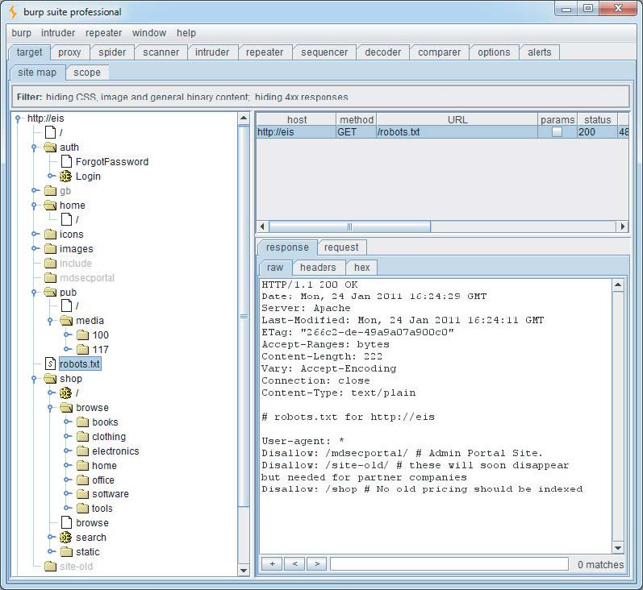
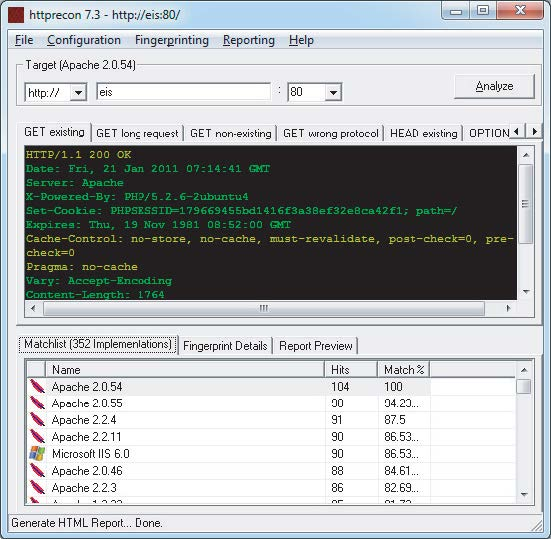
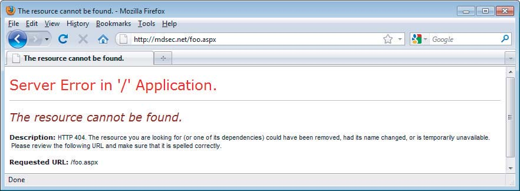
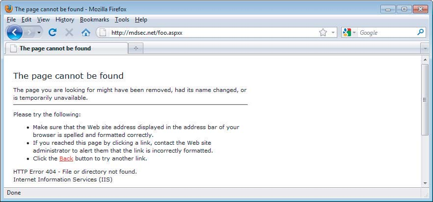
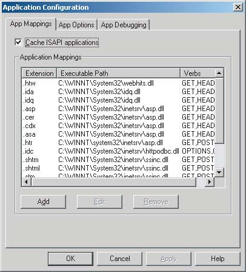
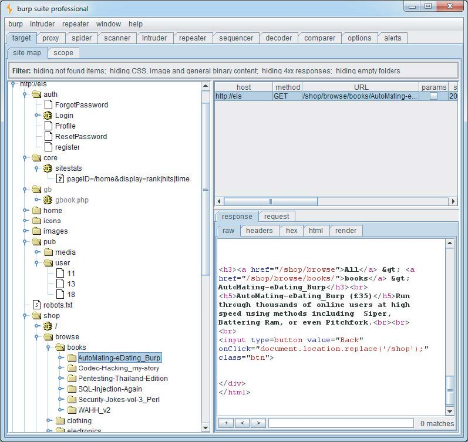

# 第四章：应用程序攻击面映射

攻击一个应用程序的第一步是收集并检查一些关键信息，以便更好地了解你所面对的挑战。

映射工作从枚举应用程序的内容和功能开始，以了解应用程序的功能和行为。许多功能很容易识别，但有些可能隐藏起来，需要一定程度的猜测和运气才能发现。

在汇集了应用程序功能的目录后，主要任务是仔细检查其行为的各个方面、其核心安全机制以及所使用的技术（客户端和服务器端）。这将使你能够识别应用程序暴露的关键攻击面，从而确定你应该重点关注的区域，以寻找可利用的漏洞。通常，分析过程本身就可以发现漏洞，这将在本章后面讨论。

随着应用程序变得越来越大、功能越来越强大，有效的映射是一项宝贵的技能。经验丰富的专家可以快速对整个功能区域进行分类，寻找漏洞的类别而不是实例，同时投入大量时间测试其他特定区域，以发现高风险问题。

本章将描述在应用程序映射过程中需要遵循的实际步骤，以及可以用来最大限度地提高其有效性的各种技术和技巧，以及一些可以帮助你完成此过程的工具。

## 枚举内容和功能

在典型的应用程序中，大部分内容和功能可以通过手动浏览来识别。基本的方法是从主初始页面开始，逐个点击链接，并遍历所有多阶段功能（如用户注册或密码重置）。如果应用程序包含一个“站点地图”，这可以为枚举内容提供一个有用的起点。

然而，要对枚举的内容进行严格检查，并获得对所有识别内容的全面记录，就必须采用比简单浏览更高级的技术。

### Web爬虫

各种工具可以执行网站的自动爬取。这些工具的工作原理是请求一个网页，解析其中的链接到其他内容，请求这些链接，并递归地继续，直到没有发现新的内容。

基于这个基本功能，Web应用程序爬虫试图通过解析HTML表单并使用各种预设或随机值将这些表单提交回应用程序来实现更高的覆盖率。这可以使它们遍历多阶段功能，并遵循基于表单的导航（例如，其中下拉列表用作内容菜单）。一些工具还解析客户端JavaScript以提取指向更多内容的URL。

有许多免费工具可以很好地枚举应用程序的内容和功能，包括Burp Suite、WebScarab、Zed Attack Proxy和CAT（更多详细信息请参见第20章）。

**提示** 许多Web服务器的Web根目录中包含一个名为robots.txt的文件，其中包含一个站点不希望Web爬虫访问或搜索引擎索引的URL列表。有时，这个文件包含对敏感功能的引用，而这些功能无疑是您感兴趣的爬取对象。一些用于攻击Web应用程序的爬取工具会检查robots.txt文件，并使用其中的所有URL作为爬取过程中的种子。在这种情况下，robots.txt文件可能对Web应用程序的安全性产生反作用。

本章使用一个虚构的应用程序Extreme Internet Shopping（EIS）来提供常见应用程序映射操作的示例。图4-1显示了Burp Spider针对EIS运行的情况。在没有登录的情况下，可以映射出/shop目录和/media目录中的两篇新闻文章。另请注意，图中显示的robots.txt文件引用了/mdsecportal和/site-old目录。这些目录在应用程序中的任何位置都没有链接，并且不会被仅遵循已发布内容链接的Web爬虫索引。

**提示：** 采用REST风格URL的应用程序使用URL文件路径的部分来唯一标识应用程序中使用的数据和其他资源（更多详细信息请参见第3章）。在这种情况下，传统Web爬虫的基于URL的应用程序视图非常有用。在EIS应用程序中，/shop和/pub路径采用了REST风格URL，通过爬取这些区域，可以很容易地获得这些路径中可用项目的唯一链接。



图4-1：使用Burp Spider映射应用程序的一部分

虽然这种全自动的内容枚举方法通常很有效，但它也有一些显著的限制：

- **不寻常的导航机制**（例如，使用复杂的JavaScript代码动态创建和处理的菜单）通常不能被这些工具正确处理，因此它们可能会遗漏应用程序的整个区域。
- **隐藏在编译后的客户端对象（如Flash或Java applet）中的链接**可能不被爬虫捕获。
- **多阶段功能**通常实现细粒度的输入验证检查，这些检查不接受自动化工具可能提交的值。例如，一个用户注册表单可能包含姓名、电子邮件地址、电话号码和邮政编码字段。一个自动化的应用程序爬虫通常在每个可编辑的表单字段中提交一个单一的测试字符串，应用程序返回一条错误消息，说明提交的一个或多个项目无效。由于爬虫不够智能，无法理解并根据此消息采取行动，因此它不会越过注册表单，因此无法发现任何更多可访问的内容或功能。
- 自动化爬虫通常使用URL来标识唯一的内容。为了避免无限期地继续爬取，它们会识别出已经请求过的链接内容并不再请求。然而，许多应用程序使用基于表单的导航，其中相同的URL可能返回非常不同的内容和功能。例如，一个银行应用程序可能会通过向/account.jsp发送POST请求来实现每个用户操作，并使用参数来传达正在执行的操作。如果爬虫拒绝向此URL发出多个请求，它将错过应用程序的大部分内容。一些应用程序爬虫试图处理这种情况。例如，Burp Spider可以配置为根据参数名称和值来区分表单提交。然而，仍然可能存在完全自动化的方式不能完全有效的情况。我们将在本章后面讨论映射这种功能的方法。
- 相反，有些应用程序将易变数据放在URL中，而这些数据实际上并不用于标识资源或功能（例如，包含计时器或随机数种子的参数）。应用程序的每一页可能包含一组看起来是新的URL，爬虫必须请求这些URL，导致它无限期地运行。
- 当一个应用程序使用身份验证时，一个有效的应用程序爬虫必须能够处理它以访问身份验证保护的功能。前面提到的爬虫可以通过手动配置爬虫来实现这一点，方法是使用经过身份验证的会话的令牌或使用凭证提交给登录功能。然而，即使这样做了，也常常发现爬虫的操作由于各种原因破坏了经过身份验证的会话：
  - 通过跟随所有URL，爬虫最终会请求注销功能，导致其会话中断。
  - 如果爬虫向敏感功能提交无效输入，应用程序可能会防御性地终止会话。
  - 如果应用程序使用每页令牌，爬虫几乎肯定会无法通过按预期顺序请求页面来正确处理这些令牌，这可能会导致整个会话终止。

**警告**

在某些应用程序中，运行一个简单的网页爬虫来解析和请求链接都可能极其危险。例如，一个应用程序可能包含一些管理功能，比如删除用户、关闭数据库、重启服务器等等。如果使用了一个了解应用程序的爬虫，一旦爬虫发现了并使用了敏感功能，就可能造成很大的破坏。

作者曾经遇到过一个应用程序，其中包含了一些内容管理系统 (CMS) 的功能，用于编辑主应用程序的内容。这个功能可以通过站点地图发现，并且没有任何访问控制保护。如果针对这个站点运行一个自动化的爬虫，它就会找到编辑功能，并开始发送任意数据，导致主网站在爬虫运行期间实时被篡改。

### 用户引导的爬取

这是一种更为复杂但可控的技术，通常比自动化的爬取更可取。在这种方式下，用户通过一个标准浏览器以正常的方式浏览应用程序，试图遍历应用程序的所有功能。在此过程中，产生的流量会通过一个结合了拦截代理和爬虫的工具，该工具会监控所有的请求和响应。这个工具会构建一个应用程序的地图，包含浏览器访问的所有 URL。它还会像一个普通的了解应用程序的爬虫一样解析所有的应用程序响应，并用发现的内容和功能更新站点地图。Burp Suite 和 WebScarab 中的爬虫就可以这样使用（更多信息请参见第 20 章）。

与基本的爬取方式相比，这种技术提供了诸多优势：

- **对于那些使用不寻常或复杂导航机制的应用程序，用户可以通过浏览器以正常方式来跟随这些导航。** 代理/爬虫工具会处理用户访问的所有功能和内容。
- **用户可以控制提交给应用程序的所有数据，并确保满足数据验证要求。**
- **用户可以以通常的方式登录应用程序，并确保认证会话在整个映射过程中保持活跃。** 如果任何操作导致会话终止，用户可以重新登录并继续浏览。
- **任何危险的功能，例如 deleteUser.jsp，都会被完整枚举并纳入代理的站点地图，因为指向它的链接会被从应用程序的响应中解析出来。** 但是，用户可以自行决定哪些功能需要实际请求或执行。

在 Extreme Internet Shopping 网站中，之前爬虫无法索引 /home 目录下的任何内容，因为该内容需要认证。对 /home 的请求会得到以下响应：

```http
HTTP/1.1 302 Moved Temporarily
Date: Mon, 24 Jan 2011 16:13:12 GMT
Server: Apache
Location: /auth/Login?ReturnURL=/home/
```

通过用户引导的爬取，用户只需使用浏览器登录应用程序，代理/爬虫工具就会接管产生的会话，并识别现在对用户可用的一切额外内容。图 4-2 显示了当用户成功认证到应用程序的受保护区域时，EIS 站点地图的样子。


图 4-2：完成用户引导爬取后的 Burp 站点地图

这张图揭示了主菜单系统中的一些额外资源。图中显示了一个指向私有配置文件的引用，该配置文件是通过一个在 onClick 事件处理程序中触发的 JavaScript 函数访问的。

```html
<a href=”#” onclick=”ui_nav(‘profile’)”>private profile</a>
```

一个仅遵循HTML内部链接的传统网络爬虫很可能错过这种类型的链接。即使是最先进的自动化应用程序爬虫，也远远落后于当今应用程序和浏览器扩展所采用的众多导航机制。然而，通过用户驱动的爬取，用户只需使用浏览器跟随可见的屏幕上的链接，代理/爬虫工具就会将生成的内容添加到站点地图中。

相反，请注意，尽管这个链接并未显示给用户，但爬虫已经成功地识别出了HTML注释中包含的指向/core/sitestats的链接。

**提示：** 除了上述代理/爬虫工具之外，在应用程序映射过程中经常有用的另一类工具是各种可以在浏览器界面中执行HTTP和HTML分析的浏览器扩展。例如，图4-3所示的IEWatch工具可以在Microsoft Internet Explorer中运行，监控所有请求和响应的详细信息，包括头信息、请求参数和cookie。它分析每个应用程序页面以显示链接、脚本、表单和富客户端组件。

当然，所有这些信息都可以在您的拦截代理中查看，但是拥有第二个有用的映射数据的记录只能帮助您更好地理解应用程序并枚举其所有功能。有关此类工具的更多信息，请参见第20章。


图4-3：IEWatch在浏览器内执行HTTP和HTML分析

**攻击步骤**

1. **配置浏览器**：将浏览器设置为使用Burp或WebScarab作为本地代理（如果你不确定如何操作，请参考第20章的详细说明）。
2. **浏览整个应用**：以正常方式浏览整个应用程序，尝试访问发现的每个链接/URL，提交每个表单，并完成所有多步骤功能。尝试启用和禁用JavaScript，以及启用和禁用cookie。许多应用程序可以处理各种浏览器配置，你可能会到达应用程序中的不同内容和代码路径。
3. **审查站点地图**：审查代理/爬虫工具生成的站点地图，并识别任何你没有手动浏览的应用程序内容或功能。确定爬虫如何枚举每个项。例如，在Burp Spider中，检查“Linked From”详细信息。使用浏览器手动访问该项，以便代理/爬虫工具解析来自服务器的响应，以识别任何进一步的内容。递归地继续此步骤，直到不再识别出任何进一步的内容或功能。
4. **主动爬取**（可选）：告诉工具使用所有已枚举的内容作为起点，主动爬取站点。首先，识别任何危险的或可能破坏应用程序会话的URL，并配置爬虫将其排除在其范围之外。运行爬虫并审查结果，以查找它发现的任何额外内容。

代理/爬虫工具生成的站点地图包含大量关于目标应用程序的信息，这将在以后识别应用程序暴露的各种攻击面时非常有用。

### 发现隐藏内容

应用程序通常包含与主可见内容没有直接链接或无法直接访问的内容和功能。一个常见的例子是为测试或调试目的而实现的功能，并且从未被删除。

另一个例子是，应用程序向不同类别的用户（例如匿名用户、经过身份验证的普通用户和管理员）呈现不同的功能。处于一个权限级别的用户通过对应用程序进行详尽的爬虫可能会错过对其他级别用户可见的功能。攻击者发现该功能后，可能会利用它来提升她在应用程序中的权限。

还有无数其他情况，可能存在有趣的内容和功能，而之前描述的映射技术无法识别：

- **备份文件的副本：** 对于动态页面，其文件扩展名可能已更改为未映射为可执行的文件，使您可以查看页面源代码以查找可用于实时页面上的漏洞。
- **备份存档，包含文件（甚至在Web根目录之外）的完整快照，可能使您可以轻松识别应用程序中的所有内容和功能。**
- **已部署到服务器进行测试但尚未从主应用程序链接的新功能。**
- **现成应用程序中的默认应用程序功能，已从用户界面中隐藏，但仍存在于服务器上。**
- **尚未从服务器删除的文件的旧版本。** 对于动态页面，这些可能包含当前版本中已修复但仍可以在旧版本中利用的漏洞。
- **包含敏感数据（如数据库凭据）的配置文件和包含文件。**
- **从其中编译了实时应用程序功能的源文件。**
- **源代码中的注释，在极端情况下可能包含用户名和密码等信息，但更有可能提供有关应用程序状态的信息。** 诸如“测试此功能”之类的关键短语是开始寻找漏洞的强烈指示。
- **可能包含敏感信息（如有效用户名、会话令牌、访问的URL和执行的操作）的日志文件。**

有效地发现隐藏内容需要结合自动化和手动技术，并且通常依赖于一定程度的运气。

### 暴力破解技术

第14章描述了如何利用自动化技术来加速对应用程序的几乎任何攻击。在当前的信息收集环境中，自动化可以用来向Web服务器发出大量请求，试图猜测隐藏功能的名称或标识符。

例如，假设您的用户定向爬虫已经识别出以下应用程序内容：

``` http
http://eis/auth/Login
http://eis/auth/ForgotPassword
http://eis/home/
http://eis/pub/media/100/view
http://eis/images/eis.gif
http://eis/include/eis.css
```

自动识别隐藏内容的第一步可能涉及以下请求，以查找其他目录：

```http
http://eis/About/
http://eis/abstract/
http://eis/academics/
http://eis/accessibility/
http://eis/accounts/
http://eis/action/
...
```

Burp Intruder 可以用来迭代一个常见的目录名称列表，并捕获服务器响应的详细信息，这些详细信息可以被审查以识别有效的目录。图4-4显示了 Burp Intruder 被配置为探测位于Web根目录下的常见目录。


图4-4：Burp Intruder 被配置为探测常见目录

当攻击被执行时，点击列标题如“status”和“length”可以对结果进行排序，使您能够快速识别一系列潜在的进一步资源，如图4-5所示。

在对目录和子目录进行暴力破解后，您可能希望在应用程序中找到其他页面。特别令人感兴趣的是 /auth 目录，其中包含在爬虫过程中识别的 Login 资源，这可能是未经身份验证的攻击者的良好起点。

同样，您可以请求此目录中的系列文件：

```http
http://eis/auth/About/
http://eis/auth/Aboutus/
http://eis/auth/AddUser/
http://eis/auth/Admin/
http://eis/auth/Administration/
http://eis/auth/Admins/
...
```


图4-5：Burp Intruder 显示目录暴力破解攻击的结果

图4-6 显示了这次攻击的结果，它已经识别了 /auth 目录中的几个资源：

```http
Login
Logout
Register
Profile
```

请注意，对 Profile 的请求返回 HTTP 状态代码 302。这表明在没有身份验证的情况下访问此链接会将用户重定向到登录页面。另一个有趣的是，虽然在爬虫过程中发现了登录页面，但注册页面却没有。这可能是因为这个额外的功能是可操作的，攻击者可以在网站上注册一个用户账户。


图4-6：Burp Intruder 显示文件暴力破解攻击的结果

**注意**：不要假设如果请求的资源存在，应用程序将以 200 OK 响应，而如果不存在，则以 404 Not Found 响应。许多应用程序以自定义方式处理对不存在的资源的请求，通常返回定制错误消息和 200 响应代码。此外，对现有资源的一些请求可能会收到非 200 响应。以下是您在暴力破解寻找隐藏内容时可能遇到的响应代码的可能含义的粗略指南：

- **302 Found** — 如果重定向到登录页面，则该资源可能仅可由经过身份验证的用户访问。如果重定向到错误消息，这可能表明不同的原因。如果重定向到另一个位置，则重定向可能是应用程序的预期逻辑的一部分，应进一步调查。
- **400 Bad Request** — 应用程序可能使用自定义命名方案来命名 URL 中的目录和文件，而特定请求未遵守该方案。然而，更有可能的是，您使用的单词列表包含一些空格字符或其他无效语法。
- **401 Unauthorized or 403 Forbidden** — 这通常表示所请求的资源存在，但任何用户都无法访问，无论其身份验证状态或权限级别如何。当请求目录时，通常会发生这种情况，您可以推断目录存在。
- **500 Internal Server Error** — 在内容发现过程中，这通常表示应用程序期望在请求资源时提交某些参数。

各种可能表明有趣内容存在的响应意味着很难编写一个完全自动化的脚本来输出有效资源的列表。最好的方法是在暴力破解练习期间捕获尽可能多的有关应用程序响应的信息，并手动对其进行审查。

**黑客步骤**

1. 对已知有效和无效资源进行一些手动请求，并确定服务器如何处理后者。
2. 使用通过用户定向爬虫生成的站点地图作为隐藏内容自动发现的基础。
3. 对应用程序中已知存在的每个目录或路径内的常见文件名和目录进行自动请求。使用 Burp Intruder 或自定义脚本，结合常见文件和目录的词汇表，快速生成大量请求。如果您已经确定应用程序处理无效资源的特定方式（例如自定义的“文件未找到”页面），请配置 Intruder 或您的脚本以突出显示这些结果，以便可以忽略它们。
4. 捕获从服务器收到的响应，并手动审查它们以识别有效资源。
5. 随着新内容的发现，递归地执行目录请求。

### 从已发布内容中推断

大多数应用程序都使用某种命名方案来命名其内容和功能。通过从应用程序中已经识别的资源中推断，可以微调您的自动枚举方法，以增加发现更多隐藏内容的可能性。

在 EIS 应用程序中，请注意 /auth 中的所有资源都以大写字母开头。这就是为什么在前一节的文件暴力破解中使用的单词列表是故意大写的。此外，由于我们已经识别了 /auth 目录中的一个名为 ForgotPassword 的页面，我们可以搜索类似命名的项目，例如：

```http
http://eis/auth/ResetPassword
```

此外，在用户定向爬虫期间创建的站点地图识别了以下资源：

```http
http://eis/pub/media/100 
http://eis/pub/media/117 
http://eis/pub/user/11
```

类似范围内的其他数值可能会识别出进一步的资源和信息。

**提示:** Burp Intruder 具有高度可定制性，可用于定位 HTTP 请求的任何部分。图 4-7 显示了 Burp Intruder 被用于对文件名的一半执行暴力破解攻击以发出请求：

```http
http://eis/auth/AddPassword
http://eis/auth/ForgotPassword
http://eis/auth/GetPassword
http://eis/auth/ResetPassword
http://eis/auth/RetrievePassword
http://eis/auth/UpdatePassword
...
```

图 4-7：Burp Intruder 用于对文件名的一部分执行自定义暴力破解攻击

**黑客步骤**

1. 审查您的用户定向浏览和基本暴力破解练习的结果。编译已枚举的所有子目录、文件开头和文件扩展名的名称列表。
2. 审查这些列表以识别正在使用的任何命名方案。例如，如果有名为 AddDocument.jsp 和 ViewDocument.jsp 的页面，那么可能还有名为 EditDocument.jsp 和 RemoveDocument.jsp 的页面。您通常可以通过阅读几个示例来了解开发人员的命名习惯。例如，根据他们的个人风格，开发人员可能冗长（AddANewUser.asp）、简洁（AddUser.asp）、使用缩写（AddUsr.asp），甚至更神秘（AddU.asp）。了解使用的命名风格可能有助于您猜测尚未识别的内容的精确名称。
3. 有时，用于不同内容的命名方案使用数字和日期等标识符，这可以使推断隐藏内容变得容易。这最常见于静态资源的名称，而不是动态脚本。例如，如果一家公司的网站链接到 AnnualReport2009.pdf 和 AnnualReport2010.pdf，那么应该很快就能确定下一份报告将被称为什么。令人难以置信的是，曾经有公司在公开宣布之前将包含财务报告的文件放在其 Web 服务器上，只有狡猾的记者根据前几年使用的命名方案发现了它们。
4. 审查所有客户端代码，如 HTML 和 JavaScript，以识别有关隐藏服务器端内容的任何线索。这些可能包括与受保护或未链接功能相关的 HTML 注释、具有禁用 SUBMIT 元素的 HTML 表单等。通常，注释是由用于生成 Web 内容的软件或应用程序运行的平台自动生成的。对服务器端包含文件的引用特别令人感兴趣。这些文件实际上可能是公开可下载的，并且可能包含高度敏感的信息，如数据库连接字符串和密码。在其他情况下，开发人员的注释可能包含各种有用的信息，例如数据库名称、后端组件的引用、SQL 查询字符串等。诸如 Java applets 和 ActiveX 控件之类的后客户端组件也可能包含您可以提取的敏感数据。请参阅第 15 章了解应用程序可能披露有关其自身信息的更多方式。
5. 根据您发现的项目，将任何进一步的潜在名称添加到枚举项目的列表中。此外，将常见的扩展名（如 txt、bak、src、inc 和 old）添加到文件扩展名列表中，这些扩展名可能会揭露实时页面的源代码和备份版本。此外，添加与正在使用的开发语言相关的扩展名，例如 .java 和 .cs，这些扩展名可能会揭露已编译为实时页面的源文件。（有关识别正在使用的技术的提示，请参阅本章后面的部分。）
6. 搜索可能由开发人员工具和文件编辑器无意中创建的临时文件。示例包括 .DS_Store 文件，它包含 OS X 下的目录索引，file.php~1，这是在编辑 file.php 时创建的临时文件，以及 .tmp 文件扩展名，它由许多软件工具使用。
7. 执行进一步的自动化练习，结合目录、文件开头和文件扩展名的列表，以请求大量潜在资源。例如，在给定目录中，请求每个文件开头与每个文件扩展名的组合。或者将每个目录名称作为每个已知目录的子目录进行请求。
8. 在识别出一致的命名方案的情况下，考虑执行更集中的暴力破解练习。例如，如果已知存在 AddDocument.jsp 和 ViewDocument.jsp，您可以创建一个操作列表（编辑、删除、创建）并发出 XxxDocument.jsp 形式的请求。或者，创建一个项目类型列表（用户、帐户、文件）并发出 AddXxx.jsp 形式的请求。
9. 递归地执行每个练习，使用新枚举的内容和模式作为进一步用户定向爬虫和进一步自动化内容发现的基础。您仅受想象力、可用时间和您对发现目标应用程序中隐藏内容的重要性所限制。

**注意：** 您可以使用 Burp Suite Pro 的内容发现功能来自动化大多数到目前为止描述的任务。在使用浏览器手动映射应用程序的可见内容后，您可以选择一个或多个 Burp 站点地图的分支，并在这些分支上启动内容发现会话。

Burp 在尝试发现新内容时使用以下技术：

- 使用内置的常见文件和目录名称列表进行暴力破解
- 基于在目标应用程序中观察到的资源名称动态生成单词列表
- 外推包含数字和日期的资源名称
- 对识别出的资源测试替代文件扩展名
- 从发现的内容中爬取
- 自动指纹识别有效和无效的响应，以减少误报

所有练习都是递归执行的，随着新应用程序内容的发现，将安排新的发现任务。图 4-8 显示了正在针对 EIS 应用程序进行的内容发现会话。


图 4-8：正在针对 EIS 应用程序进行的内容发现会话

**提示** OWASP 的 DirBuster 项目在执行自动内容发现任务时也是一个有用的资源。它包含大量在野外发现的目录名称列表，按出现频率排序。

### 公共信息的使用

应用程序可能包含一些内容和功能，它们目前未链接到主内容，但曾经链接过。在这种情况下，各种历史存储库很可能仍然包含指向隐藏内容的引用。以下两种类型的公开可用资源在此派上用场：

- **搜索引擎**（例如 Google、Yahoo 和 MSN）： 这些搜索引擎维护了一个细粒度的索引，涵盖其强大爬虫发现的所有内容，并且还缓存了大部分内容的副本，即使原始内容已被删除，这些副本仍然存在。
- **网页存档**（例如位于 archive.org 的 WayBack Machine）： 这些存档维护了大量网站的历史记录。在许多情况下，它们允许用户浏览给定网站在过去几年不同日期的全复制快照。

除了曾经链接过的内容之外，这些资源还可能包含指向内容的引用，这些内容通过第三方网站进行链接，但不在目标应用程序本身之内。例如，一些应用程序包含供其商业伙伴使用的受限功能。这些合作伙伴可能会以应用程序本身没有的方式披露此功能的存在。

**黑客步骤：**

1. 使用之前列出的几种不同的搜索引擎和网页存档来发现它们为您的攻击目标应用程序索引或存储的内容。
2. 当查询搜索引擎时，您可以使用各种高级技术来最大限度地提高研究效率。以下建议适用于 Google 搜索。您可以通过选择其他搜索引擎的“高级搜索”选项找到对应的查询方式。
   - `site:www.wahh-target.com`：返回 Google 引用到的目标网站内的所有资源。
   - `site:www.wahh-target.com login`：返回所有包含“login”表达式的页面。对于大型复杂应用程序，此技术可用于快速定位有趣的资源，例如站点地图、密码重置功能和管理菜单。
   - `link:www.wahh-target.com`：返回其他网站和应用程序上所有包含指向目标网站链接的页面。这可能包括指向旧内容的链接，或者仅供第三方使用的功能，例如合作伙伴链接。
   - `related:www.wahh-target.com`：返回与目标“相似”的页面，因此会包含许多无关的材料。但是，它也可能会在其他网站上讨论目标，这可能很有用。
3. 每个搜索不仅要在 Google 的默认网页部分进行，还要在“Google 网页搜索”和“Google 新闻”中进行，因为这些部分可能包含不同的结果。
4. 浏览给定查询的搜索结果的最后一页，然后选择“包括省略的结果重复搜索”。默认情况下，Google 尝试通过删除它认为与结果中包含的其他页面足够相似的页面来过滤冗余结果。覆盖此行为可能会揭示一些细微不同的页面，这些页面在攻击应用程序时对您来说可能很有用。
5. 查看有趣页面的缓存版本，包括不再出现在实际应用程序中的任何内容。在某些情况下，搜索引擎缓存包含无法在应用程序中直接访问的资源，这些资源可能需要身份验证或付费才能访问。
6. 对属于同一组织的其他域名执行相同的查询，这些域名可能包含有关您所攻击的应用程序的有用信息。

如果您的研究发现不再链接到主应用程序的旧内容和功能，则该内容和功能可能仍然存在并可用。旧功能可能包含应用程序其他地方不存在的漏洞。

即使旧内容已从实时应用程序中删除，从搜索引擎缓存或网页存档中获取的内容也可能包含指向实时应用程序中仍然存在并可用于攻击它的其他功能的引用或线索。

**另一种关于目标应用程序的有用信息的公开来源是开发人员和其他人在互联网论坛上发布的任何帖子。** 有许多此类论坛，软件设计师和程序员在其中提问和回答技术问题。通常，发布在这些论坛上的项目包含对攻击者直接有益的关于应用程序的信息，包括使用的技术、实现的功能、开发过程中遇到的问题、已知的安全漏洞、提交以协助故障排除的配置和日志文件，甚至源代码的摘录。

**黑客步骤：**

1. **收集相关人员信息**：编译一个包含所有你能发现与目标应用程序及其开发相关的人名和电子邮件地址的列表。这应该包括任何已知的开发人员、在 HTML 源代码中找到的名称、在主公司网站的联系信息部分找到的名称，以及应用程序本身披露的任何名称，例如管理人员。
2. **搜索论坛帖子**：使用之前描述的搜索技术，搜索每个识别出的名称，以查找他们发布在互联网论坛上的任何问题和答案。审查找到的任何信息，以寻找关于目标应用程序中的功能或漏洞的线索。

### 利用Web服务器

Web服务器层可能存在漏洞，使您可以发现Web应用程序本身未链接的内容和功能。例如，Web服务器软件中的错误可能允许攻击者列出目录的内容或获取动态服务器可执行页面的原始源代码。有关这些漏洞的一些示例以及识别它们的方法，请参见第18章。如果存在这样的错误，您可能能够利用它直接获取应用程序中所有页面和其他资源的列表。

许多应用程序服务器都附带默认内容，这些内容可能有助于您攻击它们。例如，示例和诊断脚本可能包含已知的漏洞或功能，这些漏洞或功能可能被用于恶意目的。

此外，许多Web应用程序都整合了通用的第三方组件，用于标准功能，如购物车、讨论论坛或内容管理系统（CMS）功能。这些通常安装到相对于Web根目录或应用程序的起始目录的固定位置。

自动化工具非常适合此类任务，并且许多工具从大量已知的默认Web服务器内容、第三方应用程序组件和常见目录名称的数据库中发出请求。虽然这些工具不会严格测试任何隐藏的自定义功能，但它们通常可以用于发现应用程序中未链接的其他资源，这些资源可能对制定攻击很有用。

Wikto是许多执行此类扫描的免费工具之一，此外还包含一个可配置的暴力破解列表用于内容。如图4-9所示，当用于极端互联网购物站点时，它使用其内部单词列表识别了一些目录。因为它有一个庞大的常用Web应用程序软件和脚本数据库，它还识别了以下目录，攻击者不会通过自动化或用户驱动的爬虫发现：

```http
http://eis/phpmyadmin/
```


图4-9：使用Wikto发现内容和一些已知漏洞

此外，虽然/gb目录已经通过爬虫识别，但Wikto已经识别了以下特定URL：

```html
/gb/index.php?login=true
```

Wikto检查此URL，因为它用于gbook PHP应用程序，该应用程序包含一个公开已知的漏洞。

**注意:** 就像许多商业Web扫描器一样，Nikto和Wikto等工具包含大量的默认文件和目录列表，因此似乎在执行大量检查方面非常勤奋。然而，大量的检查是冗余的，并且误报很常见。更糟糕的是，如果服务器配置为隐藏横幅，如果脚本或脚本集合被移动到不同的目录，或者如果HTTP状态代码以自定义方式处理，则可能会经常出现误报。因此，最好使用像Burp Intruder这样的工具，它允许您解释原始响应信息，并且不会试图为您提取好坏结果。

**黑客步骤：**

运行Nikto时，可以使用几个有用的选项：

1. 如果您认为服务器正在使用非标准位置用于Nikto检查的有趣内容（例如/cgi/cgi-bin而不是/cgi-bin），您可以使用选项-root /cgi/指定此替代位置。对于CGI目录的特定情况，也可以使用选项-Cgidirs指定这些目录。
2. 如果站点使用自定义的“文件未找到”页面，该页面不返回HTTP 404状态代码，您可以使用-404选项指定标识此页面的特定字符串。
3. 请注意，Nikto不会执行任何智能验证潜在问题，因此容易报告误报。始终手动检查Nikto返回的任何结果。

请注意，使用像Nikto这样的工具，您可以使用其域名或IP地址指定目标应用程序。如果工具使用其IP地址访问页面，则工具将该页面上使用其域名的链接视为属于不同的域，因此不会跟踪这些链接。这是合理的，因为一些应用程序是虚拟托管的，多个域名共享相同的IP地址。请确保您考虑到这一点来配置您的工具。

### 应用程序页面与功能路径

到目前为止描述的枚举技术已经隐含地由一种特定的图片驱动，该图片描述了如何对Web应用程序内容进行概念化和编目。这张图片继承自万维网的应用程序前时代，其中Web服务器作为静态信息的存储库，使用实际上是文件名URL进行检索。为了发布一些Web内容，作者只需生成一堆HTML文件并将其复制到Web服务器上的相关目录中。当用户遵循超链接时，他们导航作者创建的文件集，通过其在服务器上驻留的目录树中的名称请求每个文件。

虽然Web应用程序的演变从根本上改变了与Web交互的体验，但刚刚描述的图片仍然适用于大多数Web应用程序内容和功能。个别功能通常通过唯一的URL访问，该URL通常是实现该功能的服务器端脚本的名称。请求的参数（位于URL查询字符串或POST请求的主体中）不会告诉应用程序要执行什么功能；它们告诉它在执行功能时使用什么信息。在这种情况下，构建基于URL的地图的方法可以有效地编目应用程序的功能。

在使用REST风格URL的应用程序中，URL文件路径的一部分包含实际上用作参数值的字符串。在这种情况下，通过映射URL，映射应用程序功能和已知参数值到这些功能。

然而，在某些应用程序中，基于应用程序“页面”的图片是不合适的。虽然可以将任何应用程序的结构塞入这种表示形式，但在许多情况下，基于功能路径的不同图片对于编目其内容和功能更有用。考虑一个仅使用以下形式的请求访问的应用程序：

```http
POST /bank.jsp HTTP/1.1
Host: wahh-bank.com
Content-Length: 106
servlet=TransferFunds&method=confirmTransfer&fromAccount=10372918&to
Account=
3910852&amount=291.23&Submit=Ok
```

在这里，每个请求都发送到单个URL。请求的参数用于通过命名要调用的Java servlet和方法来告诉应用程序要执行什么功能。其他参数提供用于执行功能的信息。在基于应用程序页面的图片中，应用程序似乎只有一个功能，并且基于URL的地图无法阐明其功能。但是，如果我们根据功能路径映射应用程序，我们可以获得更具信息性和有用的目录。图4-10是应用程序中存在的功能路径的部分映射。


图4-10：Web应用程序中功能路径的映射

以这种方式表示应用程序的功能通常更有用，即使在没有问题的情况下可以应用基于应用程序页面的图片时也是如此。不同功能之间的逻辑关系和依赖关系可能与URL中使用的目录结构不对应。这些逻辑关系对于理解应用程序的核心功能以及制定针对它的可能攻击最感兴趣。通过识别这些关系，您可以更好地理解应用程序开发人员在实现功能时的期望和假设。您还可以尝试找到违反这些假设的方法，从而导致应用程序出现意外行为。

在使用请求参数而不是URL标识功能的应用程序中，这对于应用程序内容的枚举具有影响。在前面的示例中，到目前为止描述的内容发现练习不太可能发现任何隐藏内容。这些技术需要适应应用程序实际用于访问功能的机制。

**黑客步骤:**

1. 识别任何应用程序功能不是通过请求该功能的特定页面（例如/admin/editUser.jsp），而是通过在参数中传递函数的名称（例如/admin.jsp?action=editUser）来访问的实例。
2. 修改为发现URL指定内容所描述的自动化技术，以适用于应用程序中使用的内容访问机制。例如，如果应用程序使用指定servlet和方法名称的参数，首先确定在请求无效servlet和/或方法以及请求有效方法时具有其他无效参数时的行为。尝试识别服务器响应的属性，这些属性指示“命中”——有效的servlet和方法。如果可能，找到一种分两个阶段攻击问题的方法，首先枚举servlet，然后枚举这些servlet中的方法。使用与URL指定内容类似的方法，编译常见项的列表，通过从实际观察到的名称中推断来添加到这些列表，并根据这些列表生成大量请求。
3. 如果适用，根据功能路径编译应用程序内容的映射，显示所有枚举的功能以及它们之间的逻辑路径和依赖关系。

### 发现隐藏参数

应用程序使用请求参数指定应执行哪个功能的情况的一种变体是，其他参数用于以重要的方式控制应用程序的逻辑。例如，如果将参数debug=true添加到任何URL的查询字符串中，应用程序可能会表现不同。它可能会关闭某些输入验证检查，允许用户绕过某些访问控制，或在其响应中显示详细的调试信息。在许多情况下，无法直接从应用程序的任何内容中推断出应用程序处理此参数的事实（例如，它不会将debug=false包含在其作为超链接发布的URL中）。只有通过猜测一系列值直到提交正确的值才能检测到参数的效果。

**黑客步骤:**

1. 使用常用调试参数名称（debug、test、hide、source等）和常用值（true、yes、on、1等）的列表，向已知应用程序页面或函数发出大量请求，迭代所有名称和值的排列组合。对于POST请求，将添加的参数插入URL查询字符串和消息正文中。Burp Intruder可以使用多个有效载荷集和“集群炸弹”攻击类型来执行此测试（有关更多详细信息，请参见第14章）。
2. 监控收到的所有响应，以识别可能表明添加的参数对应用程序的处理产生了影响的任何异常。
3. 根据可用时间，针对多个不同页面或函数进行隐藏参数发现。选择最有可能开发人员实现调试逻辑的函数，例如登录、搜索以及文件上传和下载。

## 分析应用程序

尽可能枚举应用程序的大部分内容只是映射过程的一个步骤。同样重要的是分析应用程序的功能、行为和使用的技术，以识别它暴露的关键攻击面，并开始制定一种方法来探测应用程序是否存在可利用的漏洞。

以下是需要调查的一些关键领域：

- 应用程序的核心功能——在按预期使用时可以利用来执行的操作
- 其他、更多外围的应用程序行为，包括外部链接、错误消息、管理和日志记录功能，以及重定向的使用
- 核心安全机制及其功能——特别是会话状态管理、访问控制和身份验证机制以及支持逻辑（用户注册、密码更改和帐户恢复）
- 应用程序处理用户提供的所有不同位置的输入——每个URL、查询字符串参数、POST数据项和cookie
- 客户端使用的技术，包括表单、客户端脚本、厚客户端组件（Java小程序、ActiveX控件和Flash）以及cookie
- 服务器端使用的技术，包括静态和动态页面、使用的请求参数类型、SSL的使用、Web服务器软件、与数据库、电子邮件系统和其他后端组件的交互
- 任何其他可能收集到的有关服务器端应用程序的内部结构和功能的详细信息——它在幕后使用的机制来提供从客户端角度可见的功能和行为

### 识别用户输入的入口点

在查看应用程序功能生成的HTTP请求时，应用程序捕获用于服务器端处理的用户输入的大多数方式应该是显而易见的。以下是需要注意的关键位置：

- 每个URL字符串直到查询字符串标记
- URL查询字符串中提交的每个参数
- POST请求正文中提交的每个参数
- 每个cookie
- 应用程序可能处理的每个其他HTTP标头——特别是User-Agent、Referer、Accept、Accept-Language和Host标头

### URL文件路径

URL中查询字符串之前的部分通常被忽略为入口点，因为它们被假定为只是服务器文件系统上目录和文件的名称。但是，在使用REST风格URL的应用程序中，URL中查询字符串之前的部分实际上可以作为数据参数，并且与查询字符串本身一样重要作为用户输入的入口点。

典型的REST风格URL可以具有以下格式：

```http
http://eis/shop/browse/electronics/iPhone3G/
```

在此示例中，字符串electronics和iPhone3G应视为存储搜索函数的参数。

同样，在此URL中：

```html
http://eis/updates/2010/12/25/my-new-iphone/
```

updates之后的每个URL组件都可能以RESTful方式处理。

大多数使用REST风格URL的应用程序在给定URL结构和应用程序上下文的情况下很容易识别。但是，在映射应用程序时，不应假设任何严格的规则，因为应用程序的作者可以决定用户应该如何与之交互。

### 请求参数

URL 查询字符串、消息主体和 HTTP cookie 中提交的参数是最明显的用户输入入口。然而，一些应用程序并不采用标准的  “name=value” 格式来表示这些参数。它们可能会使用自己的自定义方案，该方案可能使用非标准的查询字符串标记和字段分隔符，或者可能在参数数据中嵌入其他数据格式，例如 XML。

下面列举了一些作者在实际测试中遇到的非标准参数格式示例：

- `/dir/file;foo=bar&foo2=bar2`
- `/dir/file?foo=bar$foo2=bar2` (注意这里的分隔符)
- `/dir/file/foo%3dbar%26foo2%3dbar2` (URL 编码)
- `/dir/foo.bar/file` (点号可能被解析成路径分隔符)
- `/dir/foo=bar/file` (等号可能被解析成参数分隔符)
- `/dir/file?param=foo:bar` (自定义分隔符)
- `/dir/file?data=%3cfoo%3ebar%3c%2ffoo%3e%3cfoo2%3ebar2%3c%2ffoo2%3e` (嵌入式 XML 数据)

如果应用程序使用非标准的参数格式，在测试过程中就需要考虑这一点，以查找各种常见的漏洞。例如，假设您在测试最后一个 URL 时忽略了自定义格式，只是简单地将查询字符串视为包含单个名为 “data” 的参数，然后将各种攻击载荷作为该参数的值提交。这样您将错过查询字符串处理中可能存在的许多漏洞。相反，如果您剖析格式并将攻击载荷放置在嵌入式 XML 数据字段中，您可能会立即发现诸如 SQL 注入或路径遍历等严重漏洞。

### HTTP标头

许多应用程序执行自定义日志记录功能，并可能记录HTTP标头的内容，例如Referer和User-Agent。这些标头应始终被视为基于输入的攻击的可能入口点。

一些应用程序对Referer标头执行额外的处理。例如，一个应用程序可能会检测到用户是从搜索引擎进入的，并试图提供一个定制的响应来满足用户的搜索查询。应用程序可能会回显搜索词或尝试在响应中突出显示匹配的表达式。一些应用程序试图通过动态添加内容，如HTML关键字，来提高其搜索排名，这些关键字包含最近从搜索引擎来的访问者所搜索的字符串。在这种情况下，可以通过多次发出包含适当构造的Referer URL的请求，将内容持久注入应用程序的响应中。

近年来，一个重要的趋势是应用程序向通过不同设备（笔记本电脑、手机、平板电脑）访问应用程序的用户呈现不同的内容。这是通过检查User-Agent标头来实现的。除了为直接在User-Agent标头本身内的基于输入的攻击提供途径之外，这种行为还提供了在应用程序内发现额外攻击面的机会。通过欺骗流行移动设备的User-Agent标头，您可能能够访问一个简化的用户界面，其行为与主界面不同。由于这个界面是通过服务器端应用程序中的不同代码路径生成的，并且可能经过了较少的安全测试，您可能会发现诸如跨站点脚本等在主应用程序界面中不存在的错误。

**提示：** Burp Intruder包含一个内置的有效载荷列表，其中包含大量不同类型设备的用户代理字符串。您可以进行一个简单的攻击，对主应用程序页面执行GET请求，提供不同的用户代理字符串，然后查看入侵者结果，以识别表明正在呈现不同用户界面的异常。

除了针对浏览器默认发送的HTTP请求标头或应用程序组件添加的HTTP请求标头之外，在某些情况下，您还可以通过添加应用程序可能仍处理的进一步标头来执行成功的攻击。例如，许多应用程序对客户端的IP地址执行一些处理，以执行诸如日志记录、访问控制或用户地理定位等功能。客户端网络连接的IP地址通常可通过平台API提供给应用程序。但是，为了处理应用程序位于负载均衡器或代理后面的情况，应用程序可以使用X-Forwarded-For请求标头中指定的IP地址，如果存在的话。开发人员可能会错误地认为IP地址值是未被污染的，并以危险的方式处理它。通过添加适当构造的X-Forwarded-For标头，您可以交付诸如SQL注入或持久性跨站点脚本等攻击。

### 带外通道

基于用户输入的入口点的最终类别包括任何带外通道，通过该通道，应用程序接收您可能能够控制的数据。如果您只是检查应用程序生成的HTTP流量，这些入口点中的有些可能完全无法检测到，并且找到它们通常需要对应用程序实现的功能的更广泛上下文进行理解。以下是通过带外通道接收用户可控数据的Web应用程序的一些示例：

- 一种处理和呈现通过SMTP接收的电子邮件消息的Web邮件应用程序
- 一个包含一个函数，通过HTTP从另一个服务器检索内容的发布应用程序
- 一个使用网络嗅探器收集数据并使用Web应用程序界面呈现这些数据的入侵检测应用程序
- 任何类型的应用程序，如果通过此接口处理的数据与主Web应用程序共享，则为非浏览器用户代理（如手机应用程序）提供API接口

### 识别服务器端技术

通常可以通过各种线索和指标来识别服务器上使用的技术。

#### 横幅抓取

许多Web服务器公开细粒度的版本信息，包括Web服务器软件本身和已安装的其他组件。例如，HTTP Server标头公开了有关某些安装的巨大详细信息：

```http
Server: Apache/1.3.31 (Unix) mod_gzip/1.3.26.1a mod_auth_passthrough/
1.8 mod_log_bytes/1.2 mod_bwlimited/1.4 PHP/4.3.9 FrontPage/
5.0.2.2634a mod_ssl/2.8.20 OpenSSL/0.9.7a
```

除了服务器标头之外，软件的类型和版本还可以在其他位置公开：

- 用于构建HTML页面的模板
- 自定义HTTP标头
- URL查询字符串参数

#### HTTP指纹识别

原则上，服务器返回的任何信息项都可以定制甚至故意伪造，服务器标头等横幅也不例外。大多数应用程序服务器软件允许管理员配置在服务器HTTP标头中返回的横幅。尽管采取了诸如这样的措施，但一个有决心的攻击者通常可以使用Web服务器的其他行为方面来确定正在使用的软件，或者至少缩小可能性的范围。HTTP规范包含许多可选或留给实现者裁量的详细信息。此外，许多Web服务器以各种方式偏离或扩展规范。因此，除了通过其服务器横幅之外，还可以通过多种微妙的方式对Web服务器进行指纹识别。Httprecon是一个方便的工具，它执行许多测试来尝试对Web服务器的软件进行指纹识别。图4-11显示了Httprecon针对EIS应用程序运行并报告了不同置信度下各种可能的Web服务器。



图4-11：Httprecon对EIS应用程序进行指纹识别

#### 文件扩展名

URL 中使用的文件扩展名通常会泄露用于实现相关功能的平台或编程语言。例如：

- asp — Microsoft Active Server Pages
- aspx — Microsoft ASP.NET
- jsp — Java Server Pages
- cfm — Cold Fusion
- php — The PHP language
- d2w — WebSphere
- pl — The Perl language
- py — The Python language
- dll — Usually compiled native code (C or C++)
- nsf or ntf — Lotus Domino

即使应用程序在其发布内容中未使用特定文件扩展名，通常也可以验证支持该扩展名的技术是否在服务器上实现。例如，如果安装了 ASP.NET，请求一个不存在的 `.aspx` 文件会返回由 ASP.NET 框架生成的定制错误页面，如图 4-12 所示。请求一个具有不同扩展名的不存在文件会返回由 Web 服务器生成的通用错误消息，如图 4-13 所示。



图 4-12：指示服务器上存在 ASP.NET 平台的定制错误页面

通过之前描述的自动内容发现技术，可以请求大量常见的文件扩展名，并快速确认服务器上是否实现了任何相关技术。

出现这种不同的行为是因为许多 Web 服务器将特定的文件扩展名映射到特定的服务器端组件。每个不同的组件可能会以不同的方式处理错误（包括对不存在内容的请求）。图 4-14 显示了在 IIS 5.0 的默认安装中映射到不同处理程序 DLL 的各种扩展名。



图 4-13：请求未识别文件扩展名时创建的通用错误消息



图 4-14：IIS 5.0 中的文件扩展名映射

可以通过请求该文件扩展名时生成的不同的错误消息来检测每个文件扩展名映射的存在。在某些情况下，发现特定的映射可能表明存在 Web 服务器漏洞。例如，IIS 中的 `.printer` 和 `.ida/.idq` 处理程序曾经被发现容易受到缓冲区溢出漏洞的影响。

另一个常见的指纹是看起来像这样的 URL：

`https://wahh-app/news/0,,2-421206,00.html`

URL 末尾的逗号分隔数字通常由 Vignette 内容管理平台生成。

#### 目录名

子目录名称通常会指示关联技术的名称。例如：

- servlet - Java Servlet
- pls - Oracle Application Server PL/SQL 网关
- cfdocs 或 cfide - Cold Fusion
- SilverStream - SilverStream Web 服务器
- WebObjects 或 {function}.woa - Apple WebObjects
- rails - Ruby on Rails

#### 会话令牌

许多 Web 服务器和 Web 应用程序平台默认生成会话令牌，其名称会提供有关所用技术的的信息。例如：

- JSESSIONID - Java 平台
- ASPSESSIONID - Microsoft IIS 服务器
- ASP.NET_SessionId - Microsoft ASP.NET
- CFID/CFTOKEN - Cold Fusion
- PHPSESSID - PHP  

#### 第三方代码组件

许多 Web 应用程序整合了第三方代码组件来实现常见功能，如购物车、登录机制和留言板。这些可以是开源的，也可以从外部软件开发人员购买。在这种情况下，相同的组件通常出现在互联网上的许多其他 Web 应用程序中，您可以检查这些组件以了解组件的功能。通常，其他应用程序使用相同组件的不同功能，使您能够识别出除目标应用程序中直接可见的行为和功能之外的其他行为和功能。此外，该软件可能包含已在其他地方讨论过的已知漏洞，或者您可能能够自己下载并安装该组件，并以受控的方式执行源代码审查或探测其中的缺陷。

#### **黑客步骤**

1. **识别所有用户输入的入口点**，包括 URL、查询字符串参数、POST 数据、cookie 和应用程序处理的其他 HTTP 标头。
2. **检查应用程序使用的查询字符串格式**。如果它不使用第 3 章中描述的标准格式，请尝试了解如何通过 URL 传递参数。几乎所有自定义方案仍然使用名称/值模型的某种变体，因此请尝试了解如何将名称/值对封装到您已识别的非标准 URL 中。
3. **识别任何带外通道**，通过该通道将用户可控或其他第三方数据引入应用程序的处理中。
4. **查看应用程序返回的 HTTP 服务器横幅**。请注意，在某些情况下，应用程序的不同区域由不同的后端组件处理，因此可能会收到不同的服务器标头。
5. **检查任何其他包含在任何自定义 HTTP 标头或 HTML 源代码注释中的软件标识符**。
6. **运行 httprint 工具来对 Web 服务器进行指纹识别**。
7. **如果获得了有关 Web 服务器和其他组件的详细信息，请研究正在使用的软件版本以识别可能被利用来推进攻击的任何漏洞（参见第 18 章）**。
8. **查看您的应用程序 URL 地图以识别任何看起来有趣的文件扩展名、目录或其他子序列，这些可能提供有关服务器上使用的技术的线索**。
9. **查看应用程序发出的所有会话令牌的名称以识别正在使用的技术**。
10. **使用常见技术的列表或 Google 来确定可能在服务器上使用的技术，或发现其他似乎使用相同技术的网站和应用程序**。
11. **对任何不寻常的 cookie、脚本、HTTP 标头等可能属于第三方软件组件的名称执行搜索**。如果您找到使用相同组件的其他应用程序，请查看这些应用程序以识别组件支持的任何其他功能和参数，并验证这些功能和参数是否也存在于您的目标应用程序中。请注意，第三方组件在每个实现中的外观和感觉可能非常不同，因为有品牌定制，但核心功能（包括脚本和参数名称）通常相同。如果可能，请下载并安装该组件并对其进行分析以充分了解其功能，并如果可能的话，发现任何漏洞。请查阅已知漏洞的存储库以识别该组件的任何已知缺陷。

### 识别服务器端功能

通过观察应用程序泄露给客户端的线索，通常可以推断出大量关于服务器端功能和结构的信息，或者至少做出一些合理的猜测。

#### 分析请求

考虑以下用于访问搜索功能的 URL：

```
https://wahh-app.com/calendar.jsp?name=new%20applicants&isExpired=0&startDate=22%2F09%2F2010&endDate=22%2F03%202011&OrderBy=name
```

正如您所看到的，`.jsp` 文件扩展名表明应用程序正在使用 Java Server Pages 技术。您可以猜测搜索功能将从索引系统或数据库中检索其信息。`OrderBy` 参数的存在表明正在使用后端数据库，并且您提交的值可能用作 SQL 查询的 `ORDER BY` 子句。该参数很可能容易受到 SQL 注入攻击，其他任何用于数据库查询的参数也可能存在同样的漏洞（参见第 9 章）。

其他参数中值得注意的是 `isExpired` 字段。这似乎是一个布尔标志，指定搜索查询是否应包含已过期的内容。如果应用程序设计者不期望普通用户能够检索任何已过期的内容，那么将此参数从 0 改为 1 可能会暴露访问控制漏洞（参见第 8 章）。

以下 URL 允许用户访问内容管理系统，它包含一组不同的线索：

```
https://wahh-app.com/workbench.aspx?template=NewBranch.tpl&loc=/default&ver=2.31&edit=false
```

这里的 `.aspx` 文件扩展名表明这是一个 ASP.NET 应用程序。此外，`template` 参数似乎用于指定文件名，而 `loc` 参数用于指定目录。可能的 `.tpl` 文件扩展名似乎也证实了这一点，位置 `/default` 也很可能是目录名。应用程序可能会检索指定的模板文件并将其内容包含在响应中。这些参数很可能容易遭受路径遍历攻击，允许从服务器读取任意文件（参见第 10 章）。

同样值得注意的是 `edit` 参数，它设置为 `false`。将此值更改为 `true` 可能会修改注册功能，从而使攻击者能够编辑应用程序开发人员不希望被编辑的项目。`ver` 参数没有容易猜出的用途，但修改它可能会导致应用程序执行攻击者可以利用的一组不同的功能。

最后，考虑以下用于向应用程序管理员提交问题的请求：

```http
POST /feedback.php HTTP/1.1
Host: wahh-app.com
Content-Length: 389
from=user@wahh-mail.com&to=helpdesk@wahh-app.com&subject=
Problem+logging+in&message=Please+help...
```

和其他例子一样，`.php` 文件扩展名表明该功能使用 PHP 语言实现。此外，应用程序极有可能与外部电子邮件系统交互，并且似乎用户可控的输入在所有相关的电子邮件字段中传递给该系统。该功能可能被利用向任何收件人发送任意消息，并且任何字段也可能容易受到电子邮件头注入攻击（参见第 10 章）。

**提示:** 为了猜测请求不同部分的功能，通常需要考虑整个 URL 和应用程序上下文。回想来自 Extreme Internet Shopping 应用程序的以下 URL：

```http
http://eis/pub/media/117/view
```

处理这个 URL 可能在功能上等同于以下内容：

```http
http://eis/manager?schema=pub&type=media&id=117&action=view
```

虽然不能确定，但资源 117 似乎包含在资源集合 media 中，并且应用程序正在对此资源执行相当于查看的操作。检查其他 URL 将有助于确认这一点。

首先要考虑的是将操作从查看更改为可能的替代方案，例如编辑或添加。但是，如果您将它更改为添加并且这个猜测是对的，那么它可能对应于尝试添加一个 ID 为 117 的资源。这可能会失败，因为已经存在一个 ID 为 117 的资源。最好的方法是寻找一个 ID 值高于观察到的最高值的添加操作，或者选择一个任意的高值。例如，您可以请求以下内容：

```http
http://eis/pub/media/7337/add
```

同时，通过改变 media 但保持类似的 URL 结构来寻找其他数据集合也是值得的：

```http
http://eis/pub/pages/1/view
http://eis/pub/users/1/view
```

#### 黑客步骤

1. 在所支持的功能的上下文中查看提交给应用程序的所有参数的名称和值。
2. 试着像程序员一样思考，想象可能用来实现您观察到的行为的服务器端机制和技术。

### 推断应用程序行为

通常，应用程序在其功能范围内表现一致。这可能是因为不同的功能由同一个开发人员编写或按照相同的规格说明编写，或者共享一些共同的代码组件。在这种情况下，可以从一个区域推断出服务器端功能，并将其外推到另一个区域。

例如，应用程序可能会强制执行一些全局输入验证检查，例如在处理潜在恶意输入之前对其进行清理。在识别出 SQL 盲注漏洞后，您可能会遇到利用它的问题，因为您的精心制作的请求正在被输入验证逻辑以不可见的方式进行修改。但是，应用程序中的其他功能可能会提供有关正在执行的清理类型的良好反馈，例如，将一些用户提供的输入回显到浏览器的功能。您可以使用此功能来测试不同编码和 SQL 注入有效负载的变体，以确定在应用输入验证逻辑后必须提交哪些原始输入才能实现所需的攻击字符串。如果幸运的话，验证在整个应用程序中以相同的方式工作，使您能够利用注入缺陷。

一些应用程序在客户端存储敏感数据时使用自定义混淆方案，以防止用户随意检查和修改这些数据（参见第 5 章）。仅凭混淆数据的样本，一些这样的方案可能非常难以解密。但是，应用程序中可能存在一些功能，用户可以在其中提供混淆字符串并检索原始字符串。例如，错误消息可能包含导致错误的混淆数据。如果整个应用程序都使用相同的混淆方案，则可以从一个位置（例如 cookie）获取混淆字符串并将其输入到另一个函数以解密其含义。还可以通过向函数提交系统地变化的值并监控它们的混淆等价物来逆向工程混淆方案。

最后，应用程序中的错误通常处理不一致。一些区域会捕获并优雅地处理错误，而其他区域只是崩溃并向用户返回详细的调试信息（参见第 15 章）。在这种情况下，可以从一个区域返回的错误消息中收集信息，并将其应用于其他区域，这些区域中的错误处理方式很优雅。例如，通过以系统方式操纵请求参数并监控收到的错误消息，可以确定应用程序组件的内部结构和逻辑。如果幸运的话，这种结构的一些方面可能会在其他区域复制。

#### **黑客步骤**

1. 尝试识别应用程序中可能包含有关其他区域的内部结构和功能的线索的任何位置。
2. 可能无法得出任何明确结论；然而，识别出的案例可能在攻击的后期阶段证明有用，那时您正在尝试利用任何潜在的漏洞。

## 映射攻击面

映射过程的最后阶段是识别应用程序暴露的各种攻击面以及与每个攻击面通常相关的潜在漏洞。以下是您可能识别的某些关键类型行为和功能以及在每个功能中发现的最常见的漏洞类型的粗略指南。本书的其余部分涉及如何检测和利用这些问题的实际细节：

- 客户端验证 - 检查可能不会在服务器上复制
- 数据库交互 - SQL 注入
- 文件上传和下载 - 路径遍历漏洞、存储型跨站点脚本
- 显示用户提供的数据 - 跨站点脚本
- 动态重定向 - 重定向和标头注入攻击
- 社交网络功能 - 用户名枚举、存储型跨站点脚本
- 登录 - 用户名枚举、弱密码、使用暴力破解的能力
- 多阶段登录 - 逻辑缺陷
- 会话状态 - 可预测的令牌、令牌的不安全处理
- 访问控制 - 水平和垂直权限升级
- 用户模拟功能 - 权限升级
- 使用明文通信 - 会话劫持、凭据和其他敏感数据的捕获
- 站外链接 - Referer 标头中查询字符串参数的泄漏
- 与外部系统的接口 - 在会话和/或访问控制的处理中存在捷径
- 错误消息 - 信息泄露
- 电子邮件交互 - 电子邮件和/或命令注入
- 本机代码组件或交互 - 缓冲区溢出
- 使用第三方应用程序组件 - 已知漏洞
- 可识别的 Web 服务器软件 - 常见的配置弱点、已知的软件错误

### 映射 Extreme Internet Shopping 应用程序

在映射 EIS 应用程序的内容和功能之后，可以遵循许多路径来攻击应用程序，如图 4-15 所示。



图 4-15：EIS 应用程序暴露的攻击面

 "/auth" 目录包含身份验证功能。 对所有身份验证功能、会话处理和访问控制进行全面审查是值得的，包括进一步的内容发现攻击。

在 "/core" 路径中，"sitestats" 页面似乎接受一个由管道字符（|）分隔的参数数组。 除了传统的基于输入的攻击之外，还可以对其他值进行暴力破解，例如 source、location 和 IP，以试图揭示有关其他用户或页面中指定的信息 pageID。 还可以获取有关不可访问资源的信息或尝试在 pageID 中使用通配符选项，例如 pageID=all 或 pageID=*。 最后，因为观察到的 pageID 值包含一个斜杠，它可能表示从文件系统中检索到的资源，在这种情况下，路径遍历攻击可能是可能的。

"/gb" 路径包含网站的访客留言簿。 访问此页面表明它用作讨论论坛，由管理员管理。 消息是经过审核的，但是登录旁路登录=true 意味着攻击者可以尝试批准恶意消息（例如，为了交付跨站点脚本攻击）并读取其他用户发送给管理员的私人消息。

"/home" 路径似乎包含经过身份验证的用户信息。 这可以为尝试发起横向权限提升攻击以访问另一个用户的个人信息并确保在每个页面上都存在并实施访问控制提供良好的基础。

快速审查显示 "/icons" 和 "/images" 路径包含静态内容。 值得对可能指示第三方软件的图标名称进行暴力破解，并检查这些目录上的目录索引，但它们不太可能值得付出巨大的努力。

"/pub" 路径在 /pub/media 和 /pub/user 下包含 REST 风格的资源。 暴力破解攻击可用于通过定位 /pub/user/11 中的数值来查找其他应用程序用户的个人资料页面。 这样的社交网络功能可以揭示用户信息、用户名和其他用户的登录状态。

"/shop" 路径包含在线购物网站并具有大量 URL。 然而，它们都具有相似的结构，并且攻击者可以通过查看一两个项目来探测所有相关的攻击面。 购买过程可能包含有趣的逻辑缺陷，可以利用这些缺陷来获得未经授权的折扣或避免付款。

### 渗透测试步骤

1. **理解核心功能和安全机制:**
   - 首先，需要了解应用程序的核心功能及其使用的主要安全机制。这将帮助我们专注于最可能存在漏洞的区域。
2. **识别常见漏洞点:**
   - 接下来，识别应用程序功能和行为中所有与常见漏洞相关的特征。常见漏洞点包括注入漏洞、会话管理漏洞、访问控制漏洞等。
3. **检查第三方代码:**
   - 如果应用程序使用了第三方代码，则需要对这些代码进行漏洞检测。我们可以使用公共漏洞数据库 (例如 www.osvdb.org) 来检查已知漏洞。
4. **制定攻击计划:**
   - 基于收集到的信息，制定渗透测试计划。该计划应优先考虑看起来最有趣的模块和最严重的潜在漏洞。

## 总结

**应用程序攻击面映射是攻击它的关键前提。** 虽然可能会很想直接跳进去开始寻找漏洞，但花时间深入了解应用程序的功能、技术和攻击面将在后续阶段带来回报。

**与几乎所有 Web 应用程序黑客攻击一样，最有效的方法是使用手动技术，并在适当情况下辅以受控自动化。** 没有完全自动化的工具可以以安全的方式对应用程序进行彻底映射。 要做到这一点，您需要使用自己的双手并依靠自己的经验。 我们概述的核心方法包括以下内容：

- **手动浏览和用户引导的爬虫**，以枚举应用程序的可见内容和功能。
- **结合人工推理和直觉使用暴力破解**，以发现尽可能多的隐藏内容。
- **对应用程序进行智能分析**，以识别其关键功能、行为、安全机制和技术。
- **对应用程序的攻击面进行评估**，突出最具前景的功能和行为，以便更专注地探查可利用的漏洞。

## 问题

答案在此网站[http://mdsec.net/wahh](http://mdsec.net/wahh)

**问题1：**

在映射一个应用程序时，你遇到了以下URL： https://wahh-app.com/CookieAuth.dll?GetLogon?curl=Z2Fdefault.aspx

你能从这个URL中推断出服务器上所使用的技术以及它的可能行为吗？

**问题2：**

你正在攻击的应用程序实现了Web论坛功能。 你目前只发现了以下这个URL： http://wahh-app.com/forums/ucp.php?mode=register

你如何获取论坛成员列表？

**问题3：**

在映射应用程序时，你遇到了以下URL： [https://wahh-app.com/public/profile/Address.asp?action=view&location=default]

你能推断出服务器端使用了哪些技术吗？你还能猜测可能存在哪些其他内容和功能吗？

**问题4：**

一个Web服务器的响应包含以下头部信息： Server: Apache-Coyote/1.1

这表明服务器上使用了哪些技术？

**问题5：**

你正在映射两个不同的Web应用程序，并向每个应用程序请求/admin.cpf这个URL。每个请求返回的响应头部如下所示。仅从这些头部信息中，你能推断出每个应用程序中是否存在所请求的资源吗？

```http
HTTP/1.1 200 OK
Server: Microsoft-IIS/5.0
Expires: Mon, 20 Jun 2011 14:59:21 GMT
Content-Location: http://wahhapp.
com/includes/error.htm?404;http://wahh-app.com/admin.cpf
Date: Mon, 20 Jun 2011 14:59:21 GMT
Content-Type: text/html
Accept-Ranges: bytes
Content-Length: 2117
```

```http
HTTP/1.1 401 Unauthorized
Server: Apache-Coyote/1.1
WWW-Authenticate: Basic realm=”Wahh Administration Site”
Content-Type: text/html;charset=utf-8
Content-Length: 954
Date: Mon, 20 Jun 2011 15:07:27 GMT
Connection: close
```

# 链接

**上一节：**[06 第三章：Web应用技术.md](./06 第三章：Web应用技术.md)

**下一节：**[08 第五章：绕过客户端验证.md](./08 第五章：绕过客户端验证.md)

