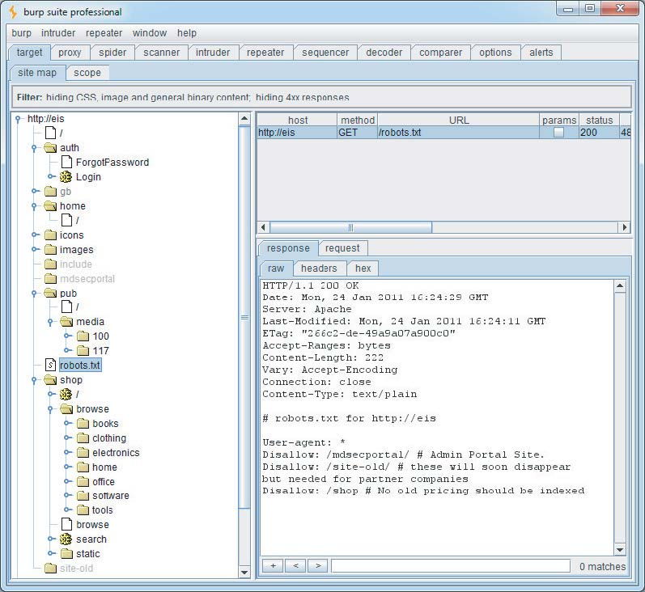

# 第四章：应用程序映射

攻击一个应用程序的第一步是收集并检查一些关键信息，以便更好地了解你所面对的挑战。

映射工作从枚举应用程序的内容和功能开始，以了解应用程序的功能和行为。许多功能很容易识别，但有些可能隐藏起来，需要一定程度的猜测和运气才能发现。

在汇集了应用程序功能的目录后，主要任务是仔细检查其行为的各个方面、其核心安全机制以及所使用的技术（客户端和服务器端）。这将使你能够识别应用程序暴露的关键攻击面，从而确定你应该重点关注的区域，以寻找可利用的漏洞。通常，分析过程本身就可以发现漏洞，这将在本章后面讨论。

随着应用程序变得越来越大、功能越来越强大，有效的映射是一项宝贵的技能。经验丰富的专家可以快速对整个功能区域进行分类，寻找漏洞的类别而不是实例，同时投入大量时间测试其他特定区域，以发现高风险问题。

本章将描述在应用程序映射过程中需要遵循的实际步骤，以及可以用来最大限度地提高其有效性的各种技术和技巧，以及一些可以帮助你完成此过程的工具。

## 枚举内容和功能

在典型的应用程序中，大部分内容和功能可以通过手动浏览来识别。基本的方法是从主初始页面开始，逐个点击链接，并遍历所有多阶段功能（如用户注册或密码重置）。如果应用程序包含一个“站点地图”，这可以为枚举内容提供一个有用的起点。

然而，要对枚举的内容进行严格检查，并获得对所有识别内容的全面记录，就必须采用比简单浏览更高级的技术。

### Web爬虫

各种工具可以执行网站的自动爬取。这些工具的工作原理是请求一个网页，解析其中的链接到其他内容，请求这些链接，并递归地继续，直到没有发现新的内容。

基于这个基本功能，Web应用程序爬虫试图通过解析HTML表单并使用各种预设或随机值将这些表单提交回应用程序来实现更高的覆盖率。这可以使它们遍历多阶段功能，并遵循基于表单的导航（例如，其中下拉列表用作内容菜单）。一些工具还解析客户端JavaScript以提取指向更多内容的URL。

有许多免费工具可以很好地枚举应用程序的内容和功能，包括Burp Suite、WebScarab、Zed Attack Proxy和CAT（更多详细信息请参见第20章）。

**提示** 许多Web服务器的Web根目录中包含一个名为robots.txt的文件，其中包含一个站点不希望Web爬虫访问或搜索引擎索引的URL列表。有时，这个文件包含对敏感功能的引用，而这些功能无疑是您感兴趣的爬取对象。一些用于攻击Web应用程序的爬取工具会检查robots.txt文件，并使用其中的所有URL作为爬取过程中的种子。在这种情况下，robots.txt文件可能对Web应用程序的安全性产生反作用。

本章使用一个虚构的应用程序Extreme Internet Shopping（EIS）来提供常见应用程序映射操作的示例。图4-1显示了Burp Spider针对EIS运行的情况。在没有登录的情况下，可以映射出/shop目录和/media目录中的两篇新闻文章。另请注意，图中显示的robots.txt文件引用了/mdsecportal和/site-old目录。这些目录在应用程序中的任何位置都没有链接，并且不会被仅遵循已发布内容链接的Web爬虫索引。

**提示：** 采用REST风格URL的应用程序使用URL文件路径的部分来唯一标识应用程序中使用的数据和其他资源（更多详细信息请参见第3章）。在这种情况下，传统Web爬虫的基于URL的应用程序视图非常有用。在EIS应用程序中，/shop和/pub路径采用了REST风格URL，通过爬取这些区域，可以很容易地获得这些路径中可用项目的唯一链接。

图4-1：使用Burp Spider映射应用程序的一部分

虽然这种全自动的内容枚举方法通常很有效，但它也有一些显著的限制：

- **不寻常的导航机制**（例如，使用复杂的JavaScript代码动态创建和处理的菜单）通常不能被这些工具正确处理，因此它们可能会遗漏应用程序的整个区域。
- **隐藏在编译后的客户端对象（如Flash或Java applet）中的链接**可能不被爬虫捕获。
- **多阶段功能**通常实现细粒度的输入验证检查，这些检查不接受自动化工具可能提交的值。例如，一个用户注册表单可能包含姓名、电子邮件地址、电话号码和邮政编码字段。一个自动化的应用程序爬虫通常在每个可编辑的表单字段中提交一个单一的测试字符串，应用程序返回一条错误消息，说明提交的一个或多个项目无效。由于爬虫不够智能，无法理解并根据此消息采取行动，因此它不会越过注册表单，因此无法发现任何更多可访问的内容或功能。
- 自动化爬虫通常使用URL来标识唯一的内容。为了避免无限期地继续爬取，它们会识别出已经请求过的链接内容并不再请求。然而，许多应用程序使用基于表单的导航，其中相同的URL可能返回非常不同的内容和功能。例如，一个银行应用程序可能会通过向/account.jsp发送POST请求来实现每个用户操作，并使用参数来传达正在执行的操作。如果爬虫拒绝向此URL发出多个请求，它将错过应用程序的大部分内容。一些应用程序爬虫试图处理这种情况。例如，Burp Spider可以配置为根据参数名称和值来区分表单提交。然而，仍然可能存在完全自动化的方式不能完全有效的情况。我们将在本章后面讨论映射这种功能的方法。
- 相反，有些应用程序将易变数据放在URL中，而这些数据实际上并不用于标识资源或功能（例如，包含计时器或随机数种子的参数）。应用程序的每一页可能包含一组看起来是新的URL，爬虫必须请求这些URL，导致它无限期地运行。
- 当一个应用程序使用身份验证时，一个有效的应用程序爬虫必须能够处理它以访问身份验证保护的功能。前面提到的爬虫可以通过手动配置爬虫来实现这一点，方法是使用经过身份验证的会话的令牌或使用凭证提交给登录功能。然而，即使这样做了，也常常发现爬虫的操作由于各种原因破坏了经过身份验证的会话：
  - 通过跟随所有URL，爬虫最终会请求注销功能，导致其会话中断。
  - 如果爬虫向敏感功能提交无效输入，应用程序可能会防御性地终止会话。
  - 如果应用程序使用每页令牌，爬虫几乎肯定会无法通过按预期顺序请求页面来正确处理这些令牌，这可能会导致整个会话终止。

翻译至77页