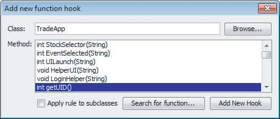
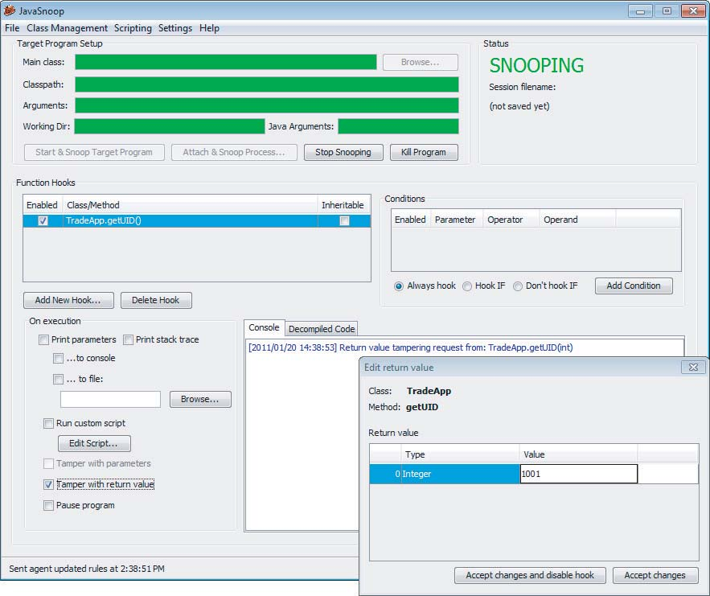

s# 第五章：绕过客户端验证

第一章描述了Web应用程序的核心安全问题，由于客户端可以提交任意输入，因此该问题出现了。尽管如此，许多Web应用程序仍然依赖于各种在客户端实现的措施来控制提交给服务器的数据。通常，这代表了一个基本的安全缺陷：用户对客户端和提交的数据具有完全控制权，并且可以绕过在客户端上实现的任何控件，并且这些控件不会在服务器上复制。

应用程序可能以两种广泛的方式依赖于客户端控件来限制用户输入。首先，应用程序可以使用它假定可以防止用户在应用程序稍后读取时修改该数据的机制，通过客户端组件传输数据。其次，应用程序可以在客户端上实现控制用户与其自身客户端交互的措施，或在提交之前围绕用户输入应用控件以限制功能。这可以使用HTML表单功能，客户端脚本或浏览器扩展技术来实现。

本章研究了每种客户端控件的示例，并描述了可以绕过它们的方法。

## 通过客户端传输数据

通常会看到应用程序以最终用户无法直接查看或修改的形式将数据传递给客户端，并期望该数据将在后续请求中发送回服务器。通常，应用程序的开发人员只是假设所使用的传输机制将确保通过客户端传输的数据不会被修改。

因为从客户端提交到服务器的所有内容都在用户的控制范围内，所以假设通过客户端传输的数据不会被修改通常是错误的，并且经常使应用程序容易受到一种或多种攻击。

您可能会合理地想知道，如果服务器知道并指定了特定数据项，应用程序为什么还需要将此值传输到客户端然后将其读回。实际上，以这种方式编写应用程序对于开发人员来说通常更容易，原因如下：

- 它消除了跟踪用户会话中所有类型数据的需要。减少在服务器上存储的会话数据量还可以提高应用程序的性能。
- 如果应用程序部署在多个不同的服务器上，并且用户可能与多个服务器交互以执行多步骤操作，则在可能处理同一用户请求的主机之间共享服务器端数据可能并不简单。使用客户端传输数据可能是解决该问题的诱人解决方案。
- 如果应用程序在服务器上使用任何第三方组件，例如购物车，则修改这些组件可能很困难或不可能，因此通过客户端传输数据可能是集成的最简单方法。
- 在某些情况下，跟踪服务器上的新数据可能需要更新核心服务器端API，从而触发完整的正式变更管理过程和回归测试。实施涉及客户端数据传输的更零散的解决方案可以避免这种情况，从而实现紧迫的期限。

但是，以这种方式传输敏感数据通常是不安全的，并且是应用程序中无数漏洞的原因。

## 隐藏表单字段

隐藏的HTML表单字段是一种通过客户端以表面上不可修改的方式传输数据的常用机制。如果字段被标记为隐藏，则不会在屏幕上显示。但是，字段的名称和值存储在表单中，并在用户提交表单时发送回应用程序。

这个安全缺陷的典型示例是零售应用程序，该应用程序将产品价格存储在隐藏的表单字段中。在Web应用程序的早期，这种漏洞非常普遍，并且今天仍然存在。图5-1显示了一个典型的表单。


图5-1：传统的HTML表单

表单的代码如下所示：

```html
<form method=”post” action=”Shop.aspx?prod=1”>
Product: iPhone 5 <br/>
Price: 449 <br/>
Quantity: <input type=”text” name=”quantity”> (Maximum quantity is 50)
<br/>
<input type=”hidden” name=”price” value=”449”>
<input type=”submit” value=”Buy”>
</form>
```

请注意名为price的表单字段，该字段被标记为隐藏。当用户提交表单时，此字段将发送到服务器：

```http
POST /shop/28/Shop.aspx?prod=1 HTTP/1.1
Host: mdsec.net
Content-Type: application/x-www-form-urlencoded
Content-Length: 20
quantity=1&price=449
```

尽管价格字段未显示在屏幕上，并且用户无法编辑它，但这完全是因为应用程序已指示浏览器隐藏该字段。因为客户端发生的一切最终都在用户的控制范围内，所以可以规避此限制以编辑价格。

实现此目标的一种方法是保存HTML页面的源代码，编辑字段的值，将源代码重新加载到浏览器中，然后单击“购买”按钮。但是，一种更容易且更优雅的方法是使用拦截代理来即时修改所需数据。

拦截代理在攻击Web应用程序时非常有用，并且是您真正需要的唯一不可或缺的工具。有许多这样的工具可用。我们将使用Burp Suite，它是由本书的作者之一编写的。

代理位于您的Web浏览器和目标应用程序之间。它拦截发送到应用程序的每个请求以及接收到的每个响应，包括HTTP和HTTPS。它可以捕获任何拦截到的消息，以便用户进行检查或修改。如果您以前从未使用过拦截代理，则可以在第20章中阅读有关其功能以及如何对其进行配置和运行的更多信息。

安装并适当地配置拦截代理后，您可以拦截提交表单的请求并修改价格字段为任意值，如图5-2所示。


图5-2：使用拦截代理修改隐藏表单字段的值

如果应用程序根据提交的价格处理交易，则可以以您选择的价格购买产品。

**提示:** 如果您发现一个应用程序以这种方式容易受到攻击，请查看您是否可以提交负数作为价格。在某些情况下，应用程序实际上接受了使用负价格的交易。攻击者收到退款到他的信用卡以及他订购的物品-如果曾经有过的话，这是一个双赢的局面。

## HTTP Cookie

通过客户端传输数据的另一种常用机制是HTTP Cookie。与隐藏的表单字段一样，通常这些不会显示在屏幕上，并且用户无法直接修改它们。当然，可以使用拦截代理通过更改设置它们的服务器响应或发出它们的后续客户端请求来修改它们。

考虑以下对先前示例的变体。在客户登录应用程序后，她会收到以下响应：

```http
HTTP/1.1 200 OK
Set-Cookie: DiscountAgreed=25
Content-Length: 1530
...
```

此DiscountAgreed cookie指向一个经典案例，该案例依赖于客户端控件（通常无法修改cookie）来保护通过客户端传输的数据。如果应用程序在将DiscountAgreed cookie提交回服务器时信任其值，则客户可以通过修改其值来获得任意折扣。例如：

```http
POST /shop/92/Shop.aspx?prod=3 HTTP/1.1
Host: mdsec.net
Cookie: DiscountAgreed=25
Content-Length: 10
quantity=1
```

## URL 参数

应用程序经常使用预设的URL参数通过客户端传输数据。例如，当用户浏览产品目录时，应用程序可能会为他提供指向以下 URL 的超链接：

http://mdsec.net/shop/?prod=3&pricecode=32

当包含参数的 URL 显示在浏览器的地址栏中时，任何用户都可以轻松地修改任何参数，而无需使用工具。但是，在许多情况下，应用程序可能期望普通用户无法查看或修改 URL 参数：

- 嵌入式图像使用包含参数的 URL 加载
- 包含参数的 URL 用于加载框架的内容
- 表单使用 POST 方法且其目标 URL 包含预设参数
- 应用程序使用弹出窗口或其他技术隐藏浏览器地址栏

当然，在任何此类情况下，URL 参数的值都可以使用之前讨论的拦截代理进行修改。

## Referer 标头

浏览器在大多数 HTTP 请求中都包含 Referer 标头。它用于指示当前请求的来源页面的 URL——可能是由于用户单击了超链接或提交了表单，也可能是因为页面引用了其他资源（如图像）。因此，它可以作为一种通过客户端传输数据的机制。由于应用程序处理的 URL 在其控制范围内，开发人员可能会认为 Referer 标头可以可靠地确定哪个 URL 生成了特定的请求。

例如，考虑一种允许用户在忘记密码时重置密码的机制。该应用程序要求用户按照规定的顺序完成几个步骤，然后才能使用以下请求实际重置密码的值：

```http
GET /auth/472/CreateUser.ashx HTTP/1.1
Host: mdsec.net
Referer: https://mdsec.net/auth/472/Admin.ashx
```

应用程序可能会使用 Referer 标头来验证此请求是否来自正确的阶段 (Admin.ashx)。如果是，用户就可以访问请求的功能。

然而，由于用户控制每个请求的各个方面，包括 HTTP 标头，因此可以通过直接访问 CreateUser.ashx 并使用截获代理将 Referer 标头的值更改为应用程序要求的值来轻松绕过此控制。

根据 w3.org 标准，Referer 标头是严格可选的。因此，虽然大多数浏览器都实现了它，但使用它来控制应用程序功能应该被视为一种“hack”（临时解决方案/非规范性做法）。

### 常见误解

人们常常认为 HTTP 标头比请求的其他部分（如 URL）更“防篡改”。这可能会导致开发人员在验证 URL 参数等其他数据时，同时信任在 Cookie 和 Referer 等标头中提交的值。然而，这种看法是错误的。鉴于有大量免费的拦截代理工具可用，任何针对应用程序的业余黑客都可以轻松更改所有请求数据。这就像认为当老师来搜查你的桌子时，把你的水枪藏在抽屉底部更安全，因为她需要弯下腰才能发现它。

### 渗透测试步骤

1. 在应用程序中找到所有使用隐藏表单字段、cookie 和 URL 参数通过客户端传输数据的实例。
2. 根据项目出现的位置和线索（如参数名称），尝试确定或猜测该项目在应用程序逻辑中的作用。
3. 以与项目在应用程序中的目的相关的方式修改项目的值。确定应用程序是否处理提交在参数中的任意值，以及这是否会使应用程序暴露于任何漏洞。

## 不透明数据

有时，通过客户端传输的数据不是透明地可理解的，因为它已经通过某种方式加密或混淆了。例如，您可能不会看到产品价格存储在隐藏字段中，而是看到传输了一个神秘的值：

```html
<form method=”post” action=”Shop.aspx?prod=4”>
Product: Nokia Infinity <br/>
Price: 699 <br/>
Quantity: <input type=”text” name=”quantity”> (Maximum quantity is 50)
<br/>
<input type=”hidden” name=”price” value=”699”>
<input type=”hidden” name=”pricing_token”
value=”E76D213D291B8F216D694A34383150265C989229”>
<input type=”submit” value=”Buy”>
</form>
```

当观察到这种情况时，您可以合理地推断，当提交表单时，服务器端应用程序会检查不透明字符串的完整性，甚至对其明文值进行解密或去混淆以执行一些处理。这种进一步的处理可能容易受到任何类型的错误的影响。然而，为了探查和利用这一点，首先需要以适当的方式包装您的有效载荷。

### 注意

通过客户端传输的不透明数据项通常是应用程序会话处理机制的一部分。在 HTTP cookie 中发送的会话令牌、在隐藏字段中传输的防 CSRF 令牌以及用于访问应用程序资源的一次性 URL 令牌都是客户端篡改的潜在目标。正如第 7 章中深入讨论的那样，这些类型的令牌有许多特定的注意事项。

### 渗透测试步骤

面对通过客户端传输的不透明数据，可以采用几种攻击途径：

1. 如果您知道不透明字符串背后的明文值，您可以尝试解密所使用的混淆算法。
2. 如第 4 章所述，应用程序可能包含其他您可以利用的功能，以返回由您控制的明文片段生成的不透明字符串。在这种情况下，您可能能够直接获取所需的字符串，以将任意有效载荷传递给您要攻击的函数。
3. 即使不透明字符串是不可穿透的，也可能在其他上下文中重放其值以达到恶意效果。例如，先前显示的表单中的 pricing_token 参数可能包含产品价格的加密版本。虽然无法为任意选择的任意价格生成加密等效项，但您可以从不同的、更便宜的产品中复制加密价格并将其提交到其位置。
4. 如果其他方法都失败了，您可以尝试攻击将解密或去混淆不透明字符串的服务器端逻辑，方法是提交其畸形变体——例如，包含过长的值、不同的字符集等。

### ASP.NET ViewState

通过客户端传输不透明数据的一种常见机制是 ASP.NET ViewState。这是一个在所有 ASP.NET Web 应用程序中默认创建的隐藏字段。它包含有关当前页面状态的序列化信息。ASP.NET 平台使用 ViewState 来提高服务器性能。它使服务器能够跨越连续的请求保留用户界面中的元素，而无需在服务器端维护所有相关状态信息。例如，服务器可能会根据用户提交的参数填充下拉列表。当用户发出后续请求时，浏览器不会将列表的内容提交回服务器。但是，浏览器会提交包含列表序列化形式的隐藏 ViewState 字段。服务器对 ViewState 进行反序列化并重新创建再次呈现给用户的相同列表。

除了 ViewState 的核心用途之外，开发人员还可以使用它跨越连续的请求存储任意信息。例如，应用程序可以将产品价格存储在 ViewState 中，而不是将其保存在隐藏的表单字段中，如下所示：

``` html
string price = getPrice(prodno);
ViewState.Add(“price”, price);
```

现在返回给用户的表单看起来像这样：

``` html
<form method=”post” action=”Shop.aspx?prod=3”>
<input type=”hidden” name=”__VIEWSTATE” id=”__VIEWSTATE”
value=”/wEPDwULLTE1ODcxNjkwNjIPFgIeBXByaWNlBQMzOTlkZA==” />
Product: HTC Avalanche <br/>
Price: 399 <br/>
Quantity: <input type=”text” name=”quantity”> (Maximum quantity is 50)
<br/>
<input type=”submit” value=”Buy”>
</form>
```

当用户提交表单时，她的浏览器发送以下内容：

```http
POST /shop/76/Shop.aspx?prod=3 HTTP/1.1
Host: mdsec.net
Content-Type: application/x-www-form-urlencoded
Content-Length: 77
__VIEWSTATE=%2FwEPDwULLTE1ODcxNjkwNjIPFgIeBXByaWNlBQMzOTlkZA%3D%3D&
quantity=1
```

该请求显然不包含产品价格——只有订购数量和不透明的 ViewState 参数。随机更改该参数会导致错误消息，并且不会处理购买。

ViewState 参数实际上是一个 Base64 编码的字符串，可以轻松解码以查看放置在其中的价格参数：

```html
3D FF 01 0F 0F 05 0B 2D 31 35 38 37 31 36 39 30 ; =ÿ.....-15871690
36 32 0F 16 02 1E 05 70 72 69 63 65 05 03 33 39 ; 62.....price..39
39 64 64 ; 9dd
```

### 提示

当您尝试解码看似用 Base64 编码的字符串时，一个常见的错误是从字符串的错误位置开始解码。由于 Base64 编码的工作方式，如果您从错误的位置开始，解码后的字符串将包含乱码。Base64 是一种基于块的格式，其中每 4 个字节的编码数据会转换为 3 个字节的解码数据。因此，如果您尝试解码 Base64 字符串但没有发现任何有意义的内容，请尝试从编码字符串中的四个相邻偏移量开始解码。

默认情况下，ASP.NET 平台会通过向 ViewState 添加密钥哈希 (称为 MAC 保护) 来防止篡改。但是，一些应用程序会禁用此默认保护，这意味着您可以修改 ViewState 的值，以确定它是否会影响应用程序的服务器端处理。Burp Suite 包含一个 ViewState 解析器，用于指示 ViewState 是否受 MAC 保护，如图 5-3 所示。如果不受保护，您可以使用 ViewState 树下方的十六进制编辑器编辑 Burp 中的 ViewState 内容。当您将消息发送到服务器或客户端时，Burp 会发送您更新的 ViewState，并且在本例中，它使您可以更改所购买物品的价格。


图 5-3：Burp Proxy 可以解码和呈现 ViewState，允许您查看其内容并在未设置 EnableViewStateMac 选项时编辑这些内容。

### 渗透测试步骤

1. 攻击 ASP.NET 应用程序时，请验证 ViewState 是否启用了 MAC 保护。这可以通过 ViewState 结构末尾是否存在 20 字节哈希来判断，您可以使用 Burp Suite 中的 ViewState 解析器确认是否存在哈希。
2. 即使 ViewState 受保护，也仍然可以使用 Burp 对应用程序的不同页面解码 ViewState，以发现应用程序是否正在通过客户端传输任何敏感数据。
3. 尝试修改 ViewState 中特定参数的值，同时不破坏其结构，看看是否会产生错误消息。
4. 如果您可以修改 ViewState 而不会导致错误，则应查看 ViewState 中每个参数的功能，并查看应用程序是否使用它存储任何自定义数据。尝试针对每个参数提交精心构造的值，以探测常见漏洞，就像您对通过客户端传输的任何其他数据项所做的那样。
5. 请注意，MAC 保护可以逐页启用或禁用，因此可能需要测试应用程序的每个重要页面是否存在 ViewState 漏洞。如果您启用了被动扫描的 Burp Scanner，Burp 会自动报告任何未启用 MAC 保护的 ViewState 页面。

## 捕获用户数据：HTML 表单

应用程序使用客户端控件来限制客户端提交的数据的另一种主要方式是使用未由服务器最初指定的、而是收集在客户端计算机本身上的数据。

HTML 表单是从用户那里捕获输入并将其提交到服务器的最简单、最常见的方法。通过这种方法的最基本用法，用户将数据输入到命名的文本字段中，这些字段将作为名称/值对提交到服务器。但是，表单也可以以其他方式使用；它们可以对用户提供的数据施加限制或执行验证检查。当应用程序使用这些客户端控件作为安全机制来防御恶意输入时，这些控件通常可以很容易地被绕过，从而使应用程序可能容易受到攻击。

### 限制长度

考虑以下原始 HTML 表单的变体，它对数量字段施加了 1 的最大长度：

```html
<form method=”post” action=”Shop.aspx?prod=1”>
Product: iPhone 5 <br/>
Price: 449 <br/>
Quantity: <input type=”text” name=”quantity” maxlength=”1”> <br/>
<input type=”hidden” name=”price” value=”449”>
<input type=”submit” value=”Buy”>
</form>
```

在这里，浏览器阻止用户在输入字段中输入超过一个字符，因此服务器端应用程序可能会假设它接收到的数量参数将小于 10。然而，这个限制可以通过拦截包含表单提交的请求来输入任意值，或者通过拦截包含表单的响应来删除 maxlength 属性，从而很容易地绕过。

### 拦截响应

当您尝试拦截和修改服务器响应时，您可能会发现代理中显示的相关消息如下所示：

```http
HTTP/1.1 304 Not Modified
Date: Wed, 6 Jul 2011 22:40:20 GMT
Etag: “6c7-5fcc0900”
Expires: Thu, 7 Jul 2011 00:40:20 GMT
Cache-Control: max-age=7200
```

此响应是因为浏览器已经拥有所请求资源的缓存副本。当浏览器请求缓存的资源时，它通常会向请求中添加两个标头——If-Modified-Since 和 If-None-Match：

```http
GET /scripts/validate.js HTTP/1.1
Host: wahh-app.com
If-Modified-Since: Sat, 7 Jul 2011 19:48:20 GMT
If-None-Match: “6c7-5fcc0900”
```

这些标头告诉服务器浏览器上次更新其缓存副本的时间。服务器提供的资源副本的 Etag 字符串是一种序列号，服务器为每个可缓存资源分配该序列号。每次修改资源时，它都会更新。如果服务器拥有的资源版本比 If-Modified-Since 标头中指定的日期新，或者当前版本的 Etag 与 If-None-Match 标头中指定的 Etag 相匹配，则服务器将使用最新版本的资源进行响应。否则，它将返回 304 响应，如这里所示，通知浏览器资源未被修改，浏览器应该使用其缓存副本。

当发生这种情况，并且您需要拦截和修改浏览器缓存的资源时，您可以拦截相关请求并删除 If-Modified-Since 和 If-None-Match 标头。这会导致服务器以完整版本的请求资源进行响应。Burp Proxy 包含一个选项，可以从每个请求中删除这些标头，从而覆盖浏览器发送的所有缓存信息。

##### 渗透步骤

1. 查找包含 maxlength 属性的表单元素。提交长度超过此长度但其他方面格式正确的数据（例如，如果应用程序期望一个数字，则该数据是数字）。
2. 如果应用程序接受过长的数据，您可以推断客户端验证没有在服务器上复制。
3. 根据应用程序对参数执行的后续处理，您可能能够利用验证中的缺陷来利用其他漏洞，例如 SQL 注入、跨站点脚本或缓冲区溢出。

### 基于脚本的验证

内置于 HTML 表单本身的输入验证机制非常简单，并且不足以对许多种类的输入执行相关验证。例如，用户注册表单可能包含姓名、电子邮件地址、电话号码和邮政编码字段，所有这些字段都期望不同类型的输入。因此，常见的是在脚本中实现自定义客户端输入验证。请考虑以下原始示例的变体：

```html
<form method=”post” action=”Shop.aspx?prod=2” onsubmit=”return
validateForm(this)”>
Product: Samsung Multiverse <br/>
Price: 399 <br/>
Quantity: <input type=”text” name=”quantity”> (Maximum quantity is 50)
<br/>
<input type=”submit” value=”Buy”>
</form>
<script>function validateForm(theForm)
{
var isInteger = /^\d+$/;
var valid = isInteger.test(quantity) &&
quantity > 0 && quantity <= 50;
if (!valid)
alert(’Please enter a valid quantity’);
return valid;
}
</script>
```

表单标签的 onsubmit 属性指示浏览器在用户单击提交按钮时执行 ValidateForm 函数，并且只有当该函数返回 true 时才提交表单。这种机制使客户端逻辑能够拦截试图提交表单的操作，对用户的输入执行自定义验证检查，并决定是否接受该输入。

在前面的示例中，验证很简单；它检查 amount 字段中输入的数据是否为整数，并且在 1 到 50 之间。

这种类型的客户端控件通常很容易绕过。通常，只需在浏览器中禁用 JavaScript 即可。如果这样做，onsubmit 属性将被忽略，并且表单将在没有任何自定义验证的情况下提交。

然而，如果应用程序依赖于客户端脚本进行正常操作（例如构建用户界面的部分），禁用 JavaScript 可能会破坏应用程序。一种更整洁的方法是在浏览器中输入一个良性的（已知良好的）值到输入字段中，使用您的代理拦截经过验证的提交，并将数据修改为您想要的值。这通常是最简单、最优雅的击败基于 JavaScript 的验证的方法。

或者，您可以拦截包含 JavaScript 验证例程的服务器的响应，并修改脚本以中和其效果——在前面的示例中，通过更改 ValidateForm 函数在每种情况下都返回 true。

##### 渗透步骤

1. 确定任何使用客户端 JavaScript 在表单提交之前执行输入验证的情况。
2. 提交服务器通常会阻止的数据，方法是修改提交请求以注入无效数据或修改表单验证代码以中和它。
3. 与长度限制一样，确定客户端控件是否在服务器上复制，如果没有，是否可以将其用于任何恶意目的。
4. 请注意，如果多个输入字段在表单提交之前受到客户端验证，则需要使用无效数据单独测试每个字段，同时在所有其他字段中保留有效值。如果您同时在多个字段中提交无效数据，则服务器可能会在识别第一个无效字段时停止处理表单。因此，您的测试无法到达应用程序中的所有可能代码路径。

#### 注意

在 Web 应用程序中，用于验证用户输入的客户端 JavaScript 例程很常见，但不要因此而得出结论认为每个这样的应用程序都是易受攻击的。只有当客户端验证没有在服务器上复制时，应用程序才会暴露，并且只有当绕过客户端验证的精心制作的输入可以用于导致应用程序的某些不良行为时，才会暴露。

在大多数情况下，对用户输入进行客户端验证对应用程序的性能和用户体验质量有有益的影响。例如，在填写详细的注册表单时，普通用户可能会犯各种错误，例如省略必填字段或错误地格式化他的电话号码。如果没有客户端验证，纠正这些错误可能需要多次重新加载页面和往返消息到服务器。在客户端实现基本验证检查可以使用户的体验更加流畅，并减少服务器上的负载。

### 禁用的元素

如果 HTML 表单上的元素被标记为 disabled，则它会显示在屏幕上，但通常是灰色的，并且不能像普通控件那样进行编辑或使用。此外，在提交表单时，它不会发送到服务器。例如，请考虑以下表单：

```html
<form method=”post” action=”Shop.aspx?prod=5”>
Product: Blackberry Rude <br/>
Price: <input type=”text” disabled=”true” name=”price” value=”299”>
<br/>
Quantity: <input type=”text” name=”quantity”> (Maximum quantity is 50)
<br/>
<input type=”submit” value=”Buy”>
</form>
```

这包括产品价格作为禁用的文本字段，并在屏幕上显示如图 5-4 所示。


图 5-4：包含禁用输入字段的表单

当提交此表单时，只有 quantity 参数被发送到服务器。然而，禁用字段的存在表明应用程序可能最初使用了 price 参数，也许是在开发过程中用于测试。此参数将被提交到服务器，并且可能已被应用程序处理。在这种情况下，您应该绝对测试服务器端应用程序是否仍然处理此参数。如果这样做，请寻求利用这一事实。

#### 渗透测试步骤

1. 在应用程序的每个表单中查找禁用的元素。每当你找到一个，请尝试将其与表单的其他参数一起提交到服务器，以确定它是否有任何影响。
2. 通常，提交元素被标记为 disabled，以便按钮在相关操作不可用时显示为灰色。您应该始终尝试提交这些元素的名称，以确定应用程序是否在尝试执行请求的操作之前执行服务器端检查。
3. 请注意，当提交表单时，浏览器不包含禁用的表单元素。因此，如果您只是浏览应用程序的功能并监视浏览器发出的请求，您将无法识别这些元素。要识别禁用的元素，您需要监视服务器的响应或在浏览器中查看页面源代码。
4. 您可以使用 Burp Proxy 中的 HTML 修改功能来自动重新启用应用程序中使用的任何禁用的字段。

## 捕获用户数据：浏览器扩展组件

除了 HTML 表单之外，捕获、验证和提交用户数据的另一种主要方法是使用在浏览器扩展中运行的客户端组件，例如 Java 或 Flash。当首次在 Web 应用程序中使用时，浏览器扩展通常用于执行简单且通常是美观的任务。现在，公司越来越多地使用浏览器扩展来创建功能齐全的客户端组件。这些组件在浏览器中运行，跨多个客户端平台，并提供反馈、灵活性以及桌面应用程序的处理。

一个副作用是，以前会在服务器上进行的处理任务可能会由于速度和用户体验的原因而卸载到客户端。在某些情况下，例如在线交易应用程序，速度是如此关键，以至于大部分关键应用程序逻辑都在客户端进行。应用程序设计可能会故意牺牲安全性以换取速度，也许是错误地认为交易者是受信任的用户，或者浏览器扩展包含其自己的防御。回顾第 2 章和本章前面部分讨论的核心安全问题，我们知道，客户端组件防御其业务逻辑的概念是不可能的。

浏览器扩展可以通过各种方式捕获数据——通过输入表单，有时还通过与客户端操作系统的文件系统或注册表进行交互。它们可以在提交到服务器之前对捕获的数据执行任意复杂的验证和操作。此外，由于它们的内部工作比 HTML 表单和 JavaScript 更不透明，开发人员更有可能认为他们执行的验证无法绕过。因此，浏览器扩展通常是发现 Web 应用程序漏洞的一个富有成果的目标。

一个经典的浏览器扩展示例，该扩展在客户端应用控件，是一个赌场组件。考虑到我们对客户端控件易错性的观察，使用浏览器扩展（在潜在攻击者的机器上本地运行）来实现在线赌博应用程序的想法很有趣。如果游戏的任何方面都是在客户端而不是服务器上控制的，攻击者就可以精确地操纵游戏以提高赔率、更改规则或更改提交给服务器的分数。在这种情况下可能会发生几种类型的攻击：

- 客户端组件可以被信任来维护游戏状态。在这种情况下，对游戏状态进行本地篡改将为攻击者带来优势。
- 攻击者可以绕过客户端控件并执行旨在为自己提供游戏优势的非法操作。
- 攻击者可以找到一个隐藏的函数、参数或资源，当调用时，可以访问服务器端资源。
- 如果游戏涉及任何对等体或庄家，客户端组件可能会接收和处理有关其他玩家的信息，如果已知，这些信息可以用于攻击者的优势。

### 常见浏览器扩展组件技术

您最可能遇到的浏览器扩展技术是 Java applet、Flash 和 Silverlight。由于它们竞争实现相似的目标，因此它们的架构具有与安全相关的相似属性：

- 它们被编译为中间字节码。
- 它们在为执行提供沙箱环境的虚拟机中执行。
- 它们可以使用远程框架，使用序列化通过 HTTP 传输复杂的数据结构或对象。

#### Java

Java applet 在 Java 虚拟机 (JVM) 中运行，并受 Java 安全策略应用的沙箱限制。由于 Java 自 Web 历史的早期就存在，并且其核心概念相对保持不变，因此有大量知识和工具可用于攻击和防御 Java applet，如本章稍后所述。

#### Flash

Flash 对象在 Flash 虚拟机中运行，并且像 Java applet 一样，与主机计算机隔离。曾经主要作为一种提供动画内容的方法，Flash 已经发展了。随着较新版本的 ActionScript，Flash 现在明确地被标榜为能够交付完整的桌面应用程序。

Flash 的一个关键最新变化是 ActionScript 3 及其与 Action Message Format (AMF) 序列化的远程功能。

#### Silverlight

Silverlight 是 Microsoft 对 Flash 的替代品。它的设计目标类似于启用丰富的、类似桌面的应用程序，允许 Web 应用程序在沙箱环境中提供浏览器内的缩小版 .NET 体验。从技术上讲，Silverlight 应用程序可以用任何符合 .NET 的语言开发，从 C# 到 Python，尽管 C# 是迄今为止最常见的。

### 浏览器扩展组件攻击方法

在针对使用浏览器扩展组件的应用程序时，需要采用两种广泛的技术。

首先，您可以拦截并修改组件发出的请求以及从服务器接收的响应。在许多情况下，这是开始测试组件最快和最简单的方法，但您可能会遇到一些限制。传输的数据可能被混淆或加密，或者可能使用特定于所使用技术的方案进行序列化。仅通过查看组件生成的流量，您可能会忽略一些关键功能或业务逻辑，这些功能或业务逻辑只能通过分析组件本身来发现。此外，您可能会遇到使用拦截代理的正常方式的障碍；然而，通常可以通过一些仔细的配置来规避这些障碍，如本章后面所述。

其次，您可以直接针对组件本身，并尝试对其字节码进行反编译以查看原始源代码，或使用调试器与组件进行动态交互。这种方法的优点是，如果做得彻底，您可以识别组件支持或引用的所有功能。它还允许您修改提交给服务器的请求中的关键数据，而不管用于传输数据的任何混淆或加密机制。这种方法的一个缺点是它可能很耗时，并且可能需要对组件中使用的技术和编程语言有详细的了解。

在许多情况下，这两种技术的结合是合适的。以下各节将更详细地介绍每一种技术。

#### 拦截浏览器扩展的流量

如果您的浏览器已经配置为使用拦截代理，并且应用程序使用浏览器扩展加载客户端组件，您可能会看到来自该组件的请求通过您的代理。在某些情况下，您无需执行任何其他操作即可开始测试相关功能，因为您可以像往常一样拦截和修改组件的请求。

在绕过浏览器扩展中实现的客户端输入验证的上下文中，如果组件透明地将经过验证的数据提交给服务器，则可以使用拦截代理以与 HTML 表单数据相同的方式修改此数据。例如，支持身份验证机制的浏览器扩展可能会捕获用户凭据，对这些凭据进行一些验证，并将这些值作为请求中的明文参数提交给服务器。无需对组件本身进行任何分析或攻击即可轻松绕过验证。

在其他情况下，您可能会遇到各种阻碍您测试的障碍，如以下各节所述。

#### 处理序列化数据

应用程序可能会在 HTTP 请求中传输数据或对象之前对其进行序列化。虽然可以通过检查原始序列化数据来解密一些基于字符串的数据，但通常需要在完全理解序列化数据之前对其进行解包。如果您想修改数据以干扰应用程序的处理，首先需要解包序列化内容，根据需要对其进行编辑，然后正确地重新序列化。简单地编辑原始序列化数据几乎肯定会破坏格式，并在应用程序处理消息时导致解析错误。

每种浏览器扩展技术都有自己的序列化数据在 HTTP 消息中的方案。因此，通常可以根据所使用的客户端组件的类型推断序列化格式，但在任何情况下，通常可以通过仔细检查相关 HTTP 消息来确定格式。

##### Java 序列化

Java 语言包含对对象序列化的本机支持，Java 小程序可以使用它在客户端和服务器应用程序组件之间发送序列化数据结构。包含序列化 Java 对象的消息通常可以通过它们具有以下 Content-Type 头来识别：

```http
Content-Type: application/x-java-serialized-object
```

拦截原始序列化数据后，您可以使用 Java 本身对其进行反序列化，以访问其中包含的原始数据项。

DSer 是 Burp Suite 的一个方便的插件，它提供了一个框架来查看和操作在 Burp 中拦截的序列化 Java 对象。

此工具将拦截对象中的原始数据转换为 XML 格式，以便于编辑。

当您修改了相关数据后，DSer 将重新序列化对象并相应地更新 HTTP 请求。

您可以从以下 URL 下载 DSer 并了解有关其工作原理的更多信息：

[http://blog.andlabs.org/2010/09/re-visiting-java-de-serialization-it.html](http://blog.andlabs.org/2010/09/re-visiting-java-de-serialization-it.html)

##### Flash 序列化

Flash 使用其自己的序列化格式，可用于在服务器和客户端组件之间传输复杂的数据结构。Action Message Format (AMF) 通常可以通过以下 Content-Type 头来识别：

```http
Content-Type: application/x-amf
```

Burp 本机支持 AMF 格式。当它识别包含序列化 AMF 数据的 HTTP 请求或响应时，它会解包内容并以树形形式呈现，以便查看和编辑，如图 5-5 所示。当您修改了结构中的相关原始数据项时，Burp 会重新序列化消息，您可以将其转发到服务器或客户端进行处理。


图 5-5：Burp Suite 支持 AMF 格式，并允许您查看和编辑反序列化数据

##### Silverlight 序列化

Silverlight 应用程序可以使用内置于 .NET 平台的 Windows Communication Foundation (WCF) 远程框架。使用 WCF 的 Silverlight 客户端组件通常使用 Microsoft 的 .NET Binary Format for SOAP (NBFS)，可以通过以下 Content-Type 头来识别：

```http
Content-Type: application/soap+msbin1
```

一款插件可用于 Burp Proxy，它会在 Burp 的拦截窗口中显示 NBFS 编码的数据之前自动将其反序列化。

在查看或编辑解码数据后，插件会在将数据转发到服务器或客户端进行处理之前对其进行重新编码。

WCF binary SOAP plug-in for Burp 由 Brian Holyfield 制作，可在此处下载：

[www.gdssecurity.com/l/b/2009/11/19/wcf-binary-soap-plug-in-for-burp](www.gdssecurity.com/l/b/2009/11/19/wcf-binary-soap-plug-in-for-burp/)

#### 拦截浏览器扩展流量的障碍

如果您已将浏览器设置为使用拦截代理，您可能会发现浏览器扩展组件发出的请求没有被您的代理拦截或失败。通常，这个问题是由于组件对 HTTP 代理或 SSL（或两者）的处理问题造成的。通常可以通过对工具进行一些仔细的配置来解决它。

第一个问题是客户端组件可能不遵守您在浏览器或计算机设置中指定的代理配置。这是因为组件可能会发出自己的 HTTP 请求，超出浏览器本身或扩展框架提供的 API。如果发生这种情况，您仍然可以拦截组件的请求。您需要修改计算机的 hosts 文件以实现拦截，并配置您的代理以支持隐形代理和自动重定向到正确的目标主机。有关如何执行此操作的更多详细信息，请参见第 20 章。

第二个问题是客户端组件可能不接受拦截代理所呈现的 SSL 证书。如果您的代理使用通用自签名证书，并且您已将浏览器配置为接受它，浏览器扩展组件可能仍会拒绝该证书。这可能是因为浏览器扩展没有获取浏览器临时信任证书的配置，或者可能是因为组件本身以编程方式要求不应接受不受信任的证书。

在任何一种情况下，您可以通过配置您的代理使用主 CA 证书来规避此问题，该证书用于为您访问的每个站点签署有效的每个主机证书，并在计算机的受信任证书存储中安装 CA 证书。有关如何执行此操作的更多详细信息，请参见第 20 章。

在某些罕见的情况下，您可能会发现客户端组件正在使用 HTTP 之外的协议进行通信，这根本无法使用拦截代理进行处理。在这些情况下，您仍然可以通过使用网络嗅探器或函数挂钩工具来查看和修改受影响的流量。

一个例子是 Echo Mirage，它可以注入到进程中并拦截对套接字 API 的调用，允许您在数据发送到网络之前查看和修改它。Echo Mirage 可以从以下 URL 下载：

[www.bindshell.net/tools/echomirage](www.bindshell.net/tools/echomirage)

#### 渗透步骤

1. **确保您的代理正确拦截来自浏览器扩展的所有流量。** 如果必要，请使用嗅探器识别任何未正确代理的流量。
2. **如果客户端组件使用标准序列化方案，请确保您拥有必要的工具来解包和修改它。** 如果组件使用专有编码或加密机制，您需要反编译或调试组件以进行全面测试。
3. **查看触发关键客户端逻辑的服务器响应。** 通常，及时拦截和修改服务器响应可能会允许您“解锁”客户端 GUI，从而轻松地揭示并执行复杂或多阶段的特权操作。
4. **如果应用程序执行任何关键逻辑或事件，客户端组件不应该被信任来执行（例如，在赌博应用程序中抽牌或掷骰子），请查找关键逻辑执行与与服务器通信之间的任何相关性。** 如果客户端不与服务器通信以确定事件的结果，则该应用程序绝对容易受到攻击。

#### 反编译浏览器扩展

迄今为止，攻击浏览器扩展组件的最彻底方法是反编译对象，对源代码进行全面审查，必要时修改代码以更改对象的行为，然后重新编译它。如前所述，浏览器扩展被编译成字节码。字节码是一种高级平台独立的二进制表示，可以由相关解释器（如 Java 虚拟机或 Flash Player）执行，每种浏览器扩展技术都使用自己的字节码格式。因此，应用程序可以在解释器本身可以运行的任何平台上运行。

字节码表示的高级性质意味着理论上总是可以将字节码反编译成类似于原始源代码的东西。然而，可以部署各种防御技术来导致反编译失败，或输出非常难以跟踪和解释的反编译代码。

在这些混淆防御的条件下，反编译字节码通常是理解和攻击浏览器扩展组件的首选途径。这允许您查看业务逻辑、评估客户端应用程序的完整功能，并以有针对性的方式修改其行为。

#### 下载字节码 

第一步是下载可执行字节码，以便开始工作。通常，字节码是从运行浏览器扩展的应用程序页面的HTML源代码中指定的URL加载到单个文件中。Java小程序通常使用<applet>标签加载，而其他组件通常使用<object>标签加载。例如：

```html
<applet code=”CheckQuantity.class” codebase=”/scripts”
id=”CheckQuantityApplet”>
</applet>
```

在某些情况下，加载字节码的URL可能不太明显，因为组件可以使用不同浏览器扩展框架提供的各种包装脚本进行加载。另一种识别字节码URL的方法是在浏览器加载浏览器扩展后查看代理历史记录。如果采用这种方法，需要注意两个潜在的障碍：

- 一些代理工具对代理历史记录应用过滤器，以隐藏您通常不太感兴趣的图像和样式表文件等项目。如果您找不到浏览器扩展字节码的请求，则应修改代理历史记录显示过滤器，以便所有项目都可见。
- 浏览器通常比其他静态资源（如图像）更积极地缓存下载的扩展组件字节码。如果浏览器已经为组件加载了字节码，即使对使用该组件的页面进行完全刷新，也可能不会导致浏览器再次请求该组件。在这种情况下，您可能需要完全清除浏览器的缓存，关闭浏览器的所有实例，然后启动一个新的浏览器会话，以强制浏览器再次请求字节码。 当您识别出浏览器扩展的字节码的URL时，通常只需将此URL粘贴到浏览器的地址栏中。然后，您的浏览器会提示您将字节码文件保存到本地文件系统中。 

##### 提示

如果您在Burp Proxy历史记录中识别出了字节码的请求，并且服务器的响应包含完整的字节码（而不是对早期缓存副本的引用），您可以直接从Burp中将字节码保存到文件中。最可靠的方法是选择响应查看器中的Headers选项卡，右键单击包含响应正文的下窗格，然后从上下文菜单中选择Copy to File。

#### 对字节码进行反编译

字节码通常以单个文件包的形式分发，可能需要解压缩才能获得用于反编译为源代码的单个字节码文件。 Java小程序通常打包为.jar（Java存档）文件，而Silverlight对象打包为.xap文件。这两种文件类型都使用zip存档格式，因此您可以通过将文件重命名为.zip扩展名，然后使用任何zip阅读器将其解压缩为包含的单个文件来轻松解压缩它们。Java字节码包含在.class文件中，Silverlight字节码包含在.dll文件中。解压缩相关文件包后，需要反编译这些文件以获得源代码。 Flash对象打包为.swf文件，在使用反编译器之前不需要任何解压缩。 要执行实际的字节码反编译，您需要使用一些特定工具，具体取决于所使用的浏览器扩展技术的类型，如以下各节所述。 

##### Java工具

Java字节码可以使用名为Jad（Java反编译器）的工具反编译为Java源代码，该工具可从以下网址获得：

www.varaneckas.com/jad

##### Flash工具

Flash字节码可以反编译为ActionScript源代码。另一种通常更有效的替代方法是将字节码反汇编为人类可读的形式，而不是实际将其完全反编译为源代码。 要反编译和反汇编Flash，您可以使用以下工具：

- Flasm — www.nowrap.de/flasm
- Flare — www.nowrap.de/flare
- SWFScan — www.hp.com/go/swfscan (this works for Actionscript 2 and 3)

##### Silverlight工具

可以使用名为.NET Reflector的工具将Silverlight字节码反编译为源代码，该工具可从以下网址获得：

www.red-gate.com/products/dotnet-development/reflector/

#### 处理源代码 

获得组件的源代码或类似内容后，您可以采取多种方法来攻击它。第一步通常是查看源代码以了解组件的工作原理以及它包含或引用的功能。以下是需要注意的一些事项：

- 客户端发生的输入验证或其他与安全相关的逻辑和事件
- 用于在将用户提供的数据发送到服务器之前对其进行包装的混淆或加密例程
- 在您的用户界面中不可见但您可能可以通过修改组件解锁的“隐藏”客户端功能
- 对您之前未通过应用程序映射识别的服务器端功能的引用 通常，查看源代码会发现组件中的一些有趣函数，您可以修改或操作这些函数以识别潜在的安全漏洞。这可能包括删除客户端输入验证、向服务器提交非标准数据、操纵客户端状态或事件，或直接调用组件中存在的功能。 您可以通过以下各节所述的几种方式修改组件的行为。

##### 在浏览器中重新编译和执行 

您可以修改反编译的源代码以更改组件的行为，将其重新编译为字节码，并在浏览器中执行修改后的组件。当您需要操纵关键的客户端事件（例如在游戏应用程序中掷骰子）时，通常首选这种方法。 要执行重新编译，您需要使用与您使用的技术相关的开发工具：

- 对于Java，使用JDK中的javac程序重新编译您的修改后的源代码。
- 对于Flash，您可以使用flasm重新组装您的修改后的字节码或使用Adobe的Flash开发工作室之一重新编译修改后的ActionScript源代码。
- 对于Silverlight，使用Visual Studio重新编译您的修改后的源代码。 将您的源代码重新编译为一个或多个字节码文件后，您可能需要重新打包可分发文件（如果该技术需要的话）。对于Java和Silverlight，请将修改后的字节码文件替换为解压缩的存档中的文件，使用zip实用程序重新打包，然后将扩展名更改为.jar或.xap，具体取决于情况。 最后一步是将你修改后的组件加载到浏览器中，以便你的更改可以在您正在测试的应用程序中生效。您可以通过多种方式实现这一点：
- 如果您可以在浏览器的磁盘缓存中找到包含原始可执行文件的物理文件，您可以将其替换为您的修改版本并重新启动浏览器。如果您的浏览器不为每个缓存的资源使用不同的单个文件，或者仅在内存中实现浏览器扩展组件的缓存，则这种方法可能很困难。
- 使用您的拦截代理，您可以修改加载组件的页面的源代码并指定不同的URL，指向本地文件系统或您控制的Web服务器。这种方法通常很困难，因为更改组件加载的域可能会违反浏览器的同源策略，并且可能需要重新配置浏览器或其他方法来削弱该策略。
- 您可以让浏览器从原始服务器重新加载组件（如前面的“下载字节码”部分所述），使用您的代理拦截包含可执行文件的响应，并用您的修改版本替换消息的主体。在Burp Proxy中，您可以使用Paste from File上下文菜单选项来实现这一点。这种方法通常是最简单的方法，并且最不可能遇到前面描述的问题。

##### 在浏览器外部重新编译和执行 

在某些情况下，没有必要在执行组件时修改其行为。例如，一些浏览器扩展组件验证用户提供的输入，然后在将其发送到服务器之前对其进行混淆或加密。在这种情况下，您可能能够修改组件以对任意未验证的输入执行所需的混淆或加密，并简单地本地输出结果。然后，您可以使用您的代理来拦截相关请求，当原始组件提交验证过的输入时，您可以用修改后的组件输出的值替换它。 要执行此攻击，您需要将原始可执行文件（设计为在相关浏览器扩展内运行）更改为可以在命令行上运行的独立程序。如何做到这一点取决于所使用的编程语言。例如，在Java中，您只需实现一个main方法。部分“Java小程序：一个工作示例”给出了如何做到这一点的示例。

##### 使用JavaScript操作原始组件

在某些情况下，无需修改组件的字节码。相反，您可以通过修改与组件交互的HTML页面中的JavaScript来实现目标。

在审查组件的源代码后，您可以识别所有可以直接从JavaScript调用的公共方法以及这些方法的参数处理方式。通常，可用的方法比应用程序页面中调用的方法更多，您还可以发现有关这些方法的目的和参数处理的更多信息。

例如，组件可能会公开一个可以调用的方法来启用或禁用可见用户界面的部分。使用您的拦截代理，您可能能够编辑加载组件的HTML页面并修改或添加一些JavaScript来解锁隐藏的界面部分。

##### 渗透步骤

1. 使用所述技术下载组件的字节码，将其解压缩并将其反编译为源代码。
2. 查看相关源代码以了解正在执行的处理。
3. 如果组件包含任何可以被操纵以实现您的目标的公共方法，请拦截与组件交互的HTML响应，并添加一些JavaScript来使用您的输入调用适当的方法。
4. 如果没有，请修改组件的源代码以实现您的目标，然后重新编译并执行它，无论是在浏览器中还是作为独立程序。
5. 如果组件用于将混淆或加密的数据提交到服务器，请使用您的修改版组件将各种适当混淆的攻击字符串提交到服务器以探测漏洞，就像您对任何其他参数一样。

#### 应对字节码混淆

由于字节码可以很容易地反编译以恢复其源代码，因此已经开发了各种技术来混淆字节码本身。应用这些技术会产生更难反编译或反编译为误导性或无效源代码的字节码，这些源代码可能非常难以理解并且无法在没有大量努力的情况下重新编译。例如，请考虑以下混淆的Java源代码：

```java
package myapp.interface;
import myapp.class.public;
import myapp.throw.throw;
import if.if.if.if.else;
import java.awt.event.KeyEvent;
public class double extends public implements strict
{
public double(j j1)
{
_mthif();
_fldif = j1;
}
private void _mthif(ActionEvent actionevent)
{
_mthif(((KeyEvent) (null)));
switch(_fldif._mthnew()._fldif)
{
case 0:
_fldfloat.setEnabled(false);
_fldboolean.setEnabled(false);
_fldinstanceof.setEnabled(false);
_fldint.setEnabled(false);
break;
...
```

常用的混淆技术如下：

- 有意义的类、方法和成员变量名称被替换为无意义的表达式，例如 a、b 和 c。这迫使反编译代码的阅读者通过研究每个项的使用方式来识别其目的。这可能会使在跟踪源代码时跟踪不同项变得困难。
- 进一步地，一些混淆器将项名称替换为为语言保留的关键字，例如 new 和 int。虽然这在技术上使字节码非法，但大多数虚拟机 (VM) 容忍非法代码，并且它正常执行。但是，即使反编译器可以处理非法字节码，生成的源代码也比刚刚描述的源代码更难读。更重要的是，源代码无法在不进行大量重做以一致地重命名非法命名的项的情况下重新编译。
- 许多混淆器从字节码中删除不必要的调试和元信息，包括源文件名和行号（这使得堆栈跟踪信息量较少）、局部变量名（这会使调试变得困难）和内部类信息（这会阻止反射正常工作）。
- 可能会添加冗余代码，以明显的方式创建和操作各种类型的数据，但这些代码与应用程序功能实际使用的真实数据是独立的。
- 可以通过使用跳转指令以复杂的方式修改代码中的执行路径，以便在读取反编译的源代码时难以辨别执行的逻辑顺序。
- 可能会引入非法的编程结构，例如无法访问的语句和缺少返回语句的代码路径。大多数 VM 容忍字节码中的这些现象，但反编译的源代码无法在不纠正非法代码的情况下重新编译。

##### 渗透步骤

应对字节码混淆的有效策略取决于所使用的技术和您分析源代码的目的。以下是一些建议：

1. 您可以查看组件的公共方法，而无需完全理解源代码。应该很明显哪些方法可以从 JavaScript 调用，以及它们的签名是什么，使您能够通过输入各种输入来测试方法的行为。
2. 如果类、方法和成员变量名称已被替换为无意义的表达式（但不是编程语言保留的特殊单词），您可以使用许多 IDE 中内置的重构功能来帮助您理解代码。通过研究项的使用方式，您可以开始为它们分配有意义的名称。如果您使用 IDE 中的重命名工具，它会为您完成很多工作，跟踪项在整个代码库中的使用并将其重命名到任何地方。
3. 您实际上可以通过第二次运行混淆的字节码通过混淆器来撤消大量混淆并选择合适的选项。一个有用的 Java 混淆器是 Jode。它可以删除另一个混淆器添加的冗余代码路径，并通过为项分配全局唯一名称来促进理解混淆名称的过程。

#### Java小程序：一个实例

现在，我们将通过查看一个在 Java 小程序中执行输入验证的购物应用程序，来考虑一个简短的反编译浏览器扩展示例。

在这个示例中，提交用户请求的订单数量的表单如下所示：

```html
<form method=”post” action=”Shop.aspx?prod=2” onsubmit=”return
validateForm(this)”>
<input type=”hidden” name=”obfpad”
value=”klGSB8X9x0WFv9KGqilePdqaxHIsU5RnojwPdBRgZuiXSB3TgkupaFigj
UQm8CIP5HJxpidrPOuQPw63ogZ2vbyiOevPrkxFiuUxA8Gn30o1ep2Lax6IyuyEUD9SmG7c”>
<script>
function validateForm(theForm)
{
var obfquantity =
document.CheckQuantityApplet.doCheck(
theForm.quantity.value, theForm.obfpad.value);
if (obfquantity == undefined)
{
alert(‘Please enter a valid quantity.’);
return false;
}
theForm.quantity.value = obfquantity;
return true;
}
</script>
<applet code=”CheckQuantity.class” codebase=”/scripts” width=”0”
height=”0”
id=”CheckQuantityApplet”></applet>
Product: Samsung Multiverse <br/>
Price: 399 <br/>
Quantity: <input type=”text” name=”quantity”> (Maximum quantity is 50)
<br/>
<input type=”submit” value=”Buy”>
</form>
```

当表单以数量2提交时，发出以下请求：

```http
POST /shop/154/Shop.aspx?prod=2 HTTP/1.1
Host: mdsec.net
Content-Type: application/x-www-form-urlencoded
Content-Length: 77
obfpad=klGSB8X9x0WFv9KGqilePdqaxHIsU5RnojwPdBRgZuiXSB3TgkupaFigjUQm8CIP5
HJxpidrPOuQ
Pw63ogZ2vbyiOevPrkxFiuUxA8Gn30o1ep2Lax6IyuyEUD9SmG7c&quantity=4b282c510f
776a405f465
877090058575f445b536545401e4268475e105b2d15055c5d5204161000
```

如HTML代码所示，当提交表单时，验证脚本将用户提供的数量和obfpad参数的值传递给名为CheckQuantity的Java小程序。该小程序显然执行必要的输入验证，并向脚本返回数量的混淆版本，然后将其提交到服务器。 由于服务器端应用程序确认我们的订单为两个单位，因此很明显，数量参数包含我们请求的值。 但是，如果我们尝试在不知道混淆算法的情况下修改此参数，则攻击失败，大概是由于服务器无法正确解包我们的混淆值。 在这种情况下，我们可以使用已经描述的方法来反编译Java小程序并了解其功能。

首先，我们需要从HTML页面中指定的小程序标记的URL下载小程序的字节码：

 /scripts/CheckQuantity.class 

由于可执行文件不是打包为.jar文件，因此无需解包，可以直接在下载的.class文件上运行Jad：

``` yaml
C:\tmp>jad CheckQuantity.class
Parsing CheckQuantity.class...The class file version is 50.0 (only 45.3,
46.0 and 47.0 are supported)
Generating CheckQuantity.jad
Couldn’t fully decompile method doCheck
Couldn’t resolve all exception handlers in method doCheck
```

Jad将反编译的源代码输出为.jad文件，我们可以在任何文本编辑器中查看：

```java
// Decompiled by Jad v1.5.8f. Copyright 2001 Pavel Kouznetsov.
// Jad home page: http://www.kpdus.com/jad.html
// Decompiler options: packimports(3)
// Source File Name: CheckQuantity.java
import java.applet.Applet;
public class CheckQuantity extends Applet
{
public CheckQuantity()
{
}
public String doCheck(String s, String s1)
{
int i = 0;
i = Integer.parseInt(s);
if(i <= 0 || i > 50)
return null;
break MISSING_BLOCK_LABEL_26;
Exception exception;
exception;
return null;
String s2 = (new StringBuilder()).append(“rand=”).append
(Math.random()).append(“&q=”).append(Integer.toString(i)).append
(“&checked=true”).toString();
StringBuilder stringbuilder = new StringBuilder();
for(int j = 0; j < s2.length(); j++)
{
String s3 = (new StringBuilder()).append(‘0’).append
(Integer.toHexString((byte)s1.charAt((j * 19 + 7) % s1.length()) ^
s2.charAt(j))).toString();
    int k = s3.length();
if(k > 2)
s3 = s3.substring(k - 2, k);
stringbuilder.append(s3);
}
return stringbuilder.toString();
}
}
```

如反编译源代码所示，Jad在反编译方面做得相当不错，小程序的源代码很简单。当用用户提供的数量和应用程序提供的obfpad参数调用doCheck方法时，小程序首先验证数量是否为有效数字并且在1到50之间。如果是这样，它使用URL查询字符串格式构建一个名称/值对字符串，其中包括验证的数量。最后，它通过对obfpad字符串提供的字符执行异或运算来混淆此字符串。这是添加一些表面混淆以防止琐碎篡改的相当简单且常见的方法。 我们已经描述了在反编译并分析浏览器扩展组件的源代码时可以采取的各种方法。在这种情况下，最简单的破坏小程序的方法如下：

1. 修改doCheck方法以删除输入验证，允许您提供任意字符串作为您的数量。
2. 添加一个main方法，允许您从命令行执行修改后的组件。此方法只需调用修改后的doCheck方法并将混淆结果打印到控制台。 做出这些更改后，修改后的源代码如下：

```java
public class CheckQuantity
{
public static void main(String[] a)
{
System.out.println(doCheck(“999”,
“klGSB8X9x0WFv9KGqilePdqaxHIsU5RnojwPdBRgZuiXSB3TgkupaFigjUQm8CIP5HJxpi
drPOuQPw63ogZ2vbyiOevPrkxFiuUxA8Gn30o1ep2Lax6IyuyEUD9 SmG7c”));
}
public static String doCheck(String s, String s1)
{
String s2 = (new StringBuilder()).append(“rand=”).append
(Math.random()).append(“&q=”).append(s).append
(“&checked=true”).toString();
StringBuilder stringbuilder = new StringBuilder();
for(int j = 0; j < s2.length(); j++)
{
String s3 = (new StringBuilder()).append(‘0’).append
(Integer.toHexString((byte)s1.charAt((j * 19 + 7) % s1.length()) ^
s2.charAt(j))).toString();
int k = s3.length();
if(k > 2)
s3 = s3.substring(k - 2, k);
stringbuilder.append(s3);
}
return stringbuilder.toString();
}
}
```

此修改组件的版本为任意数量的999提供有效的混淆字符串。请注意，您可以在此处使用非数字输入，允许您探测应用程序是否存在各种基于输入的漏洞。 

#### 提示

Jad程序使用.jad扩展名保存其反编译的源代码。但是，如果要修改和重新编译源代码，则需要使用.java扩展名重命名每个源文件。

 剩下的就是使用Java SDK附带的javac编译器重新编译源代码，然后从命令行执行组件：

```bash
C:\tmp>javac CheckQuantity.java
C:\tmp>java CheckQuantity
4b282c510f776a455d425a7808015c555f42585460464d1e42684c414a152b1e0b5a520a
145911171609
```

我们的修改后的组件现在对我们的任意数量999进行了必要的混淆。为了将攻击传递给服务器，我们只需使用有效输入以正常方式提交订单表单，使用我们的代理拦截结果请求，并用修改后的组件提供的混淆数量替换提供的数量。请注意，如果应用程序每次加载订单表单时都会发出新的混淆垫，则也需要确保提交回服务器的混淆垫与用于混淆提交的数量的混淆垫相匹配。

#### 附加调试器 

反编译是理解和破坏浏览器扩展的最完整方法。但是，在大而复杂的组件中，包含数万行代码，观察组件在执行过程中的行为，将方法和类与界面中的关键操作相关联，通常要快得多。这种方法还可以避免在解释和重新编译混淆的字节码时可能出现的困难。通常，实现特定目标就像执行关键函数并更改其行为以规避组件中实现的控件一样简单。 因为调试器在字节码级别工作，所以它可以很容易地用于控制和理解执行流程。特别是，如果可以通过反编译获得源代码，则可以在特定的代码行上设置断点，从而使通过反编译获得的理解可以通过对执行过程中所采取的代码路径的实际观察来支持。 虽然高效的调试器还没有完全成熟地应用于所有浏览器扩展技术，但是调试对于Java小程序来说得到了很好的支持。为此，最好的资源是JavaSnoop，这是一个Java调试器，它可以集成Jad来反编译源代码，通过应用程序跟踪变量，并在方法上设置断点以查看和修改参数。图5-6显示了JavaSnoop正在用于直接挂钩到浏览器中运行的Java小程序。图5-7显示了JavaSnoop正在用于篡改方法的返回值。



图5-6：JavaSnoop可以直接挂钩到浏览器中运行的小程序

**注意**

最好在加载目标小程序之前运行JavaSnoop。 JavaSnoop关闭了由您的Java安全策略设置的限制，以便它可以在目标上运行。在Windows中，它通过向系统上的所有Java程序授予所有权限来实现这一点，因此请确保JavaSnoop干净地关闭，并在完成工作时恢复权限。

调试Java的另一种工具是JSwat，它具有高度可配置性。在大项目中，包含许多类文件，有时最好反编译、修改和重新编译关键类文件，然后使用JSwat将其热交换到正在运行的应用程序中。要使用JSwat，您需要使用JDK中包含的appletviewer工具启动小程序，然后将JSwat连接到它。例如，您可以使用以下命令：

```bash
appletviewer -J-Xdebug -J-Djava.compiler=NONE -JXrunjdwp:
transport=dt_socket,
server=y,suspend=n,address=5000 appletpage.htm
```



图5-7：一旦确定了合适的方法，JavaSnoop就可以用来篡改方法的返回值

当您使用Silverlight对象时，您可以使用Silverlight Spy工具来监视组件在运行时的执行。这可以大大有助于将相关代码路径与用户界面中发生的事件相关联。Silverlight Spy可以从以下URL获得：

http://firstfloorsoftware.com/SilverlightSpy/

#### 原生客户端组件

一些应用程序需要在用户计算机内执行浏览器沙箱无法进行的操作。以下是一些此类功能的客户端安全控制示例：

- 验证用户是否拥有最新的病毒扫描程序
- 验证代理设置和其他公司配置是否生效
- 与智能卡读卡器集成

通常，这类操作需要使用原生代码组件，将本地应用程序功能与 Web 应用程序功能集成在一起。原生客户端组件通常通过 ActiveX 控件提供。这些是运行在浏览器沙箱之外的自定义浏览器扩展程序。

原生客户端组件可能比其他浏览器扩展程序更难破解，因为没有等同于中间字节码的东西。但是，绕过客户端控件的原则仍然适用，即使这需要不同的工具集。以下是用于此任务的一些流行工具示例：

- OllyDbg：这是一个 Windows 调试器，可用于逐步浏览原生可执行代码、设置断点以及修补可执行文件（磁盘上或运行时）。
- IDA Pro：它可以将来自各种平台的原生可执行代码反汇编成人类可读的汇编代码。

虽然本书的范围涵盖不了完整描述，但以下是一些如果您想了解更多关于原生代码组件逆向工程和相关主题的有用资源：

- 《逆向工程的秘密》 by Eldad Eilam
- 《黑客拆解解密》 by Kris Kaspersky
- 《软件安全评估艺术》 by Mark Dowd, John McDonald, and Justin Schuh
- 《软件安全测试和质量保证模糊测试》（Artech House 信息安全和隐私） by Ari Takanen, Jared DeMott, and Charlie Miller
- 《IDA Pro 书籍：世界上最流行的反汇编器非官方指南》 by Chris Eagle
- www.acm.uiuc.edu/sigmil/RevEng
- www.uninformed.org/?v=1&a=7

## 安全处理客户端数据

正如您所看到的，Web 应用程序的核心安全问题源于客户端组件和用户输入不在服务器的直接控制之下。客户端及其接收到的所有数据本质上都是不可信的。

### 通过客户端传输数据

许多应用程序容易受到攻击，因为它们以一种不安全的方式通过客户端传输关键数据，例如产品价格和折扣率。

**如果可能，应用程序应避免通过客户端传输此类数据。**在几乎所有可以想象的场景中，都可以将此类数据保存在服务器上，并在需要时直接从服务器端逻辑引用它。例如，一个接收用户各种产品订单的应用程序应该允许用户提交产品代码和数量，并在服务器端数据库中查找每个所请求产品的价格。用户无需将物品的价格提交回服务器。即使应用程序为不同的用户提供不同的价格或折扣，也无需偏离此模型。价格可以按用户身份保存在数据库中，折扣率可以存储在用户配置文件甚至会话对象中。应用程序已经在服务器端拥有计算特定用户特定产品价格所需的所有信息。它必须如此，否则它将无法在不安全模型中将此价格存储在隐藏的表单字段中。

**如果开发人员决定别无选择，只能通过客户端传输关键数据，则应签名和/或加密数据以防止用户篡改。**如果采取此操作，则有两个重要陷阱需要避免：

- 一些使用签名或加密数据的方法可能容易受到重放攻击。例如，如果产品价格在存储到隐藏字段之前被加密，则可能复制较便宜产品的加密价格并将其替换为原始价格。为了防止这种攻击，应用程序需要在加密数据中包含足够的环境信息，以防止它在不同的环境中被重放。例如，应用程序可以连接产品代码和价格，将结果作为一个单独的项目进行加密，然后验证提交订单时提交的加密字符串是否与正在订购的产品实际匹配。
- 如果用户知道和/或控制发送给他们的加密字符串的明文值，他们可能能够发起各种密码攻击来发现服务器使用的加密密钥。一旦完成，他们就可以加密任意值并完全绕过解决方案提供的保护。

在运行在 ASP.NET 平台上的应用程序中，建议永远不要在 ViewState 中存储任何自定义数据 - 特别是任何您不想在屏幕上显示给用户的敏感数据。始终应该激活启用 ViewState MAC 的选项。

### 验证客户端生成的数据

原则上，无法在客户端安全地验证在客户端生成并传输到服务器的数据：

- 轻量级的客户端控件，如 HTML 表单字段和 JavaScript，很容易被规避，并且不能保证服务器接收到的输入。
- 在浏览器扩展组件中实现的控件有时更难以规避，但这可能只是在短时间内减慢攻击者的速度。
- 使用高度混淆或打包的客户端代码提供了额外的障碍；但是，一个有决心的攻击者总是可以克服这些障碍。（在其他领域的比较是使用 DRM 技术来阻止用户复制数字媒体文件。许多公司在这些客户端控件上投入了大量资金，并且每个新解决方案通常在短时间内就会被破坏。）

验证客户端生成数据的唯一安全方法是在应用程序的服务器端。从客户端接收的每一项数据都应视为受污染的且可能具有恶意性。

### 常见误解

有时人们认为任何使用客户端控件都是不好的。特别是，一些专业的渗透测试人员报告客户端控件的存在作为一种“发现”，而没有验证它们是否在服务器上复制或是否存在任何非安全解释。事实上，尽管由于本章描述的各种攻击而出现了重大的注意事项，但仍然有一些使用客户端控件的方法不会产生任何安全漏洞：

- 客户端脚本可用于验证输入作为增强可用性的手段，避免与服务器进行往返通信的需要。例如，如果用户以不正确的格式输入她的出生日期，则通过客户端脚本提醒她问题可以提供更无缝的体验。当然，应用程序必须在提交的项目到达服务器时重新验证它。
- 有时，客户端数据验证可以作为一种安全措施有效 - 例如，作为防御基于 DOM 的跨站点脚本攻击。但是，这些是攻击重点的另一个应用程序用户，而不是服务器端应用程序，并且利用潜在漏洞不一定依赖于向服务器传输任何恶意数据。有关此类场景的更多详细信息，请参见第 12 章和第 13 章。
- 如前所述，有通过客户端传输加密数据的方法，这些方法不容易受到篡改或重放攻击。

### 记录和警报

当应用程序使用长度限制和基于 JavaScript 的验证等机制来提高性能和可用性时，这些机制应该与服务器端入侵检测防御集成。执行客户端提交数据验证的服务器端逻辑应该知道客户端已经发生的验证。如果接收到客户端验证将阻止的数据，应用程序可能会推断出用户正在积极规避此验证，因此可能是恶意的。

应记录异常，并在适当的情况下，实时向应用程序管理员发出警报，以便他们能够监控任何尝试的攻击并采取必要的适当措施。应用程序还可以通过终止用户的会话甚至暂停其帐户来主动防御自己。

**注意** 在某些使用 JavaScript 的情况下，应用程序仍然可以被禁用浏览器中 JavaScript 的用户使用。在这种情况下，浏览器只是简单地跳过基于 JavaScript 的表单验证代码，并提交用户输入的原始输入。为了避免误报，记录和警报机制应该知道这种情况可能发生在哪里和如何发生。

## 总结

几乎所有客户端/服务器应用程序都必须接受客户端组件及其上发生的所有处理都无法保证按预期运行。正如您所看到的，Web 应用程序通常使用的透明通信方法意味着装备了简单工具和最低技能的攻击者可以轻松规避在客户端实施的大多数控件。即使应用程序试图混淆客户端驻留的数据和处理，有决心的攻击者也可以破坏这些防御。

在您识别通过客户端传输的数据或在客户端实现用户提供输入验证的每个实例中，您都应该测试服务器如何响应绕过这些控件的意外数据。通常，严重的漏洞潜藏在应用程序对客户端实施的防御所提供的保护的假设之后。

## 问题

1. **如何以防止篡改攻击的方式通过客户端传输数据？**

2. **应用程序开发人员希望阻止攻击者对登录功能执行暴力破解攻击。因为攻击者可能会针对多个用户名，开发人员决定将失败尝试次数存储在加密的 cookie 中，如果失败尝试次数超过五次，则阻止任何请求。如何绕过这种防御？**

3. **一个应用程序包含一个受严格访问控制的管理页面。该页面链接到位于不同Web服务器上的诊断功能。对这些功能的访问也应该仅限于管理员。在不实现第二种认证机制的情况下，以下哪种客户端机制（如果有）可以安全地控制对诊断功能的访问？您是否需要更多信息来帮助选择解决方案？**

   **(a) 诊断功能可以检查HTTP Referer头部以确认请求源自主管理页面。**

   **(b) 诊断功能可以验证提供的cookie以确认其中包含主应用程序的有效会话令牌。**

   **(c) 主应用程序可以在隐藏字段中设置一个认证令牌，该字段包含在请求中。诊断功能可以验证该令牌以确认用户在主应用程序上有一个会话。**

4. **如果表单字段包含 disabled=true 属性，它不会与表单的其余部分一起提交。如何更改此行为？**

5. **是否存在任何方法可以确保在客户端运行了一段输入验证逻辑？**

## 链接

**上一节：**[07 第四章：应用程序攻击面映射.md](./07 第四章：应用程序攻击面映射.md)

**下一节：**[09 第六章：攻击身份验证.md](./09 第六章：攻击身份验证.md)

