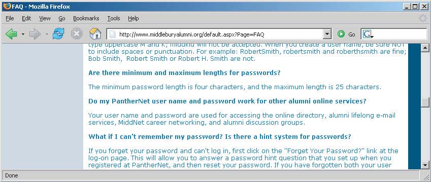
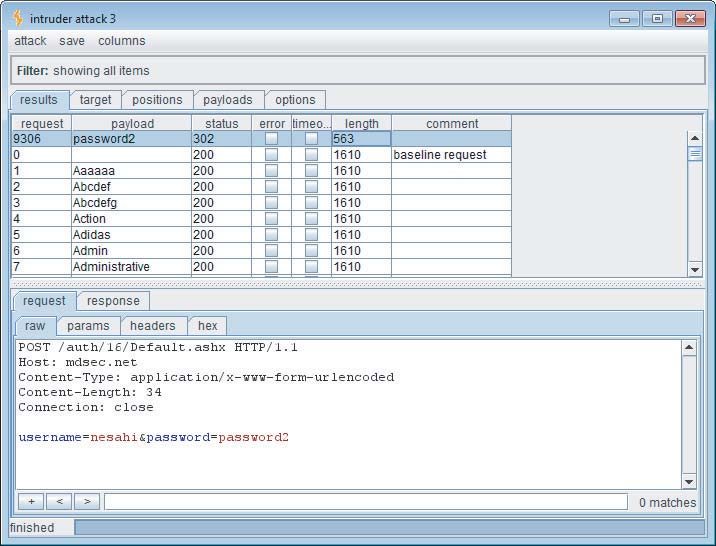
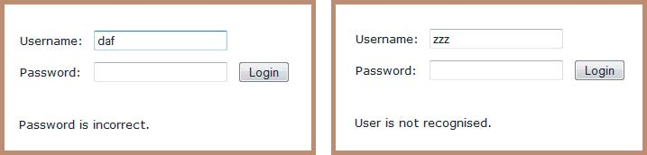
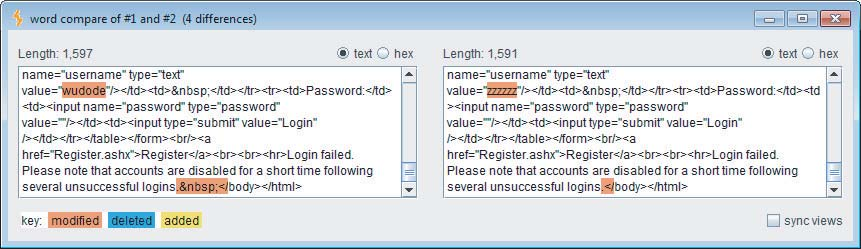
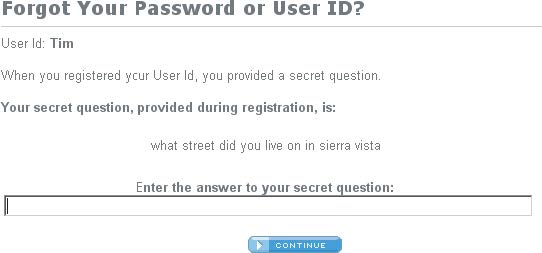
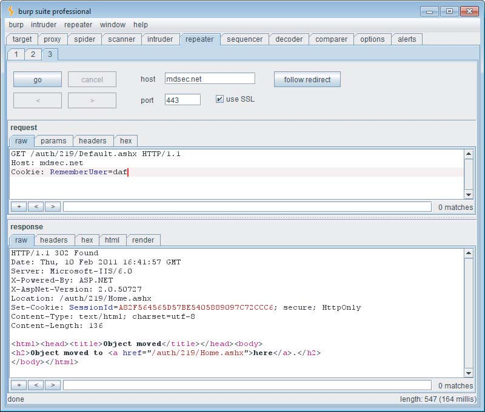
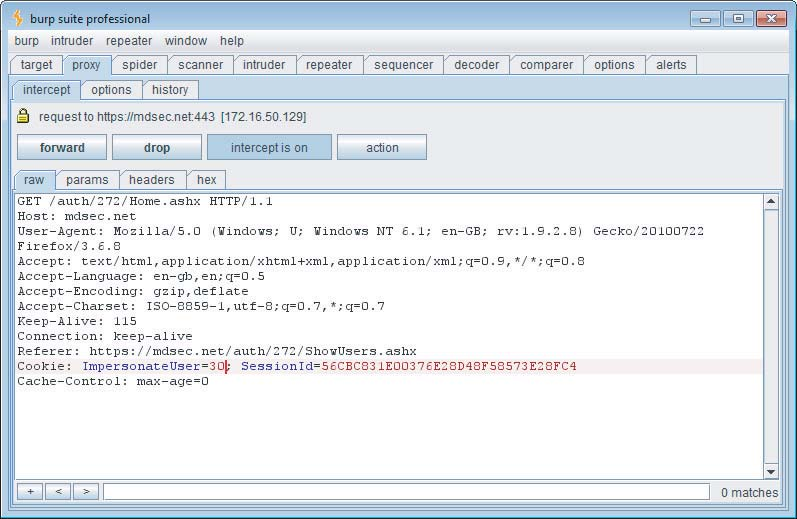
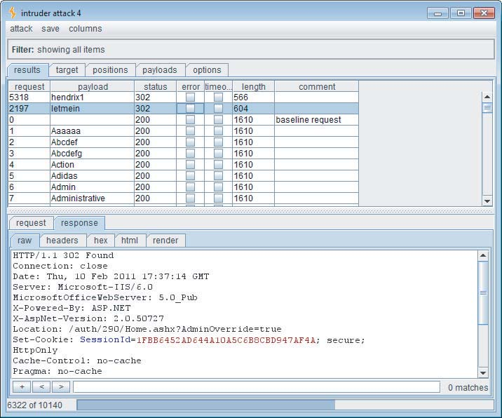

# 09 第六章：攻击身份验证

表面上看，身份验证是网络应用程序中使用的所有安全机制中最简单的概念之一。在典型情况下，用户提供她的用户名和密码，应用程序必须验证这些项是否正确。如果是正确的，它就让用户进入。如果不是，它就不让用户进入。

身份验证也是应用程序保护免受恶意攻击的核心。它是抵御未经授权访问的第一道防线。如果攻击者能够击败这些防御措施，他通常可以获得对应用程序功能的完全控制，以及对其中存储的数据的无限制访问。如果没有可靠的身份验证，其他核心安全机制（如会话管理和访问控制）将无法有效。

事实上，尽管身份验证看起来很简单，但设计一个安全的身份验证功能是一件微妙的事情。在实际的网络应用程序中，身份验证通常是最薄弱的环节，这使得攻击者能够获得未经授权的访问。作者已经记不清由于身份验证逻辑中的各种缺陷，我们破坏了多少应用程序。

本章详细介绍了常见于网络应用程序的各种设计和实现缺陷。这些缺陷通常是由于应用程序设计人员和开发人员没有问一个简单的问题：如果攻击者针对我们的身份验证机制，他可以实现什么？在大多数情况下，一旦认真地对某个应用程序提出这个问题，就会出现一些潜在的漏洞，其中任何一个都可能足以破坏应用程序。

许多最常见身份验证漏洞都是显而易见的。任何人都可以在登录表单中输入字典单词，试图猜测有效的密码。在其他情况下，微妙的缺陷可能潜伏在应用程序的深层处理中，只有经过对复杂的多阶段登录机制的仔细分析才能发现和利用。我们将描述这些攻击的全部范围，包括成功破坏一些最安全关键和最强大防御的网络应用程序的身份验证的技术。

## 身份验证技术

在实现身份验证机制时，网络应用程序开发人员可以使用多种技术：

- 基于 HTML 表单的身份验证
- 多因子机制，例如结合密码和物理令牌的机制
- 客户端 SSL 证书和/或智能卡
- HTTP 基本和摘要身份验证
- 使用 NTLM 或 Kerberos 的 Windows 集成身份验证
- 身份验证服务

网络应用程序最常用的身份验证机制是使用 HTML 表单捕获用户名和密码，并将其提交给应用程序。这种机制占了您在互联网上可能遇到的应用程序的 90% 以上。

在安全性更高的互联网应用程序中，例如在线银行，这种基本机制通常扩展为多个阶段，要求用户提交额外的凭据，例如 PIN 码或从秘密单词中选择的字符。HTML 表单通常仍用于捕获相关数据。

在安全性最高的应用程序中，例如面向高价值个人的私人银行，通常会遇到使用物理令牌的多因子机制。这些令牌通常生成一系列一次性密码，或根据应用程序指定的输入执行挑战-响应功能。

随着这项技术的成本随着时间的推移而降低，越来越多的应用程序可能会采用这种机制。然而，这些解决方案中的许多实际上并没有解决它们为之设计的威胁——主要是网络钓鱼攻击和那些使用客户端特洛伊木马的攻击。

一些网络应用程序使用客户端 SSL 证书或在智能卡中实现的加密机制。由于管理和分发这些项目的开销，它们通常仅用于安全性关键的上下文，其中应用程序的用户群很小，例如用于远程办公室工作人员的基于 Web 的 VPN。

基于 HTTP 的身份验证机制（基本、摘要和 Windows 集成）很少用于互联网。它们在企业内部环境中更常见，在这些环境中，组织的内部用户通过提供其正常的网络或域凭据来访问公司应用程序。然后，应用程序使用这些技术之一处理这些凭据。

第三方身份验证服务，如 Microsoft Passport，偶尔会遇到，但在目前，它们还没有被大规模采用。

与身份验证相关的许多漏洞和攻击都可以应用于上述任何技术。由于基于 HTML 表单的身份验证的压倒性优势，我们将在此上下文中描述每个特定的漏洞和攻击。在相关的情况下，我们将指出与其他可用技术相关的任何特定差异和攻击方法。

## 身份验证机制中的设计缺陷

与网络应用程序中常用的任何其他安全机制相比，身份验证功能更容易受到设计缺陷的影响。即使在看似简单的标准模型中，应用程序基于用户的用户名和密码对用户进行身份验证，该模型的设计中的缺点也会使应用程序极易受到未经授权访问的影响。

### 弱密码

许多网络应用程序对用户密码的质量没有或只有最少的控制。常见的情况是，应用程序允许以下密码：

- 非常短或为空
- 常见的字典单词或名称
- 与用户名相同
- 仍设置为默认值

图 6-1 显示了弱密码质量规则的示例。最终用户通常对安全问题知之甚少。因此，一个不强制执行强密码标准的应用程序很可能包含大量设置了弱密码的用户帐户。攻击者可以轻松地猜测这些帐户的密码，从而未经授权地访问应用程序。



图 6-1：一个强制执行弱密码质量规则的应用程序

#### 渗透步骤

尝试发现有关密码质量的任何规则：

1. 查看网站是否有任何关于规则的说明。
2. 如果可以进行自我注册，尝试注册多个帐户，使用不同类型的弱密码来发现有哪些规则。
3. 如果您控制单个帐户并且可以更改密码，请尝试将密码更改为各种弱值。

**注意** 如果密码质量规则仅通过客户端控制来强制执行，这本身不是安全问题，因为普通用户仍然受到保护。狡猾的攻击者可以给自己分配弱密码，这通常不会对应用程序的安全构成威胁。

### 暴力破解登录

登录功能向攻击者提供了一个公开邀请，尝试猜测用户名和密码，从而未经授权访问应用程序。

如果应用程序允许攻击者使用不同的密码进行重复的登录尝试，直到他猜对正确的密码，即使是业余攻击者手动将一些常见的用户名和密码输入到他的浏览器中，它也容易受到攻击。

最近对高知名度网站的破坏提供了访问数十万个真实世界的密码，这些密码以明文或使用暴力破解哈希存储。以下是最受欢迎的真实世界密码：

- password
- website name
- 12345678
- qwerty
- abc123
- 111111
- monkey
- 12345
- letmein

**注意** 管理员密码实际上可能比密码策略允许的更弱。它们可能是在策略生效之前设置的，或者可能是通过不同的应用程序或界面设置的。

在这种情况下，任何认真的攻击者都将使用自动化技术来尝试猜测密码，基于冗长的常见值列表。考虑到今天的带宽和处理能力，从标准 PC 和 DSL 连接可以每分钟尝试数千次登录。即使是最强大的密码最终也会在这种情况下被破解。

本章详细介绍了使用自动化进行这种方式的各种技术和工具。图 6-2 显示了使用 Burp Intruder 对单个帐户进行成功的密码猜测攻击。成功的登录尝试可以通过 HTTP 响应代码、响应长度和“登录不正确”消息的缺失来清楚地区分。

在某些应用程序中，客户端控件被用来尝试防止密码猜测攻击。例如，应用程序可以设置一个 cookie，例如 failedlogins=1，并在每次失败尝试后增加它。当达到某个阈值时，服务器在提交的 cookie 中检测到这一点，并拒绝处理登录尝试。这种客户端防御可以防止仅使用浏览器发起手动攻击，但它当然可以很容易地被绕过，如第 5 章所述。



图 6-2：成功的密码猜测攻击

对前述漏洞的变体，当失败的登录计数器在当前会话中保留时，就会发生前述漏洞的变体。虽然客户端可能没有对此的任何指示，但攻击者需要做的只是获得一个新的会话（例如，通过保留他的会话 cookie），他就可以继续他的密码猜测攻击。

最后，在某些情况下，应用程序会在适当数量的失败登录后锁定目标帐户。但是，它对额外的登录尝试的响应是指示（或允许攻击者推断）所提供的密码是否正确。这意味着攻击者可以完成他的密码猜测攻击，即使目标帐户被锁定。

如果应用程序在一定延迟后自动解锁帐户，攻击者只需等待发生这种情况，然后像往常一样使用发现的密码登录。

**黑客步骤**

1. 手动提交您控制的帐户的多个错误登录尝试，监控您收到的错误消息。
2. 如果大约 10 次失败登录后，应用程序没有返回有关帐户锁定的消息，请尝试正确登录。如果成功，则可能没有帐户锁定策略。
3. 如果帐户被锁定，请尝试使用不同的帐户重复练习。这一次，如果应用程序发出任何 cookie，请每个 cookie 仅用于一次登录尝试，并为每次后续登录尝试获取一个新 cookie。
4. 此外，如果帐户被锁定，请查看提交有效密码是否会导致应用程序的行为与无效密码相比有任何差异。如果是这样，即使帐户被锁定，您也可以继续密码猜测攻击。
5. 如果您不控制任何帐户，请尝试枚举一个有效的用户名（请参阅下一节）并使用它进行多次错误登录。监控有关帐户锁定的任何错误消息。
6. 要安装暴力破解攻击，首先要识别应用程序在响应成功和失败登录时的行为差异。您可以使用此事实来区分自动化攻击过程中的成功和失败。
7. 获取枚举或常见的用户名列表和常见密码列表。使用有关密码质量规则的任何信息来调整密码列表，以避免多余的测试用例。
8. 使用合适的工具或自定义脚本快速生成使用所有这些用户名和密码的排列组合的登录请求。监控服务器的响应以识别成功的登录尝试。第 14 章详细描述了使用自动化执行自定义攻击的各种技术和工具。
9. 如果您同时针对多个用户名，通常最好以广度优先而不是深度优先的方式执行这种暴力破解攻击。这涉及迭代密码列表（从最常见的开始），并依次尝试每个密码。这种方法有两个好处。首先，您可以更快地发现具有常见密码的帐户。其次，您不太可能触发任何帐户锁定防御，因为在使用每个单独帐户的连续尝试之间存在时间延迟。

### 冗长的失败消息

典型的登录表单要求用户输入两条信息——用户名和密码。一些应用程序需要更多信息，例如出生日期、一个难忘的地方或 PIN 码。

当登录尝试失败时，您可以当然推断至少有一条信息是错误的。但是，如果应用程序告诉您哪条信息无效，您可以利用这种行为来大大降低登录机制的有效性。

在最简单的情况下，如果登录需要用户名和密码，应用程序可能会通过指示失败的原因是未识别的用户名还是错误的密码来响应失败的登录尝试，如图 6-3 所示。



图 6-3：冗长的登录失败消息，指示何时猜测到有效的用户名

在这种情况下，您可以使用自动化攻击来迭代一个大的常见用户名列表，以枚举哪些是有效的。当然，用户名通常不被视为秘密（例如，它们在登录期间不会被屏蔽）。然而，为攻击者提供一种简单的方法来识别有效的用户名，增加了他在给定的时间、技能和努力下攻击应用程序的可能性。枚举的用户名列表可以用作各种后续攻击的基础，包括密码猜测、用户数据或会话攻击，或社会工程。

除了主登录功能之外，用户名枚举还可以出现在身份验证机制的其他组件中。原则上，任何提交实际或潜在用户名的功能都可以用于此目的。用户名枚举通常发现的一个位置是用户注册功能。如果应用程序允许新用户注册并指定自己的用户名，那么如果应用程序要防止注册重复的用户名，则几乎不可能阻止用户名枚举。有时可以在密码更改和忘记密码功能中找到用户名枚举的其他位置，如本章后面所述。

**注意** 许多身份验证机制或隐式或显式地披露用户名。在网络邮件帐户中，用户名通常是电子邮件地址，这是根据设计而公知的。许多其他站点在应用程序中公开用户名，而不考虑这给攻击者带来的优势，或以可预测的方式生成用户名（例如，user1842、user1843 等）。

在更复杂的登录机制中，当应用程序要求用户提交多条信息或经过多个阶段时，冗长的失败消息或其他区分符可以使攻击者依次针对登录过程的每个阶段，从而增加他获得未经授权访问的可能性。

**注意** 此漏洞可能以比此处所示更微妙的方式出现。即使响应有效和无效用户名返回的错误消息表面上相似，它们之间可能存在可以用来枚举有效用户名的细微差异。例如，如果应用程序中的多个代码路径返回“相同”的失败消息，则每个消息实例之间可能存在微小的排版差异。在某些情况下，应用程序的响应在屏幕上可能相同，但在 HTML 源代码中隐藏着细微的差异，例如注释或布局差异。如果没有明显的枚举用户名的方式，您应该对应用程序对有效和无效用户名的响应进行仔细比较。

您可以使用 Burp Suite 中的 Comparer 工具自动分析并突出显示两个应用程序响应之间的差异，如图 6-4 所示。这有助于您快速识别用户名的有效性是否导致应用程序响应的任何系统差异。



图 6-4：使用 Burp Comparer 识别应用程序响应中的细微差异

**渗透步骤**

1. 如果您已经知道一个有效的用户名（例如，您控制的帐户），请使用此用户名和错误的密码提交一次登录，并使用随机用户名提交另一次登录。
2. 记录服务器对每次登录尝试的每个细节，包括状态代码、任何重定向、屏幕上显示的信息以及 HTML 页面源代码中隐藏的任何差异。使用您的拦截代理来维护到和从服务器的所有流量的完整历史记录。
3. 尝试发现服务器对两次登录尝试的任何明显或微妙的差异。
4. 如果失败，请在应用程序中可以提交用户名的任何位置重复练习（例如，自我注册、密码更改和忘记密码）。
5. 如果在服务器对有效和无效用户名的响应中检测到差异，请获取常见用户名的列表。使用自定义脚本或自动化工具快速提交每个用户名，并过滤表示用户名有效的响应（参见第 14 章）。
6. 在开始您的枚举练习之前，请验证应用程序是否在一定数量的失败登录尝试后执行任何帐户锁定（请参见前一节）。如果是这样，建议您在设计枚举攻击时考虑这一事实。例如，如果应用程序只允许您对任何给定帐户进行三次失败的登录尝试，您就有可能“浪费”其中一个，因为您通过自动枚举发现的每个用户名。因此，在执行枚举攻击时，不要在每次登录尝试中提交一个牵强的密码。相反，提交一个常见的密码，例如 password1 或用户名本身作为密码。如果密码质量规则较弱，则您作为枚举练习的一部分执行的一些尝试登录很可能会成功，并将在一次点击中披露用户名和密码。要将密码字段设置为与用户名相同，您可以在 Burp Intruder 中使用“撞锤”攻击模式，在登录请求中的多个位置插入相同的有效负载。

即使应用程序对包含有效和无效用户名的登录尝试的响应在每个内在方面都是相同的，仍然可能基于应用程序响应登录请求所需的时间来枚举用户名。应用程序通常对登录请求执行非常不同的后端处理，这取决于它是否包含有效的用户名。

例如，当提交有效的用户名时，应用程序可能会从后端数据库中检索用户详细信息，对这些详细信息执行各种处理（例如，检查帐户是否过期），然后在返回通用消息之前验证密码（这可能涉及资源密集的哈希算法）如果密码不正确。两个响应之间的时间差异可能太微妙，无法在仅使用浏览器时检测到，但自动化工具可能能够区分它们。

即使这种练习的结果包含大量的误报，仍然比拥有 10,000 个用户名列表好得多，其中大约 0.5% 是有效的。

请参阅第 15 章，详细了解如何检测和利用这种类型的时差从应用程序中提取信息。

**提示** 除了登录功能本身之外，还可能有其他信息来源，您可以从中获取有效的用户名。查看在应用程序映射（参见第 4 章）期间发现的所有源代码注释，以识别任何明显的用户名。组织内开发人员或其他人员的任何电子邮件地址都可能是有效的用户名，无论是全部还是仅用户特定的前缀。任何可访问的日志记录功能都可能会泄露用户名。

### **凭据的脆弱传输**

如果应用程序使用未加密的 HTTP 连接传输登录凭据，则网络上适当定位的窃听者当然可以拦截它们。根据用户的位置，潜在的窃听者可能居住在：

- 用户的本地网络上
- 用户的 IT 部门内
- 用户的 ISP 内
- 互联网主干上
- 托管应用程序的 ISP 内
- 管理应用程序的 IT 部门内

**注意** 这些位置中的任何一个都可能被授权人员占用，但也可能被通过其他方式破坏相关基础设施的外部攻击者占用。即使相信特定网络上的中间人是可以信任的，在通过它传递敏感数据时使用安全传输机制仍然更安全。

即使登录是通过 HTTPS 进行的，如果应用程序以不安全的方式处理凭据，凭据仍可能被未经授权的方披露：

- 如果凭据作为查询字符串参数传输，而不是在 POST 请求的主体中传输，这些凭据可能会在各种地方记录，例如在用户的浏览器历史记录中、在 Web 服务器日志中以及在托管基础设施中使用的任何反向代理的日志中。如果攻击者成功地破坏了这些资源中的任何一个，他可能会通过捕获存储在其中的用户凭据来升级权限。
- 虽然大多数网络应用程序确实使用 POST 请求的主体来提交 HTML 登录表单本身，但令人惊讶地常见的是看到登录请求通过重定向到具有相同凭据作为查询字符串参数的不同 URL 来处理。为什么应用程序开发人员认为有必要执行这些反弹尚不清楚，但是选择这样做后，将它们作为 302 重定向到 URL 比使用 JavaScript 提交的第二个 HTML 表单作为 POST 请求更容易实现。
- 网络应用程序有时将用户凭据存储在 cookie 中，通常用于实现设计不佳的登录、密码更改、“记住我”等机制。这些凭据容易受到攻击，这些攻击会破坏用户 cookie，并且在持久 cookie 的情况下，任何访问客户端本地文件系统的人都可以捕获这些凭据。即使凭据是加密的，攻击者仍然可以简单地重放 cookie，因此无需实际知道她的凭据即可作为用户登录。
- 第 12 章和第 13 章描述了攻击者可以用来攻击其他用户以捕获其 cookie 的各种方式。

许多应用程序对应用程序的未经身份验证的区域使用 HTTP，并在登录时切换到 HTTPS。如果是这种情况，则切换到 HTTPS 的正确位置是在浏览器中加载登录页面时，允许用户在输入凭据之前验证页面是否真实。但是，常见的是遇到使用 HTTP 加载登录页面本身，然后在提交凭据时切换到 HTTPS 的应用程序。这是不安全的，因为用户无法验证登录页面的真实性，因此没有保证凭据将被安全地提交。

适当定位的攻击者可以拦截和修改登录页面，将登录表单的目标 URL 更改为使用 HTTP。当精明的用户意识到凭据已使用 HTTP 提交时，它们将已被破坏。

#### 渗透步骤

1. 在监视客户端和服务器之间双向的所有流量的同时，执行成功的登录。
2. 识别在任何情况下凭据是否在任一方向传输。您可以在拦截代理中设置拦截规则，以标记包含特定字符串的消息（参见第 20 章）。
3. 如果发现任何实例，其中凭据以 URL 查询字符串或作为 cookie 提交，或从服务器传输到客户端，请了解正在发生什么，并尝试确定应用程序开发人员试图实现什么目的。尝试找到攻击者可能干扰应用程序的逻辑以破坏其他用户凭据的每种方式。
4. 如果任何敏感信息通过未加密的通道传输，这当然是容易被拦截的。
5. 如果没有识别到实际凭据被不安全地传输的任何情况，请密切关注任何似乎被编码或混淆的数据。如果这包括敏感数据，则可能可以对混淆算法进行逆向工程。
6. 如果使用 HTTPS 提交凭据，但登录表单是使用 HTTP 加载的，则应用程序容易受到中间人攻击，这可能用于捕获凭据。

### 密码更改功能

令人惊讶的是，许多网络应用程序都没有为用户提供更改密码的方式。然而，对于完善的认证机制来说，这个功能是必要的，有两个原因：

- **定期强制密码更改减轻了密码泄露的威胁。** 它缩短了在猜测攻击中可以针对给定密码的时间窗口。它还缩短了在攻击者检测到之前可以使用泄露的密码的时间窗口。
- **怀疑自己的密码可能已经被泄露的用户需要能够快速更改密码，以减少未经授权使用的威胁。**

虽然它是有效认证机制的一个必要部分，但密码更改功能通常在设计上容易受到攻击。在主登录功能中故意避免的漏洞通常会在密码更改功能中重新出现。许多网络应用程序的密码更改功能在没有身份验证的情况下就可以访问，并执行以下操作：

- 提供一个详细的错误消息，指示请求的用户名是否有效。
- 允许无限制地猜测“现有密码”字段。
- 只有在验证了现有密码后，才检查“新密码”和“确认新密码”字段是否具有相同的值，从而允许攻击成功地非侵入性地发现现有密码。

典型的密码更改功能包括一个相对较大的逻辑决策树。应用程序需要识别用户，验证提供的现有密码，与任何帐户锁定防御集成，将提供的密码相互比较并与密码质量规则进行比较，并以适当的方式向用户反馈任何错误条件。因此，密码更改功能通常包含微妙的逻辑缺陷，可以利用这些缺陷来破坏整个机制。

#### 攻击步骤

1. 识别应用程序中的任何密码更改功能。如果没有从已发布的内容中明确链接，它仍然可以实现。第4章描述了在应用程序中发现隐藏内容的各种技术。
2. 使用无效用户名、无效现有密码以及不匹配的“新密码”和“确认新密码”值对密码更改功能发出各种请求。
3. 尝试识别任何可用于用户名枚举或暴力破解攻击的行为（如“暴力破解登录”和“详细失败消息”部分所述）。

**提示**

如果密码更改表单只有经过身份验证的用户才能访问，并且不包含用户名字段，仍然有可能提供任意用户名。表单可能会将用户名存储在隐藏字段中，可以很容易地进行修改。如果没有，请尝试提供包含用户名的附加参数，使用与主登录表单中使用的相同参数名称。这个技巧有时可以成功地覆盖当前用户的用户名，使您能够在即使主登录时无法做到这一点的情况下，对其他用户的凭据进行暴力破解。

### 遗忘密码功能

与密码更改功能一样，从遗忘密码情况恢复的机制通常会引入在主登录功能中可能避免的问题，例如用户名枚举。

除了这些缺陷之外，遗忘密码功能的设计弱点通常使其成为攻击应用程序整体身份验证逻辑的最薄弱环节。通常可以找到几种设计弱点：

- **遗忘密码功能通常涉及向用户呈现一个替代主登录的辅助挑战，如图6-5所示。** 对于攻击者来说，应对这个挑战通常比试图猜测用户的密码容易得多。关于母亲的娘家姓、难忘的日期、喜欢的颜色等问题通常比可能的密码集具有更小的潜在答案集。此外，它们通常涉及公开信息或攻击者经过一定努力可以发现的信息。



图6-5：帐户恢复功能中使用的辅助挑战

- 在许多情况下，应用程序允许用户在注册期间设置自己的密码恢复挑战和响应。用户倾向于设置极其不安全的挑战，可能是基于错误的假设，即只有他们才会被提出这些挑战。例如，“我有一艘船吗？”在这种情况下，想要访问的攻击者可以使用自动化攻击来迭代一个枚举或常见的用户名列表，记录所有密码恢复挑战，并选择那些看起来最容易猜测的挑战。（有关如何在脚本攻击中获取此类数据的技术，请参见第14章。）

- **与密码更改功能一样，应用程序开发人员通常忽略了对密码恢复挑战的响应进行暴力破解的可能性，即使他们在主登录页面上阻止了这种攻击。** 如果应用程序允许无限制地尝试回答密码恢复挑战，那么它很可能被有决心的攻击者破坏。
- **在某些应用程序中，恢复挑战被替换为一个简单的密码“提示”，该提示由用户在注册期间配置。** 用户通常会设置非常明显的提示，甚至可能与密码本身相同，基于错误的假设，只有他们才会看到这些提示。同样，拥有常见或枚举用户名列表的攻击者可以轻松捕获大量密码提示，然后开始猜测。
- **应用程序通过某种机制使用户能够在正确回答挑战后重新控制其帐户，这种机制通常容易受到攻击。** 一种合理安全的实现方法是将一个唯一的、不可猜测的、时限的恢复 URL 发送到用户在注册期间提供的电子邮件地址。在几分钟内访问此 URL 使用户能够设置新密码。然而，经常遇到的其他帐户恢复机制在设计上是不安全的：
  - **一些应用程序在成功完成挑战后向用户披露现有的、遗忘的密码，使攻击者能够无限期地使用该帐户，而不会有任何被所有者检测到的风险。** 即使帐户所有者随后更改了被泄露的密码，攻击者也可以简单地重复相同的挑战来获取新密码。
  - **一些应用程序在成功完成挑战后立即将用户放入经过身份验证的会话中，同样使攻击者能够无限期地使用该帐户而不会被检测到，并且无需知道用户的密码。**
  - **一些应用程序采用发送唯一恢复 URL 的机制，但将此发送到用户在完成挑战时指定的电子邮件地址。这除了可能记录攻击者使用的电子邮件地址之外，对恢复过程没有任何增强的安全性。**

**提示**

即使应用程序没有提供屏幕上的字段供您提供电子邮件地址以接收恢复 URL，应用程序仍可以通过隐藏表单字段或 cookie 传输地址。这提供了双重机会：您可以发现您已入侵的用户电子邮件地址，并且您可以修改其值以在您选择的地址接收恢复 URL。

- **某些应用程序允许用户在成功完成挑战后直接重置其密码的值，并且不向用户发送任何电子邮件通知。这意味着攻击者入侵帐户将不会被注意到，直到所有者尝试再次登录。如果所有者认为她一定忘记了密码，因此以相同的方式重置密码，它甚至可能不会被注意到。仅仅希望访问应用程序的攻击者可以入侵不同用户的帐户一段时间，因此可以无限期地继续使用应用程序。**

#### 攻击步骤

1. 识别应用程序中的任何遗忘密码功能。如果没有从已发布的内容中明确链接，它仍然可以实现（参见第4章）。
2. 通过使用您控制的帐户进行完整的演练，了解遗忘密码功能的工作原理。
3. 如果该机制使用挑战，请确定用户是否可以设置或选择自己的挑战和响应。如果是这样，请使用枚举或常见用户名的列表来收集挑战列表，并检查是否有任何挑战看起来容易猜测。
4. 如果该机制使用密码“提示”，请执行相同的操作以收集密码提示列表，并针对任何容易猜测的提示。
5. 尝试识别遗忘密码机制中的任何行为，这些行为可以作为用户名枚举或暴力破解攻击的基础（参见前面的详细信息）。
6. 如果应用程序在响应遗忘密码请求时生成包含恢复 URL 的电子邮件，请获取多个此类 URL，并尝试识别可能使您能够预测发送给其他用户的 URL 的任何模式。采用与分析会话令牌的可预测性相关的相同技术（参见第7章）。

### “记住我”功能

应用程序通常实现“记住我”功能作为对用户的便利。这样，用户无需每次从特定计算机使用应用程序时重新输入其用户名和密码。这些功能在设计上通常是不安全的，并且使用户容易受到本地和来自其他计算机用户的攻击：

- **一些“记住我”功能使用简单的持久性 cookie 实现，例如 RememberUser=daf（参见图6-6）。当此 cookie 提交到初始应用程序页面时，应用程序信任 cookie 来验证用户身份，并为该人创建应用程序会话，绕过登录。攻击者可以使用常见或枚举用户名的列表，无需任何身份验证即可获得对应用程序的完全访问权限。**



图6-6：易受攻击的“记住我”功能，仅基于存储在 cookie 中的用户名自动登录用户

- **一些“记住我”功能设置包含持久性会话标识符而不是用户名的 cookie，例如 RememberUser=1328。当标识符提交到登录页面时，应用程序查找与其关联的用户并为该用户创建应用程序会话。与普通会话令牌一样，如果其他用户的会话标识符可以预测或外推，攻击者可以迭代大量潜在标识符以找到与应用程序用户关联的那些标识符，从而在没有身份验证的情况下访问他们的帐户。有关执行此攻击的技术，请参见第7章。**
- **即使存储用于重新识别用户的信息受到适当保护（加密）以防止其他用户确定或猜测它，信息仍然可能容易受到跨站点脚本（参见第12章）等错误或具有本地访问权限的攻击者的捕获用户的计算机。**

#### 攻击步骤

1. 激活任何“记住我”功能，并确定该功能是否确实完全“记住”用户，或者是否仅记住他的用户名并仍然要求他在后续访问时输入密码。如果是后者，该功能不太可能暴露任何安全漏洞。
2. 仔细检查设置的所有持久性 cookie，以及存储在其他本地存储机制中的任何数据，例如 Internet Explorer 的 userData、Silverlight 隔离存储或 Flash 本地共享对象。查找任何明确标识用户或似乎包含用户的一些可预测标识符的保存数据。
3. 即使存储的数据似乎经过了大量编码或混淆，也要仔细检查。比较“记住”几个非常相似的用户名和/或密码的结果，以识别任何反向工程原始数据的机会。在这里，使用第7章中描述的相同技术来检测会话令牌中的含义和模式。
4. 尝试修改持久性 cookie 的内容，以尝试说服应用程序另一个用户已在他的计算机上保存了他的详细信息。

### **用户模拟功能**

一些应用程序实现了以下功能：应用程序的特权用户可以模拟其他用户，以便访问数据并在其用户上下文中执行操作。例如，一些银行应用程序允许帮助台操作员口头验证电话用户，然后将他们的应用程序会话切换到该用户上下文中以帮助他或她。

模拟功能中通常存在各种设计缺陷：

- 它可以作为“隐藏”功能实现，不受适当访问控制的约束。例如，任何知道或猜测 URL /admin/ImpersonateUser.jsp 的人都可以使用该功能并模拟任何其他用户（参见第8章）。
- 应用程序在确定用户是否正在执行模拟时可能信任用户可控制的数据。例如，除了有效的会话令牌之外，用户可能会提交一个 cookie，指定他的会话当前正在使用哪个帐户。攻击者可能能够修改此值并获得对其他用户帐户的访问权限，如图6-7所示。
- 如果应用程序允许模拟管理员用户，则模拟逻辑中的任何弱点都可能导致垂直权限提升漏洞。攻击者不仅可以访问其他普通用户的数据，还可以获得对应用程序的完全控制。
- 一些模拟功能作为简单的“后门”密码实现，可以与任何用户名一起提交到标准登录页面以作为该用户进行身份验证。这种设计由于许多原因而高度不安全，但攻击者最大的机会是他们可能会在执行标准攻击（例如登录的暴力破解）时发现此密码。如果在用户实际密码之前匹配了后门密码，攻击者可能会发现后门密码的功能，从而访问每个用户的帐户。
- 同样，暴力破解攻击可能会导致两个不同的“命中”，从而揭示后门密码，如图6-8所示。



图6-7：易受攻击的用户模拟功能

#### 攻击步骤

1. 识别应用程序中的任何模拟功能。如果没有从已发布的内容中明确链接，它仍然可以实现（参见第4章）。
2. 尝试直接使用模拟功能模拟其他用户。
3. 尝试操纵模拟功能处理的任何用户提供的数据，以尝试模拟其他用户。特别注意在正常登录之外提交用户名的任何情况。
4. 如果您成功使用该功能，请尝试模拟任何已知或猜测的管理员用户以提升权限。
5. 在进行密码猜测攻击（参见“暴力破解登录”部分）时，检查是否有任何用户似乎有多个有效密码，或者是否将特定密码与多个用户名匹配。此外，以尽可能多的不同用户登录，使用暴力破解攻击中捕获的凭据，并检查一切是否正常。请特别注意任何“以 X 登录”状态消息。



图6-8：两次“命中”的密码猜测攻击，表明存在后门密码

### 不完整的凭证验证

精心设计的身份验证机制对密码强制执行各种要求，例如最小长度或同时存在大写和小写字符。相应地，一些设计不当的身份验证机制不仅不强制执行这些良好做法，而且不考虑用户自己遵守这些做法的尝试。

例如，一些应用程序截断密码，因此仅验证前 n 个字符。一些应用程序执行不区分大小写的密码检查。一些应用程序在检查密码之前删除不寻常的字符（有时以执行输入验证为借口）。最近，在一些令人惊讶的高调网络应用程序中已经识别出了这种行为，通常是由于好奇用户的反复试验。

这些对密码验证的每个限制都将可用变体数量降低一个数量级，这些变体在可能的密码集中可用。通过实验，您可以确定密码是否正在完全验证或是否存在任何限制。然后，您可以微调您针对登录的自动化攻击，以删除不必要的测试用例，从而大大减少破坏用户帐户所需的请求数量。

#### 攻击步骤

1. 使用您控制的帐户，尝试使用您自己的密码的变体登录：删除最后一个字符、更改字符的大小写以及删除任何特殊印刷字符。如果任何尝试成功，请继续实验以尝试了解实际发生的验证。
2. 将任何结果反馈到您的自动化密码猜测攻击中，以删除多余的测试用例并提高成功的可能性。

### 非唯一用户名

一些支持自我注册的应用程序允许用户指定自己的用户名，并且不强制要求用户名必须唯一。虽然这种情况很少见，但作者遇到了不止一个具有此行为的应用程序。

这代表了一个设计缺陷，有两个原因：

- **与另一个用户共享用户名的一个用户也可能恰好选择与该用户相同的密码，无论是注册期间还是后续密码更改期间。在这种情况下，应用程序要么拒绝第二个用户的选定密码，要么允许两个帐户具有相同的凭据。在第一个实例中，应用程序的行为有效地向一个用户披露另一个用户的凭据。在第二个实例中，后续登录其中一个用户会导致访问另一个用户的帐户。**
- **攻击者可以利用这种行为来执行成功的暴力破解攻击，即使由于对失败登录尝试的限制，这可能在其他地方是不可能的。攻击者可以多次注册特定用户名，使用不同的密码，同时监控指示具有该用户名和密码的帐户已经存在的差异响应。攻击者将在不尝试以该用户身份登录的情况下确定目标用户的密码。**

设计糟糕的自我注册功能还可以提供一种用于用户名枚举的方法。如果应用程序不允许重复用户名，攻击者可能会尝试注册大量常见用户名来识别被拒绝的现有用户名。

#### 攻击步骤

1. 如果可以进行自我注册，请尝试使用不同的密码注册两次相同的用户名。
2. 如果应用程序阻止了第二次注册尝试，您可以利用此行为来枚举现有用户名，即使在主登录页面或其他地方可能无法做到这一点。使用常见用户名的列表进行多次注册尝试，以识别应用程序阻止的已注册名称。
3. 如果成功注册重复用户名，请尝试使用相同的密码注册两次相同的用户名，并确定应用程序的行为：
   - 如果出现错误消息，您可以利用此行为来执行暴力破解攻击，即使在主登录页面上不可能这样做。针对枚举或猜测的用户名，并尝试使用常见密码列表多次注册此用户名。当应用程序拒绝特定密码时，您可能已经找到了目标帐户的现有密码。
   - 如果没有出现错误消息，请使用您指定的凭据登录，并查看会发生什么。您可能需要注册多个用户并修改每个帐户中保存的不同数据，以了解此行为是否可用于未经授权访问其他用户的帐户。

### **可预测的用户名**

一些应用程序根据可预测的序列（cust5331、cust5332 等）自动生成帐户用户名。当应用程序表现为这样时，攻击者可以识别序列，可以快速到达所有有效用户名的潜在详尽列表，可将其用作进一步攻击的基础。与依赖于由单词列表驱动的重复请求的枚举方法不同，这种确定用户名的方式可以在与应用程序的最小交互下非侵入性地进行。

#### 攻击步骤

1. 如果应用程序生成用户名，请尝试快速连续获取几个用户名，并确定是否可以识别任何序列或模式。
2. 如果可以，外推回溯以获得可能的有效用户名列表。这可以用作对登录和需要有效用户名的其他攻击（例如访问控制缺陷的利用（参见第8章））的暴力破解攻击的基础。

### 可预测的初始密码

在某些应用程序中，用户一次或一次创建大量用户，并自动分配初始密码，然后通过某种方式分发给他们。密码生成的机制可能使攻击者能够预测其他应用程序用户的密码。这种类型的漏洞在基于内部网的企业应用程序中更常见——例如，每个员工都为她创建了一个帐户，并收到她密码的打印通知。

在最脆弱的情况下，所有用户都收到相同的密码，或者从他们的用户名或工作职能中紧密派生出来的密码。在其他情况下，生成的密码可能包含可以通过访问非常小的初始密码样本进行识别或猜测的序列。

#### 攻击步骤

1. 如果应用程序生成密码，请尝试快速连续获取几个密码，并确定是否可以识别任何序列或模式。
2. 如果可以，外推模式以获取其他应用程序用户的密码列表。
3. 如果密码显示出可以与用户名相关的模式，您可以尝试使用已知或猜测的用户名和相应的推断密码登录。
4. 否则，您可以使用推断的密码列表作为暴力破解攻击的基础，其中包含枚举或常见的用户名列表。

### 不安全的凭证分发

许多应用程序采用一种流程，在该流程中，为新创建的帐户提供的凭据在与应用程序的正常交互之外分发给用户（例如，通过邮件、电子邮件或短信）。有时，出于安全考虑，这样做，例如，为了确保用户提供的邮政或电子邮件地址实际上属于该人。

在某些情况下，此过程可能会带来安全风险。例如，假设分发的消息包含用户名和密码，对它们的使用没有时间限制，并且对用户没有要求在首次登录时更改密码。很可能大量甚至大部分应用程序用户不会修改他们的初始凭据，并且分发消息将在很长一段时间内存在，在此期间它们可能会被未经授权的方访问。

有时，分发的不是凭据本身，而是“帐户激活” URL，这使用户能够设置自己的初始密码。如果发送给连续用户的这些 URL 系列表现出任何类型的序列，攻击者可以通过紧密连续注册多个用户来识别这一点，然后推断发送给最近和即将到来的用户的激活 URL。

一些网络应用程序的相关行为是允许新用户以看似安全的方式注册帐户，然后向每个新用户发送包含其完整登录凭据的欢迎电子邮件。在最坏的情况下，一个有安全意识的用户决定立即更改他的可能被泄露的密码，然后收到另一封包含新密码“以备将来参考”的电子邮件。这种行为是如此奇怪和不必要，建议用户停止使用从事它的网络应用程序。

#### 攻击步骤

1. 获取新帐户。如果您不需要在注册期间设置所有凭据，请确定应用程序向新用户分发凭据的方式。
2. 如果使用帐户激活 URL，请尝试连续注册几个新帐户，并识别您收到的 URL 中的任何序列。如果可以确定模式，请尝试预测发送给最近和即将到来的用户的激活 URL，并尝试使用这些 URL 来拥有他们的帐户。
3. 尝试多次重用单个激活 URL，并查看应用程序是否允许这样做。如果没有，请尝试在重用 URL 之前锁定目标帐户，并查看它现在是否有效。

## 身份验证中的实现缺陷

即使是精心设计的身份验证机制，由于在其实现中犯下的错误，也可能高度不安全。这些错误可能会导致信息泄露、完全绕过登录或削弱机制的整体安全性，就像设计一样。实现缺陷通常比设计缺陷（例如低质量密码和暴力破解）更微妙且难以检测。

因此，对于最安全关键的应用程序，它们通常是攻击的有价值目标，其中许多威胁模型和渗透测试可能会声称任何低悬果实。作者在大型银行部署的网络应用程序中发现了此处描述的每个实现缺陷。

### 失败开放登陆机制

失败开放逻辑是一种逻辑缺陷（在第11章中详细描述），在身份验证机制的背景下具有特别严重的后果。

以下是一个人为设计的失败开放登录机制示例。如果对 `db.getUser()` 的调用由于某种原因抛出异常（例如，由于用户请求不包含用户名或密码参数而产生的空指针异常），则登录成功。尽管生成的会话可能不会绑定到特定的用户身份，因此可能无法完全正常工作，但这仍可能使攻击者访问某些敏感数据或功能。

```java
public Response checkLogin(Session session) {
    try {
        String uname = session.getParameter("username");
        String passwd = session.getParameter("password");
        User user = db.getUser(uname, passwd);
        if (user == null) {
            // invalid credentials
            session.setMessage("Login failed.");
            return doLogin(session);
        }
    } catch (Exception e) {}
    // valid user
    session.setMessage("Login successful.");
    return doMainMenu(session);
}
```

在实际应用中，您不会期望这样的代码能够通过最简单的安全审查。然而，同样的概念性缺陷更有可能存在于更复杂的机制中，其中涉及大量分层的方法调用，可能出现许多潜在错误并在不同的地方处理，并且更复杂的验证逻辑可能涉及维护关于登录进度的重要状态。

### 攻击步骤

1. **完整有效登录:** 使用您控制的帐户执行完整的有效登录。使用您的拦截代理记录提交给应用程序的每条数据和收到的每个响应。

2. 异常请求测试:

    重复登录过程多次，以意外方式修改提交的数据。例如，对于客户端发送的每个请求参数或 Cookie，执行以下操作：

   - 提交空字符串作为值。
   - 完全删除名称/值对。
   - 提交非常长和非常短的值。
   - 提交字符串而不是数字，反之亦然。
   - 提交同一项多次，具有相同和不同的值。

3. **响应分析:** 对于提交的每个格式错误的请求，仔细审查应用程序的响应，以识别与基本情况的任何差异。

4. **测试用例优化:** 将这些观察结果反馈到构建测试用例的过程中。当一个修改导致行为改变时，尝试将其与其他更改结合起来，以将应用程序的逻辑推向极限。

## 多阶段登录机制中的缺陷

某些应用程序使用复杂的涉及多个阶段的登录机制，例如：

- 输入用户名和密码
- 对 PIN 或记忆词中的特定数字进行挑战
- 提交显示在不断变化的物理令牌上的值

多阶段登录机制旨在提供比基于用户名和密码的简单模型更高的安全性。通常，第一阶段要求用户使用用户名或类似项来识别自己，后续阶段执行各种身份验证检查。此类机制经常包含安全漏洞，特别是各种逻辑缺陷（参见第11章）。

**常见误解**

通常认为，多阶段登录机制比标准的用户名/密码身份验证更不容易受到安全绕过。这种信念是错误的。执行多个身份验证检查可能会为机制增加相当大的安全性。但与之相抵的是，该过程更容易在实现中出现缺陷。在存在多种缺陷的情况下，甚至可能导致安全性低于基于用户名和密码的普通登录的解决方案。

某些多阶段登录机制的实现对用户与早期阶段的交互做出了潜在的不安全假设：

- **跳过中间阶段:** 应用程序可能会假设访问第三阶段的用户必须已经通过第一阶段和第二阶段。因此，它可能会认证直接从第一阶段跳到第三阶段并正确完成的攻击者，使攻击者能够仅使用通常所需的各种凭据的一部分进行登录。
- **数据篡改:** 应用程序可能会信任第二阶段处理的一些数据，因为这些数据在第一阶段已经过验证。但是，攻击者可能能够在第二阶段操纵这些数据，使其具有与第一阶段验证的不同值。例如，在第一阶段，应用程序可能会确定用户的帐户是否已过期、被锁定或属于管理组，或者是否需要完成除第二阶段之外的更多登录阶段。如果攻击者能够在登录在不同阶段之间转换时干扰这些标志，他可能能够修改应用程序的行为并使其仅凭部分凭据或以其他方式提升权限来对其进行身份验证。
- **用户身份混淆:** 应用程序可能会假设使用相同的用户身份来完成每个阶段；但是，它可能不会明确检查这一点。例如，第一阶段可能涉及提交有效的用户名和密码，第二阶段可能涉及重新提交用户名（现在在隐藏表单字段中）和来自不断变化的物理令牌的值。如果攻击者在每个阶段提交有效的数据对，但针对不同的用户，应用程序可能会将用户身份验证为两个阶段中使用的任何一个身份。这将使拥有自己的物理令牌并发现另一个用户密码的攻击者能够以该用户身份登录（反之亦然）。

尽管在没有任何先验信息的情况下无法完全破坏登录机制，但其整体安全态势已大大削弱，并且实施双因素机制的大量支出和努力并未带来预期的效益。

### 攻击步骤

1. **完整有效登录:** 使用您控制的帐户执行完整的有效登录。使用您的拦截代理记录提交给应用程序的每条数据。

2. **阶段识别与数据分析:** 识别登录的每个不同阶段以及每个阶段收集的数据。确定是否有任何单一信息被多次收集或是否曾经被传输回客户端并通过隐藏表单字段、Cookie 或预设 URL 参数重新提交（参见第 5 章）。

3. 异常请求测试:

    重复登录过程多次，使用各种格式错误的请求：

   - 尝试以不同顺序执行登录步骤。
   - 尝试直接进入任何给定阶段并从那里继续。
   - 尝试跳过每个阶段并继续下一个阶段。
   - 使用您的想象力来思考开发人员可能没有预料到的访问不同阶段的其他方式。

4. **数据篡改与用户身份混淆:** 如果任何数据被多次提交，请尝试在不同阶段提交不同的值，并查看登录是否仍然成功。某些提交可能是多余的，实际上并未被应用程序处理。或者，数据可能在一个阶段被验证，然后随后被信任。在这种情况下，尝试在第一阶段提供一个用户的凭据，然后在下一个阶段切换为实际身份验证为不同的用户。或者，同一数据可能在多个阶段被验证，但针对不同的检查。在这种情况下，尝试在第一阶段提供一个用户的用户名和密码，在第二阶段提供另一个用户的用户名和 PIN。

5. **客户端数据分析:** 密切关注通过客户端传输的任何并非由用户直接输入的数据。应用程序可能使用此数据来存储有关登录进度状态的信息，并且应用程序可能在将其提交回服务器时信任它。例如，如果对第三阶段的请求包含参数 `stage2complete=true`，则可能可以通过设置此值直接进入第三阶段。尝试修改提交的值，并确定这是否使您能够推进或跳过阶段。

某些登录机制在登录过程的某个阶段使用随机变化的问题。例如，在提交用户名和密码后，用户可能会被问到各种“秘密”问题之一（关于他们母亲的娘家姓、出生地点、第一所学校的名称）或提交秘密短语中的两个随机字母。这种行为的理由是，即使攻击者捕获了用户在一次场合输入的所有内容，这也不会使他能够在不同场合以该用户身份登录，因为会提出不同的问题。

在某些实现中，此功能被破坏并且无法实现其目标：

- **客户端存储问题:** 应用程序可能会呈现一个随机选择的问题并将详细信息存储在隐藏的 HTML 表单字段或 Cookie 中，而不是在服务器上。用户随后同时提交答案和问题本身。这有效地允许攻击者选择要回答的问题，使攻击者能够在捕获用户一次输入后重复登录。
- **服务器状态管理缺陷:** 应用程序可能会在每次登录尝试时呈现一个随机选择的问题，但如果用户未能提交答案，则不会记住向给定用户询问了哪个问题。如果同一用户稍后启动新的登录尝试，则会生成不同的随机问题。这有效地允许攻击者循环遍历问题，直到他收到一个他知道答案的问题，使他能够在捕获用户一次输入后重复登录。

**注意** 第二个条件非常微妙，因此许多现实世界的应用程序都容易受到攻击。乍一看，挑战用户提供记忆词的两个随机字母的应用程序似乎功能正常并提供增强的安全性。但是，如果每次通过之前的身份验证阶段时都随机选择字母，则捕获了用户一次登录的攻击者只需重新认证到该点，直到请求他知道的那两个字母为止，而无需担心帐户锁定。

### 攻击步骤

1. **客户端存储问题测试:** 如果其中一个登录阶段使用随机变化的问题，请验证问题详细信息是否与答案一起提交。如果是这样，请更改问题，提交与该问题关联的正确答案，并验证登录是否仍然成功。
2. **服务器状态管理缺陷测试:** 如果应用程序不允许攻击者提交任意问题和答案，请使用单个帐户多次执行部分登录，每次都进行到不同的问题。如果问题每次都发生变化，攻击者仍然可以有效地选择要回答的问题。

### **注意** 

在某些应用程序中，如果登录的一个组件随机变化，应用程序会在单个阶段收集用户的所有凭据。

例如，主登录页面可能会显示一个包含用户名、密码和各种秘密问题之一的字段的表单。每次加载登录页面时，秘密问题都会发生变化。在这种情况下，秘密问题的随机性无助于阻止攻击者在捕获用户一次输入后重播有效的登录请求。

由于攻击者可以简单地重新加载页面，直到他收到他知道答案的变动问题，因此无法以当前形式修改登录过程。在这种场景的变化中，应用程序可能会设置一个持久性 Cookie 来“确保”向任何给定用户呈现相同的变化问题，直到该人正确回答为止。

当然，可以通过修改或删除 Cookie 来轻松绕过此措施。

## 不安全的凭据存储

即使身份验证过程本身没有固有的缺陷，如果应用程序不安全地存储登录凭据，登录机制的安全性也会受到破坏。

经常遇到的情况是，Web 应用程序在数据库中不安全地存储用户凭据。这可能涉及以纯文本存储密码。但是，如果使用标准算法（例如 MD5 或 SHA-1）对密码进行散列，攻击者仍然可以简单地将观察到的散列与预先计算的散列值数据库进行比较。由于应用程序使用的数据库帐户必须具有对这些凭据的完全读/写访问权限，因此应用程序中的许多其他漏洞都可能被利用来使您能够访问这些凭据，例如命令注入或 SQL 注入漏洞（参见第 9 章）和访问控制缺陷（参见第 8 章）。

### 攻击步骤

1. **审查应用程序的功能:** 检查应用程序的所有身份验证相关功能以及任何与用户维护相关的功能。如果您发现任何将用户密码传回客户端的实例，这表明密码存储不安全，要么是纯文本，要么使用可逆加密。

2. **利用漏洞访问凭据:**

    如果在应用程序中发现任何任意命令或查询执行漏洞，请尝试找到用户凭据存储在应用程序数据库或文件系统中的位置：

   - 查询这些凭据以确定密码是否以未加密的形式存储。
   - 如果密码以散列形式存储，请检查非唯一值，指示帐户分配了常见或默认密码，并且散列没有加盐。
   - 如果密码使用标准算法以无盐形式进行散列，请查询在线散列数据库以确定相应的明文密码值。

## 安全的身份验证

实现安全的身份验证解决方案涉及尝试同时满足多个关键安全目标，并且在许多情况下与其他目标（如功能、可用性和总成本）进行权衡。在某些情况下，“更多”的安全实际上可能适得其反。例如，强迫用户设置非常长的密码并频繁更改密码通常会导致用户写下密码。

由于可能的身份验证漏洞种类繁多，并且应用程序可能需要部署复杂的防御措施来缓解所有漏洞，许多应用程序设计人员和开发人员选择接受某些威胁作为既定事实，并专注于防止最严重的攻击。以下是考虑在适当的平衡中的一些因素：

- **应用程序提供的功能的关键性**
- **用户对不同类型身份验证控制的容忍和使用程度**
- **支持不太用户友好的系统的成本**
- **竞争替代品的财务成本与应用程序可能产生的收入或其保护的资产的价值之间的关系**

本节描述了最有效的方法来击败针对身份验证机制的各种攻击。我们将由您决定在每种情况下哪些类型的防御措施最合适。

### 使用强凭据

- **实施密码强度要求:** 应强制执行适当的最低密码质量要求。这可能包括有关最小长度、字母、数字和印刷字符的外观、大写和小写字符的外观、避免字典单词、姓名和其他常用密码、防止将密码设置为用户名以及防止与先前设置的密码相似或匹配的规则。与大多数安全措施一样，不同类别的用户可能需要不同的密码质量要求。
- **确保用户名唯一性:** 用户名应唯一。
- **生成强随机密码:** 任何系统生成的用户名和密码都应具有足够的熵，以至于即使攻击者获得大量连续生成实例的样本也无法实际地排序或预测。
- **允许用户设置强密码:** 例如，应允许使用长密码和广泛的字符范围。

### 秘密处理凭据

- **安全存储和传输:** 所有凭据的创建、存储和传输都应以不导致未经授权披露的方式进行。
- **加密通信:** 所有客户端-服务器通信都应使用成熟的加密技术（如 SSL）进行保护。自定义的传输数据保护解决方案既不必要也不可取。
- **HTTPS 加密登录表单:** 如果考虑使用 HTTP 访问应用程序的未经身份验证区域，请确保登录表单本身使用 HTTPS 加载，而不是在登录提交时切换到 HTTPS。
- **POST 请求传输凭据:** 仅应使用 POST 请求将凭据传输到服务器。凭据绝不应放在 URL 参数或 Cookie 中（即使是临时 Cookie）。凭据绝不应传输回客户端，即使是在重定向的参数中。
- **安全存储凭据:** 所有服务器端应用程序组件都应以不允许轻松恢复其原始值的方式存储凭据，即使是获得对应用程序数据库中所有相关数据的完全访问权限的攻击者也是如此。实现此目标的常用方法是使用强散列函数（例如，在撰写本文时使用 SHA-256），并适当加盐以减少预先计算的离线攻击的有效性。盐应特定于拥有密码的帐户，以便攻击者无法重放或替换散列值。
- **安全处理“记住我”功能:** 客户端的“记住我”功能通常只应记住非秘密项目，例如用户名。在安全性不太关键的应用程序中，可以考虑允许用户选择加入记住密码的功能。在这种情况下，不应在客户端存储任何明文凭据（密码应使用仅服务器知道的密钥进行可逆加密存储）。此外，应警告用户注意计算机物理访问或远程入侵攻击者带来的风险。应特别注意消除应用程序中可能用于窃取存储的凭据的跨站点脚本漏洞（参见第 12 章）。
- **密码更改机制:** 应实施密码更改机制（参见“防止滥用密码更改功能”部分），并要求用户定期更改密码。
- **安全分发新账户凭据:** 如果将新帐户的凭据通过带外方式分发给用户，则应尽可能安全地发送这些凭据，并且应有时间限制。用户应在首次登录时更改密码，并应告知销毁首次使用后的通信。
- **使用下拉菜单隐藏部分信息:** 在适用情况下，考虑使用下拉菜单而不是文本字段来捕获用户的部分登录信息（例如，记忆词中的单个字母）。这将阻止安装在用户计算机上的任何键盘记录器捕获用户提交的所有数据。（但是，请注意，简单的键盘记录器只是攻击者可以捕获用户输入的一种方式。如果攻击者已经入侵了用户的计算机，原则上攻击者可以记录每种类型的事件，包括鼠标移动、通过 HTTPS 的表单提交和屏幕截图。）

### 验证凭据的正确性

- **完整密码验证:** 密码应完整验证，即以区分大小写的方式，不过滤或修改任何字符，也不截断密码。

- **异常处理:** 应用程序应积极防御登录处理过程中发生的意外事件。例如，根据使用的开发语言，应用程序应在所有 API 调用周围使用全捕获异常处理程序。那些应该明确删除的用于控制登录状态的所有会话和方法的本地数据，并明确使当前会话无效，从而即使某种程度上绕过了身份验证，服务器也会强制注销。

- **逻辑审查:** 所有身份验证逻辑都应仔细进行代码审查，包括伪代码和实际应用程序源代码，以识别逻辑错误，例如失败开放条件。

- **严格控制用户模拟功能:** 如果实现了支持用户模拟的功能，则应严格控制该功能，以确保无法滥用它来获得未经授权的访问。由于功能的关键性，通常值得从面向公众的应用程序中删除此功能，并仅为内部管理用户实现它，其模拟使用应受到严格控制和审核。

- 控制多阶段登录:

   多阶段登录应受到严格控制，以防止攻击者干扰阶段之间的转换和关系：

  - **服务器端存储状态:** 所有关于阶段进度和先前验证任务结果的数据都应保存在服务器端会话对象中，并且绝不应传输到客户端或从客户端读取。
  - **避免重复提交:** 用户不应多次提交任何信息项，并且用户不应有任何方式修改已经收集和/或验证的数据。如果在多个阶段使用用户名等数据项，则应在首次收集时将其存储在会话变量中，并随后从中引用。
  - **验证前阶段完成:** 每个阶段执行的第一项任务应该是验证所有先前阶段是否已正确完成。如果不是这样，则应立即将身份验证尝试标记为失败。
  - **隐藏失败阶段:** 为了防止泄露有关哪个登录阶段失败的信息（这将使攻击者能够依次针对每个阶段），应用程序应始终通过所有登录阶段，即使用户未能正确完成早期阶段，即使原始用户名无效。在通过所有阶段后，应用程序应在最终阶段显示通用“登录失败”消息，而不提供有关失败发生位置的任何信息。

- 防止选择随机问题:

   如果登录过程包括随机变化的问题，请确保攻击者无法有效地选择自己的问题：

  - **初始阶段用户身份验证:** 始终采用多阶段过程，用户在初始阶段进行身份验证，并在后续阶段向他们呈现随机变化的问题。
  - **存储特定用户问题:** 当向给定用户呈现给定变化问题时，请将其存储在用户的持久用户配置文件中，并确保向同一用户呈现相同的问题，直到她成功回答为止。
  - **服务器端存储问题:** 当向用户呈现随机变化的挑战时，将已提出的问题存储在服务器端会话变量中，而不是 HTML 表单中的隐藏字段中，并根据该保存的问题验证后续答案。

### **注意**

设计安全的身份验证机制的微妙之处在于此。如果在提出随机变化的问题时不小心，这可能会导致新的用户名枚举机会。例如，为了防止攻击者选择自己的问题，应用程序可能会在每个用户的配置文件中存储向该用户提出的最后一个问题，并继续提出该问题，直到用户正确回答为止。使用任何给定用户名启动多个登录的攻击者将遇到相同的问题。但是，如果攻击者使用无效用户名执行相同的过程，应用程序的行为可能会有所不同。因为没有用户配置文件与无效用户名相关联，因此不会有存储的问题，因此会提出不同的问题。攻击者可以使用这种行为差异（在多次登录尝试中表现出来）来推断给定用户名的有效性。在脚本攻击中，他将能够快速收集大量用户名。

如果应用程序想要防御这种可能性，它必须付出一定的努力。当使用无效用户名启动登录尝试时，应用程序必须在某个地方记录为该无效用户名呈现的随机问题，并确保使用相同用户名随后的登录尝试遇到相同的问题。更进一步，应用程序可以定期切换到不同的问题来模拟不存在的用户正常登录，从而导致下一个问题发生变化！然而，在某些时候，应用程序设计人员必须划清界限，承认完全战胜这种顽强的攻击者可能是不可能的。

## 防止信息泄露

应用程序使用的各种身份验证机制不应通过明显的讯息或从应用程序行为的其他方面推断出的信息来泄露任何有关身份验证参数的信息。攻击者不应该有任何手段来确定提交的各种项目中的哪一项导致了问题。

单个代码组件应负责以通用消息响应所有失败的登录尝试。这避免了一种微妙的漏洞，即来自不同代码路径的看似无信息的讯息实际上可能因讯息中的印刷错误、不同的 HTTP 状态代码、隐藏在 HTML 中的其他信息等而被攻击者发现。

如果应用程序实施某种账户锁定来防止暴力破解攻击（如下一节所述），请小心不要让这导致任何信息泄露。例如，如果应用程序披露特定账户由于 Y 次失败登录而被暂停 X 分钟，这种行为很容易被用来枚举有效用户名。此外，披露锁定策略的精确指标使攻击者能够优化任何尝试继续猜测密码，尽管有该策略。为了避免枚举用户名，应用程序应该对来自同一浏览器的任何一系列失败的登录尝试以通用消息回应，建议如果多次失败则账户会被暂停，用户应该稍后再试。这可以通过使用 cookie 或隐藏字段来跟踪源自同一浏览器的重复失败来实现。（当然，这种机制不应该用于执行任何实际的安全控制——仅用于向普通用户提供有用的讯息，他们正在努力记住他们的凭证。）

如果应用程序支持自助注册，它可以通过两种方式防止此功能被用于枚举现有用户名：

- 而不是允许用户自行选择用户名，应用程序可以为每个新用户创建一个唯一（且不可预测）的用户名，从而避免需要披露所选用户名已经存在。
- 应用程序可以使用电子邮件地址作为用户名。在这里，注册过程的第一阶段要求用户输入她的电子邮件地址，然后她只需等待电子邮件并按照其中的说明操作。如果电子邮件地址已经注册，则可以通知用户。如果该地址尚未注册，则可以为用户提供一个唯一且不可猜测的 URL 来继续注册过程。这可以防止攻击者枚举有效用户名（除非他碰巧已经入侵了大量电子邮件账户）。

## 防止暴力破解攻击

需要在身份验证功能实现的所有各种挑战中实施措施，以防止试图使用自动化来满足这些挑战的攻击。这包括登录本身，以及更改密码、从忘记密码的情况恢复等功能。

使用不可预测的用户名并防止它们的枚举对完全盲目的暴力破解攻击提出了重大障碍，并要求攻击者在发起攻击之前以某种方式发现一个或多个特定的用户名。

一些安全关键的应用程序（如在线银行）在少量失败登录（如三次）后简单地禁用账户。他们还要求账户所有者采取各种带外步骤来重新激活账户，例如致电客户支持并回答一系列安全问题。该策略的缺点是它允许攻击者通过反复禁用合法用户的账户来拒绝服务，并增加了提供账户恢复服务的成本。对于大多数安全意识强的应用程序来说，更平衡的策略是在少量失败登录尝试（如三次）后将账户暂停短时间（如 30 分钟）。这有助于大大减慢任何密码猜测攻击，同时减轻拒绝服务攻击的风险，并减少呼叫中心工作。

如果实施了临时账户暂停策略，应注意确保其有效性：

- 为了防止导致用户名枚举的信息泄露，应用程序绝不应表明任何特定账户已被暂停。相反，它应该对任何一系列失败的登录尝试做出响应，即使那些使用无效用户名，也应该有一条消息建议如果多次失败则账户会被暂停，用户应该稍后再试（如上所述）。
- 策略的指标不应向用户披露。简单地告诉合法用户“稍后再试”不会严重降低他们的服务质量。但是，告知攻击者容忍多少失败尝试以及暂停期有多长，使他能够优化任何尝试继续猜测密码，尽管有该策略。
- 如果账户被暂停，则应拒绝登录尝试，甚至不检查凭证。一些已经实施了暂停策略的应用程序仍然容易受到暴力破解，因为它们在暂停期间继续登录尝试，并且当提交有效凭证时，它们返回一条微妙（或不那么微妙）不同的消息。这种行为使有效的暴力破解攻击能够以全速进行，而不考虑暂停策略。

- 针对特定的暴力破解攻击诸如账户锁定之类的针对单个账户的措施并不能帮助保护针对一种经常非常有效的暴力破解攻击：迭代通过一个很长的枚举用户名列表，检查一个单一的弱密码，例如“password”。例如，如果五次失败尝试触发账户暂停，这意味着攻击者可以在每个账户上尝试四种不同的密码，而不会对用户造成任何干扰。在一个典型的包含许多弱密码的应用程序中，这样的攻击者很可能危及许多账户。

  当然，如果身份验证机制的其他领域设计得安全，这种攻击的有效性将大大降低。如果用户名不能被枚举或可靠地预测，攻击者将需要通过猜测用户名来执行暴力破解练习而减慢速度。如果对密码质量有严格的要求，攻击者选择一个密码进行测试的可能性要小得多，即使应用程序的单个用户也选择了该密码。

  除了这些控制措施之外，应用程序可以通过在可能成为暴力破解攻击目标的每个页面上使用 CAPTCHA（Completely Automated Public Turing test to tell Computers and Humans Apart）挑战来专门保护自己免受这种攻击（见图 6-9）。如果有效，此措施可以防止任何自动提交数据到任何应用程序页面，从而阻止执行所有类型的密码猜测攻击。请注意，已经对 CAPTCHA 技术进行了大量研究，并且针对它们的自动化攻击在某些情况下是可靠的。此外，已知一些攻击者设计了 CAPTCHA 解决竞赛，其中公众不知情的成员被用作无人机来协助攻击者。

  然而，即使某种挑战不是完全有效的，它仍然会使大多数偶然的攻击者停止并找到一个不使用该技术的应用程序。


图 6-9：一种用于阻碍自动化攻击的验证码控件

**提示：**如果您正在攻击使用验证码控件来阻碍自动化的应用程序，请始终仔细检查图像出现页面的 HTML 源代码。作者遇到过这样的情况：解决方案以文字形式出现在图像标记的 ALT 属性中，或隐藏在表单字段中，使脚本攻击能够在不实际解决难题的情况下击败保护。

## 防止滥用密码更改功能

- 应始终实现密码更改功能，以允许定期密码过期（如果需要）并允许用户出于任何原因更改密码。作为一种关键的安全机制，这需要很好地抵御滥用。
- 该功能只能在经过身份验证的会话中访问。
- 不应提供显式或通过隐藏表单字段或 Cookie 提供用户名的方式。用户没有合法理由尝试更改其他人的密码。
- 作为一种纵深防御措施，该功能应受到保护，防止通过应用程序中的其他安全缺陷（例如会话劫持漏洞、跨站点脚本甚至无人值守终端）获得未经授权的访问。为此，应要求用户重新输入现有密码。
- 应两次输入新密码以防止错误。应用程序应将其第一步比较“新密码”和“确认新密码”字段，如果不匹配则返回信息性错误。
- 该功能应防止针对主要登录机制的各种攻击。应使用单个通用错误消息通知用户现有凭据中的任何错误，并且在尝试更改密码失败几次后应暂时暂停该功能。
- 应通过带外方式（例如通过电子邮件）通知用户其密码已被更改，但消息不应包含其旧密码或新密码

## 防止滥用帐户恢复功能

- 在大多数安全关键的应用程序（如在线银行）中，忘记密码时的帐户恢复是通过带外方式处理的。用户必须拨打电话并回答一系列安全问题，新凭据或重新激活代码也通过带外方式（通过传统邮件）发送到用户的注册家庭地址。大多数应用程序不需要这种级别的安全性，因此自动恢复功能可能是合适的。
- 设计良好的密码恢复机制需要防止帐户被未经授权方入侵，并最大限度地减少对合法用户的干扰。
- 不应使用密码“提示”等功能，因为它们主要帮助攻击者筛选具有明显提示设置的帐户。
- 使用户能够重新控制帐户的最佳自动化解决方案是通过电子邮件向用户发送唯一的、有限时间的、不可猜测的、一次性恢复 URL。此电子邮件应发送到用户在注册期间提供的地址。访问 URL 允许用户设置新密码。完成此操作后，应发送第二封电子邮件，表明已更改密码。为了防止攻击者通过不断请求密码重新激活电子邮件来拒绝用户服务，用户现有凭据应保持有效，直到他们更改密码。
- 为了进一步防止未经授权的访问，应用程序可能会要求用户完成第二个挑战，然后才能访问密码重置功能。确保此挑战的设计不会引入新的漏洞：
  - 挑战应实施相同的问题或一组问题，由应用程序在注册期间强制执行。
  - 如果用户提供自己的挑战，则其中一些可能会很弱，这也使攻击者能够通过识别设置了挑战的帐户来枚举有效帐户。
  - 对挑战的响应应包含足够的熵，以使其不容易猜测。例如，询问用户的第一所学校的名称比询问他最喜欢的颜色更好。
  - 应该暂时暂停帐户，以防止暴力破解攻击，以防止多次尝试完成挑战。
  - 应用程序不应泄露任何信息，例如用户名是否有效、帐户是否被暂停等。
  - 成功完成挑战后，应按照前面描述的过程进行，其中向用户的注册电子邮件地址发送一条消息，其中包含重新激活 URL。在任何情况下，应用程序都不应透露用户的忘记密码或简单地将用户放入经过身份验证的会话中。甚至直接转到密码重置功能也是不可取的。对帐户恢复挑战的响应通常比原始密码更容易被攻击者猜测，因此不应单独依赖它来认证用户。

## 登录、监控和通知

- 应用程序应记录所有与身份验证相关的事件，包括登录、注销、密码更改、密码重置、帐户暂停和帐户恢复。在适用的情况下，应记录失败和成功的尝试。日志应包含所有相关详细信息（例如用户名和 IP 地址），但不包含任何安全机密（例如密码）。
- 日志应受到强力保护，防止未经授权的访问，因为它们是信息泄露的重要来源。
- 身份验证事件中的异常应由应用程序的实时警报和入侵防御功能处理。例如，应让应用程序管理员了解指示暴力攻击的模式，以便考虑适当的防御和进攻措施。
- 应通过带外方式通知用户任何关键安全事件。例如，每当用户更改密码时，应用程序应向用户的注册电子邮件地址发送消息。
- 应通过带内方式通知用户频繁发生的安全事件。例如，在成功登录后，应用程序应通知用户上次登录的时间和源 IP/域名以及自上次登录以来进行的无效登录尝试次数。如果用户知道她的帐户正在遭受密码猜测攻击，她更有可能频繁更改密码并将其设置为强值。

## 总结

身份验证功能可能是典型应用程序攻击面中最突出的目标。根据定义，未经授权的匿名用户可以访问它们。如果被破坏，它们将授予访问受保护的功能和敏感数据的权限。它们位于应用程序用来保护自己的安全机制的核心，是防御未经授权访问的第一道防线。

现实世界中的身份验证机制包含无数设计和实现缺陷。对它们的有效攻击需要系统地进行，使用结构化的方法来处理每一条可能的攻击途径。在许多情况下，会出现明显的目标——糟糕的密码、找出用户名的方法、对暴力攻击的脆弱性。在另一端，缺陷可能很难发现。它们可能需要仔细检查复杂的登录过程，以确定所做的假设并帮助您发现可以用来直接通过的小逻辑缺陷。

攻击身份验证功能时最重要的教训是无处不在。除了主登录表单之外，可能还有注册新帐户、更改密码、记住密码、恢复忘记的密码和模拟其他用户的功能。这些每一个都呈现出潜在缺陷的丰富目标，并且在一个功能中被有意识地消除的问题经常在其他功能中重新出现。花时间仔细检查和探究您可以找到的每一寸攻击面，您的回报可能会很大。

## 链接

**上一节：**[09 第六章：攻击身份验证.md](./09 第六章：攻击身份验证.md)

**下一节：[10 第七章：攻击会话管理.md](./10 第七章：攻击会话管理.md)**

