# 10 第七章：攻击会话管理

会话管理机制是大多数Web应用程序中的一个基本安全组件。它使应用程序能够在许多不同的请求中唯一地识别给定的用户，并处理它积累的关于该用户与应用程序的交互状态的数据。如果应用程序实现了登录功能，会话管理就特别重要，因为它使应用程序能够在用户提供凭证的请求之外持续保证任何给定用户的身份。

由于会话管理机制的重要作用，它们是针对应用程序的恶意攻击的主要目标。如果攻击者能够破坏应用程序的会话管理，她就可以有效地绕过其身份验证控制，并伪装成其他应用程序用户，而无需知道他们的凭证。如果攻击者以这种方式损害管理用户，则攻击者可以拥有整个应用程序。

与身份验证机制一样，会话管理功能中通常可以发现各种各样的缺陷。在最脆弱的情况下，攻击者只需增加应用程序向其发行的令牌的值，即可将其上下文切换到另一个用户的上下文。在这种情况下，应用程序对任何人都可以访问所有区域敞开大门。在另一个极端，攻击者可能必须非常努力地破译多层混淆并设计复杂的自动化攻击，才能找到应用程序防御中的漏洞。

本章探讨了作者在真实世界Web应用程序中遇到的各种弱点。它详细阐述了发现和利用这些缺陷所需的实际步骤。最后，它描述了应用程序应该采取的防御措施来保护自己免受这些攻击。

**常见误区** “我们使用智能卡进行身份验证，用户会话在没有智能卡的情况下无法被入侵。”

然而，无论应用程序的身份验证机制多么强大，后续来自用户的请求仅通过生成的会话链接回该身份验证。如果应用程序的会话管理存在缺陷，攻击者可以绕过强大的身份验证并仍然危害用户。

## 会话管理的需求

HTTP 协议本质上是无状态的。它基于简单的请求-响应模型，每一对消息代表一个独立的交互。协议本身没有机制来链接特定用户发出的一系列请求，也无法将这些请求与服务器收到的所有其他请求区分开来。在网络的早期，这种机制并不是必需的：网站用于发布静态的 HTML 页面，供任何人浏览。但现在情况截然不同。

如今大多数的网站实际上都是 web 应用。它们允许用户注册和登录，进行商品买卖，记住你的偏好设置，并根据你的点击和输入动态生成丰富的多媒体体验。为了实现这些功能，web 应用需要使用会话的概念。

会话最明显的使用场景之一是支持登录的应用。输入用户名和密码后，你可以一直以该凭证对应的用户身份使用应用程序，直到你退出登录或由于长时间不活动导致会话过期。如果没有会话，用户在应用程序的每个页面都需要重新输入密码。因此，在用户认证后，应用程序会为他创建一个会话，并将其所有请求视为来自该用户。

即使没有登录功能的应用程序通常也需要使用会话。许多销售商品的网站并不要求客户创建账户。然而，它们允许用户浏览商品目录、将商品添加到购物车、提供送货细节并进行支付。在这种情况下，不需要验证用户的身份：在访问的大部分时间里，应用程序并不知道或不在乎用户是谁。但要与用户做生意，它需要知道来自同一用户的请求序列。

实现会话最简单也最常见的方法是向每个用户颁发一个唯一的会话令牌或标识符。在后续的请求中，用户重新提交此令牌，使应用程序能够确定当前请求与之前哪个请求序列相关。大多数情况下，应用程序使用 HTTP cookie 作为在服务器和客户端之间传递会话令牌的传输机制。服务器对新客户端的第一次响应包含类似以下的 HTTP 头：

```http
Set-Cookie: ASP.NET_SessionId=mza2ji454s04cwbgwb2ttj55
```

来自客户端的后续请求则包含以下头部：

```http
Cookie: ASP.NET_SessionId=mza2ji454s04cwbgwb2ttj55
```

这种标准的会话管理机制本质上容易受到各种攻击。攻击者针对此机制的主要目标是劫持合法用户的会话，从而冒充该用户身份。如果用户已经通过应用程序的认证，攻击者可能能够访问属于该用户的隐私数据，或者代表该用户执行未经授权的操作。如果用户未经身份验证，攻击者仍然可能查看用户在会话期间提交的敏感信息。

和之前提到的运行 ASP.NET 的 Microsoft IIS 服务器示例一样，大多数商用 web 服务器和 web 应用平台都实现了基于 HTTP cookie 的现成会话管理解决方案。它们提供 API，供 web 应用开发者将自己的会话相关功能与该解决方案集成。

一些现成的会话管理实现被发现容易受到各种攻击，导致用户会话被劫持（这些将在本章后面讨论）。此外，一些开发人员发现他们需要比内置解决方案更细粒度的控制会话行为，或者他们想要避免 cookie 解决方案固有的某些漏洞。出于这些原因，在安全关键型应用程序（例如网上银行）中使用定制的和/或非基于 cookie 的会话管理机制是很常见的。

会话管理机制中存在的漏洞大体上可以分为两类：

- 会话令牌生成中的弱点
- 整个生命周期中会话令牌处理的弱点

我们将依次研究这两个领域，描述现实世界会话管理机制中常见缺陷的不同类型，以及发现和利用这些缺陷的实用技术。最后，我们将描述应用程序可以采取的措施来防御这些攻击。

### 攻击步骤

在许多使用标准 cookie 机制传输会话令牌的应用程序中，很容易识别出哪个数据项包含令牌。然而，在其他情况下，这可能需要一些侦察工作。

1. 应用程序可能经常使用多个不同的数据项作为令牌，包括 cookie、URL 参数和隐藏表单字段。其中一些项可能用于在不同的后端组件上维护会话状态。不要假设特定参数是会话令牌，除非你已经证明了这一点，或者会话仅使用一项进行跟踪。
2. 有时，看起来像是应用程序会话令牌的项可能不是。特别是，由 Web 服务器或应用程序平台生成的标准会话 cookie 可能存在，但实际上并没有被应用程序使用。
3. 观察用户认证后传递给浏览器的哪些新项。通常，在用户认证后会创建新的会话令牌。
4. 要验证哪些项实际上用作令牌，请找到一个明确依赖会话的页面（例如用户特定的“我的详细信息”页面）。对其发出多个请求，系统地删除你怀疑用作令牌的每个项。如果删除某个项导致不返回依赖会话的页面，这可能证实该项是会话令牌。Burp Repeater 是执行这些测试的有用工具。

## 替代会话管理

并非所有 Web 应用程序都使用会话，一些包含身份验证机制和复杂功能的安全关键型应用程序会选择其他技术来管理状态。你可能会遇到两种可能的替代方案：

- **HTTP 认证** - 使用基于 HTTP 的各种认证技术（基本认证、摘要认证、NTLM）的应用程序有时可以避免使用会话。在 HTTP 认证中，客户端组件通过浏览器直接与认证机制交互，使用 HTTP 头而非任何单个页面内包含的应用程序特定代码。用户在浏览器对话框中输入凭证后，浏览器实际上会将这些凭证（或重新执行任何必要的握手）与后续发送到同一服务器的每个请求一起重新提交。这相当于使用基于 HTML 表单的身份验证并每个应用程序页面都放置登录表单的应用程序，要求用户在执行每个操作时都重新进行身份验证。因此，当使用基于 HTTP 的身份验证时，应用程序可以在不使用会话的情况下跨多个请求重新识别用户。然而，基于 HTTP 的身份验证很少用于任何复杂的互联网应用程序，并且完全成熟的会话机制所提供的其他多种好处意味着几乎所有 Web 应用程序实际上都确实使用了这些机制。
- **无状态状态机制** -  一些应用程序不会颁发会话令牌来管理用户与应用程序交互的状态。相反，它们通过客户端传输所有管理该状态所需的数据，通常是在 cookie 或隐藏表单字段中。实际上，这种机制与 ASP.NET 视图状态非常相似地使用无状态状态。要使此类机制安全，通过客户端传输的数据必须得到适当保护。这通常涉及构建一个包含所有状态信息的二进制 blob 并使用公认算法对其进行加密或签名。数据中必须包含足够的环境信息，以防止攻击者在应用程序的一个位置收集状态对象，然后将其提交到另一个位置以引起一些不良行为。应用程序还可以在对象数据中包含一个过期时间，以执行相当于会话超时的操作。第五章将更详细地描述通过客户端安全传输数据的机制。

### 攻击步骤

1. 如果正在使用 HTTP 认证，则可能没有实现任何会话管理机制。使用之前描述的方法来检查任何类似令牌的数据项所扮演的角色。
2. 如果应用程序使用无状态状态机制，通过客户端传输所有维护状态所需的数据，这有时可能难以确定，但以下几点强烈表明正在使用此类机制：
   - 颁发给客户端的类似令牌的数据项相当长（100 个或更多字节）。
   - 应用程序对每个请求都发出一个新的类似令牌的项目。
   - 项目中的数据看起来是加密的（因此没有可辨别的结构）或签名的（因此具有有意义的结构，并伴有一些无意义的二进制数据）。
   - 应用程序可能会拒绝尝试使用相同的项目提交多个请求。
3. 如果证据强烈表明应用程序没有使用会话令牌来管理状态，那么本章描述的任何攻击都不太可能成功。您可能应该把时间花在寻找其他严重问题上，例如破坏的访问控制或代码注入漏洞。

## 会话令牌生成中的弱点

会话管理机制通常容易受到攻击，因为令牌的生成方式不安全，使攻击者能够识别已发给其他用户的令牌值。

**注意** 应用程序的安全在许多地方都依赖于其生成的令牌的**不可预测性**。以下是一些示例：

- 发送到用户注册电子邮件地址的密码恢复令牌
- 放在隐藏表单字段中以防止跨站点请求伪造攻击（见第 13 章）的令牌
- 用于授予一次性访问受保护资源的令牌
- 用于“记住我”功能的持久令牌
- 允许不使用身份验证的购物应用程序的客户检索现有订单当前状态的令牌

本章中关于令牌生成弱点方面的考虑适用于所有这些情况。事实上，由于当今许多应用程序依赖成熟的平台机制来生成会话令牌，因此通常是在这些其他功能领域中发现了可利用的令牌生成弱点。

### 有意义的令牌

一些会话令牌是使用对用户名、电子邮件地址或与该人相关的信息的转换创建的。这些信息可能以某种方式进行编码或混淆，并可能与其他数据组合。

例如，以下令牌可能最初看起来是一个很长的随机字符串：

```
757365723d6461663b6170703d61646d696e3b646174653d30312f31322f3131
```

然而，仔细观察，你会发现它只包含十六进制字符。猜测该字符串可能实际上是 ASCII 字符串的十六进制编码，你可以通过解码器来揭示以下内容：

```
user=daf;app=admin;date=10/09/11
```

攻击者可以利用此会话令牌中的含义来尝试猜测其他应用程序用户的当前会话。使用枚举或常见用户名列表，他们可以快速生成大量潜在有效的令牌并测试它们以确认哪些是有效的。

包含有意义数据的令牌通常具有结构。换句话说，它们包含几个组件，通常由分隔符分隔，可以单独提取和分析，以允许攻击者了解其功能和生成方式。以下是结构化令牌中可能遇到的某些组件：

- 账户用户名
- 应用程序用来区分账户的数字标识符
- 用户的姓和名
- 用户的电子邮件地址
- 用户在应用程序中的组或角色
- 日期/时间戳
- 增量或可预测的数字
- 客户端 IP 地址

结构化令牌中的每个不同组件，甚至整个令牌，都可以以不同的方式编码。这可能是一种故意混淆其内容的措施，也可能只是为了确保通过 HTTP 安全传输二进制数据。常见的编码方案包括 XOR、Base64 和使用 ASCII 字符的十六进制表示（见第 3 章）。可能需要对结构化令牌的每个组件测试各种解码，以将其解压缩为原始形式。

**注意** 当应用程序处理包含结构化令牌的请求时，它可能不会实际处理令牌中的每个组件或每个组件中包含的所有数据。在前面的示例中，应用程序可能会对令牌进行 Base64 解码，然后仅处理“user”和“date”组件。

在令牌包含二进制数据块的情况下，其中大部分数据可能是填充。只有一小部分可能与服务器对令牌执行的验证相关。缩小实际所需的令牌子部分，通常可以大大减少令牌包含的明显熵和复杂性。

### 攻击步骤

1. **获取并修改令牌**：从应用程序获取单个令牌，并系统地修改它以确定是否验证整个令牌或是否忽略了某些子组件。尝试一次修改令牌的值一个字节（甚至一个比特），并将修改后的令牌重新提交给应用程序，以确定它是否仍然被接受。如果你发现某些令牌部分实际上不需要正确，你可以将这些排除在任何进一步分析之外，潜在地减少你需要执行的工作量。你可以在 Burp Intruder 中使用“字符乱序”有效负载类型，一次修改令牌值的一个字符位置，以帮助完成此任务。
2. **收集不同用户的令牌**：以不同用户身份在不同时间登录，并记录从服务器收到的令牌。如果可以使用自注册并可以选择用户名，请使用一系列相似但略有变化的用户名登录，例如 A、AA、AAA、AAAA、AAAB、AAAC、AABA 等。如果在登录时提交或存储在用户配置文件中的其他用户特定数据（例如电子邮件地址），请执行类似的练习，系统地改变该数据，并记录登录后收到的令牌。
3. **分析令牌关联**：分析令牌中是否存在与用户名和其他用户可控数据相关的任何关联。
4. **分析令牌编码**：分析令牌中是否存在可检测的编码或混淆。如果用户名包含一系列相同的字符，请在令牌中查找相应的字符序列，这可能表明使用了 XOR 混淆。查找令牌中仅包含十六进制字符的序列，这可能表明 ASCII 字符串或其他信息的十六进制编码。查找以等号结尾或仅包含其他有效 Base64 字符（a 到 z、A 到 Z、0 到 9、+ 和 /）的序列。
5. **猜测其他用户令牌**：如果可以从会话令牌样本中逆向工程任何含义，请考虑是否拥有足够的信息来尝试猜测最近发给其他应用程序用户的令牌。找到应用程序的一个依赖于会话的页面，例如在没有有效会话的情况下访问时会返回错误消息或重定向到其他位置的页面。然后使用 Burp Intruder 等工具，使用猜测的令牌向该页面发出大量请求。监视结果，查看页面是否正确加载，这表明会话令牌有效。

## 可预测的令牌

某些会话令牌不包含任何与特定用户相关联的有意义的数据。尽管如此，它们仍然可以被猜测，因为它们包含序列或模式，攻击者可以利用这些序列或模式从令牌样本中推断出应用程序最近发行的其他有效令牌。即使推断涉及一些试错（例如，每 1000 次尝试一次有效猜测），这仍然使自动化攻击能够在相对较短的时间内识别大量有效令牌。

与可预测令牌生成相关的漏洞可能更容易在商业实现的会话管理（如 Web 服务器或 Web 应用程序平台）中发现，而不是在定制应用程序中发现。

当您远程针对定制会话管理机制时，您发行的令牌样本可能会受到服务器容量、其他用户活动、您的带宽、网络延迟等的限制。然而，在实验室环境中，您可以快速创建数百万个样本令牌，所有这些令牌都精确排序并带有时间戳，并且您可以消除其他用户造成的干扰。

在最简单和最明显易受攻击的情况下，应用程序可能会使用简单的序列号作为会话令牌。在这种情况下，您只需要获取两个或三个令牌样本，然后启动攻击，即可快速捕获 100% 的当前有效会话。

图 7-1 显示了 Burp Intruder 用于循环序列会话令牌的后两位数字，以找到会话仍然活动并可以被劫持的值。在这里，服务器响应的长度是找到有效会话的可靠指标。extract grep 功能还用于显示每个会话的登录用户名称。

在其他情况下，应用程序的令牌可能包含更复杂的序列，需要一些努力才能发现。您可能会遇到此类潜在变体的类型是开放式的，但作者在该领域的经验表明，可预测的会话令牌通常来自三个不同的来源：

- 隐藏序列
- 时间依赖性
- 弱随机数生成

我们将依次查看这些领域。

### 隐藏序列

常见的情况是，当以原始形式分析时，会话令牌无法轻易预测，但它们包含在适当解码或解包令牌时显露出来的序列。

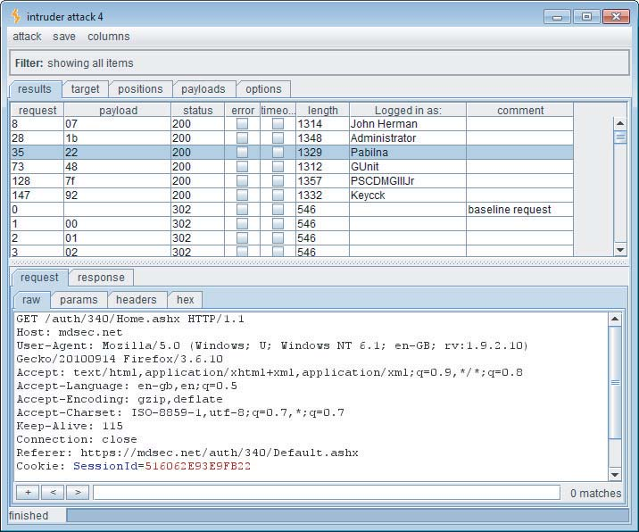

图 7-1：一种攻击，用于发现会话令牌可预测的有效会话

考虑以下一系列值，它们构成结构化会话令牌的一个组件：

```http
lwjVJA
Ls3Ajg
xpKr+A
XleXYg
9hyCzA
jeFuNg
JaZZoA
```

没有立即可辨别的模式；然而，粗略检查表明令牌可能包含 Base64 编码的数据。除了混合大小写的字母数字字符外，还有一个 + 字符，它在 Base64 编码字符串中也是有效的。通过 Base64 解码器运行令牌揭示了以下内容：

```http
--Õ$
.ÍÀŽ
Æ’«ø
^W-b
ö‚Ì
?án6
%¦Y
```

这些字符串似乎是乱码，并且还包含非打印字符。这通常表明您正在处理二进制数据而不是 ASCII 文本。

将解码后的数据呈现为十六进制数字，得到以下结果：

```http
9708D524
2ECDC08E
C692ABF8
5E579762
F61C82CC
8DE16E36
25A659A0
```

仍然没有可见的模式。但是，如果您从最后一个数字中减去前面的数字，您将得到以下结果：

```http
FF97C4EB6A
97C4EB6A
FF97C4EB6A
97C4EB6A
FF97C4EB6A
FF97C4EB6A
```

这立即揭示了隐藏的模式。用于生成令牌的算法将 0x97C4EB6A 添加到前一个值，将结果截断为 32 位数字，并对该二进制数据进行 Base64 编码以允许它使用基于文本的协议 HTTP 进行传输。利用这些知识，您可以轻松编写脚本生成服务器接下来将产生的令牌序列，以及它在捕获样本之前产生的序列。

### 时间依赖性

一些 Web 服务器和应用程序使用算法来生成会话令牌，该算法使用生成时间作为令牌值的输入。如果算法中没有加入足够的其他熵，您可能能够预测其他用户的令牌。尽管任何给定的令牌序列本身可能看起来是随机的，但相同的序列加上有关每个令牌生成时间的信息可能包含可辨别的模式。在每个秒钟创建大量会话的繁忙应用程序中，脚本化攻击可能会成功识别大量其他用户的令牌。

在测试在线零售商的 Web 应用程序时，作者遇到了以下会话令牌序列：

```http
3124538-1172764258718
3124539-1172764259062
3124540-1172764259281
3124541-1172764259734
3124542-1172764260046
3124543-1172764260156
3124544-1172764260296
3124545-1172764260421
3124546-1172764260812
3124547-1172764260890
```

每个令牌显然由两个单独的数字组件组成。第一个数字遵循简单的递增序列，很容易预测。第二个数字每次增加不同的数量。计算其在每个连续令牌中的值之间的差异揭示了以下内容：

```http
344
219
453
312
110
140
125
391
78
```

该序列似乎不包含可靠可预测的模式。然而，显然可以通过在自动化攻击中蛮力破解相关数字范围来发现序列中的有效值。但是，在尝试此攻击之前，我们等待了几分钟并收集了另一系列令牌：

```http
3124553-1172764800468
3124554-1172764800609
3124555-1172764801109
3124556-1172764801406
3124557-1172764801703
3124558-1172764802125
3124559-1172764802500
3124560-1172764802656
3124561-1172764803125
3124562-1172764803562
```

比较这两个令牌序列，立即可以看出两点：

- 第一个数字序列继续递增；然而，自第一个序列结束以来，已经跳过了五个值。这可能是因为缺少的值已发给在两次测试之间的窗口登录应用程序的其他用户。
- 第二个数字序列继续以类似的间隔递增；然而，我们获得的第一个值比前一个值大 539,578。

第二个观察立即提醒我们时间在生成会话令牌中所起的作用。显然，两个令牌获取练习之间只发行了五个令牌。然而，已经过去了大约 10 分钟。最可能的解释是第二个数字是时间相关的，可能是一个简单的毫秒计数。

事实上，我们的直觉是正确的。在测试的后续阶段，我们进行代码审查，揭示了以下令牌生成算法：

```java
String sessId = Integer.toString(s_SessionIndex++) +
“-” +
System.currentTimeMillis();
```

鉴于我们对令牌创建方式的分析，构建脚本化攻击来获取应用程序发给其他用户的会话令牌是直截了当的：

- 我们继续轮询服务器以快速连续地获取新的会话令牌。
- 我们监控第一个数字的增量。当它增加超过 1 时，我们知道已向另一个用户发行了令牌。
- 当向另一个用户发出令牌时，我们知道发给该人的第二个数字的上限和下限，因为我们拥有在他之前和之后发出的令牌。因为我们经常获得新的会话令牌，所以这些边界之间的范围通常只包含几百个值。
- 每次向另一个用户发出令牌时，我们都会启动暴力破解攻击，迭代该范围内的每个数字，将其附加到我们知道已发给另一个用户的缺失增量数字。我们尝试使用我们构建的每个令牌访问受保护的页面，直到尝试成功并且我们破坏了用户会话。
- 连续运行此脚本化攻击将使我们能够捕获每个其他应用程序用户的会话令牌。当管理员用户登录时，我们将完全破坏整个应用程序。

### 弱随机数生成

计算机内部几乎没有什么真正随机的过程。因此，当需要随机性时，软件会使用各种技术以伪随机的方式生成数字。一些算法生成的序列看起来是随机的，并在可能的值范围内均匀分布。然而，只要获得少量值样本，任何人都可以准确地向前或向后推断序列。

当使用可预测的伪随机数生成器生成会话令牌时，生成的令牌容易受到攻击者的序列攻击。Jetty 是一个用 100% Java 编写的流行 Web 服务器，它提供了一种会话管理机制供在其上运行的应用程序使用。2006 年，NGSSoftware 的 Chris Anley 发现该机制容易受到会话令牌预测攻击。服务器使用 Java API `java.util.Random` 生成会话令牌。该 API 实现了一个“线性同余生成器”，按照以下方式生成序列中的下一个数字：

```java
synchronized protected int next(int bits) {
seed = (seed * 0x5DEECE66DL + 0xBL) & ((1L << 48) - 1);
return (int)(seed >>> (48 - bits));
}
```

该算法取最后一个生成的数字，乘以一个常数，再加上另一个常数，得到下一个数字。该数字被截断为 48 位，算法将结果移位以返回调用者请求的特定位数。

知道了这个算法和一个由它生成的数字，我们可以很容易地推导出算法接下来将生成的数字序列。通过一些数论知识，我们还可以推导出它之前生成的序列。这意味着攻击者获得服务器的一个会话令牌就可以获得所有当前和未来会话的令牌。

**注意**

有时，当基于伪随机数生成器的输出创建令牌时，开发人员决定通过连接生成器的几个连续输出来构造每个令牌。这样做的理由是它创建了一个更长、因此更“强”的令牌。然而，这种策略通常是错误的。如果攻击者能够获得生成器的几个连续输出，这可能使他能够推断出其内部状态的一些信息。事实上，攻击者可能更容易向前或向后推断生成器的输出序列。

其他现成的应用程序框架在会话令牌生成中使用了令人惊讶的简单或可预测的熵源，其中大部分是确定性的。

例如，在 PHP 5.3.2 及更早版本中，会话令牌是基于客户端的 **IP 地址、令牌创建时间、令牌创建时的微秒数以及线性同余生成器**生成的。虽然这里有几个未知值，但一些应用程序可能会泄露信息，允许推断这些值。社交网络站点可能会泄露站点用户的登录时间和 IP 地址。此外，该生成器使用的种子是 PHP 进程启动的时间，如果攻击者正在监控服务器，则可以确定该时间位于一小范围内。

**注意**

这是一个不断发展的研究领域。PHP 会话令牌生成中的弱点于 2001 年在 Full Disclosure 邮件列表中指出，但并未被证明是实际可利用的。2010 年，Samy Kamkar 使用 phpwn 工具将 2001 年的理论付诸实践。

### 测试随机性的质量

在某些情况下，您可以仅通过目视检查或少量手动分析来识别一系列令牌中的模式。然而，一般来说，您需要使用更严格的方法来测试应用程序令牌中随机性的质量。

解决此任务的标准方法应用统计假设检验的原理，并采用各种有据可查的测试来寻找样本中非随机性的证据。此过程的高级步骤如下：

1. 从令牌是随机生成的假设开始。
2. 应用一系列测试，每个测试观察样本的特定属性，如果令牌是随机生成的，这些属性可能具有某些特征。
3. 对于每个测试，计算观察到的特征发生的概率，假设假设为真。
4. 如果该概率低于某个水平（“显著性水平”），则拒绝该假设并得出结论，即令牌不是随机生成的。

好消息是您不必手动执行所有这些操作！目前可用于测试 Web 应用程序令牌随机性的最佳工具是 Burp Sequencer。该工具以灵活的方式应用多个标准测试，并为您提供清晰易懂的结果。

要使用 Burp Sequencer，您需要找到应用程序发出的令牌的响应，例如发出包含会话令牌的新 cookie 的登录请求的响应。从 Burp 的上下文菜单中选择“发送到 Sequencer”选项，并在 Sequencer 配置中设置令牌在响应中的位置，如图 7-2 所示。您还可以配置各种选项，这些选项会影响令牌的收集方式，然后单击“开始捕获”按钮开始捕获令牌。如果您已经通过其他方式（例如，通过保存 Burp Intruder 攻击的结果）获得合适的令牌样本，您可以使用手动加载选项卡跳过令牌捕获并直接进行统计分析。

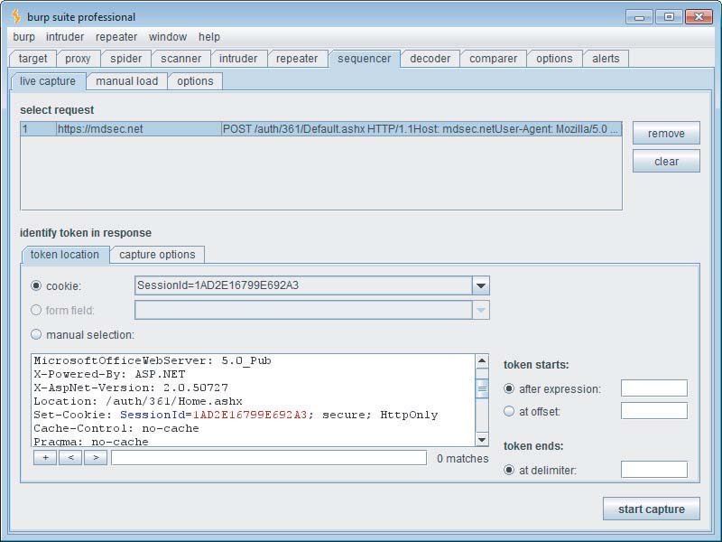

图 7-2：配置 Burp Sequencer 测试会话令牌的随机性

获得合适的令牌样本后，您可以对样本进行统计分析。您还可以在样本仍在捕获时进行中期分析。一般来说，获得更大的样本可以提高分析的可靠性。Burp 要求的最小样本量是 100 个令牌，但理想情况下，您应该获得更大的样本。如果对几百个令牌的分析明确表明令牌未能通过随机性测试，您可以合理地决定不需要进一步捕获令牌。否则，您应该继续捕获令牌并定期重新执行分析。如果您捕获了 5,000 个令牌并证明它们通过了随机性测试，您可以决定这足够了。但是，为了符合正式的 FIPS 随机性测试，您需要获得 20,000 个令牌的样本。这是 Burp 支持的最大样本量。

Burp Sequencer 在字符级和位级别执行统计测试。所有测试的结果被汇总以给出对令牌内有效熵位数的总体估计；这是要考虑的关键结果。

但是，您还可以深入研究每个测试的结果，以准确了解令牌的不同部分如何以及为什么通过或失败，如图 7-3 所示。每个测试类型使用的方法在测试结果下方进行了描述。

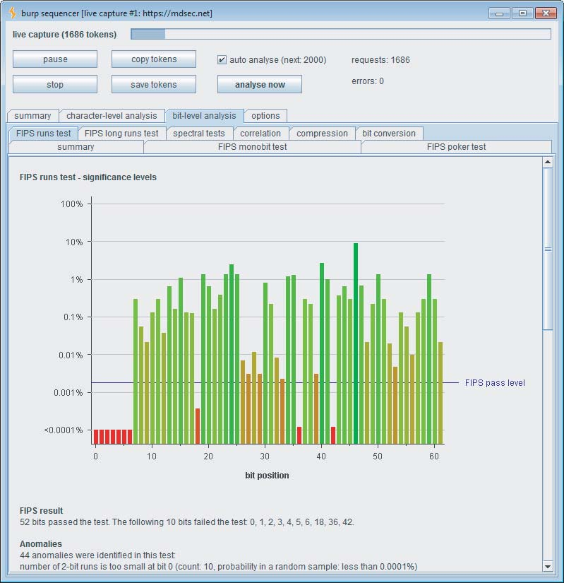

图 7-3：分析 Burp Sequencer 结果以了解所测试令牌的属性

请注意，Burp 对令牌中的每个字符和位数据单独执行所有测试。在许多情况下，您会发现结构化令牌的大部分都不是随机的；这本身可能不会带来任何弱点。重要的是令牌包含足够数量通过随机性测试的位。例如，如果一个大型令牌包含 1,000 位信息，而其中只有 50 位通过了随机性测试，那么整个令牌与完全通过测试的 50 位令牌一样稳健。

**注意**

在执行随机性统计测试时，请记住两个重要的注意事项。这些注意事项影响了对测试结果的正确解释及其对应用程序安全态势的影响。

首先，以完全确定性方式生成的令牌可能会通过随机性统计测试。例如，线性同余伪随机数生成器或计算序列号哈希的算法可能会产生通过测试的输出。然而，了解算法和生成器内部状态的攻击者可以完全可靠地向前和向后推断其输出。

其次，未能通过随机性统计测试的令牌在实际情况下可能实际上不可预测。如果令牌的给定位测试失败，这仅意味着在该位置观察到的位序列包含不太可能出现在真正随机令牌中的特征。但是，基于观察到的特征来预测下一个令牌中该位的值，可能比盲目猜测可靠性低得多。将这种不可靠性乘以需要同时预测的大量位，可能意味着做出正确预测的概率极低。

### 攻击步骤：

1. **确定会话令牌的颁发时机和方式**

通过从第一个应用程序页面开始，逐步浏览整个应用程序，包括任何登录功能，来确定会话令牌何时以及如何颁发。

通常有两种行为：

- 应用程序在接收到不包含令牌的请求时创建一个新会话。
- 应用程序在成功登录后创建一个新会话。

为了以自动化方式获取大量令牌，理想情况下，应识别单个请求（通常是 GET / 或登录提交）来触发新令牌的颁发。

2. **使用 Burp Suite 捕获令牌**

在 Burp Suite 中，将创建新会话的请求发送到 Burp Sequencer，并配置令牌的位置。然后启动实时捕获，以尽可能多地收集令牌。如果使用了自定义的会话管理机制，并且您只能远程访问应用程序，则应尽快收集令牌，以最小化其他用户获得的令牌丢失，并减少任何时间依赖性的影响。

3. **利用商业会话管理机制或本地访问**

如果使用了商业会话管理机制和/或您具有应用程序的本地访问权限，则可以在受控条件下获取无限数量的会话令牌序列。

4. **使用 Burp Sequencer 进行统计分析**

在 Burp Sequencer 捕获令牌的同时，启用“自动分析”设置，以便 Burp 定期自动执行统计分析。收集至少 500 个令牌，然后再详细查看结果。如果令牌中的足够多的位通过了测试，则继续收集令牌，直到可行为止，并随着更多令牌的捕获来查看分析结果。

5. **考虑令牌的随机性**

如果令牌未能通过随机性测试，并且似乎包含可用于预测未来令牌的模式，请从不同的 IP 地址和（如果相关）不同的用户名重新执行此练习。这将有助于您确定是否检测到相同的模式，以及在第一个练习中收到的令牌是否可以外推以识别在第二个练习中收到的令牌。有时，由一个用户捕获的令牌序列会表现出某种模式。但这不会允许直接外推到发给其他用户的令牌，因为诸如源 IP 之类的信息用作熵源（例如随机数生成器的种子）。

6. **自动化攻击**

如果您相信自己对令牌生成算法有足够的了解，可以对其他用户的会话发起自动化攻击，那么最好的方法可能是使用自定义脚本。该脚本可以根据您观察到的特定模式生成令牌，并应用任何必要的编码。有关将自动化应用于此类问题的通用技术，请参见第 14 章。

7. **源代码分析**

如果源代码可用，请仔细审查负责生成会话令牌的代码，以了解使用的机制并确定其是否容易受到预测攻击。如果熵是从可以在应用程序内确定且可暴力破解的范围内的数据中提取的，请考虑暴力破解应用程序令牌所需的实际请求数量。

## 加密令牌

一些应用程序使用包含有关用户有意义信息的令牌，并试图通过在向用户颁发令牌之前对其进行加密来避免由此带来的明显问题。由于令牌是使用用户未知的密钥加密的，因此这似乎是一种稳健的方法，因为用户将无法解密令牌并篡改其内容。

然而，在某些情况下，根据使用的加密算法和应用程序处理令牌的方式，用户可能仍然能够在不实际解密令牌的情况下篡改令牌的有意义内容。尽管听起来很奇怪，但这些实际上是可行的攻击，有时很容易实施，并且许多现实世界的应用程序都容易受到这些攻击。适用的攻击类型取决于所使用的确切加密算法。

### ECB密码

使用加密令牌的应用程序使用对称加密算法，以便可以解密从用户接收到的令牌以恢复其有意义的内容。一些对称加密算法使用“电子密码本”（ECB）密码。这种类型的密码将明文分成大小相等的数据块（例如，每个数据块 8 字节），并使用密钥加密每个数据块。在解密过程中，使用相同的密钥解密每个密文块以恢复原始的明文块。这种方法的一个特点是，明文中的模式可能会导致密文中的模式，因为相同的明文块将被加密成相同的密文块。对于某些类型的数据，例如位图图像，这意味着可以从密文中辨别出明文中的有意义信息，如图 7-4 所示。


图 7-4：使用 ECB 密码加密的明文中的模式可能在生成的密文中可见。

尽管 ECB 有这个缺点，但这些密码经常用于加密 Web 应用程序中的信息。即使在不存在明文模式问题的情况下，仍然可能存在漏洞。这是因为密码的行为是将相同的明文块加密成相同的密文块。

考虑一个应用程序，其令牌包含多个不同的有意义的组件，包括一个数字用户标识符。

```http
rnd=2458992;app=iTradeEUR_1;uid=218;username=dafydd;time=634430423694715
000;
```

当这个令牌被加密时，它显然是无意义的，并且很可能通过所有标准的随机性统计测试：

```http
68BAC980742B9EF80A27CBBBC0618E3876FF3D6C6E6A7B9CB8FCA486F9E11922776F0307
329140AABD223F003A8309DDB6B970C47BA2E249A0670592D74BCD07D51A3E150EFC2E69
885A5C8131E4210F
```

正在使用的ECB密码对8字节的数据块进行操作，明文块映射到相应的密文块，如下所示：

```http
rnd=2458 68BAC980742B9EF8
992;app= 0A27CBBBC0618E38
iTradeEU 76FF3D6C6E6A7B9C
R_1;uid= B8FCA486F9E11922
218;user 776F0307329140AA
name=daf BD223F003A8309DD
ydd;time B6B970C47BA2E249
=6344304 A0670592D74BCD07
23694715 D51A3E150EFC2E69
000; 885A5C8131E4210F
```

现在，因为每个密文块总是解密成相同的明文块，攻击者可以操纵密文块的顺序，以有意义的方式修改相应的明文。根据应用程序处理解密令牌的方式，这可能使攻击者切换到不同的用户或提升权限。

例如，如果在第四个块之后复制第二个块，则块的顺序如下

```http
rnd=2458 68BAC980742B9EF8
992;app= 0A27CBBBC0618E38
iTradeEU 76FF3D6C6E6A7B9C
R_1;uid= B8FCA486F9E11922
992;app= 0A27CBBBC0618E38
218;user 776F0307329140AA
name=daf BD223F003A8309DD
ydd;time B6B970C47BA2E249
=6344304 A0670592D74BCD07
23694715 D51A3E150EFC2E69
000; 885A5C8131E4210F
```

解密后的令牌现在包含一个修改后的uid值和一个重复的app值。具体发生什么取决于应用程序如何处理解密后的令牌。通常，以这种方式使用令牌的应用程序只检查解密令牌的某些部分，例如用户标识符。如果应用程序的行为是这样，那么它将以uid为992的用户上下文处理请求，而不是原始的218。

刚刚描述的攻击将取决于在操作块时发出与有效uid值对应的合适rnd值。

另一种更可靠的攻击是注册一个包含适当偏移量处的数字值的用户名，并复制此块以替换现有uid值。假设您注册了用户名daf1，并被发行了以下令牌：

```http
9A5A47BF9B3B6603708F9DEAD67C7F4C76FF3D6C6E6A7B9CB8FCA486F9E11922A5BC430A
73B38C14BD223F003A8309DDF29A5A6F0DC06C53905B5366F5F4684C0D2BBBB08BD834BB
ADEBC07FFE87819D
```

该令牌的明文和密文块如下：

```http
rnd=9224 9A5A47BF9B3B6603
856;app= 708F9DEAD67C7F4C
iTradeEU 76FF3D6C6E6A7B9C
R_1;uid= B8FCA486F9E11922
219;user A5BC430A73B38C14
name=daf BD223F003A8309DD
1;time=6 F29A5A6F0DC06C53
34430503 905B5366F5F4684C
61065250 0D2BBBB08BD834BB
0; ADEBC07FFE87819D
```

如果您在第四个块之后复制第七个块，您的解密令牌将包含一个uid值为1的值：

```http
rnd=9224 9A5A47BF9B3B6603
856;app= 708F9DEAD67C7F4C
iTradeEU 76FF3D6C6E6A7B9C
R_1;uid= B8FCA486F9E11922
1;time=6 F29A5A6F0DC06C53
219;user A5BC430A73B38C14
name=daf BD223F003A8309DD
1;time=6 F29A5A6F0DC06C53
34430503 905B5366F5F4684C
61065250 0D2BBBB08BD834BB
0; ADEBC07FFE87819D
```

通过注册一系列合适的用户名并重复此攻击，您可以潜在地遍历整个有效uid值的范围，从而伪装成应用程序的每个用户。

### CBC 密码

ECB 密码的缺点促使了密码块链接 (CBC, Cipher Block Chaining) 密码的开发。使用 CBC 密码时，每个明文块在加密之前，都会与前一个密文块进行异或 (XOR) 运算，如图 7-5 所示。这可以防止相同的明文块被加密成相同的密文块。在解密过程中，异或运算以相反的顺序进行，每个解密后的块都与前一个密文块进行异或运算，以恢复原始明文

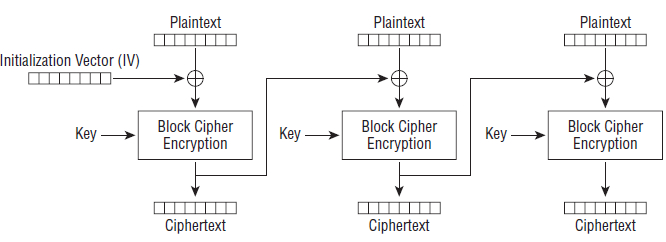

图 7-5：在 CBC 密码中，每个明文块在加密之前都会与前一个密文块进行异或运算。

由于 CBC 密码避免了 ECB 密码的一些问题，因此诸如 DES 和 AES 等标准对称加密算法经常以 CBC 模式使用。然而，CBC 加密的令牌在 Web 应用程序中的使用方式通常意味着攻击者可能能够在不知道密钥的情况下操纵部分解密的令牌。

考虑前述应用程序的一个变体，其令牌包含几个不同的有意义的组成部分，包括一个数字用户标识符：

```
rnd=191432758301;app=eBankProdTC;uid=216;time=6343303;
```

和以前一样，当此信息被加密时，它会生成一个看似无意义的令牌：

```
0FB1F1AFB4C874E695AAFC9AA4C2269D3E8E66BBA9B2829B173F255D447C51321586257C6E459A93635636F45D7B1A43163201477
```

由于此令牌使用 CBC 密码进行加密，因此当令牌被解密时，每个密文块都与 *下一个* 解密文本块进行异或运算，以获得明文。现在，如果攻击者修改了部分密文（他收到的令牌），这将导致该特定块解密为乱码。然而，它还会导致 *下一个* 解密文本块与不同的值进行异或运算，从而产生修改过但仍然有意义的明文。换句话说，通过操纵令牌的单个块，攻击者可以系统地修改其 *后面* 的块的解密内容。根据应用程序如何处理生成的解密令牌，这可能使攻击者能够切换到不同的用户或提升权限。

让我们看看这是如何实现的。在上述示例中，攻击者遍历加密的令牌，一次随意更改一个字符，并将每个修改后的令牌发送到应用程序。这涉及大量的请求。以下是当应用程序解密每个修改后的令牌时产生的部分值：

```
????????32858301;app=eBankProdTC;uid=216;time=6343303;` `????????32758321;app=eBankProdTC;uid=216;time=6343303;` `rnd=1914????????;aqp=eBankProdTC;uid=216;time=6343303;` `rnd=1914????????;app=eAankProdTC;uid=216;time=6343303;` `rnd=191432758301????????nkPqodTC;uid=216;time=6343303;` `rnd=191432758301????????nkProdUC;uid=216;time=6343303;` `rnd=191432758301;app=eBa????????;uie=216;time=6343303;` `rnd=191432758301;app=eBa????????;uid=226;time=6343303;` `rnd=191432758301;app=eBankProdTC????????;timd=6343303;` `rnd=191432758301;app=eBankProdTC????????;time=6343503;
```

在每种情况下，攻击者修改的块都会像预期的那样解密为乱码（用 ???????? 表示）。然而，*后面的* 块会解密为与原始令牌略有不同的有意义的文本。正如已经描述的那样，发生这种差异是因为解密的文本与 *前面* 的密文块进行了异或运算，而攻击者已经稍微修改了该密文块。

虽然攻击者看不到解密后的值，但应用程序会尝试处理它们，并且攻击者会在应用程序的响应中看到结果。具体会发生什么取决于应用程序如何处理已损坏的解密令牌部分。如果应用程序拒绝包含任何无效数据的令牌，则攻击失败。然而，通常情况下，以这种方式使用令牌的应用程序仅检查解密令牌的某些部分，例如用户标识符。如果应用程序的行为如此，则上述列表中的第八个示例将成功，并且应用程序将以 uid 为 226 的用户的身份处理请求，而不是原始的 216。

您可以使用 Burp Intruder 中的“bit flipper”（位翻转）有效负载类型轻松测试应用程序是否存在此漏洞。首先，您需要使用自己的帐户登录到应用程序。然后，您找到应用程序中依赖于已登录会话并在响应中显示已登录用户身份的页面。通常，用户的首页或帐户详细信息页面可以达到此目的。图 7-6 显示了 Burp Intruder 设置为以用户的主页为目标，并将加密的会话令牌标记为有效负载位置。

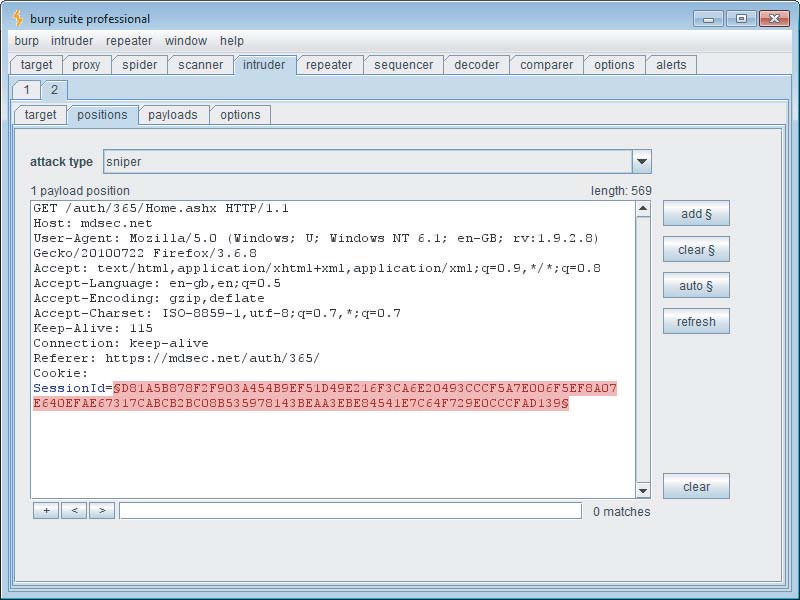

图 7-6：配置 Burp Intruder 以修改加密的会话令牌

图 7-7 显示了所需的有效负载配置。它告诉 Burp 对令牌的原始值进行操作，将其视为 ASCII 编码的十六进制，并在每个字符位置翻转每一位。这种方法非常理想，因为它只需要相对较少的请求（令牌中每个字节的数据需要八个请求），并且几乎总是能确定应用程序是否易受攻击。这使您可以使用更有针对性的攻击来执行实际的利用。

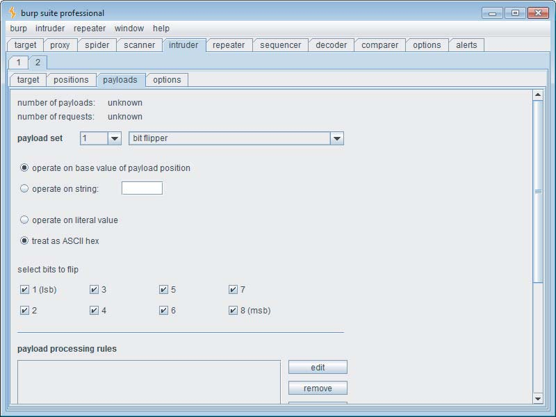

图 7-7：配置 Burp Intruder 以翻转加密令牌中的每一位

执行攻击时，初始请求不会导致应用程序的响应发生任何明显的变化，用户的会话仍然完整。这本身就很有趣，因为它表明令牌的第一部分未用于标识已登录的用户。攻击后面的许多请求会导致重定向到登录页面，表明修改以某种方式使令牌无效。至关重要的是，还有一系列请求，其响应似乎是有效会话的一部分，但未与原始用户身份关联。这对应于包含 uid 值的令牌块。在某些情况下，应用程序只是显示“未知用户”，表明修改后的 uid 与实际用户不对应，因此攻击失败。在其他情况下，它会显示应用程序的其他注册用户的姓名，从而确凿地证明攻击已成功。图 7-8 显示了攻击结果。在这里，我们定义了一个提取 grep 列来显示已登录用户的身份，并设置了一个过滤器来隐藏重定向到登录页面的响应。

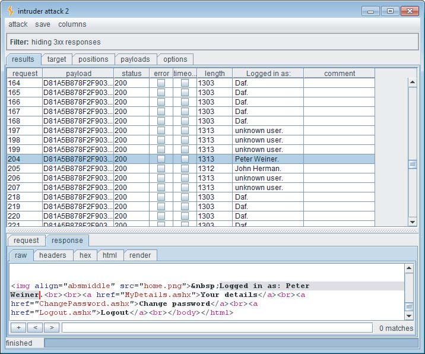

图 7-8：针对加密令牌的成功位翻转攻击

在确定了漏洞之后，您可以继续使用更有针对性的攻击来利用它。为此，您需要从结果中准确确定在用户上下文更改时正在篡改加密令牌的哪个块。然后，您将进行一次攻击，测试此块中的许多其他值。您可以使用 Burp Intruder 中的 Numbers（数字）有效负载类型来执行此操作。

**注意：**一些应用程序更广泛地使用在请求参数中加密有意义的数据的技术，以尝试防止篡改数据，例如购物商品的价格。在任何您看到在应用程序功能中起关键作用的明显加密数据的位置，您都应该尝试位翻转技术，以查看是否可以以有意义的方式操纵加密信息以干扰应用程序逻辑。

> 笔记：加密数据的密文可能会有重叠，或者有逻辑意义，执行位翻转类似于密文碰撞，有可能产生越权访问。

在寻求利用本节中描述的漏洞时，您的目标当然是伪装成不同的应用程序用户——理想情况下是具有更高权限的管理用户。如果您仅限于盲目地操纵加密令牌的部分内容，这可能需要一定的运气。但是，在某些情况下，应用程序可能会为您提供更多帮助。当应用程序使用对称加密来保护数据免受用户篡改时，通常会在整个应用程序中使用相同的加密算法和密钥。在这种情况下，如果任何应用程序功能向用户披露了任意加密字符串的解密值，则可以利用它来完全解密任何受保护的信息项。

作者观察到的一个应用程序包含文件上传/下载功能。上传文件后，用户会获得一个包含文件名参数的下载链接。为了防止各种操纵文件路径的攻击，应用程序在此参数中加密了文件名。但是，如果用户请求已删除的文件，应用程序会显示一条错误消息，其中显示了请求文件的解密名称。此行为可用于查找应用程序中使用的任何加密字符串的明文值，包括会话令牌的值。发现会话令牌以结构化格式包含各种有意义的值，该格式容易受到本节中描述的攻击类型的攻击。由于这些值包含文本用户名和应用程序角色，而不是数字标识符，因此仅使用盲位翻转进行成功的利用将非常困难。但是，使用文件名解密器功能，可以在查看结果的同时系统地操纵令牌的位。

这允许构建一个令牌，该令牌在解密后指定一个有效的用户和管理角色，从而实现对应用程序的完全控制。

> 笔记：大多数情况下，当在一个应用程序中发现为对称加密时，该程序其它的地方会使用相同的加密算法和密钥。导致程序的攻击面变大，该程序的任何加密位置，都有可能因为报错等情况泄露密文和明文，进而被利用解密收到保护的密文信息，执行进一步攻击。


**注意：**其他技术可能允许您解密应用程序使用的加密数据。“reveal”（揭示）加密 oracle 可被滥用来获取加密令牌的明文值。虽然这在解密密码时可能是一个严重的漏洞，但解密会话令牌并不能立即提供危及其他用户会话的方法。但是，解密的令牌提供了对明文结构的有用见解，这对于进行有针对性的位翻转攻击非常有用。有关“reveal”加密 oracle 攻击的更多详细信息，请参见第 11 章。针对填充 oracle 的侧信道攻击可用于危及加密令牌。有关更多详细信息，请参见第 18 章。

### **攻击步骤**：

在使用加密令牌的许多情况下，实际的可利用性可能取决于各种因素，包括块边界相对于您需要攻击的数据的偏移量，以及应用程序对您导致周围明文结构发生变化的容忍度。完全盲目地工作，构建有效的攻击似乎很困难，但在许多情况下，这实际上是可能的。

1. 除非会话令牌本身明显有意义或按顺序排列，否则始终要考虑它可能被加密的可能性。您通常可以通过注册几个不同的用户名并每次添加一个字符的长度来确定是否正在使用基于块的密码。如果您发现添加一个字符会导致您的会话令牌长度跳跃 8 或 16 个字节的点，则可能正在使用块密码。您可以通过继续向用户名添加字节，并查找 8 或 16 个字节后发生的相同跳跃来确认这一点。
2. ECB 密码操纵漏洞通常难以在纯黑盒环境中识别和利用。您可以尝试盲目地复制和移动令牌中的密文块，并查看您是否仍然以您自己的用户上下文或另一个用户的上下文登录到应用程序，或者根本没有登录。
3. 您可以通过使用“bit flipping”（位翻转）有效负载源在整个令牌上运行 Burp Intruder 攻击来测试 CBC 密码操纵漏洞。如果位翻转攻击在令牌中标识出一个部分，对其进行操纵会导致您仍然处于有效会话中，但作为不同的或不存在的用户，则仅针对此部分执行更有针对性的攻击，尝试在每个位置使用更广泛的值。
4. 在两次攻击期间，监控应用程序的响应，以确定每个请求后与您的会话关联的用户，并尝试利用可能导致的任何权限提升机会。
5. 如果您的攻击不成功，但从步骤 1 看来，您控制的可变长度输入正被合并到令牌中，您应该尝试通过一次添加一个字符来生成一系列令牌，至少要达到所用块的大小。对于每个生成的令牌，您应该重新执行步骤 2 和 3。这将增加您需要修改的数据与块边界适当对齐以使您的攻击成功的机会。

> 1. 检查是否使用块加密，2.通过替换不同用户对应标识密文，观察是否会有异常。3.使用位翻转攻击CBC加密的密文。4.多尝试1-2-3步骤循环，增加攻击覆盖面。

## 会话令牌处理中的弱点

无论应用程序在确保其生成的会话令牌不包含任何有意义的信息且不易受到分析或预测方面多么有效，如果这些令牌在生成后未得到妥善处理，其会话机制将完全暴露于攻击之下。例如，如果令牌通过某种方式泄露给攻击者，即使预测令牌是不可能的，攻击者也可以劫持用户会话。

应用程序对令牌的不安全处理会使其容易受到以下几种方式的攻击。

### 常见误解

“我们的令牌可以安全地防止泄露给第三方，因为我们使用了 SSL。”

正确使用 SSL 当然有助于保护会话令牌免遭捕获。但是，即使在使用 SSL 的情况下，各种错误仍可能导致令牌以明文形式传输。并且可以使用各种针对最终用户的直接攻击来获取他们的令牌。

### 常见误解

“我们的令牌是由平台使用成熟的、密码学上可靠的技术生成的，因此它不易受到损害。”

应用服务器的默认行为通常是在用户首次访问该站点时创建一个会话 cookie，并使其在用户与该站点的整个交互过程中都可用。正如以下部分所述，这可能会导致令牌处理方式中的各种安全漏洞。

> 笔记：可靠地加密并不意味着绝对的安全，应用程序加密到解密，服务器到用户的全过程中每个环节都可能存在薄弱点，从而遭受攻击。

### 网络上令牌的泄露

当会话令牌以未加密的形式在网络上传输时，就会出现这种漏洞，从而使处于适当位置的窃听者能够获得令牌，从而伪装成合法用户。适合窃听的位置包括用户的本地网络、用户 IT 部门内部、用户 ISP 内部、互联网骨干网、应用程序 ISP 内部以及托管应用程序的组织的 IT 部门内部。在每种情况下，这都包括相关组织的授权人员和任何已入侵相关基础设施的外部攻击者。

在最简单的情况下，如果应用程序使用未加密的 HTTP 连接进行通信，则攻击者可以捕获客户端和服务器之间传输的所有数据，包括登录凭据、个人信息、支付详细信息等。在这种情况下，通常不需要针对用户会话的攻击，因为攻击者已经可以查看特权信息，并且可以使用捕获的凭据登录以执行其他恶意操作。

但是，仍然可能存在用户会话是主要目标的情况。例如，如果捕获的凭据不足以执行第二次登录（例如，在银行应用程序中，它们可能包含在不断变化的物理令牌上显示的数字，或用户 PIN 码中的特定数字），则攻击者可能需要劫持窃听到的会话以执行任意操作。或者，如果仔细审核登录，并且每次成功登录都会通知用户，则攻击者可能希望避免执行自己的登录以尽可能隐蔽。

> 笔记：从服务器到用户端整条网络链路都存在信息泄露导致会话劫持的风险。

在其他情况下，应用程序可能使用 HTTPS 来保护关键的客户端-服务器通信，但仍然容易受到网络上会话令牌的拦截。这种弱点可能以各种方式发生，其中许多方式可能专门在使用 HTTP cookie 作为会话令牌的传输机制时出现：

- 一些应用程序选择使用 HTTPS 在登录期间保护用户的凭据，然后在用户会话的剩余时间内恢复为 HTTP。许多 Web 邮件应用程序都以这种方式运行。在这种情况下，窃听者无法拦截用户的凭据，但仍然可以捕获会话令牌。作为 Firefox 插件发布的 Firesheep 工具使这一过程变得容易。

> 笔记：HTTPS 虽然能够保护用户的登录凭据，但是攻击者也可以捕获会话令牌。

- 一些应用程序对站点的预身份验证区域（例如站点首页）使用 HTTP，但从登录页面开始切换到 HTTPS。但是，在许多情况下，用户在访问的第一个页面上会获得一个会话令牌，并且该令牌在用户登录时不会被修改。用户的会话最初是未经身份验证的，登录后会升级为已身份验证的会话。在这种情况下，窃听者可以在登录前拦截用户的令牌，等待用户的通信切换到 HTTPS，表明用户正在登录，然后尝试使用该令牌访问受保护的页面（例如“我的帐户”）。

> 笔记：部分网站登录前和登陆后使用的令牌相同。

- 即使应用程序在成功登录后发出新的令牌，并从登录页面开始使用 HTTPS，用户已验证会话的令牌仍可能被泄露。如果用户通过以下方式重新访问预身份验证页面（例如“帮助”或“关于”），则可能会发生这种情况：通过已验证区域内的链接、使用后退按钮或直接键入 URL。

> 笔记：使用https已登录的用户可能会在网站其它使用http服务的区域泄露会话令牌。

- 在上述情况的一个变体中，应用程序可能会在用户单击“登录”链接时尝试切换到 HTTPS。但是，如果用户相应地修改 URL，它仍然可能接受通过 HTTP 进行的登录。在这种情况下，处于适当位置的攻击者可以修改在站点的预身份验证区域中返回的页面，以使“登录”链接指向 HTTP 页面。即使应用程序在成功登录后发出新的会话令牌，如果攻击者已成功将用户的连接降级为 HTTP，他仍然可以拦截此令牌。

> 笔记：更改URL从https改为http导致泄露

- 一些应用程序对应用程序中的所有静态内容（例如图像、脚本、样式表和页面模板）使用 HTTP。用户的浏览器中的警告通常会表明此行为，如图 7-9 所示。当浏览器显示此警告时，它已经通过 HTTP 检索了相关项目，因此会话令牌已被传输。浏览器警告的目的是让用户拒绝处理通过 HTTP 接收并可能被污染的响应数据。如前所述，当用户的浏览器通过 HTTP 访问资源时，攻击者可以拦截用户的会话令牌，并使用此令牌通过 HTTPS 访问站点的受保护的非静态区域。

> 笔记：静态内容可能会泄露会话令牌。

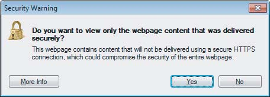

图 7-9：当通过 HTTPS 访问的页面包含通过 HTTP 访问的项目时，浏览器会显示警告。

- 即使应用程序对每个页面（包括站点的未经身份验证的区域和静态内容）都使用 HTTPS，仍然可能存在用户令牌通过 HTTP 传输的情况。如果攻击者能够以某种方式诱使用户通过 HTTP 发出请求（如果同一服务器上有 HTTP 服务在运行，则发送到该服务，否则发送到 `http://server:443/`），则可能会提交他的令牌。攻击者可能尝试使用的方法包括在电子邮件或即时消息中向用户发送 URL，将自动加载链接放入攻击者控制的网站，或使用可点击的横幅广告。（有关此类技术用于针对其他用户进行攻击的更多详细信息，请参见第 12 章和第 13 章。）

> 制作http请求的钓鱼网站或者钓鱼邮件URL，获取用户HTTPS网站的会话令牌。

### 攻击步骤

1. 从首次访问（“开始”URL）开始，通过登录过程，然后通过应用程序的所有功能，以正常方式浏览应用程序。记录每个访问的 URL，并记下每次收到新会话令牌的实例。特别注意登录功能以及 HTTP 和 HTTPS 通信之间的转换。这可以通过使用诸如 Wireshark 之类的网络嗅探器手动完成，或者使用拦截代理的日志记录功能部分自动化完成，如图 7-10 所示。

   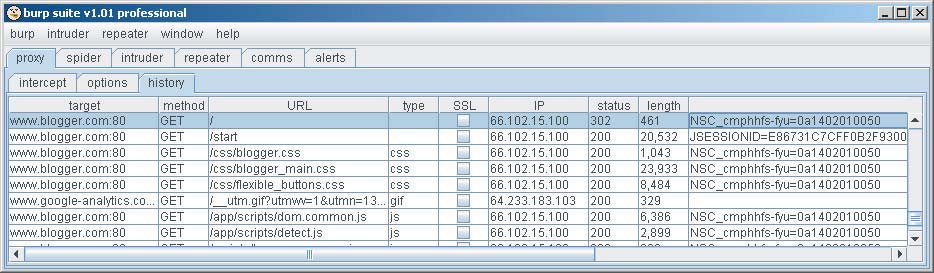

   图 7-10：浏览应用程序以识别接收新会话令牌的位置。

2. 如果 HTTP cookie 正用作会话令牌的传输机制，请验证是否设置了 secure 标志，以防止它们通过未加密的连接传输。

3. 确定在应用程序的正常使用中，会话令牌是否曾经通过未加密的连接传输。如果是这样，则应将其视为容易受到拦截的攻击。

4. 如果起始页使用 HTTP，并且应用程序切换到 HTTPS 进行登录和站点的已验证区域，请验证登录后是否发出新令牌，或者是否仍使用在 HTTP 阶段传输的令牌来跟踪用户的已验证会话。还要验证如果相应地修改登录 URL，应用程序是否会接受通过 HTTP 进行的登录。

5. 即使应用程序对每个页面都使用 HTTPS，也要验证服务器是否也在端口 80 上侦听，运行任何服务或内容。如果是这样，请从已验证的会话中直接访问任何 HTTP URL，并验证是否传输了会话令牌。

6. 如果通过 HTTP 将已验证会话的令牌传输到服务器，请验证该令牌是否仍然有效或是否立即被服务器终止。

> 笔记：通过http劫持https中的会话令牌或者登录凭据。

### 令牌泄露在日志中

除了会话令牌在网络通信中以纯文本传输之外，最常见的令牌泄露给未授权用户查看的地方是各种系统的日志。虽然这种情况发生的频率较低，但其后果通常更为严重。这些日志可能被更广泛的潜在攻击者查看，而不仅仅是那些能够窃听网络的人。

许多应用程序为管理员和其他支持人员提供功能，用于监视和控制应用程序运行时状态的各个方面，包括用户会话。例如，帮助台工作人员在协助遇到问题的用户时，可能会询问用户用户名，通过列表或搜索功能找到用户的当前会话，并查看与该会话相关的详细信息。或者，管理员可能会在调查安全漏洞的过程中查看最近会话的日志。通常，这类监控和控制功能会泄露与每个会话关联的实际会话令牌。而且，这些功能往往保护不当，允许未经授权的用户访问当前会话令牌列表，从而劫持所有应用程序用户的会话。

会话令牌出现在系统日志中的另一个主要原因是应用程序使用 URL 查询字符串作为传输令牌的机制，而不是使用 HTTP cookie 或 POST 请求主体。例如，谷歌搜索 "inurl:jsessionid" 可以识别数千个在 URL 中传输 Java 平台会话令牌（称为 jsessionid）的应用程序：

http://www.webjunction.org/do/Navigation;jsessionid= F27ED2A6AAE4C6DA409A3044E79B8B48?category=327

> 笔记：日志的访问权限较低，日志通常会记录URL查询字符串，如果使用URL查询字符串传递信息，可能会被日志泄露。

当应用程序以这种方式传输其会话令牌时，它们的会话令牌很可能出现在各种未授权方可能访问的系统日志中：

- 用户浏览器日志
- Web 服务器日志
- 企业或 ISP 代理服务器的日志
- 应用程序托管环境中使用的任何反向代理的日志
- 应用程序用户通过跟踪站外链接访问的任何服务器的 Referer 日志，如图 7-11 所示

即使整个应用程序都使用 HTTPS，其中一些漏洞仍然会出现。

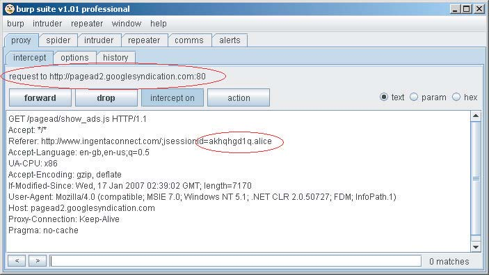

图 7-11：当会话令牌出现在 URL 中时，用户跟踪站外链接或其浏览器加载站外资源时，这些令牌会在 Referer 标头中传输。

刚刚描述的最后一种情况为攻击者提供了一种非常有效的方法来捕获某些应用程序中的会话令牌。例如，如果 Web 邮件应用程序在 URL 中传输会话令牌，则攻击者可以向该应用程序的用户发送包含指向其控制的 Web 服务器的链接的电子邮件。如果任何用户访问该链接（因为她单击了该链接，或者因为她的浏览器加载了 HTML 格式的电子邮件中包含的图像），则攻击者会实时收到用户的会话令牌。攻击者可以在其服务器上运行一个简单的脚本来劫持收到的每个令牌的会话，并执行一些恶意操作，例如发送垃圾邮件、收集个人信息或更改密码。

注意：当前版本的 Internet Explorer 在跟踪通过 HTTPS 访问的页面中包含的站外链接时，不包含 Referer 标头。在这种情况下，如果站外链接也是通过 HTTPS 访问的（即使它属于不同的域），则 Firefox 会包含 Referer 标头。因此，即使在使用 SSL 的情况下，放置在 URL 中的敏感数据也容易在 Referer 日志中泄露。

### 攻击步骤

1. 识别应用程序中的所有功能，并找到任何可以查看会话令牌的日志记录或监控功能。验证谁可以访问此功能——例如，管理员、任何经过身份验证的用户或任何匿名用户。有关发现未直接从主应用程序链接的隐藏内容的技术，请参见第 4 章。
2. 识别应用程序中任何在 URL 中传输会话令牌的实例。可能是令牌通常以更安全的方式传输，但开发人员在特定情况下使用 URL 来解决特定难题。例如，当 Web 应用程序与外部系统交互时，通常会观察到这种行为。
3. 如果会话令牌正在 URL 中传输，请尝试查找任何允许你将任意站外链接注入其他用户查看的页面的应用程序功能。示例包括实现留言板、站点反馈、问答等的功能。如果是这样，提交指向你控制的 Web 服务器的链接，并等待查看你的 Referer 日志中是否收到任何用户的会话令牌。
4. 如果捕获到任何会话令牌，请尝试通过正常使用应用程序但将捕获的令牌替换为你自己的令牌来劫持用户会话。你可以通过拦截服务器的下一个响应并添加你自己的包含捕获的 cookie 值的 Set-Cookie 标头来完成此操作。在 Burp 中，你可以应用一个套件范围的配置，该配置在对目标应用程序的所有请求中设置一个特定的 cookie，以便在测试期间轻松切换不同的会话上下文。
5. （原文中此处为6，应为5）如果捕获到大量令牌，并且会话劫持允许你访问敏感数据，例如个人详细信息、支付信息或用户密码，则可以使用第 14 章中描述的自动化技术来收集属于其他应用程序用户的所有所需数据。

> 首先，FUZZ查看有无日志泄露，然后，观察会话令牌是否在URL中传输，随后，尝试在留言板或其它能提交数据的地方发送布置好的web服务器链接进行钓鱼，通过查看Referer日志确认会话令牌，最后，更换会话令牌验证是否能够登录成功，登录成功后自动化收集应用程序信息。
>
> Burp proxy中的match and replace可以轻松替换cookie

### 令牌到会话的脆弱映射

会话管理机制中出现的各种常见漏洞是由于应用程序如何将会话令牌的创建和处理映射到各个用户的会话本身方面的弱点造成的。

最简单的弱点是允许将多个有效令牌同时分配给同一个用户帐户。实际上，在几乎所有应用程序中，没有任何正当理由允许任何用户一次拥有多个活动会话。当然，用户放弃一个活动会话并开始一个新的会话是很常见的——例如，因为他关闭了浏览器窗口或移动到另一台计算机。但是，如果用户似乎同时使用两个不同的会话，这通常表明发生了安全漏洞：要么用户将其凭据泄露给了另一方，要么攻击者通过其他某种方式获得了其凭据。在这两种情况下，允许并发会话都是不可取的，因为它允许用户继续进行不良行为而不会带来不便，并且因为它允许攻击者使用捕获的凭据而没有被发现的风险。

> 单个用户允许多个有效令牌同时生效，存在安全风险。

一个相关但截然不同的弱点是应用程序使用“静态”令牌。这些令牌看起来像会话令牌，并且最初可能看起来像它们一样工作，但实际上它们根本不是。在这些应用程序中，每个用户都被分配一个令牌，并且每次用户登录时都会向该用户重新颁发相同的令牌。无论用户最近是否登录并已获得该令牌，应用程序始终接受该令牌为有效。这样的应用程序实际上是对会话的整个概念及其为管理和控制对应用程序的访问所提供的好处的误解。有时，应用程序以这种方式运行是为了实现设计不良的“记住我”功能，因此静态令牌存储在持久性 cookie 中（请参阅第 6 章）。有时，令牌本身容易受到预测攻击，从而使漏洞更加严重。成功的攻击不是损害当前登录用户的会话，而是永久性地损害所有注册用户的帐户。

> 笔记：静态令牌容易遭到预测攻击

偶尔还会观察到其他类型的奇怪应用程序行为，这些行为表明令牌和会话之间的关系存在根本缺陷。一个例子是基于用户名和随机组件构建有意义的令牌。例如，考虑以下令牌：

dXNlcj1kYWY7cjE9MTMwOTQxODEyMTM0NTkwMTI=

其 Base64 解码为：

user=daf;r1=13094181213459012

在对 r1 组件进行广泛分析后，我们可以得出结论，无法根据值样本预测该组件。但是，如果应用程序的会话处理逻辑出现偏差，则攻击者可能只需提交任何有效值作为 r1，并提交任何有效值作为 user，即可在指定用户的安全上下文中访问会话。这本质上是一个访问控制漏洞，因为关于访问的决策是基于会话之外的用户提供的数据做出的（请参阅第 8 章）。它之所以产生，是因为应用程序有效地使用会话令牌来表示请求者已与应用程序建立了某种有效的会话。但是，处理该会话的用户上下文不是会话本身的固有属性，而是通过其他某种方式按请求确定的。在这种情况下，该方式可以由请求者直接控制。

> 笔记：令牌的构建方法随机性弱，攻击者使用参数，可能会造成访问控制漏洞。

### 攻击步骤

1. 使用同一用户帐户（从不同的浏览器进程或不同的计算机）两次登录到应用程序。确定两个会话是否仍然同时处于活动状态。如果是这样，则应用程序支持并发会话，从而使已获得另一用户凭据的攻击者可以利用这些凭据而没有被发现的风险。
2. 使用同一用户帐户（从不同的浏览器进程或不同的计算机）多次登录和注销。确定每次是否颁发新的会话令牌，或者每次登录时是否颁发相同的令牌。如果发生后者，则应用程序实际上并未采用适当的会话。
3. 如果令牌似乎包含任何结构和含义，请尝试将可能标识用户的组件与那些看似难以理解的组件分离开来。尝试修改令牌的任何与用户相关的组件，使其引用应用程序的其他已知用户，并验证生成的令牌是否被接受。

> 1. 针对单用户同时生效多个会话令牌，可以通过不同的浏览器或设备多次登录，确定两个会话是否都处于活动状态。
> 2. 针对静态令牌，使用不同的浏览器和设备多次登录，查看颁布的令牌是否相同。
> 3. 针对弱随机性令牌，尝试修改用户的各种信息，查看令牌是否改变。

### 脆弱的会话终止

正确终止会话很重要，原因有二。首先，尽可能缩短会话的生命周期，可以减少攻击者捕获、猜测或滥用有效会话令牌的机会窗口。其次，它为用户提供了一种在不再需要现有会话时使其失效的方法。这使他们能够进一步缩小此窗口，并在共享计算环境中承担保护其会话的一些责任。会话终止功能的主要弱点包括未能实现这两个关键目标。

一些应用程序不强制执行有效的会话过期。一旦创建，会话可能会在收到最后一个请求后仍然有效很多天，然后服务器最终才会使会话过期。如果令牌容易受到某种难以利用的排序缺陷的影响（例如，对于每个识别出的有效令牌需要 100,000 次猜测），则攻击者仍然可能捕获最近访问过该应用程序的每个用户的令牌。

一些应用程序不提供有效的注销功能：

- 在某些情况下，根本没有实现注销功能。用户无法使应用程序的会话失效。
- 在某些情况下，注销功能实际上并不会导致服务器使会话失效。服务器会从用户的浏览器中删除令牌（例如，通过发出 Set-Cookie 指令来清空令牌）。但是，如果用户继续提交令牌，服务器仍然会接受它。
- 在最坏的情况下，当用户单击“注销”时，此事实不会传达给服务器，因此服务器不执行任何操作。而是执行客户端脚本来清空用户的 cookie，这意味着后续请求会将用户返回到登录页面。获得此 cookie 的攻击者可以像用户从未注销一样使用该会话。

一些不使用身份验证的应用程序仍然包含允许用户在其会话中构建敏感数据的功能（例如，购物应用程序）。然而，通常它们不提供任何等效于注销功能供用户终止其会话。

### 攻击步骤

1. 不要落入检查应用程序在客户端令牌上执行的操作的陷阱（例如通过新的 Set-Cookie 指令、客户端脚本或过期时间属性进行的 cookie 失效）。就会话终止而言，客户端浏览器中令牌发生的情况并不重要。相反，应调查是否在服务器端实现了会话过期：
    a. 登录到应用程序以获取有效的会话令牌。
    b. 等待一段时间不使用此令牌，然后使用该令牌提交对受保护页面的请求（例如“我的详细信息”）。 
    c. 如果页面正常显示，则令牌仍然有效。 
    d. 使用反复试验法确定任何会话过期超时时间有多长，或者在使用令牌的最后一个请求后几天令牌是否仍然可以使用。可以将 Burp Intruder 配置为增加连续请求之间的时间间隔以自动执行此任务。
2. 确定是否存在注销功能并将其显着地提供给用户。如果没有，用户更容易受到攻击，因为他们无法使应用程序的会话失效。
3. 如果提供了注销功能，请测试其有效性。注销后，尝试重复使用旧令牌并确定其是否仍然有效。如果是这样，即使在“注销”后，用户仍然容易受到某些会话劫持攻击。你可以使用 Burp Suite 来测试这一点，方法是从代理历史记录中选择最近的依赖于会话的请求，并将其发送到 Burp Repeater 以在你从应用程序注销后重新发出。

> 会话注销功能是否存在，注销后会话令牌是否有效，以及会话令牌不注销时有效期是多久。

### 客户端暴露于令牌劫持

攻击者可以针对应用程序的其他用户，试图以各种方式捕获或滥用受害者的会话令牌：

- 跨站脚本攻击的一个明显的有效负载是查询用户的 cookie 以获取其会话令牌，然后可以将其传输到攻击者控制的任意服务器。第 12 章详细描述了此攻击的所有各种排列。
- 可以利用针对用户的各种其他攻击以不同的方式劫持用户的会话。利用会话固定漏洞，攻击者向用户提供一个已知的会话令牌，等待她登录，然后劫持她的会话。利用跨站请求伪造攻击，攻击者从其控制的网站向应用程序发出精心设计的请求，并利用用户的浏览器自动将她当前的 cookie 与此请求一起提交这一事实。第 12 章也描述了这些攻击。

### 攻击步骤

1. 识别应用程序中的任何跨站脚本漏洞，并确定是否可以利用这些漏洞来捕获其他用户的会话令牌（请参阅第 12 章）。
2. 如果应用程序向未经身份验证的用户颁发会话令牌，请获取一个令牌并执行登录。如果应用程序在成功登录后没有颁发新的令牌，则它容易受到会话固定的攻击。
3. 即使应用程序不向未经身份验证的用户颁发会话令牌，也请通过登录获取一个令牌，然后返回到登录页面。如果应用程序即使在你已经过身份验证的情况下也愿意返回此页面，请使用相同的令牌以其他用户的身份提交另一次登录。如果应用程序在第二次登录后没有颁发新的令牌，则它容易受到会话固定的攻击。
4. 识别应用程序使用的会话令牌的格式。将你的令牌修改为有效形成的虚构值，然后尝试登录。如果应用程序允许你使用虚构的令牌创建经过身份验证的会话，则它容易受到会话固定的攻击。
5. 如果应用程序不支持登录，但处理敏感的用户信息（例如个人和支付详细信息），并允许在提交后显示这些信息（例如在“验证我的订单”页面上），请针对显示敏感数据的页面执行前三个测试。如果在匿名使用应用程序期间设置的令牌稍后可用于检索敏感用户信息，则该应用程序容易受到会话固定的攻击。
6. 如果应用程序使用 HTTP cookie 传输会话令牌，则它很可能容易受到跨站请求伪造 (XSRF) 的攻击。首先，登录到应用程序。然后确认向应用程序发出的但源自不同应用程序页面的请求会导致提交用户的令牌。（此提交需要从用于登录目标应用程序的同一浏览器进程的窗口进行。）尝试识别攻击者可以预先确定其参数的任何敏感应用程序功能，并利用此功能在目标用户的安全上下文中执行未经授权的操作。有关如何执行 XSRF 攻击的更多详细信息，请参阅第 13 章。

> 在各个位置确定会话令牌的作用域（登录或未登录），确定会话令牌的有效值有几位。

### 自由 Cookie 作用域

通常关于 cookie 如何工作的简单总结是服务器使用 HTTP 响应头 Set-cookie 颁发 cookie，然后浏览器在后续请求中使用 Cookie 头将此 cookie 重新提交给同一服务器。事实上，事情比这更微妙。

cookie 机制允许服务器同时指定每个 cookie 将被重新提交到的域和 URL 路径。为此，它使用 Set-cookie 指令中可能包含的 domain 和 path 属性。

#### Cookie 域限制

当位于 foo.wahh-app.com 的应用程序设置 cookie 时，浏览器默认情况下会在所有后续请求中将 cookie 重新提交到 foo.wahh-app.com，以及任何子域，例如 admin.foo.wahh-app.com。它不会将 cookie 提交到任何其他域，包括父域 wahh-app.com 和父域的任何其他子域，例如 bar.wahh-app.com。

服务器可以通过在 Set-cookie 指令中包含 domain 属性来覆盖此默认行为。例如，假设位于 foo.wahh-app.com 的应用程序返回以下 HTTP 头：

Set-cookie: sessionId=19284710; domain=wahh-app.com;

然后，浏览器会将此 cookie 重新提交到 wahh-app.com 的所有子域，包括 bar.wahh-app.com。

**注意：**服务器不能使用此属性指定任何域。首先，指定的域必须是应用程序运行所在的域或其父域（可以直接或经过一些删除）。其次，指定的域不能是顶级域，例如 .com 或 .co.uk，因为这将使恶意服务器能够在任何其他域上设置任意 cookie。如果服务器违反了其中一条规则，浏览器会简单地忽略 Set-cookie 指令。

如果应用程序将 cookie 的域范围设置得过于宽松，可能会使应用程序暴露于各种安全漏洞。

例如，考虑一个允许用户注册、登录、撰写博客文章和阅读其他人博客的博客应用程序。主应用程序位于域 wahh-blogs.com 上。当用户登录应用程序时，他们会收到一个会话令牌，该令牌存储在作用域设置为该域的 cookie 中。每个用户都可以创建通过用户名为前缀的新子域访问的博客：

herman.wahh-blogs.com solero.wahh-blogs.com

由于 cookie 会自动重新提交到其作用域内的每个子域，因此当已登录的用户浏览其他用户的博客时，他的会话令牌会随他的请求一起提交。如果博客作者被允许在其自己的博客中放置任意 JavaScript（这在现实世界的博客应用程序中很常见），那么恶意博客作者就可以窃取其他用户的会话令牌，就像存储型跨站点脚本攻击所做的那样（请参阅第 12 章）。

问题在于用户创作的博客作为身份验证和会话管理处理程序处理的主应用程序的子域创建。HTTP cookie 中没有应用程序可以防止由主域颁发的 cookie 被重新提交到其子域的功能。

解决方案是为主应用程序使用不同的域名（例如，www.wahh-blogs.com ），并将其会话令牌 cookie 的域范围限定为此完全限定的名称。这样，当登录用户浏览其他用户的博客时，会话 cookie 将不会被提交。

当应用程序显式地将 cookie 的域范围设置为父域时，会出现此漏洞的不同版本。例如，假设一个安全关键型应用程序位于域上。当它设置 cookie 时，它会显式地放宽其域范围，如下所示：

```http
Set-cookie: sessionId=12df098ad809a5219; domain=wahh-organization.com
```

这样做的结果是，敏感应用程序的会话令牌 cookie 将会在用户访问 wahh-organization.com 使用的每个子域时提交，包括：

www.wahh-organization.com  testapp.wahh-organization.com

虽然这些其他应用程序可能都属于与敏感应用程序相同的组织，但出于以下几个原因，最好不要将敏感应用程序的 cookie 提交到其他应用程序：

- 负责其他应用程序的人员可能与负责敏感应用程序的人员信任级别不同。
- 其他应用程序可能包含的功能使第三方能够获取提交给应用程序的 cookie 的值，例如前面的博客示例。
- 其他应用程序可能没有像敏感应用程序那样经过相同的安全标准或测试（因为它们不太重要，不处理敏感数据，或者仅用于测试目的）。这些应用程序中可能存在许多漏洞（例如跨站点脚本漏洞）可能与这些应用程序的安全状况无关。但是它们可以让外部攻击者利用不安全的应用程序来捕获敏感应用程序创建的会话令牌。

**注意：**基于域的 cookie 分隔不如通常的同源策略严格（请参阅第 3 章）。除了主机名处理中已经描述的问题之外，浏览器在确定 cookie 作用域时会忽略协议和端口号。如果一个应用程序与一个不受信任的应用程序共享一个主机名，并且依赖于协议或端口号的差异来进行自我隔离，那么 cookie 的更宽松处理可能会破坏这种隔离。该应用程序颁发的任何 cookie 都将可以被共享其主机名的不受信任的应用程序访问。

### 攻击步骤

查看应用程序颁发的所有 cookie，并检查用于控制 cookie 作用域的任何 domain 属性。

1. 如果应用程序显式地将其 cookie 的作用域放宽到父域，则它可能会使自己容易受到通过其他 Web 应用程序进行的攻击。
2. 如果应用程序将其 cookie 的域作用域设置为其自己的域名（或未指定 domain 属性），则它仍然可能暴露于可通过子域访问的应用程序或功能。

识别将接收应用程序颁发的 cookie 的所有可能的域名。确定是否可以通过这些域名访问任何其他 Web 应用程序或功能，你可以利用这些应用程序或功能来获取颁发给目标应用程序用户的 cookie。

> cookie的作用域默认值为其本身与子域，检查cookie的domain和path值确定cookie的作用域，cookie作用域中的其它任何站点都可能成为cookie获取的切入点。

### Cookie 路径限制

当位于 /apps/secure/foo-app/index.jsp 的应用程序设置一个 Cookie 时，浏览器默认会在所有后续请求中将该 Cookie 重新提交到路径 /apps/secure/foo-app/ 以及其任何子目录。它不会将 Cookie 提交到父目录或服务器上存在的任何其他目录路径。

与基于域的 Cookie 作用域限制类似，服务器可以通过在 Set-cookie 指令中包含 path 属性来覆盖此默认行为。例如，如果应用程序返回以下 HTTP 头部：

```
Set-cookie: sessionId=187ab023e09c00a881a; path=/apps/;
```

浏览器会将此 Cookie 重新提交到 /apps/ 路径的所有子目录。

与基于域的 Cookie 作用域不同，这种基于路径的限制比同源策略 (Same-Origin Policy) 施加的限制要严格得多。因此，如果将其用作防御同一域上托管的不可信应用程序的安全机制，则几乎完全无效。运行在一个路径上的客户端代码可以打开一个窗口或 iframe，该窗口或 iframe 针对同一域上的不同路径，并且可以毫无限制地读取和写入该窗口。因此，获取限定于同一域上不同路径的 Cookie 相对容易。有关详细信息，请参阅 Amit Klein 的以下论文：

http://lists.webappsec.org/pipermail/websecurity_lists.webappsec.org/ 2006-March/000843.html

> 基于cookie路径作用域的攻击，成功的可能性很小。

## 保护会话管理

Web 应用程序必须采取的防御措施，以防止对其会话管理机制的攻击，对应于影响这些机制的两大类漏洞。为了以安全的方式执行会话管理，应用程序必须以强大的方式生成其令牌，并且必须在其生命周期内（从创建到销毁）保护这些令牌。

### 生成强令牌

用于在连续请求之间重新识别用户的令牌的生成方式不应为攻击者提供任何空间，攻击者通常以正常方式从应用程序获取大量令牌样本，从而预测或推断分配给其他用户的令牌。

**最有效的令牌生成机制是那些：**

- 使用非常大的可能值集合
- 包含强大的伪随机源，确保令牌在可能值的范围内均匀且不可预测地分布

原则上，给定足够的时间和资源，可以使用暴力破解来猜测任何任意长度和复杂性的项目。设计生成强令牌的机制的目标是，即使是拥有大量带宽和处理资源的决心坚定的攻击者，在其有效期的生命周期内成功猜测单个有效令牌的可能性也应该极低。

> 令牌的可能值集合和生命周期应该是相辅相成的，即在有效的生命周期内猜测出有效令牌的可能性应为极低。

令牌应仅包含服务器用于定位要用于处理用户请求的相关会话对象的标识符。令牌不应包含任何含义或结构，无论是明显的还是包装在编码或混淆层中的。有关会话所有者和状态的所有数据都应存储在服务器上，存储在会话令牌对应的会话对象中。

> 令牌本身不应该有任何的含义或者结构，用户的所有数据都应该存储在服务器上。

选择随机源时要小心。开发人员应该意识到，他们可用的各种来源的强度可能存在显着差异。有些，例如 java.util.Random，对于许多需要更改输入源的用途非常有用。但是，它们可以基于单个输出项以完全的确定性在正向和反向方向上进行推断。开发人员应该研究不同可用随机源中使用的实际算法的数学特性，并且应该阅读有关不同 API 推荐用途的相关文档。一般来说，如果一个算法没有明确描述为密码学安全的，就应该假定它是可预测的。

**注意：** 一些高强度的随机源由于其获取足够熵（例如来自系统事件）所采取的步骤，需要一些时间才能返回其输出序列中的下一个值。因此，它们可能无法足够快地传递值以生成某些高容量应用程序的令牌。

除了选择可行的最强大的随机源之外，一个好的实践是引入一些关于正在为其生成令牌的单个请求的信息作为熵源。此信息对于该请求可能不是唯一的，但它可以有效地缓解所使用的核心伪随机数生成器中的任何弱点。以下是可以合并的一些信息示例：

- 接收请求的源 IP 地址和端口号
- 请求中的 User-Agent 标头
- 请求的时间（以毫秒为单位）

一种非常有效的结合这种熵的方法是构造一个字符串，该字符串连接一个伪随机数、各种如上所述的请求特定数据，以及一个只有服务器知道并在每次重启时重新生成的一次性密钥字符串。然后对此字符串进行适当的哈希运算（例如，在撰写本文时使用 SHA-256），以生成一个可管理的固定长度字符串，该字符串可用作令牌。（将变化最大的项目放在哈希输入的开头可以最大限度地提高哈希算法中的“雪崩”效应。）

**提示：** 在选择用于生成会话令牌的算法后，一个有用的“思想实验”是假设您的伪随机源已损坏并且始终返回相同的值。在这种情况下，从应用程序获取大量令牌样本的攻击者是否能够推断分配给其他用户的令牌？使用此处描述的公式，即使完全了解所使用的算法，通常这也是极不可能的。源 IP、端口号、User-Agent 标头和请求时间共同产生了大量的熵。即使完全了解这些信息，攻击者也无法在不知道服务器使用的密钥字符串的情况下生成相应的令牌。

> 使用单个请求中的信息为熵源，比如源IP、端口号、UA头和请求时间，连接一个伪随机数然后再进行哈希运算，用户即使指导算法也很难推断。

### 在生命周期内保护令牌

现在您已经创建了一个无法预测其值的强大令牌，需要在其生命周期内（从创建到销毁）保护此令牌，以确保除分配给它的用户之外的任何人都不会泄露它：

- 令牌应仅通过 HTTPS 传输。任何以明文传输的令牌都应被视为已被污染——也就是说，不能保证用户的身份。如果使用 HTTP Cookie 传输令牌，则应将其标记为安全，以防止用户的浏览器通过 HTTP 传输它们。如果可行，应用程序的每个页面都应使用 HTTPS，包括静态内容，例如帮助页面、图像等。如果不需要这样做并且仍然实现了 HTTP 服务，则应用程序应将任何对敏感内容（包括登录页面）的请求重定向到 HTTPS 服务。帮助页面等静态资源通常不敏感，可以在没有任何经过身份验证的会话的情况下访问。因此，可以使用 Cookie 作用域指令来支持安全 Cookie 的使用，以防止在对这些资源的请求中提交令牌。
- 会话令牌绝不应在 URL 中传输，因为这为会话固定攻击提供了一种简单的途径，并导致令牌出现在许多日志记录机制中。在某些情况下，开发人员使用此技术在禁用了 Cookie 的浏览器中实现会话。但是，实现此目的的更好方法是对所有导航使用 POST 请求，并将令牌存储在 HTML 表单的隐藏字段中。
- 应实现注销功能。这应处置服务器上保存的所有会话资源，并使会话令牌失效。
- 应在适当的不活动时间段（例如 10 分钟）后实现会话过期。这应导致与用户显式注销相同的行为。
- 应防止并发登录。每次用户登录时，都应颁发不同的会话令牌，并且应处置属于该用户的任何现有会话，就像她已从中注销一样。发生这种情况时，可以存储旧令牌一段时间。任何后续使用该令牌收到的请求都应向用户返回安全警报，指出由于她从其他位置登录，会话已终止。
- 如果应用程序包含任何允许查看会话令牌的管理或诊断功能，则应有力地防御此功能以防止未经授权的访问。在大多数情况下，此功能不需要显示实际的会话令牌。相反，它应该包含有关会话所有者的足够详细信息，以便执行任何支持和诊断任务，而无需泄露用户提交的用于识别其会话的会话令牌。

- 应用程序会话 Cookie 的域和路径作用域应设置得尽可能严格。范围过于宽松的 Cookie 通常是由配置不佳的 Web 应用程序平台或 Web 服务器生成的，而不是由应用程序开发人员自己生成的。不应通过包含在应用程序 Cookie 范围内的域名或 URL 路径访问任何其他 Web 应用程序或不受信任的功能。应特别注意用于访问应用程序的域名的任何现有子域名。在某些情况下，为了确保不会出现此漏洞，可能需要修改组织内使用的各种应用程序采用的域名和路径命名方案。

应采取具体措施来防御会话管理机制，以抵御应用程序用户可能成为目标的各种攻击：

- 应严格审核应用程序的代码库，以识别并删除任何跨站脚本 (Cross-Site Scripting, XSS) 漏洞（请参阅第 12 章）。大多数此类漏洞都可能被利用来攻击会话管理机制。特别是，存储型（或二阶）XSS 攻击通常可以被利用来击败针对会话滥用和劫持的所有可能防御措施。
- 不应接受服务器无法识别的用户提交的任意令牌。应立即在浏览器中取消该令牌，并且应将用户返回到应用程序的起始页。
- 通过在执行资金转账等关键操作之前要求两步确认和/或重新身份验证，可以使跨站请求伪造 (Cross-Site Request Forgery, CSRF) 和其他会话攻击更加困难。
- 可以通过不完全依赖 HTTP Cookie 来传输会话令牌来防御跨站请求伪造攻击。使用 Cookie 机制会引入漏洞，因为无论导致请求发生的原因是什么，浏览器都会自动提交 Cookie。如果令牌始终在 HTML 表单的隐藏字段中传输，则攻击者无法创建一个其提交将导致未经授权操作的表单，除非他已经知道令牌的值。在这种情况下，他可以简单地执行一次简单的劫持攻击。逐页令牌也有助于防止这些攻击（请参阅下一节）。
- 应始终在成功身份验证后创建一个新会话，以减轻会话固定攻击的影响。如果应用程序不使用身份验证但允许提交敏感数据，则固定攻击构成的威胁更难解决。一种可能的方法是尽可能缩短提交敏感数据的页面序列。然后，您可以在此序列的第一页创建一个新会话（必要时，从现有会话复制任何所需的数据，例如购物车的内容）。或者，您可以使用逐页令牌（在下一节中描述）来防止知道第一页中使用的令牌的攻击者访问后续页面。
- 除非绝对必要，否则不应将个人数据显示回给用户。即使需要这样做（例如显示地址的“确认订单”页面），也不应将信用卡号和密码等敏感项目显示回给用户，并且应始终在应用程序响应的源代码中对其进行屏蔽。

### 逐页令牌

通过在会话令牌之外使用逐页令牌，可以实现对会话更精细的控制，并且可以使许多类型的会话攻击更加困难或不可能。这里，每当用户请求一个应用程序页面（例如，而不是图像）时，就会创建一个新的页面令牌，并通过 Cookie 或 HTML 表单的隐藏字段将其传递给客户端。每次用户发出请求时，除了对主会话令牌的正常验证之外，还会根据上次颁发的值验证页面令牌。如果两者不匹配，则整个会话将终止。互联网上许多最安全的 Web 应用程序，例如网上银行，都使用逐页令牌来为其会话管理机制提供更高的保护，如图 7-12 所示。

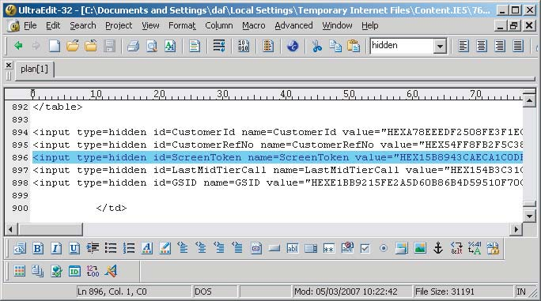

图 7-12：在银行应用程序中使用的逐页令牌

使用逐页令牌确实对导航施加了一些限制（例如，对后退和前进按钮的使用以及多窗口浏览）。但是，它可以有效地防止会话固定攻击，并确保合法用户和攻击者同时使用被劫持的会话将在两者都发出单个请求后迅速被阻止。逐页令牌还可以用于跟踪用户在应用程序中的位置和移动。它们还可以用于检测尝试以定义的顺序访问功能的行为，从而帮助防止某些访问控制缺陷（请参阅第 8 章）。

> 逐页令牌能够跟踪用户再应用程序中的位置和移动，能够帮助防止某些访问控制缺陷，安全性较高。

### 日志、监控和警报

应用程序的会话管理功能应与其日志记录、监控和警报机制紧密集成，以提供异常活动的适当记录，并使管理员能够在必要时采取防御措施：

- 应用程序应监控包含无效令牌的请求。除了最可预测的情况外，试图猜测分配给其他用户的令牌的成功攻击通常涉及发出大量包含无效令牌的请求，从而在应用程序的日志中留下明显的痕迹。
- 针对会话令牌的暴力破解攻击很难完全阻止，因为无法禁用任何特定的用户帐户或会话来阻止攻击。一种可能的措施是在收到大量包含无效令牌的请求时，阻止源 IP 地址一段时间。但是，当一个用户的请求源自多个 IP 地址（例如 AOL 用户）或多个用户的请求源自同一 IP 地址（例如位于执行网络地址转换的代理或防火墙后面的用户）时，这可能无效。
- 即使无法实时有效地阻止针对会话的暴力破解攻击，保留详细的日志并向管理员发出警报也使他们能够调查攻击并在可以采取适当措施的地方采取行动。
- 在可能的情况下，应向用户发出与其会话相关的异常事件警报，例如并发登录或明显的劫持（使用逐页令牌检测到）。即使可能已经发生了妥协，这也能使用户检查是否发生了任何未经授权的操作，例如资金转账。

#### 反应式会话终止

会话管理机制可以作为针对应用程序的许多其他类型攻击的非常有效的防御手段。一些安全关键型应用程序（例如网上银行）在用户每次提交异常请求时都会非常积极地终止用户的会话。例如，任何包含修改后的隐藏 HTML 表单字段或 URL 查询字符串参数的请求，任何包含与 SQL 注入或跨站脚本攻击相关的字符串的请求，以及任何通常会被客户端检查（例如长度限制）阻止的用户输入。

当然，需要从源头上解决可能利用此类请求的任何实际漏洞。但是，即使采用自动化技术，强迫用户每次提交无效请求时都重新进行身份验证，也可以将探测应用程序漏洞的过程减慢几个数量级。如果仍然存在残留漏洞，则它们不太可能被现场的任何人发现。

如果实施了这种防御措施，还建议可以为了测试目的轻松将其关闭。如果对应用程序的合法渗透测试以与现实世界中的攻击者相同的方式减慢速度，则其有效性将大大降低。而且，与没有该机制的情况相比，该机制的存在很可能会导致生产代码中保留更多的漏洞。

> 反应式会话终止，会在用户提交异常请求时主动终止用户的会话，这种方法虽然很安全，但是会导致生产代码中出现更多的漏洞。

### 攻击步骤

如果您正在攻击的应用程序使用这种防御措施，您可能会发现探测应用程序中许多常见漏洞非常耗时。每次失败的测试后都需要进行令人麻木的登录，并重新导航到您正在查看的应用程序部分，这会很快让您放弃。

在这种情况下，您通常可以使用自动化来解决问题。使用 Burp Intruder 执行攻击时，您可以使用“Obtain Cookie”功能在发送每个测试用例之前执行新的登录，并使用新的会话令牌（前提是登录是单阶段的）。手动浏览和探测应用程序时，您可以通过 IBurpExtender 接口使用 Burp Proxy 的可扩展性功能。您可以创建一个扩展，该扩展检测应用程序何时执行强制注销，自动重新登录到应用程序，并将新的会话和页面返回给浏览器，可以选择使用弹出消息来告诉您发生了什么。虽然这绝不能消除问题，但在某些情况下，它可以大大缓解问题。

> 逐页令牌，可以使用自动化工具探测漏洞。

## 总结

会话管理机制为您在制定针对应用程序的攻击时提供了一个丰富的潜在漏洞来源。由于其在使应用程序能够在多个请求中识别同一用户方面的基本作用，因此损坏的会话管理功能通常会提供通往王国的钥匙。跳入其他用户的会话很好。劫持管理员的会话甚至更好；通常，这使您能够危及整个应用程序。

您可以预期在现实世界的会话管理功能中遇到各种各样的缺陷。当使用定制机制时，可能的弱点和攻击途径似乎是无穷无尽的。从本主题中得出的最重要的教训是保持耐心和决心。仔细分析后会发现，很多乍一看似乎很强大的会话管理机制都存在不足之处。破译应用程序用于生成看似随机的令牌序列的方法可能需要时间和创造力。但是考虑到回报，这通常是一项非常值得的投资。

翻译至257页
