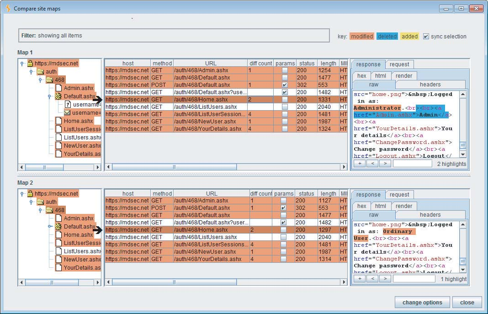
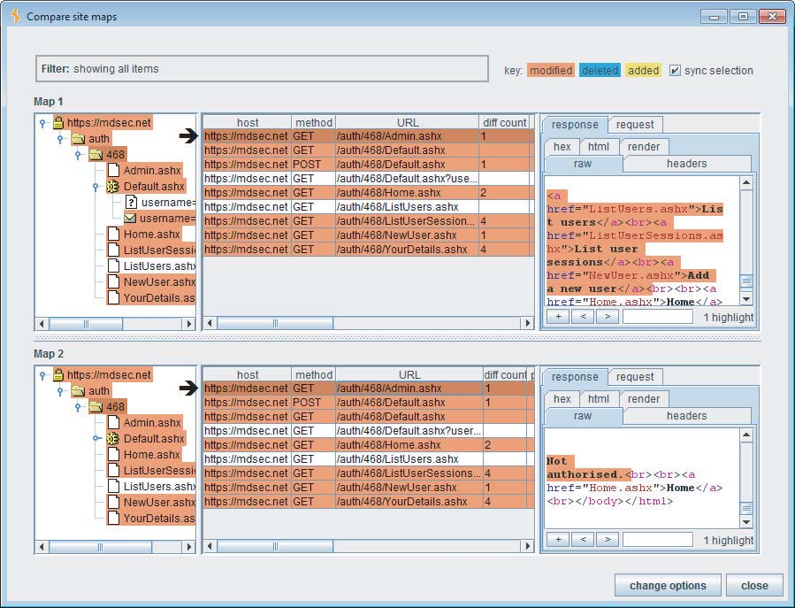
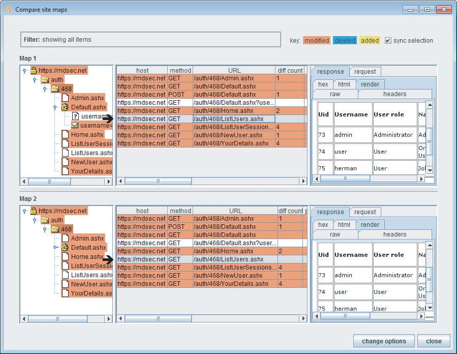
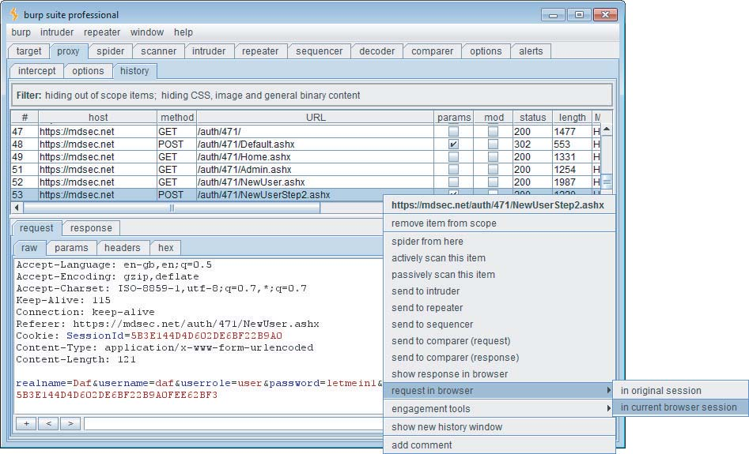
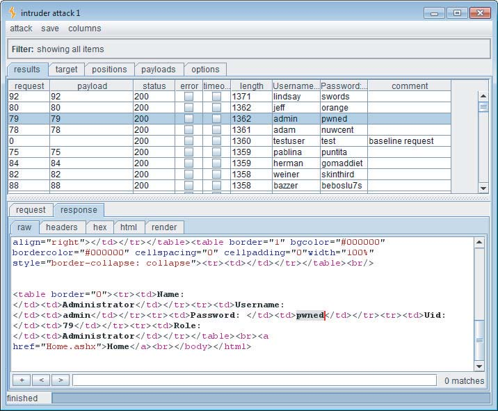

# 第八章：攻击访问控制

在应用程序的核心安全机制中，访问控制在逻辑上构建于身份验证和会话管理之上。到目前为止，您已经了解了应用程序如何首先验证用户身份，然后确认其接收到的特定请求序列是否来自同一用户。应用程序需要执行这些操作的主要原因——至少从安全的角度来看——是因为它需要一种方法来决定是否应该允许给定的请求执行其尝试的操作或访问其请求的资源。访问控制是应用程序内部一项至关重要的防御机制，因为它们负责做出这些关键决策。当它们存在缺陷时，攻击者通常可以危及整个应用程序，控制管理功能并访问属于其他每个用户的敏感数据。

正如第 1 章所述，失效的访问控制是最常见的 Web 应用程序漏洞类别之一，影响了作者最近测试的应用程序中的 71%。非常常见的情况是，应用程序费尽心思地实现了强大的身份验证和会话管理机制，却因为忽略在其之上构建有效的访问控制而浪费了这些投入。这些弱点如此普遍的一个原因是，需要针对特定用户在特定时间尝试执行的每个请求以及对资源的每个操作执行访问控制检查。而且与许多其他类型的控制不同，这是一个需要由人做出的设计决策；它无法通过使用技术来解决。

访问控制漏洞在概念上很简单：应用程序允许你做一些你不应该能够做的事情。不同缺陷之间的差异实际上归结为这种核心缺陷的不同表现方式，以及你需要用来检测它的不同技术。本章将描述所有这些技术，展示你如何利用应用程序中的不同类型的行为来执行未经授权的操作和访问受保护的数据。

## 常见漏洞

访问控制可以分为三大类：垂直访问控制、水平访问控制和上下文相关的访问控制。

垂直访问控制允许不同类型的用户访问应用程序功能的不同部分。在最简单的情况下，这通常涉及普通用户和管理员之间的划分。在更复杂的情况下，垂直访问控制可能涉及细粒度的用户角色，授予对特定功能的访问权限，每个用户被分配到一个角色，或不同角色的组合。

水平访问控制允许用户访问同一类型更广泛资源中的特定子集。例如，Web 邮件应用程序可能允许你阅读自己的电子邮件，但不能阅读其他人的电子邮件；网上银行可能只允许你从自己的帐户转账；工作流应用程序可能允许你更新分配给你的任务，但只能阅读分配给其他人的任务。

上下文相关的访问控制确保用户的访问权限仅限于当前应用程序状态允许的范围。例如，如果用户在流程中遵循多个阶段，则上下文相关的访问控制可能会阻止用户访问超出规定顺序的阶段。

在许多情况下，垂直访问控制和水平访问控制是相互交织的。例如，企业资源计划应用程序可能允许每个应付账款文员支付特定组织单位的invoice（发票），而不能支付其他单位的invoice。另一方面，应付账款经理可能被允许支付任何单位的invoice。类似地，文员可能能够支付小额invoice，但较大的invoice必须由经理支付。财务主管可能能够查看公司中每个组织单位的invoice付款和收款，但可能不允许支付任何invoice。

如果任何用户可以访问他或她未被授权的功能或资源，则访问控制就会被破坏。针对访问控制主要有三种类型的攻击，分别对应于三种控制类别：

- 垂直权限提升（Vertical privilege escalation）发生在用户可以执行其分配的角色不允许他执行的功能时。例如，如果一个普通用户可以执行管理功能，或者一个文员可以支付任何金额的invoice，则访问控制就会被破坏。
- 水平权限提升（Horizontal privilege escalation）发生在用户可以查看或修改他无权访问的资源时。例如，如果你可以使用Web邮件应用程序阅读其他人的电子邮件，或者如果付款文员可以处理他自己组织单位以外的组织单位的invoice，则访问控制就会被破坏。
- 业务逻辑利用（Business logic exploitation）发生在用户可以利用应用程序状态机中的缺陷来获得对关键资源的访问权限时。例如，用户可能能够绕过购物结账序列中的付款步骤。

通常会发现应用程序的水平权限分离中的漏洞会导致立即的垂直权限提升攻击。例如，如果用户找到一种方法来设置不同用户的密码，则该用户可以攻击管理帐户并控制应用程序。

在到目前为止描述的情况下，失效的访问控制使已在特定用户上下文中向应用程序进行身份验证的用户能够执行该上下文未授权他们执行的操作或访问数据。

但是，在最严重的访问控制失效的情况下，完全未经授权的用户可能能够访问仅供特权认证用户访问的功能或数据。

## 完全不加保护的功能

在许多访问控制失效的情况下，任何知道相关 URL 的人都可以访问敏感的功能和资源。例如，对于许多应用程序来说，任何访问特定 URL 的人都可以充分利用其管理功能：

```
https://wahh-app.com/admin/
```

在这种情况下，应用程序通常仅强制执行以下程度的访问控制：以管理员身份登录的用户会在其用户界面上看到指向此 URL 的链接，而其他用户则看不到。这种表面上的差异是唯一用于“保护”敏感功能免遭未经授权使用的机制。

有时，授予访问强大功能的 URL 可能更难猜到，甚至可能非常难以理解：

```
https://wahh-app.com/menus/secure/ff457/DoAdminMenu2.jsp
```

这里，对管理功能的访问受以下假设的保护：攻击者不会知道或发现此 URL。对于外部攻击者来说，更难攻破应用程序，因为他们不太可能猜到可以用来攻破的 URL。

> 此种方式，可以通过查看js端口看到。

## 常见误解

“没有低权限用户会知道那个 URL。我们在应用程序中没有任何地方引用它。”

即使猜测 URL 的难度很高，任何真正的访问控制缺失仍然构成严重漏洞。URL 既不是应用程序本身的秘密，也不是用户手中的秘密。它们会显示在屏幕上，也会出现在浏览器历史记录、Web 服务器和代理服务器的日志中。用户可能会将它们写下来、添加书签或通过电子邮件发送它们。它们不像密码那样通常会定期更改。当用户更换工作角色，需要撤销他们对管理功能的访问权限时，无法删除他们对特定 URL 的认知。

在某些应用程序中，敏感功能隐藏在不易猜测的 URL 后面，攻击者通常可以通过仔细检查客户端代码来识别这些 URL。许多应用程序使用 JavaScript 在客户端动态构建用户界面。这通常通过设置有关用户状态的各种标志，然后根据这些标志将各个元素添加到 UI 来实现：

```javascript
var isAdmin = false;
...
if (isAdmin)
{
adminMenu.addItem(“/menus/secure/ff457/addNewPortalUser2.jsp”,
“create a new user”);
}
```

在这里，攻击者可以简单地查看 JavaScript 以识别管理功能的 URL 并尝试访问这些 URL。在其他情况下，HTML 注释可能包含对未从屏幕内容链接的 URL 的引用或线索。第 4 章讨论了攻击者可以用来收集有关应用程序中隐藏内容的信息的各种技术。

> 可以从js注释和js代码中寻找这些泄露的网址

## 直接方法调用

未保护功能的一个具体案例是当应用程序公开 URL 或参数，这些 URL 或参数实际上是 API 方法的远程调用，通常是由 Java 接口公开的。这通常发生在服务器端代码被移动到浏览器扩展组件并且创建方法存根 (method stubs) 以便代码仍然可以调用其运行所需的服务端方法时。在这种情况之外，还可以识别一些直接访问方法的实例，其中 URL 或参数使用标准的 Java 命名约定，例如 getBalance 和 isExpired。

原则上，指定要执行的服务器端 API 的请求并不比指定服务器端脚本或其他资源的请求更不安全。然而，在实践中，这种类型的机制经常包含漏洞。通常，客户端直接与服务器端 API 方法交互，绕过应用程序对访问或意外输入向量的正常控制。还存在其他功能可以通过这种方式调用并且不受任何控制保护的可能性，前提是它永远不会被 Web 应用程序客户端直接调用。通常，需要为用户提供访问某些特定方法的权限，但他们却可以访问所有方法。这可能是因为开发人员没有完全意识到要代理哪部分方法而授予所有方法的访问权限，或者因为用于将它们映射到 HTTP 服务器的 API 默认授予所有方法的访问权限。

以下示例展示了从 securityCheck 接口中调用的 getCurrentUserRoles 方法：

```
http://wahh-app.com/public/securityCheck/getCurrentUserRoles
```

在这个例子中，除了测试 getCurrentUserRoles 方法的访问控制之外，您还应该检查是否存在其他类似命名的的方法，例如 getAllUserRoles、getAllRoles、getAllUsers 和 getCurrentUserPermissions。本章稍后将描述针对直接访问方法测试的进一步具体注意事项。

> 远程API可能没有任何的保护措施，可以调用任意函数。

## 基于标识符的功能

当应用程序的功能用于访问特定资源时，通常会看到请求标识符作为请求参数传递给服务器，它位于 URL 查询字符串或 POST 请求主体中。例如，应用程序可以使用以下 URL 来显示属于特定用户的特定文档：

```
https://wahh-app.com/ViewDocument.php?docid=1280149120
```

当拥有该文档的用户登录时，用户“我的文档”页面上会显示指向此 URL 的链接。其他用户看不到该链接。但是，如果访问控制失效，任何请求相关 URL 的用户都可能能够与授权用户完全相同的方式查看文档。

提示：此类漏洞通常发生在主应用程序与外部系统或后端组件交互时。在可能基于不同技术的不同系统之间共享基于会话的安全模型可能会很困难。面对这个问题，开发人员经常会采用一种捷径，放弃该模型，而是使用客户端提交的参数来做出访问控制决策。

在这个例子中，想要获得未经授权访问的攻击者不仅需要知道应用程序页面的名称 (ViewDocument.php)，还需要知道他想要查看的文档的标识符。有时，资源标识符的生成方式非常难以预测；例如，它们可能是随机选择的 GUID。在其他情况下，它们可能很容易猜到；例如，它们可能是按顺序生成的数字。但是，在这两种情况下，应用程序都是脆弱的。正如之前所述，URL 不是秘密，资源标识符也一样。通常，想要发现其他用户资源标识符的攻击者可以在应用程序中找到一些泄露这些标识符的位置，例如访问日志。即使应用程序的资源标识符不容易猜到，如果应用程序未能正确控制对这些资源的访问，它仍然是脆弱的。

当标识符易于预测时，问题就更加严重，也更容易被利用。

提示：应用程序日志通常是信息的金矿。它们可能包含许多可以用作标识符的数据项，用于探测以这种方式访问的功能。应用程序日志中常见到的标识符包括用户名、用户 ID 号码、账号、文档 ID、用户组和角色以及电子邮件地址。

注意：除了用作应用程序内数据资源的引用之外，这类标识符还经常用于引用应用程序本身的功能。正如您在第 4 章中看到的那样，应用程序可以通过单个页面提供不同的功能，该页面接受功能名称或标识符作为参数。同样在这种情况下，访问控制可能仅仅取决于不同类型用户界面中是否存在特定的 URL。如果攻击者可以确定敏感功能的标识符，他可能能够像更高权限的用户一样访问它。

> URL中的用户标识符，可能会造成未授权访问。可以在日志记录中排查敏感信息。

## 多阶段功能

应用程序中的许多类型的功能都是跨多个阶段实现的，涉及从客户端发送到服务器的多个请求。例如，添加新用户的功能可能涉及从用户维护菜单中选择此选项、从下拉列表中选择部门和用户角色，然后输入新用户名、初始密码和其他信息。

通常会遇到这样的应用程序：它们已经努力保护此类敏感功能免受未经授权的访问，但由于对功能的使用方式存在缺陷的假设，所采用的访问控制被破坏。

在前面的示例中，当用户尝试加载用户维护菜单并选择添加新用户的选项时，应用程序可能会验证用户是否具有所需的权限，如果用户没有权限，则阻止访问。但是，如果攻击者直接进入指定用户部门和其他详细信息的阶段，则可能没有有效的访问控制。开发人员无意识地假设任何到达该过程后期阶段的用户都必须具有相关的权限，因为这在早期阶段已经过验证。结果是，应用程序的任何用户都可以添加新的管理用户帐户，从而完全控制应用程序，并获得对许多其他功能的访问权限，而这些功能的访问控制本质上是强大的。

作者甚至在最注重安全的 Web 应用程序（即网上银行部署的应用程序）中也遇到过此类漏洞。在银行应用程序中进行资金转账通常涉及多个阶段，部分原因是防止用户在请求转账时意外犯错。此多阶段过程涉及在每个阶段从用户那里捕获不同的数据项。这些数据在首次提交时会经过彻底检查，然后通常使用 HTML 表单中的隐藏字段传递到后续的每个阶段。但是，如果应用程序未在最后阶段重新验证所有这些数据，则攻击者可能会绕过服务器的检查。例如，应用程序可能会验证为转账选择的源帐户是否属于当前用户，然后要求提供有关目标帐户和转账金额的详细信息。如果用户拦截此过程的最终 POST 请求并修改了源帐号，她可以执行水平权限提升并从属于其他用户的帐户中转出资金。

> 多阶段验证功能， 可能在经过初步彻底检查后，在后续步骤中缺乏有效的数据安全检查。

## 静态文件

在大多数情况下，用户通过向服务器上执行的动态页面发出请求来访问受保护的功能和资源。每个这样的页面都有责任执行适当的访问控制检查，并确认用户是否具有执行其尝试操作的相关权限。然而，在某些情况下，对受保护资源的请求会直接指向位于服务器网站根目录中的静态资源本身。例如，一个在线出版商可能允许用户浏览其图书目录并购买电子书下载。付款完成后，用户将被定向到以下下载链接：

https://wahh-books.com/download/9780636628104.pdf

由于这是一个完全静态的资源，如果它托管在一个传统的web服务器上，它的内容将被服务器直接返回，不会执行任何应用程序级别的代码。因此，该资源无法实现任何逻辑来验证请求用户是否具有所需的权限。当以这种方式访问静态资源时，很可能没有任何有效的访问控制来保护它们，任何知道 URL 命名方案的人都可以利用这一点来访问他们想要的任何资源。在本例中，文档名称看起来可疑地像一个 ISBN 号，这将使攻击者能够快速下载出版商制作的每一本电子书！

某些类型的功能特别容易出现这类问题，例如提供公司年度报告等静态文档的金融网站，提供可下载二进制文件的软件厂商，以及提供访问应用程序内收集的静态日志文件和其他敏感数据的管理功能。

> 静态文件URL名称固定，容易受到遍历攻击，造成越权访问。

## 平台配置错误

一些应用程序使用 Web 服务器或应用程序平台层的控制来控制访问。通常，基于用户在应用程序中的角色来限制对指定 URL 路径的访问。例如，可能禁止非管理员组的用户访问 `/admin` 路径。原则上，这是一种完全合法的访问控制方法。但是，平台级控制配置中出现的错误通常会导致未经授权的访问发生。

平台级配置通常采用类似于防火墙策略规则的形式，这些规则基于以下内容允许或拒绝访问：

- HTTP 请求方法
- URL 路径
- 用户角色

正如第 3 章所述，GET 方法的最初目的是检索信息，而 POST 方法的目的是执行更改应用程序数据或状态的操作。

如果不注意制定基于正确的 HTTP 方法和 URL 路径准确允许访问的规则，可能会导致未经授权的访问。例如，如果创建新用户的管理功能使用 POST 方法，则平台可能具有拒绝 POST 方法并允许所有其他方法的拒绝规则。但是，如果应用程序级代码没有验证此功能的所有请求实际上都使用 POST 方法，则攻击者可能能够通过使用 GET 方法提交相同的请求来绕过该控制。由于大多数用于检索请求参数的应用程序级 API 与请求方法无关，因此攻击者只需在 GET 请求的 URL 查询字符串中提供所需的参数，即可未经授权地使用该功能。

更令人惊讶的是，表面上看，即使平台级规则拒绝 GET 和 POST 方法的访问，应用程序仍然可能存在漏洞。发生这种情况是因为使用其他 HTTP 方法的请求最终可能由处理 GET 和 POST 请求的相同应用程序代码处理。其中一个例子是 HEAD 方法。根据规范，服务器应该使用与响应相应 GET 请求相同的标头来响应 HEAD 请求，但不包含消息体。因此，大多数平台通过执行相应的 GET 处理程序并仅返回生成的 HTTP 标头来正确地处理 HEAD 请求。GET 请求通常可用于执行敏感操作，原因可能是应用程序本身将 GET 请求用于此目的（与规范相反），或者因为它没有验证是否使用了 POST 方法。如果攻击者可以使用 HEAD 请求来添加管理用户帐户，他/她即使在响应中没有收到任何消息体也可以正常操作。

在某些情况下，平台通过简单地将使用无法识别的 HTTP 方法的请求传递给 GET 请求处理程序来处理这些请求。在这种情况下，只需在请求中指定任意无效的 HTTP 方法，即可绕过仅拒绝某些指定 HTTP 方法的平台级控制。

第 18 章包含了一个在这种类型的漏洞在 Web 应用程序平台产品中出现的具体示例。

> API接收的参与与请求方法无关，攻击者只需要使用无法识别的HTTP方法发送请求，即可绕过访问控制。

## 不安全的访问控制方法

一些应用程序采用从根本上不安全的访问控制模型，在这种模型中，访问控制决策是基于客户端提交的请求参数或攻击者可控制的其他条件做出的。

### 基于参数的访问控制

在该模型的一些版本中，应用程序在登录时确定用户的角色或访问级别，并从此时刻起通过客户端的隐藏表单字段、cookie 或预设查询字符串参数（请参见第 5 章）传递此信息。处理每个后续请求时，应用程序都会读取此请求参数并据此决定授予用户的访问权限。例如，使用应用程序的管理员可能会看到以下 URL：

```
https://wahh-app.com/login/home.jsp?admin=true
```

普通用户看到的 URL 则包含不同的参数，或者根本不包含参数。任何知道分配给管理员的参数的用户只需在自己的请求中设置该参数，即可访问管理功能。

如果不实际以高权限用户身份使用应用程序并识别发出的请求，则此类访问控制有时可能很难检测到。仅作为普通用户工作时，第四章中描述的用于发现隐藏请求参数的技术可能会成功发现这种机制。

> 通过某些url中的参数来决定访问控制权限。

### 基于 Referer 的访问控制

在其他不安全的访问控制模型中，应用程序使用 HTTP Referer 头作为做出访问控制决策的基础。例如，应用程序可能根据用户的权限严格控制对主管理菜单的访问。但是，当用户请求单个管理功能时，应用程序可能只是检查此请求是否来自管理菜单页面。它可能会假设用户必须访问过该页面，因此具有所需的权限。当然，这种模型从根本上是错误的，因为 Referer 头完全由用户控制，可以设置为任何值。

> 从高权限到相同权限或地权限页面时可能只检查Referer头。

### 基于位置的访问控制

许多企业出于监管或业务需求需要根据用户地理位置限制对资源的访问。这不仅限于金融行业，还包括新闻服务等其他行业。在这些情况下，公司可能会采用各种方法定位用户，最常见的方法是用户当前 IP 地址的地理位置定位。

基于位置的访问控制对于攻击者来说相对容易绕过。以下是一些常见的绕过方法：

- 使用位于所需位置的 web 代理
- 使用终止于所需位置的 VPN
- 使用支持数据漫游的移动设备
- 直接操纵客户端的地理位置定位机制

> 可以更改位置查看页面的变化。

## 攻击访问控制

在开始探测应用程序以检测任何实际的访问控制漏洞之前，您应该花点时间回顾一下应用程序映射练习的结果（请参阅第 4 章）。您需要了解应用程序在访问控制方面的实际要求是什么，从而确定将注意力集中在哪里可能最有效。

### 渗透步骤

以下是一些在检查应用程序的访问控制时需要考虑的问题：

1. 应用程序功能是否允许单个用户访问属于他们的特定数据子集？
2. 是否存在不同的用户级别，例如经理、主管、访客等，他们被授予对不同功能的访问权限？
3. 管理员是否使用内置于同一应用程序的功能来配置和监控它？
4. 在应用程序中，您发现了哪些功能或数据资源最有可能使您能够提升当前的权限？
5. 是否有任何标识符（通过 URL 参数或 POST 请求正文消息的方式）表明某个参数正被用于跟踪访问级别？

### 使用不同的用户帐户进行测试

测试应用程序访问控制有效性的最简单有效的方法是使用不同的帐户访问应用程序。这样，您就可以确定一个帐户可以合法访问的资源和功能是否可以被另一个帐户非法访问。

### 渗透步骤

1. 如果应用程序将用户访问权限划分为不同的功能级别，首先使用一个高权限帐户来查找所有可用的功能。然后尝试使用较低权限的帐户访问这些功能，以测试垂直权限提升（vertical privilege escalation）。
2. 如果应用程序将用户访问权限划分为不同的资源（例如文档），则使用两个不同的用户级帐户来测试访问控制是否有效，或者是否可能进行水平权限提升（horizontal privilege escalation）。例如，找到一个可以由一个用户合法访问但不能由另一个用户合法访问的文档，并尝试使用第二个用户的帐户访问它——通过请求相关的 URL 或从第二个用户的会话中提交相同的 POST 参数。

彻底测试应用程序的访问控制是一个耗时的过程。幸运的是，一些工具可以帮助您自动化一些相关工作，从而使您的测试更快、更可靠。这将使您能够专注于需要人工才能有效执行的任务部分。Burp Suite 允许您使用两个不同的用户上下文映射应用程序的内容。然后，您可以比较结果，以准确查看每个用户访问的内容在哪里相同或不同。

> 使用多个不同权限和相同权限的账户，同时访问敏感功能查看访问内容的差别。

### 渗透步骤

1. 将 Burp 配置为代理并禁用拦截后，在一个用户上下文中浏览应用程序的所有内容。如果您正在测试垂直访问控制，请使用高权限帐户执行此操作。
2. 查看 Burp 的站点地图内容，以确保您已识别出所有要测试的功能。然后使用上下文菜单选择“比较站点地图”功能。
3. 要选择要比较的第二个站点地图，您可以从 Burp 状态文件加载它，或者让 Burp 在新的会话上下文中动态地重新请求第一个站点地图。要测试相同类型用户之间的水平访问控制，您可以简单地加载先前保存的状态文件，该文件已将应用程序映射为不同的用户。对于测试垂直访问控制，最好以低权限用户身份重新请求高权限站点地图，因为这可以确保完全覆盖相关功能。
4. 要在不同的会话中重新请求第一个站点地图，您需要使用低权限用户会话的详细信息配置 Burp 的会话处理功能（例如，通过记录登录宏或提供要在请求中使用的特定 Cookie）。此功能在第 14 章中有更详细的描述。您可能还需要定义适当的作用域规则，以防止 Burp 请求任何注销功能。

> Burp 比较站点地图功能，测试垂直越权时先使用高权限用户遍历站点地图，随后使用低权限账户遍历高权限账户访问的站点地图查看是否有越权行为。
>
> 更快捷的方式是直接录制宏，或者替换凭证如cookie等。

图 8-1 显示了一个简单的站点地图比较结果。其对站点地图之间差异的彩色分析显示了在两个地图之间添加、删除或修改的项目。对于修改后的项目，该表包含一个“差异计数”列，该列是将第一个地图中的项目修改为第二个地图中的项目所需的编辑次数。此外，当选择一个项目时，响应也会被着色，以显示这些编辑在响应中的位置。



图 8-1：站点地图比较，显示在不同用户上下文中访问的内容之间的差异

解释站点地图比较的结果需要人工判断以及对特定应用程序功能的含义和上下文的理解。例如，图 8-1 显示了当每个用户查看其主页时返回的响应。这两个响应显示了对已登录用户的不同描述，并且管理用户有一个额外的菜单项。这些差异是可以预料的，并且就应用程序访问控制的有效性而言，它们是中立的，因为它们仅涉及用户界面。

图 8-2 显示了每个用户请求顶级管理页面时返回的响应。在这里，管理用户看到一个可用选项的菜单，而普通用户看到一条“未授权”消息。这些差异表明访问控制正在正确应用。图 8-3 显示了每个用户请求“列出用户”管理功能时返回的响应。在这里，响应是相同的，这表明应用程序存在漏洞，因为普通用户不应有权访问此功能，并且在他的用户界面中没有任何指向它的链接。

仅仅浏览站点地图树并查看项目之间的差异数量不足以评估应用程序访问控制的有效性。两个相同的响应可能表明存在漏洞（例如，在泄露敏感信息的管理功能中），或者可能是无害的（例如，在未受保护的搜索功能中）。相反，两个不同的响应仍然可能意味着存在漏洞（例如，在每次访问时返回不同内容的管理功能中），或者可能是无害的（例如，在显示有关当前登录用户的个人资料信息的页面中）。由于这些原因，完全自动化的工具通常无法有效地识别访问控制漏洞。使用 Burp 的功能比较站点地图，您可以尽可能多地自动化该过程，以现成的形式为您提供所需的所有信息，并让您应用您的应用程序功能知识来识别任何实际的漏洞。



图 8-2：低权限用户被拒绝访问顶级管理页面



图 8-3：低权限用户可以访问管理功能以列出应用程序用户

## 测试多阶段过程

前一节中描述的方法——比较在不同用户上下文中访问应用程序内容——在测试某些多阶段过程时无效。在这里，要执行一个操作，用户通常必须按正确的顺序发出多个请求，应用程序会在用户执行操作时构建一些关于用户操作的状态。简单地重新请求站点地图中的每个项目可能无法正确地复制该过程，因此尝试的操作可能会由于访问控制以外的原因而失败。

例如，考虑一个添加新应用程序用户的管理功能。这可能涉及几个步骤，包括加载添加用户的表单、提交包含新用户详细信息的表单、查看这些详细信息以及确认操作。在某些情况下，应用程序可能会保护对初始表单的访问，但未能保护处理表单提交或确认页面的页面。整个过程可能涉及大量请求，包括重定向，以及在早期阶段提交的参数稍后通过客户端重新传输。需要单独测试此过程的每个步骤，以确认是否正确应用了访问控制。

渗透步骤

1. 当以多步骤方式执行操作时，涉及客户端到服务器的几个不同请求，请单独测试每个请求，以确定是否已对其应用访问控制。请务必包含每个请求，包括表单提交、重定向的跟踪以及任何未参数化的请求。
2. 尝试查找应用程序有效假设如果您已到达某个特定点，则您一定是通过合法方式到达的任何位置。尝试使用较低权限的帐户以其他方式到达该点，以检测是否存在任何权限提升攻击。
3. 手动执行此测试的一种方法是在浏览器中多次执行受保护的多阶段过程，并使用代理将不同请求中提供的会话令牌切换为权限较低的用户的会话令牌。
4. 您通常可以使用 Burp Suite 的“在浏览器中请求”功能来显着加快此过程： 
   a. 使用较高权限的帐户完成整个多阶段过程。
   b. 使用较低权限的帐户（或根本不使用）登录到应用程序。 
   c. 在 Burp 代理历史记录中，找到以较高权限用户身份执行多阶段过程时发出的请求序列。对于序列中的每个请求，选择上下文菜单项“在当前浏览器会话中的浏览器中请求”，如图 8-4 所示。将提供的 URL 粘贴到以较低权限用户身份登录的浏览器中。 
   d. 如果应用程序允许，请使用浏览器以正常方式完成多阶段过程的其余部分。 
   e. 在浏览器和代理历史记录中查看结果，以确定它是否成功执行了特权操作。

> 或许可以直接进行cookie替换，效果回差不多。



图 8-4：使用 Burp 在当前浏览器会话中请求给定项目。

当您为特定请求选择 Burp 的“在当前浏览器会话中的浏览器中请求”功能时，Burp 会为您提供一个指向 Burp 内部 Web 服务器的唯一 URL，您需要将其粘贴到浏览器的地址栏中。当您的浏览器请求此 URL 时，Burp 会返回到原始指定 URL 的重定向。当您的浏览器跟踪重定向时，Burp 会将请求替换为您最初指定的请求，同时保持 Cookie 标头不变。如果您正在测试不同的用户上下文，则可以加快此过程。以不同用户身份登录到几个不同的浏览器，并将 URL 粘贴到每个浏览器中，以查看如何为使用该浏览器登录的用户处理请求。（请注意，由于 Cookie 通常在同一浏览器的不同窗口之间共享，因此您通常需要使用不同的浏览器产品或不同计算机上的浏览器来执行此测试。）

**提示：**当您在不同的用户上下文中测试多阶段过程时，并查看不同用户发出的请求序列有时有助于识别可能需要进一步调查的细微差别。

如果您使用单独的浏览器以不同的用户身份访问应用程序，则可以在 Burp 中为每个浏览器创建一个不同的代理侦听器（您需要更新每个浏览器中的代理配置以指向相关的侦听器）。然后，对于每个浏览器，使用代理历史记录上的上下文菜单打开一个新的历史记录窗口，并设置一个显示过滤器以仅显示来自相关代理侦听器的请求。

> Burp可以开多个代理侦听，并且为每个代理侦听端口创建单独的历史记录窗口。

## 使用有限访问权限进行测试

如果您只有一个用户级帐户可以访问应用程序（或者根本没有），则需要进行额外的工作来测试访问控制的有效性。事实上，要执行全面的测试，无论如何都需要进行进一步的工作。可能存在保护不力的功能，这些功能没有从任何应用程序用户的界面中明确链接。例如，可能尚未删除旧功能，或者已部署新功能但尚未发布给用户。

渗透步骤

1. 使用第 4 章中描述的内容发现技术来尽可能多地识别应用程序的功能。以低权限用户身份执行此操作通常足以枚举和直接访问敏感功能。
2. 如果发现应用程序页面可能向普通用户和管理用户提供不同的功能或链接（例如，“控制面板”或“我的主页”），请尝试将诸如 `admin=true` 之类的参数添加到 URL 查询字符串和 POST 请求的正文中。这将帮助您确定这是否会发现或提供对超出您的用户上下文正常访问权限的任何其他功能的访问。
3. 测试应用程序是否使用 `Referer` 标头作为进行访问控制决策的基础。对于您有权访问的关键应用程序功能，请尝试删除或修改 `Referer` 标头，并确定您的请求是否仍然成功。如果不是，则应用程序可能以不安全的方式信任 `Referer` 标头。如果您使用 Burp 的主动扫描器扫描请求，Burp 会尝试从每个请求中删除 `Referer` 标头，并在这样做似乎对应用程序的响应产生系统性和相关性差异时通知您。
4. 查看所有客户端 HTML 和脚本，以查找对隐藏功能或可以在客户端操作的功能（例如，基于脚本的用户界面）的引用。此外，按照第 5 章中的描述反编译所有浏览器扩展组件，以发现对服务器端功能的任何引用。

> 没有用户账户时的测试方法：
>
> 1. 目录遍历。
> 2. 参数遍历包括URL头Refer、url参数等。
> 3. 翻看JS代码。

当所有可访问的功能都被枚举出来后，您需要测试是否正确执行了对资源按用户的访问隔离。在应用程序允许用户访问同一类型更广泛资源子集的每种情况下（例如文档、订单、电子邮件和个人详细信息），都可能存在一个用户未经授权访问其他资源的机会。

## 渗透步骤

1. 如果应用程序使用任何类型的标识符（文档 ID、帐号、订单参考）来指定用户正在请求哪个资源，请尝试发现您没有授权访问的资源的标识符。
2. 如果可以快速连续生成一系列此类标识符（例如，通过创建多个新文档或订单），请使用第 7 章中描述的会话令牌技术，尝试发现应用程序生成的标识符中任何可预测的序列。
3. 如果无法生成任何新的标识符，则您只能分析已经发现的标识符，甚至只能使用纯粹的猜测。如果标识符的形式为 GUID，则任何基于猜测的尝试都不太可能成功。但是，如果它是一个相对较小的数字，请尝试附近范围内的其他数字，或位数相同的随机数。
4. 如果发现访问控制被破坏，并且资源标识符被发现是可预测的，您可以发起自动攻击，从应用程序中获取敏感资源和信息。使用第 14 章中描述的技术来设计定制的自动攻击，以检索您需要的数据。

在这种情况下，如果“帐户信息”页面显示用户的个人详细信息以及其用户名和密码，则会发生灾难性的漏洞。尽管密码通常在屏幕上被屏蔽，但它仍然以完整形式传输到浏览器。在这里，您通常可以快速遍历所有帐户标识符，以获取所有用户（包括管理员）的登录凭据。图 8-5 显示了 Burp Intruder 被用来执行此类成功的攻击。



图 8-5：通过访问控制漏洞成功攻击以获取用户名和密码

> 可以猜测标识符，自动生成相似的标识符进行批量自动攻击。

提示：当您检测到访问控制漏洞时，后续要立即进行的攻击是尝试通过入侵具有管理权限的用户帐户来进一步提升您的权限。您可以使用各种技巧来定位管理帐户。使用像图示那样的访问控制缺陷，您可能会获得数百个用户凭据，但不喜欢手动以每个用户身份登录直到找到管理员的任务。但是，当帐户由连续的数字 ID 标识时，通常会发现最低的帐号分配给管理员。以最初在应用程序中注册的前几个用户身份登录通常会识别出管理员。如果此方法失败，一种有效的方法是在应用程序中找到一个功能，在该功能中可以正确地进行水平隔离访问，例如呈现给每个用户的主页。编写一个脚本以使用每组捕获的凭据登录，然后尝试访问您自己的主页。管理用户很可能可以查看每个用户的主页，因此您将立即检测到何时正在使用管理帐户。

> 快速识别管理员账户：编写脚本自动登录，并访问普通用户主页，成功则为管理员账户。

## 直接方法访问测试

当应用程序使用可直接访问服务端 API 方法的请求时，任何此类方法中的访问控制缺陷通常都使用已经描述的方法进行识别。然而，您还应该测试是否存在可能未得到适当保护的其他 API。

例如，可以使用以下请求调用 Servlet：

```
POST /svc HTTP/1.1
Accept-Encoding: gzip, deflate
Host: wahh-app
Content-Length: 37
servlet=com.ibm.ws.webcontainer.httpsession.IBMTrackerDebug
```

由于这是一个众所周知的 Servlet，因此也许您可以访问其他 Servlet 来执行未经授权的操作。

翻译至277页